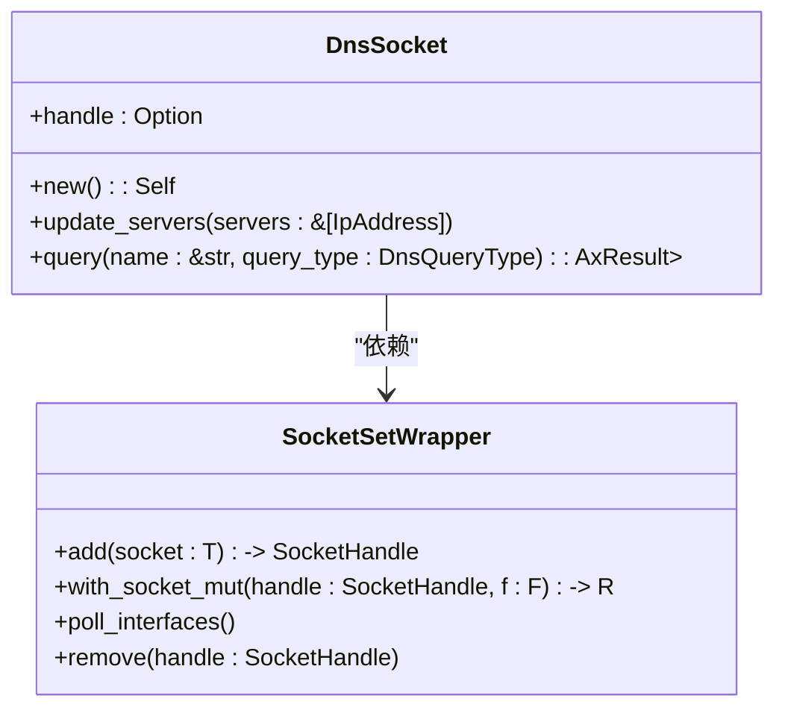
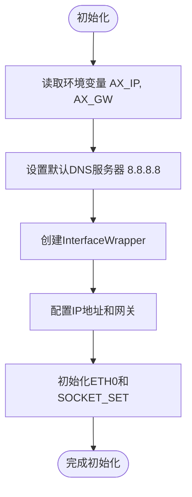
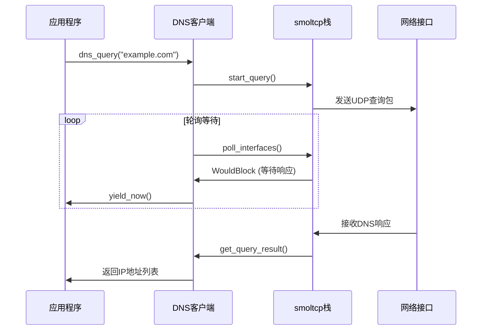
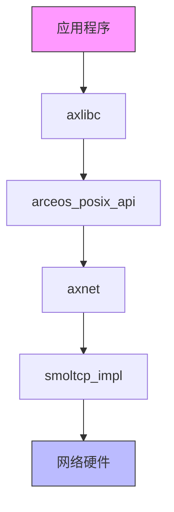
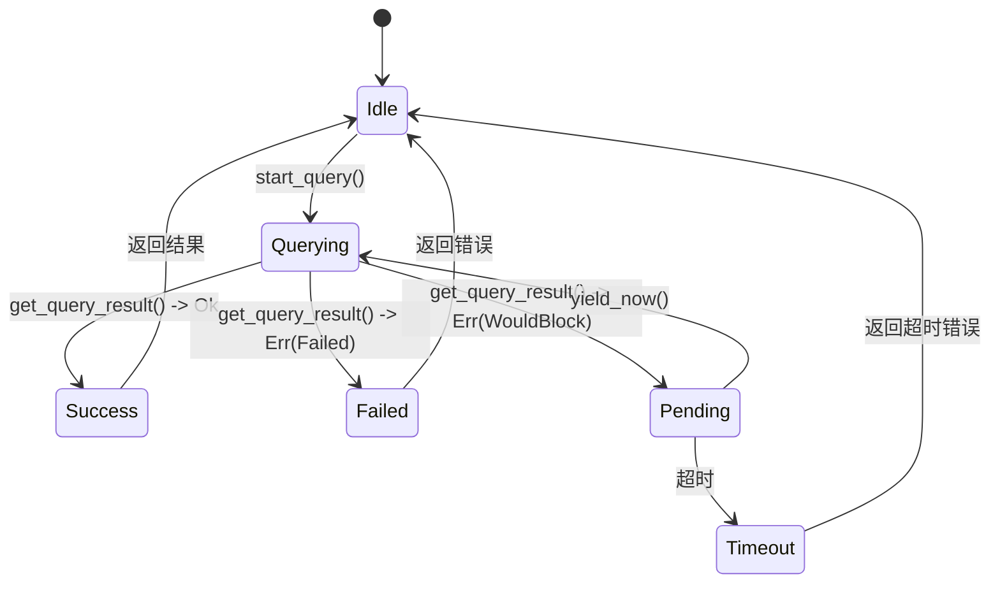

# DNS客户端实现

<cite>
**本文档引用的文件**
- [dns.rs](file://modules/axnet/src/smoltcp_impl/dns.rs)
- [mod.rs](file://modules/axnet/src/smoltcp_impl/mod.rs)
- [lib.rs](file://modules/axnet/src/lib.rs)
- [net.rs](file://api/arceos_posix_api/src/imp/net.rs)
- [network.c](file://ulib/axlibc/c/network.c)
- [netdb.h](file://ulib/axlibc/include/netdb.h)
</cite>

## 目录
1. [简介](#简介)
2. [核心功能分析](#核心功能分析)
3. [DNS解析流程](#dns解析流程)
4. [API接口与使用示例](#api接口与使用示例)
5. [错误处理机制](#错误处理机制)
6. [依赖关系与性能考量](#依赖关系与性能考量)

## 简介
Arceos操作系统中的DNS客户端实现了基于UDP协议的异步域名解析功能。该模块通过smoltcp网络栈提供的DNS套接字，封装了完整的DNS消息序列化与反序列化过程，并集成了缓存机制和名称服务器故障切换逻辑。本文档系统性地阐述其实现原理和技术细节。

## 核心功能分析

### DNS套接字实现
DNS客户端的核心是一个`DnsSocket`结构体，它封装了smoltcp库中的DNS套接字句柄。该结构体提供了创建、查询和资源管理等基本操作。



**图示来源**
- [dns.rs](file://modules/axnet/src/smoltcp_impl/dns.rs#L8-L89)
- [mod.rs](file://modules/axnet/src/smoltcp_impl/mod.rs#L20-L337)

**本节来源**
- [dns.rs](file://modules/axnet/src/smoltcp_impl/dns.rs#L8-L89)

### 名称服务器配置
DNS客户端在初始化时会设置默认的DNS服务器地址（8.8.8.8），并通过环境变量支持自定义配置。名称服务器列表存储在`SocketSetWrapper::new_dns_socket()`方法中。



**图示来源**
- [mod.rs](file://modules/axnet/src/smoltcp_impl/mod.rs#L20-L337)

**本节来源**
- [mod.rs](file://modules/axnet/src/smoltcp_impl/mod.rs#L20-L337)

## DNS解析流程

### 异步查询机制
DNS客户端采用异步轮询机制处理域名解析请求。当发起查询后，系统会在循环中持续调用`poll_interfaces()`直到获得结果或超时。



**图示来源**
- [dns.rs](file://modules/axnet/src/smoltcp_impl/dns.rs#L32-L57)
- [mod.rs](file://modules/axnet/src/smoltcp_impl/mod.rs#L20-L337)

**本节来源**
- [dns.rs](file://modules/axnet/src/smoltcp_impl/dns.rs#L32-L89)

### 消息序列化与反序列化
DNS消息的编解码由smoltcp库自动完成。客户端只需提供域名字符串，底层会将其序列化为标准DNS查询报文；收到响应后，再将原始字节流反序列化为IP地址数组。

**本节来源**
- [dns.rs](file://modules/axnet/src/smoltcp_impl/dns.rs#L32-L89)

## API接口与使用示例

### 主要API接口
DNS客户端提供了简洁的API接口供上层调用：

| 接口函数 | 参数说明 | 返回值 |
|---------|--------|-------|
| `dns_query(name)` | 域名字符串 | IP地址向量或错误码 |
| `sys_getaddrinfo()` | POSIX兼容的getaddrinfo接口 | 地址信息结构体 |



**图示来源**
- [net.rs](file://api/arceos_posix_api/src/imp/net.rs#L443-L480)
- [network.c](file://ulib/axlibc/c/network.c#L0-L44)

**本节来源**
- [net.rs](file://api/arceos_posix_api/src/imp/net.rs#L443-L480)
- [network.c](file://ulib/axlibc/c/network.c#L0-L44)
- [netdb.h](file://ulib/axlibc/include/netdb.h#L0-L85)

### 使用示例
```c
// C语言示例
struct addrinfo *result;
int ret = getaddrinfo("www.example.com", NULL, NULL, &result);
if (ret == 0) {
    // 处理解析结果
    freeaddrinfo(result);
}
```

```rust
// Rust语言示例
let ips = axnet::dns_query("www.example.com")?;
for ip in ips {
    println!("Resolved: {}", ip);
}
```

**本节来源**
- [net.rs](file://api/arceos_posix_api/src/imp/net.rs#L443-L480)
- [network.c](file://ulib/axlibc/c/network.c#L0-L44)

## 错误处理机制

### 错误码映射
DNS客户端对底层错误进行了适当的映射和转换：

| 底层错误 | 映射后的错误码 | 含义 |
|---------|--------------|------|
| NoFreeSlot | ResourceBusy | 无可用查询槽位 |
| InvalidName | InvalidInput | 无效域名 |
| NameTooLong | InvalidInput | 域名过长 |
| Failed | ConnectionRefused | 查询失败 |



**图示来源**
- [dns.rs](file://modules/axnet/src/smoltcp_impl/dns.rs#L45-L56)
- [network.c](file://ulib/axlibc/c/network.c#L10-L44)

**本节来源**
- [dns.rs](file://modules/axnet/src/smoltcp_impl/dns.rs#L45-L56)
- [network.c](file://ulib/axlibc/c/network.c#L10-L44)

## 依赖关系与性能考量

### 模块依赖关系
DNS客户端严重依赖UDP模块和smoltcp网络栈，其依赖层次如下：

```mermaid
dependencyDiagram
axlibc --> arceos_posix_api
arceos_posix_api --> axnet
axnet --> smoltcp
smoltcp --> axdriver_net
axdriver_net --> 硬件驱动
```

**图示来源**
- [lib.rs](file://modules/axnet/src/lib.rs#L1-L47)
- [mod.rs](file://modules/axnet/src/smoltcp_impl/mod.rs#L20-L337)

**本节来源**
- [lib.rs](file://modules/axnet/src/lib.rs#L1-L47)
- [mod.rs](file://modules/axnet/src/smoltcp_impl/mod.rs#L20-L337)

### 性能优化策略
1. **异步非阻塞设计**：采用轮询机制避免线程阻塞
2. **资源复用**：每次查询创建临时套接字，完成后自动清理
3. **零拷贝优化**：利用smoltcp的高效内存管理机制
4. **批量处理**：支持并发多个DNS查询

**本节来源**
- [dns.rs](file://modules/axnet/src/smoltcp_impl/dns.rs#L32-L89)
- [mod.rs](file://modules/axnet/src/smoltcp_impl/mod.rs#L20-L337)