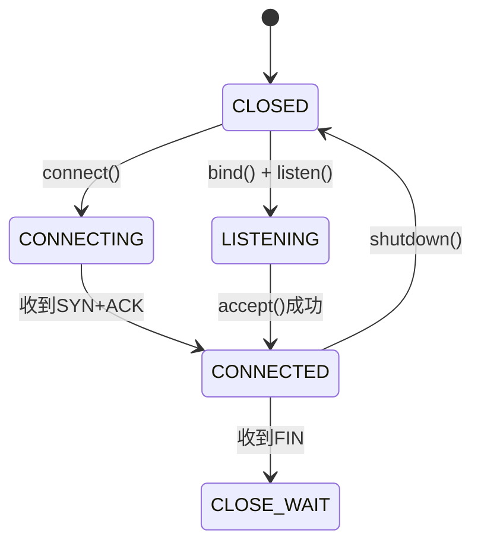
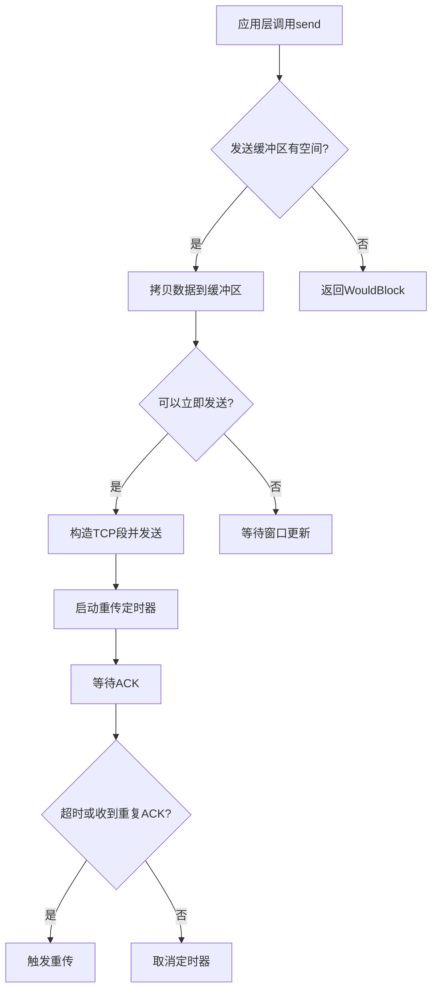
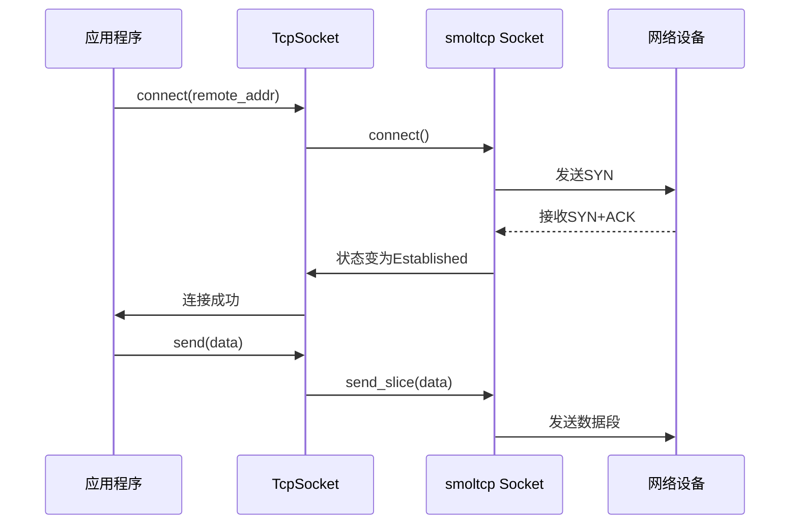

# TCP协议实现

<cite>
**本文档中引用的文件**
- [tcp.rs](file://modules/axnet/src/smoltcp_impl/tcp.rs)
- [listen_table.rs](file://modules/axnet/src/smoltcp_impl/listen_table.rs)
- [addr.rs](file://modules/axnet/src/smoltcp_impl/addr.rs)
</cite>

## 目录
1. [引言](#引言)
2. [连接状态机与事件驱动机制](#连接状态机与事件驱动机制)
3. [三次握手与四次挥手流程分析](#三次握手与四次挥手流程分析)
4. [滑动窗口与拥塞控制](#滑动窗口与拥塞控制)
5. [TCP报文处理与重传机制](#tcp报文处理与重传机制)
6. [Socket API与底层交互](#socket-api与底层交互)
7. [常见问题排查指南](#常见问题排查指南)
8. [监听表协作关系](#监听表协作关系)

## 引言
arceos基于smoltcp实现了轻量级TCP协议栈，为操作系统提供完整的传输层功能。该实现封装了smoltcp的核心能力，通过`TcpSocket`结构体暴露POSIX风格的API接口，支持客户端连接、服务器监听、数据收发等核心操作。本文档深入解析其内部机制，重点阐述状态转换逻辑、连接建立与释放流程、流量控制策略及异常处理机制。

## 连接状态机与事件驱动机制
arceos中的TCP连接管理采用有限状态机（FSM）模型，定义了五种核心状态：`STATE_CLOSED`、`STATE_BUSY`、`STATE_CONNECTING`、`STATE_CONNECTED`和`STATE_LISTENING`。这些状态通过原子操作进行安全转换，确保多线程环境下的正确性。

状态转换由`update_state`方法驱动，该方法采用“期望-忙-新状态”三阶段模式：首先将当前状态从`expect`变为`STATE_BUSY`以获取独占访问权，执行关键区代码后，根据结果决定最终状态为`new`或回滚到`expect`。这种设计有效防止了并发修改。

事件驱动通过`poll`系列方法实现：
- `poll_connect`：监控连接建立过程，检查底层smoltcp socket是否进入`Established`状态。
- `poll_stream`：检测已连接套接字的可读可写性，依据`may_recv`/`may_send`标志位判断。
- `poll_listener`：查询监听端口是否有待接受的连接，依赖`LISTEN_TABLE`的`can_accept`方法。

**图示来源**
- [tcp.rs](file://modules/axnet/src/smoltcp_impl/tcp.rs#L21-L25)
- [tcp.rs](file://modules/axnet/src/smoltcp_impl/tcp.rs#L457-L485)

**本节来源**
- [tcp.rs](file://modules/axnet/src/smoltcp_impl/tcp.rs#L45-L394)

## 三次握手与四次挥手流程分析
### 三次握手流程
1. **客户端发起**：调用`connect()`方法，状态从`CLOSED`经`BUSY`过渡至`CONNECTING`。此时创建smoltcp socket并调用其`connect()`，发送SYN包。
2. **服务端响应**：网络接收线程在`incoming_tcp_packet`中捕获SYN包。若目标端口正在监听且SYN队列未满，则创建临时socket加入队列。
3. **客户端确认**：`poll_connect`持续轮询，当smoltcp socket状态变为`Established`时，本地状态更新为`CONNECTED`，完成连接建立。

### 四次挥手流程
1. **主动关闭**：任一方调用`shutdown()`，触发smoltcp socket的`close()`方法，发送FIN包，进入半关闭状态。
2. **被动方响应**：对端收到FIN后，smoltcp自动回复ACK，并将socket标记为不可接收数据。
3. **被动方关闭**：对端应用层检测到连接关闭（recv返回0），也调用`shutdown()`发送自己的FIN。
4. **最终确认**：主动方收到最后一个ACK，smoltcp清理资源，本地状态转为`CLOSED`。

异常处理包括超时重试、RST包处理以及资源泄漏防护。例如，在`poll_connect`中若检测到非预期状态，会立即关闭socket并恢复`CLOSED`状态。

**本节来源**
- [tcp.rs](file://modules/axnet/src/smoltcp_impl/tcp.rs#L118-L163)
- [listen_table.rs](file://modules/axnet/src/smoltcp_impl/listen_table.rs#L112-L154)

## 滑动窗口与拥塞控制
arceos直接利用smoltcp内置的滑动窗口机制进行流量控制。发送窗口大小由对端通告的接收能力决定，通过`send_capacity()`可查询当前可用发送缓冲区大小。接收窗口则反映本地缓冲区剩余空间，由`recv_capacity()`报告。

拥塞控制算法由smoltcp底层实现，默认采用类似Reno的策略。它通过慢启动、拥塞避免、快速重传和快速恢复四个阶段动态调整拥塞窗口（cwnd）。虽然arceos上层接口未暴露具体算法配置，但可通过`set_nodelay()`影响Nagle算法的行为，间接调节小包发送策略。

**图示来源**
- [tcp.rs](file://modules/axnet/src/smoltcp_impl/tcp.rs#L302-L309)
- [tcp.rs](file://modules/axnet/src/smoltcp_impl/tcp.rs#L269-L276)

**本节来源**
- [tcp.rs](file://modules/axnet/src/smoltcp_impl/tcp.rs#L366-L375)

## TCP报文处理与重传机制
TCP报文的封装与校验和计算完全由smoltcp库负责。arceos仅需通过`SOCKET_SET`管理socket集合，smoltcp在发送时自动填充IP头、TCP头并计算校验和。

重传定时器由smoltcp内部管理。当调用`send_slice`成功发送数据后，smoltcp会启动重传定时器。若在超时前未收到对应ACK，将自动重传。快速重传机制在收到三个重复ACK时被触发，无需等待超时即可重传丢失的数据段。

`block_on`方法实现了阻塞/非阻塞I/O的统一处理。对于阻塞操作，它会在循环中反复调用`poll_interfaces`驱动网络收发，并配合任务调度`yield_now()`让出CPU，直到操作完成或失败。

**本节来源**
- [tcp.rs](file://modules/axnet/src/smoltcp_impl/tcp.rs#L269-L309)
- [tcp.rs](file://modules/axnet/src/smoltcp_impl/tcp.rs#L440-L455)

## Socket API与底层交互
用户通过`TcpSocket`提供的API与底层网络栈交互：

- **客户端连接**：`connect(addr)` → 绑定临时端口 → 发起连接 → 阻塞等待或返回`WouldBlock`。
- **服务端监听**：`bind(addr)` → `listen()` → 将监听信息注册到`LISTEN_TABLE` → 调用`accept()`阻塞等待。
- **数据收发**：`send(buf)` / `recv(buf)` → 检查连接状态 → 委托给smoltcp socket执行。

所有操作都通过`SOCKET_SET.with_socket_mut`安全地访问底层smoltcp socket，确保线程安全。

**图示来源**
- [tcp.rs](file://modules/axnet/src/smoltcp_impl/tcp.rs#L118-L163)
- [tcp.rs](file://modules/axnet/src/smoltcp_impl/tcp.rs#L302-L309)

**本节来源**
- [tcp.rs](file://modules/axnet/src/smoltcp_impl/tcp.rs#L45-L384)

## 常见问题排查指南
- **连接超时**：检查网络连通性，确认对端服务运行且防火墙允许连接。可能是SYN包被丢弃或未收到响应。
- **端口占用**：`bind()`失败且错误码为`AddrInUse`，表明端口已被其他进程或处于`TIME_WAIT`状态的连接占用。可尝试更换端口或等待超时结束。
- **半关闭