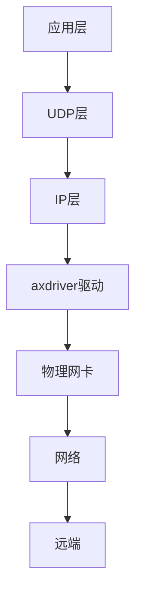

# UDP协议实现

<cite>
**本文档引用的文件**
- [udp.rs](file://modules/axnet/src/smoltcp_impl/udp.rs)
- [udp.rs](file://ulib/axstd/src/net/udp.rs)
- [net.rs](file://api/arceos_api/src/imp/net.rs)
</cite>

## 目录
1. [引言](#引言)
2. [UDP无连接通信模型设计原理](#udp无连接通信模型设计原理)
3. [数据包接收与解复用机制](#数据包接收与解复用机制)
4. [UDP校验和生成与验证机制](#udp校验和生成与验证机制)
5. [IPv4与IPv6支持差异](#ipv4与ipv6支持差异)
6. [广播与多播地址处理逻辑](#广播与多播地址处理逻辑)
7. [实际应用场景：DNS查询示例](#实际应用场景dns查询示例)
8. [高性能场景下的优势与局限性](#高性能场景下的优势与局限性)
9. [避免数据包丢失的最佳实践](#避免数据包丢失的最佳实践)
10. [与axdriver网卡驱动的数据通路集成方式](#与axdriver网卡驱动的数据通路集成方式)

## 引言
Arceos操作系统中的UDP协议实现提供了一种轻量级、无连接的传输层服务，适用于对实时性要求高而可靠性要求相对较低的应用场景。该实现基于smoltcp库构建，并通过分层架构实现了从底层网络接口到上层POSIX兼容API的完整封装。

## UDP无连接通信模型设计原理
Arceos中UDP套接字的设计遵循典型的无连接通信模型，允许应用程序在无需建立连接的情况下发送和接收数据报。这种模型的核心在于每个数据报都包含完整的源和目的地址信息，使得每次通信都是独立的。

`UdpSocket`结构体是这一模型的主要载体，它维护了本地和远程端点的信息以及非阻塞模式状态。通过`bind()`方法绑定本地地址，`send_to()`向指定目标发送数据，`recv_from()`接收来自任意源的数据，体现了完全去中心化的通信特性。

**Section sources**
- [udp.rs](file://modules/axnet/src/smoltcp_impl/udp.rs#L1-L295)

## 数据包接收与解复用机制
当UDP数据包到达时，系统首先根据IP头部的目的地址和UDP头部的目的端口号进行匹配，将数据包路由到对应的套接字队列中。这一过程由全局的`SOCKET_SET`管理，该集合维护所有活跃的UDP套接字句柄。

对于已连接的UDP套接字（即调用了`connect()`的套接字），内核会进一步检查数据包的源地址是否与预期一致，从而实现单播过滤功能；而对于未连接的套接字，则接受任何发往绑定端口的数据包。

接收操作通过`recv_from()`或`peek_from()`完成，前者取出并移除数据，后者仅查看而不移除。若缓冲区为空且处于阻塞模式，线程将让出CPU直至数据到达。

**Section sources**
- [udp.rs](file://modules/axnet/src/smoltcp_impl/udp.rs#L1-L295)

## UDP校验和生成与验证机制
UDP协议使用16位校验和来检测传输过程中可能出现的数据损坏。在校验和计算中，除了UDP头部和数据部分外，还包括一个伪头部（pseudo-header），其中含有源IP地址、目的IP地址、协议号和UDP长度字段。

在Arceos实现中，校验和的生成与验证由底层网络栈自动处理。发送方在构造UDP段时计算校验和并填入相应字段；接收方则重新计算整个段的校验和并与接收到的值比较，若不匹配则丢弃该数据包。

值得注意的是，IPv4允许校验和为零表示未启用，但IPv6强制要求必须计算校验和。

**Section sources**
- [udp.rs](file://modules/axnet/src/smoltcp_impl/udp.rs#L1-L295)

## IPv4与IPv6支持差异
Arceos的UDP实现同时支持IPv4和IPv6协议族，但在某些细节上存在差异：

- **地址格式**：IPv4使用32位地址，而IPv6使用128位地址，在套接字绑定和连接时需正确解析。
- **校验和要求**：如前所述，IPv6强制启用UDP校验和，而IPv4可选。
- **多播范围**：IPv6定义了更精细的多播地址范围（interface-local, link-local等），影响多播报文的转发行为。
- **任播支持**：IPv6原生支持任播地址，可用于负载均衡场景。

这些差异在`IpEndpoint`类型及其转换逻辑中得到体现，确保跨版本兼容性。

**Section sources**
- [udp.rs](file://modules/axnet/src/smoltcp_impl/udp.rs#L1-L295)

## 广播与多播地址处理逻辑
UDP支持两种形式的群体通信：广播和多播。

- **广播**：仅限于IPv4，通过特殊地址如`255.255.255.255`或子网定向广播地址实现。Arceos在网络接口层识别此类地址，并将其复制到所有主机可达的链路层帧中。
- **多播**：支持IPv4和IPv6，使用特定地址范围（IPv4: `224.0.0.0/4`, IPv6: `ffxx::/16`）。系统维护一个多播组成员表，只有加入相应组的接口才会接收对应流量。

应用层可通过标准API加入/离开多播组，底层通过IGMP/MLD协议与路由器协调组成员关系。

**Section sources**
- [udp.rs](file://modules/axnet/src/smoltcp_impl/udp.rs#L1-L295)

## 实际应用场景：DNS查询示例
DNS协议广泛采用UDP作为其传输层协议，典型流程如下：

```rust
let socket = UdpSocket::bind("0.0.0.0:0")?;
let server_addr = "8.8.8.8:53".parse()?;
socket.connect(server_addr)?;
let query = build_dns_query("example.com");
socket.send(&query)?;
let mut response = [0; 512];
let len = socket.recv(&mut response)?;
```

此例展示了如何创建匿名端口的UDP套接字，连接至公共DNS服务器，发送查询并等待响应。由于DNS查询通常很小（<512字节）且对延迟敏感，UDP成为理想选择。

**Section sources**
- [udp.rs](file://ulib/axstd/src/net/udp.rs#L1-L96)
- [net.rs](file://api/arceos_api/src/imp/net.rs#L1-L131)

## 高性能场景下的优势与局限性
### 优势
- **低开销**：无连接特性省去了三次握手和连接状态维护成本。
- **高吞吐**：适合短报文频繁交互，如游戏同步、监控上报。
- **实时性强**：避免TCP拥塞控制带来的延迟波动。

### 局限性
- **不可靠传输**：无重传机制，丢包需应用层补偿。
- **无序交付**：数据报可能乱序到达。
- **缺乏流控**：易受突发流量冲击导致缓冲区溢出。

因此，在视频流、语音通话等容忍一定丢包但忌讳延迟抖动的场景下表现优异，而在文件传输等要求可靠性的场合则应选用TCP。

**Section sources**
- [udp.rs](file://modules/axnet/src/smoltcp_impl/udp.rs#L1-L295)

## 避免数据包丢失的最佳实践
为减少UDP数据包丢失，建议采取以下措施：
1. **合理设置缓冲区大小**：增大套接字接收缓冲区以应对突发流量。
2. **启用非阻塞I/O**：结合轮询机制及时处理积压数据。
3. **控制发送速率**：避免超过网络带宽或对方处理能力。
4. **应用层确认机制**：关键数据引入简单ACK/NACK反馈。
5. **错误监测**：定期调用`poll()`检查可读性，防止饥饿。

此外，利用`SO_REUSEADDR`选项允许多个进程共享同一端口，有助于提升服务可用性。

**Section sources**
- [udp.rs](file://modules/axnet/src/smoltcp_impl/udp.rs#L1-L295)

## 与axdriver网卡驱动的数据通路集成方式
UDP协议栈与`axdriver`网卡驱动之间通过标准化接口进行交互。整体数据通路如下：

1. **上行路径**：应用层写入数据 → UDP层封装头部 → IP层添加IP头 → 网络设备驱动通过DMA提交至网卡。
2. **下行路径**：网卡中断触发 → 驱动收取帧 → IP层剥离IP头 → UDP层根据端口分发至对应套接字。

具体而言，`axdriver`暴露统一的`Device` trait供上层调用，包括`transmit()`和`receive()`方法。UDP模块通过`poll_interfaces()`周期性地轮询底层设备状态，实现事件驱动式收发。

这种松耦合设计使得更换不同类型的物理网卡（如virtio、ixgbe）无需修改传输层代码。



**Diagram sources**
- [udp.rs](file://modules/axnet/src/smoltcp_impl/udp.rs#L1-L295)
- [net.rs](file://api/arceos_api/src/imp/net.rs#L1-L131)

**Section sources**
- [udp.rs](file://modules/axnet/src/smoltcp_impl/udp.rs#L1-L295)
- [net.rs](file://api/arceos_api/src/imp/net.rs#L1-L131)