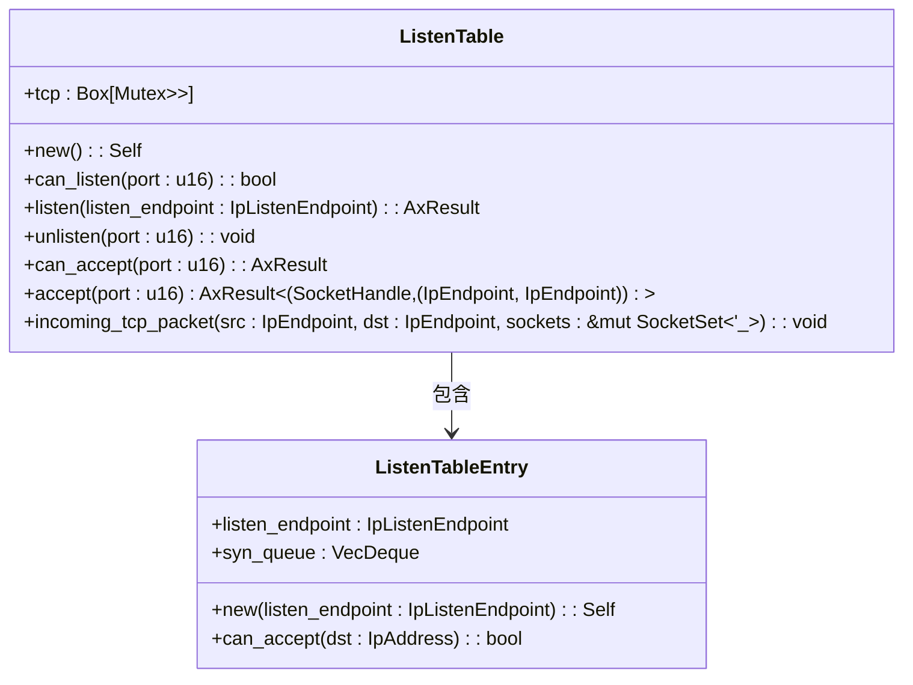
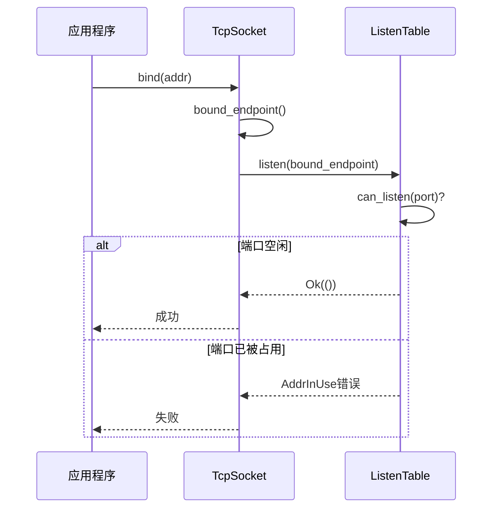
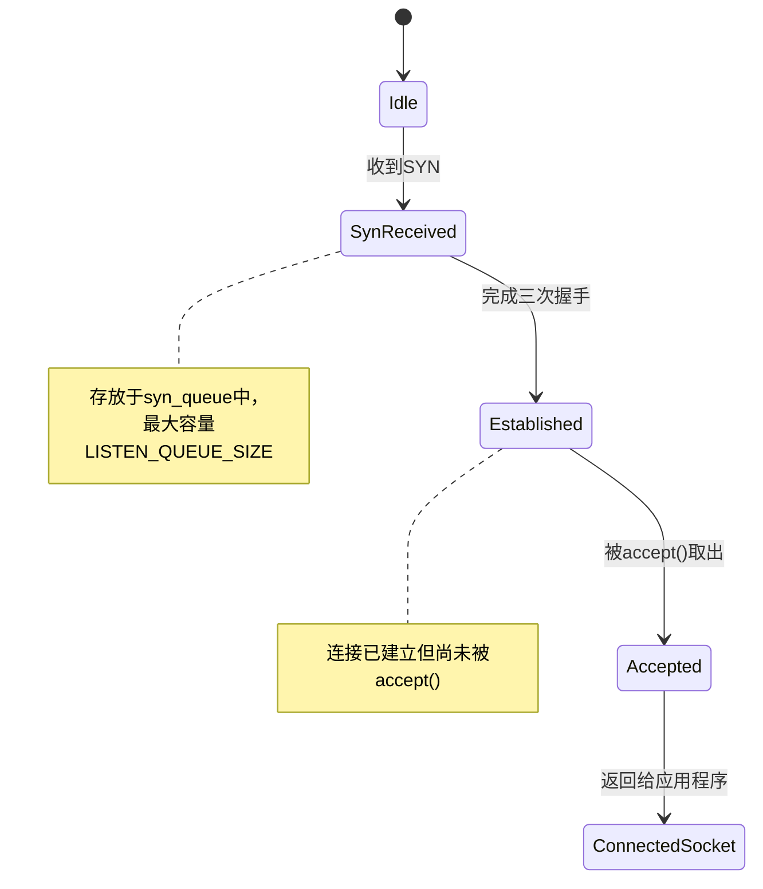
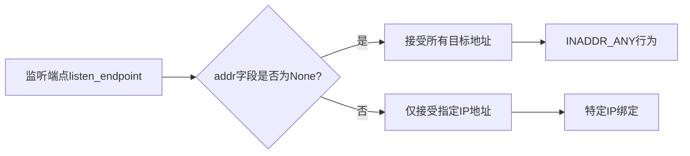

# 套接字监听表

<cite>
**本文档引用文件**  
- [listen_table.rs](file://modules/axnet/src/smoltcp_impl/listen_table.rs)
- [tcp.rs](file://modules/axnet/src/smoltcp_impl/tcp.rs)
- [mod.rs](file://modules/axnet/src/smoltcp_impl/mod.rs)
</cite>

## 目录
1. [引言](#引言)
2. [数据结构设计](#数据结构设计)
3. [端口监听与绑定机制](#端口监听与绑定机制)
4. [高效查找与匹配策略](#高效查找与匹配策略)
5. [SYN队列与ACCEPT队列管理](#syn队列与accept队列管理)
6. [通配符地址匹配规则](#通配符地址匹配规则)
7. [高并发调优建议](#高并发调优建议)
8. [竞争条件与同步解决方案](#竞争条件与同步解决方案)
9. [结论](#结论)

## 引言
套接字监听表是网络协议栈中用于管理TCP监听状态的核心数据结构。它负责处理新连接请求、维护待接受连接队列，并支持多Socket绑定同一端口及通配符地址等复杂行为。本文档深入剖析`listen_table.rs`中的实现细节，揭示其底层容器选择依据、性能特征以及在高并发场景下的优化策略。

## 数据结构设计



**图示来源**
- [listen_table.rs](file://modules/axnet/src/smoltcp_impl/listen_table.rs#L0-L155)

**节来源**
- [listen_table.rs](file://modules/axnet/src/smoltcp_impl/listen_table.rs#L0-L155)

### 底层容器选择分析
监听表采用固定大小数组作为主索引结构，每个端口对应一个条目：

- **数组索引（Port-based Array）**：使用长度为65536的数组直接映射端口号，实现O(1)时间复杂度的端口查找。
- **红黑树替代方案对比**：若使用红黑树，插入/删除/查找均为O(log n)，而数组访问为常数时间，在端口范围有限且密集的情况下更具优势。
- **哈希表对比**：虽然哈希表平均查找时间为O(1)，但存在冲突处理开销和动态扩容成本；固定数组避免了这些额外开销。

该设计充分利用了端口号空间有限（16位无符号整数）的特点，以空间换时间，确保最高效的端口定位能力。

## 端口监听与绑定机制



**图示来源**
- [listen_table.rs](file://modules/axnet/src/smoltcp_impl/listen_table.rs#L59-L86)
- [tcp.rs](file://modules/axnet/src/smoltcp_impl/tcp.rs#L200-L230)

**节来源**
- [listen_table.rs](file://modules/axnet/src/smoltcp_impl/listen_table.rs#L59-L86)
- [tcp.rs](file://modules/axnet/src/smoltcp_impl/tcp.rs#L200-L230)

### SO_REUSEADDR行为支持
当多个Socket尝试绑定同一端口时：
1. `can_listen()`检查指定端口是否已有监听条目。
2. 若返回`false`，则拒绝新的`listen()`调用并返回`AddrInUse`错误。
3. 当前实现未显式支持`SO_REUSEADDR`选项，需通过外部配置或扩展接口实现端口重用逻辑。

未来可通过引入引用计数或标志位来允许多个监听者共享同一端口，从而完整支持`SO_REUSEADDR`语义。

## 高效查找与匹配策略

```mermaid
flowchart TD
A[收到TCP包] --> B{是否为SYN包?}
B -- 是 --> C[提取目标端口]
C --> D[查监听表tcp[port]]
D --> E{是否存在条目?}
E -- 否 --> F[丢弃包]
E -- 是 --> G{地址可接受?}
G -- 否 --> F
G -- 是 --> H{SYN队列满?}
H -- 是 --> I[警告溢出]
H -- 否 --> J[创建新Socket]
J --> K[加入SocketSet]
K --> L[入队syn_queue]
```

**图示来源**
- [listen_table.rs](file://modules/axnet/src/smoltcp_impl/listen_table.rs#L112-L154)
- [mod.rs](file://modules/axnet/src/smoltcp_impl/mod.rs#L250-L337)

**节来源**
- [listen_table.rs](file://modules/axnet/src/smoltcp_impl/listen_table.rs#L112-L154)
- [mod.rs](file://modules/axnet/src/smoltcp_impl/mod.rs#L250-L337)

### 五元组精确匹配流程
新连接到来时，系统根据以下步骤进行目标Socket匹配：
1. 解析IP包头获取源/目的IP与端口。
2. 判断是否为首次SYN握手包（SYN置位且ACK未置位）。
3. 调用`LISTEN_TABLE.incoming_tcp_packet()`处理。
4. 使用目的端口索引监听表数组。
5. 检查监听条目的地址匹配性（见下文通配符规则）。
6. 若符合条件且SYN队列未满，则创建临时Socket并入队。

此过程确保只有合法的初始连接请求才会被接纳，防止无效连接占用资源。

## SYN队列与ACCEPT队列管理



**图示来源**
- [listen_table.rs](file://modules/axnet/src/smoltcp_impl/listen_table.rs#L88-L110)
- [tcp.rs](file://modules/axnet/src/smoltcp_impl/tcp.rs#L230-L250)

**节来源**
- [listen_table.rs](file://modules/axnet/src/smoltcp_impl/listen_table.rs#L88-L110)
- [tcp.rs](file://modules/axnet/src/smoltcp_impl/tcp.rs#L230-L250)

### 队列管理策略
- **SYN队列（syn_queue）**：类型为`VecDeque<SocketHandle>`，容量由`LISTEN_QUEUE_SIZE`定义（默认512）。存储处于`SynReceived`或更高级别状态的连接。
- **ACCEPT队列逻辑**：实际不存在独立的ACCEPT队列。已完成三次握手的连接仍保留在SYN队列中，直到被`accept()`系统调用取出。
- **accept()操作**：遍历`syn_queue`寻找已连接的Socket（非`Listen`或`SynReceived`状态），找到后移除并返回句柄及其地址信息。

潜在性能问题：`accept()`需线性扫描队列，若早期连接未完成握手可能导致后续已就绪连接延迟处理，触发“slow SYN queue enumeration”警告。

## 通配符地址匹配规则



**图示来源**
- [listen_table.rs](file://modules/axnet/src/smoltcp_impl/listen_table.rs#L45-L50)

**节来源**
- [listen_table.rs](file://modules/axnet/src/smoltcp_impl/listen_table.rs