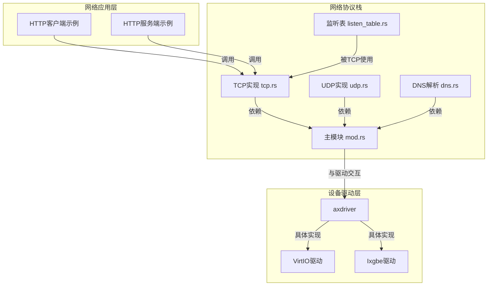
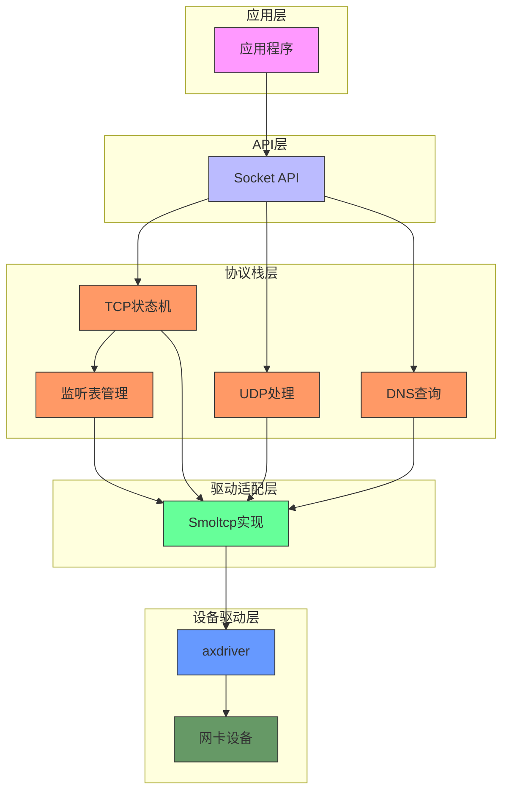
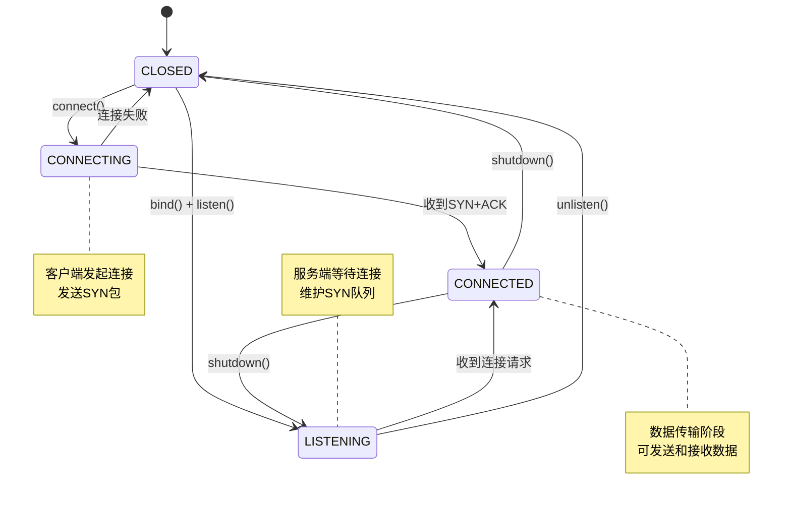
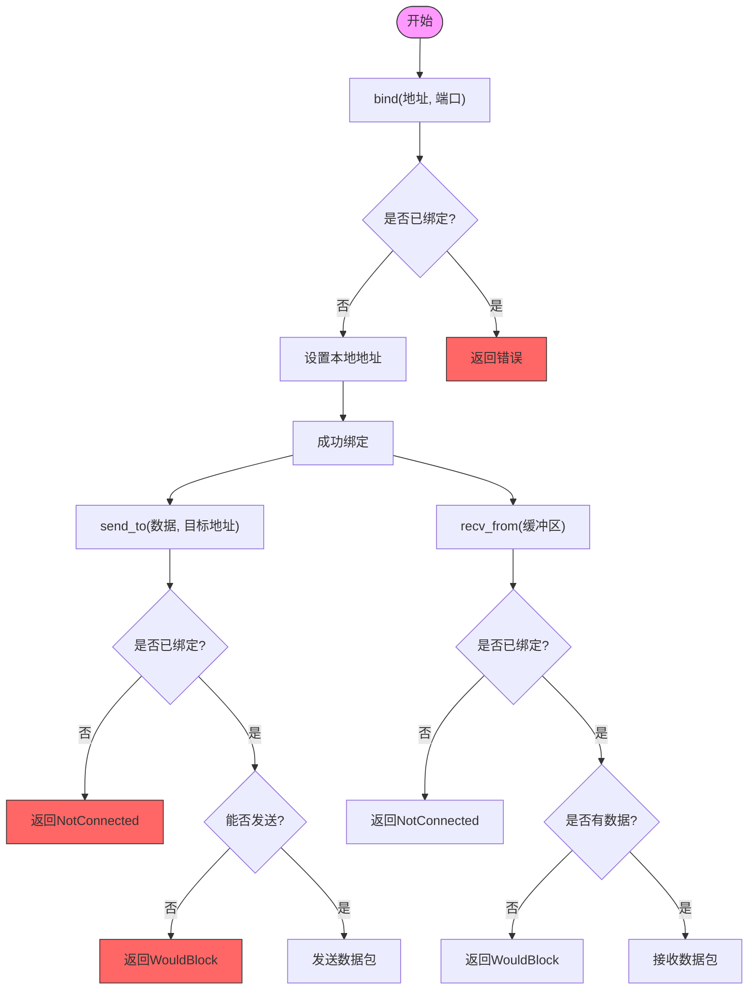
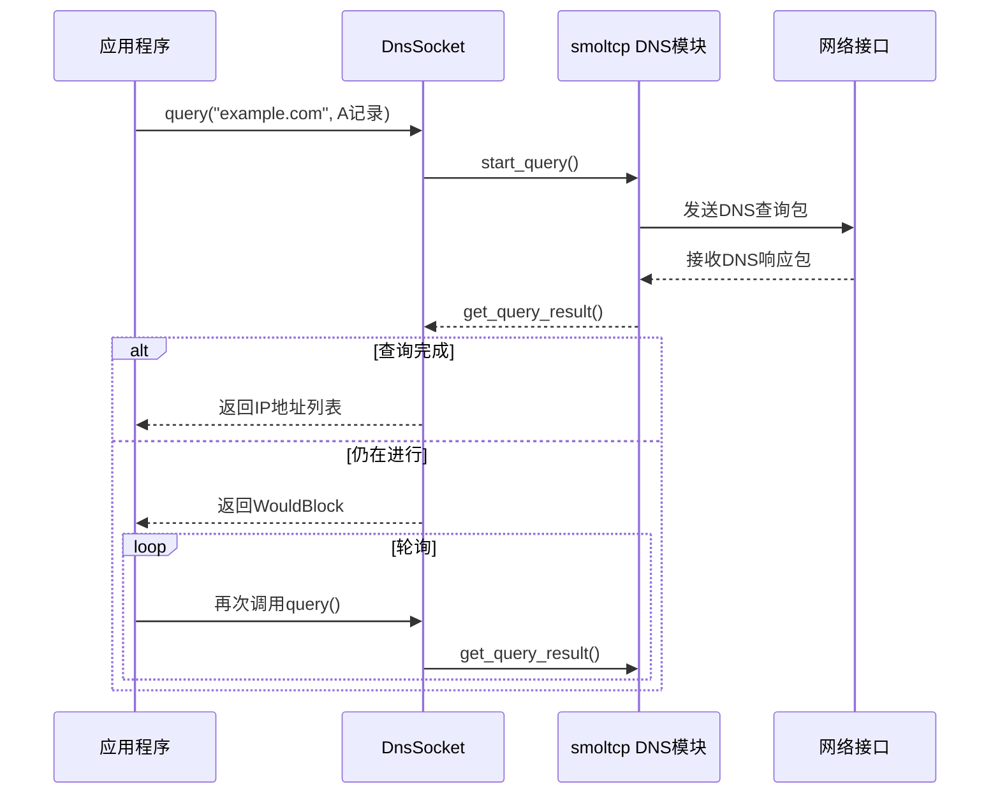
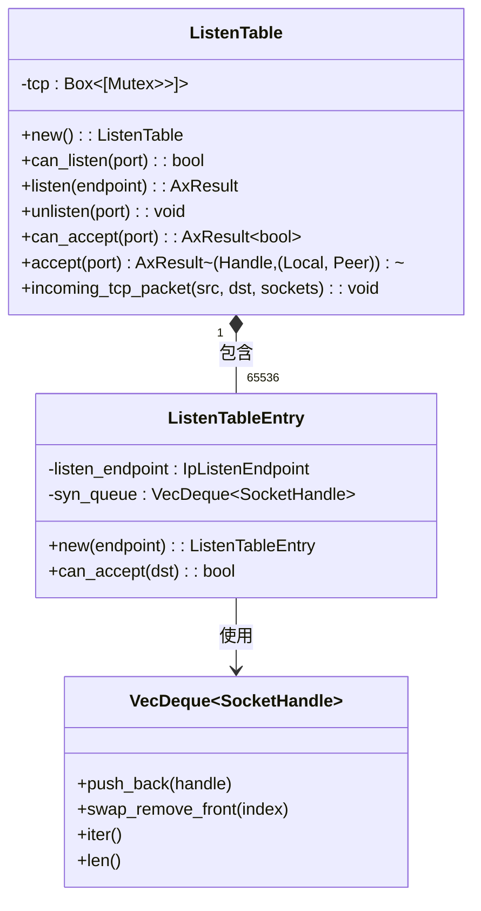
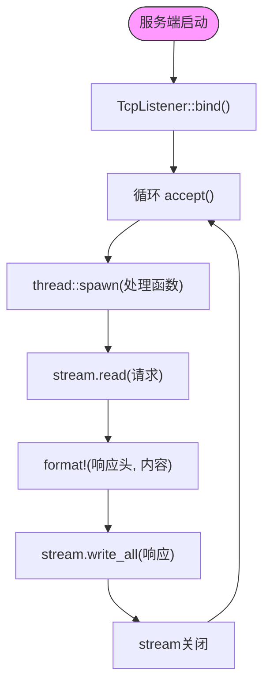

# 网络协议栈

<cite>
**本文档引用的文件**
- [tcp.rs](file://modules/axnet/src/smoltcp_impl/tcp.rs)
- [udp.rs](file://modules/axnet/src/smoltcp_impl/udp.rs)
- [dns.rs](file://modules/axnet/src/smoltcp_impl/dns.rs)
- [listen_table.rs](file://modules/axnet/src/smoltcp_impl/listen_table.rs)
- [mod.rs](file://modules/axnet/src/smoltcp_impl/mod.rs)
- [lib.rs](file://modules/axnet/src/lib.rs)
- [httpclient/main.rs](file://examples/httpclient/src/main.rs)
- [httpserver/main.rs](file://examples/httpserver/src/main.rs)
- [lib.rs](file://modules/axdriver/src/lib.rs)
- [virtio.rs](file://modules/axdriver/src/virtio.rs)
</cite>

## 目录
1. [简介](#简介)
2. [项目结构](#项目结构)
3. [核心组件](#核心组件)
4. [架构概述](#架构概述)
5. [详细组件分析](#详细组件分析)
6. [依赖关系分析](#依赖关系分析)
7. [性能考量](#性能考量)
8. [故障排除指南](#故障排除指南)
9. [结论](#结论)

## 简介
Arceos网络协议栈是一个基于smoltcp实现的轻量级TCP/IP协议栈，专为嵌入式和操作系统开发场景设计。该协议栈提供了POSIX风格的套接字API，支持TCP、UDP和DNS功能，并与底层网卡驱动程序紧密协作以实现高效的数据包收发。

## 项目结构
Arceos网络模块位于`modules/axnet`目录下，其核心实现在`src/smoltcp_impl`子目录中。该模块通过条件编译特性选择使用smoltcp作为底层网络栈。网络栈与设备驱动层（axdriver）分离，通过清晰的接口进行通信。



**图源**
- [tcp.rs](file://modules/axnet/src/smoltcp_impl/tcp.rs)
- [udp.rs](file://modules/axnet/src/smoltcp_impl/udp.rs)
- [dns.rs](file://modules/axnet/src/smoltcp_impl/dns.rs)
- [listen_table.rs](file://modules/axnet/src/smoltcp_impl/listen_table.rs)
- [mod.rs](file://modules/axnet/src/smoltcp_impl/mod.rs)
- [lib.rs](file://modules/axdriver/src/lib.rs)

**本节来源**
- [lib.rs](file://modules/axnet/src/lib.rs#L1-L48)
- [mod.rs](file://modules/axnet/src/smoltcp_impl/mod.rs#L1-L338)

## 核心组件
Arceos网络协议栈的核心组件包括TCP连接管理、UDP数据报服务、DNS域名解析以及端口监听表。这些组件共同构成了完整的网络通信能力，支持从简单的数据传输到复杂的服务器应用。

**本节来源**
- [tcp.rs](file://modules/axnet/src/smoltcp_impl/tcp.rs#L1-L564)
- [udp.rs](file://modules/axnet/src/smoltcp_impl/udp.rs#L1-L296)
- [dns.rs](file://modules/axnet/src/smoltcp_impl/dns.rs#L1-L90)
- [listen_table.rs](file://modules/axnet/src/smoltcp_impl/listen_table.rs#L1-L156)

## 架构概述
Arceos网络协议栈采用分层架构设计，上层提供统一的套接字API，中间层基于smoltcp实现TCP/IP协议族，底层通过axdriver与物理网卡交互。这种设计实现了协议逻辑与硬件细节的解耦，提高了代码的可维护性和可移植性。



**图源**
- [lib.rs](file://modules/axnet/src/lib.rs#L1-L48)
- [mod.rs](file://modules/axnet/src/smoltcp_impl/mod.rs#L1-L338)
- [lib.rs](file://modules/axdriver/src/lib.rs#L1-L199)

## 详细组件分析

### TCP连接状态机分析
Arceos的TCP实现定义了明确的状态转换机制，涵盖了从连接建立到关闭的完整生命周期。状态机通过原子操作保证线程安全，确保在多任务环境下的正确性。

#### TCP状态转换图


**图源**
- [tcp.rs](file://modules/axnet/src/smoltcp_impl/tcp.rs#L1-L564)

#### 拥塞控制算法说明
虽然代码中未显式实现拥塞控制算法，但通过smoltcp库的内置机制间接支持。smoltcp默认实现了基本的拥塞控制策略，包括慢启动和拥塞避免。用户可以通过设置套接字选项来调整相关参数。

**本节来源**
- [tcp.rs](file://modules/axnet/src/smoltcp_impl/tcp.rs#L1-L564)

### UDP无连接服务分析
UDP实现提供了简单高效的数据报服务，支持绑定端口、发送接收数据报等基本操作。与TCP不同，UDP不需要建立连接，适合对实时性要求高的应用场景。

#### UDP操作流程图


**图源**
- [udp.rs](file://modules/axnet/src/smoltcp_impl/udp.rs#L1-L296)

**本节来源**
- [udp.rs](file://modules/axnet/src/smoltcp_impl/udp.rs#L1-L296)

### DNS异步查询机制分析
DNS模块实现了异步域名解析功能，允许应用程序在不阻塞的情况下发起域名查询。查询过程涉及创建DNS套接字、发送查询请求和轮询结果三个主要步骤。

#### DNS查询序列图


**图源**
- [dns.rs](file://modules/axnet/src/smoltcp_impl/dns.rs#L1-L90)

**本节来源**
- [dns.rs](file://modules/axnet/src/smoltcp_impl/dns.rs#L1-L90)

### 端口监听表数据结构分析
监听表采用端口号索引的数组结构，每个条目包含一个互斥锁保护的可选监听条目。这种设计既保证了快速查找性能，又确保了并发访问的安全性。

#### ListenTable类图


**图源**
- [listen_table.rs](file://modules/axnet/src/smoltcp_impl/listen_table.rs#L1-L156)

**本节来源**
- [listen_table.rs](file://modules/axnet/src/smoltcp_impl/listen_table.rs#L1-L156)

### Socket编程接口使用示例
Arceos提供了标准的Socket API，支持构建各种网络应用。以下示例展示了如何使用这些API创建HTTP客户端和服务端。

#### HTTP客户端工作流程
```mermaid
flowchart TD
ClientStart([客户端启动]) --> Resolve["dns_query(\"ident.me\")"]
Resolve --> Connect["TcpStream::connect()"]
Connect --> SendRequest["stream.write_all(GET请求)"]
SendRequest --> ReadResponse["stream.read(缓冲区)"]
ReadResponse --> PrintResponse["打印响应内容"]
PrintResponse --> ClientEnd([客户端结束])
style ClientStart fill:#f9f,stroke:#333
style ClientEnd fill:#f9f,stroke:#333
```

#### HTTP服务端工作流程


**本节来源**
- [main.rs](file://examples/httpclient/src/main.rs#L1-L41)
- [main.rs](file://examples/httpserver/src/main.rs#L1-L97)

## 依赖关系分析
Arceos网络协议栈与各组件之间存在清晰的依赖关系。上层应用依赖于网络协议栈提供的API，而协议栈本身依赖于smoltcp库和axdriver驱动框架。

```mermaid
graph LR
    HTTPClient --> TcpSocket
    HTTPServer --> TcpListener
    TcpListener --> TcpSocket
    TcpSocket --> SOCKET_SET
    UdpSocket --> SOCKET_SET
    DnsSocket --> SOCKET_SET
    SOCKET_SET --> ETH0
    ETH0 --> AxNetDevice
    AxNetDevice --> VirtioNetDev
    AxNetDevice --> IxgbeDev
    
    style HTTPClient fill:#f9f,stroke:#333
    style HTTPServer fill:#f9f,stroke:#333
    style TcpSocket fill:#bbf,stroke:#333
    style TcpListener fill:#bbf,stroke:#333
    style SOCKET_SET fill:#6f9,stroke:#333
    style ETH0 fill:#6f9,stroke:#333
    style AxNetDevice fill