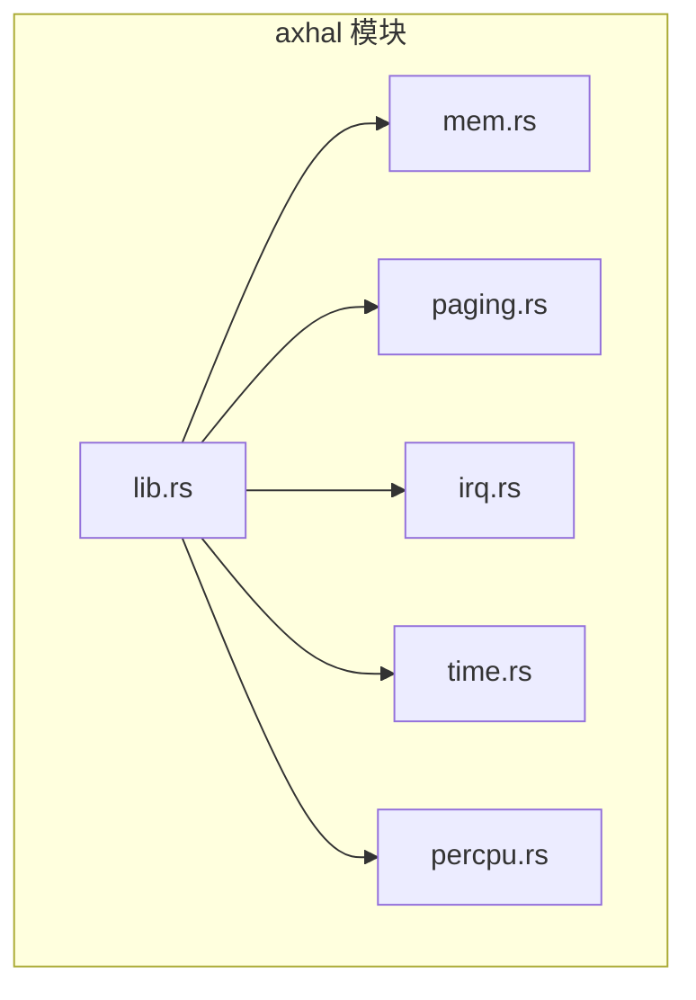
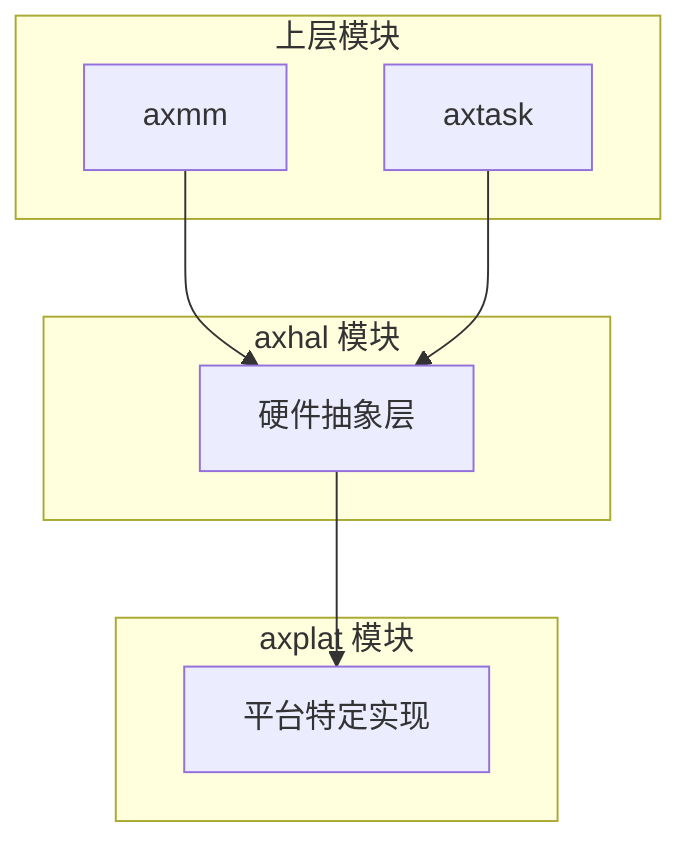
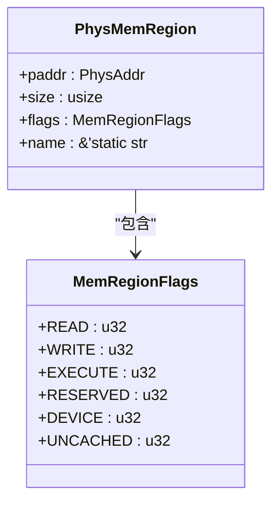
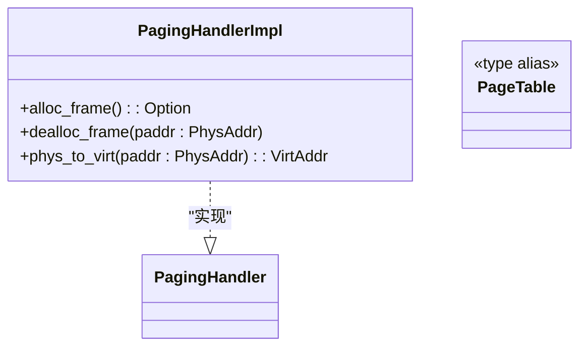
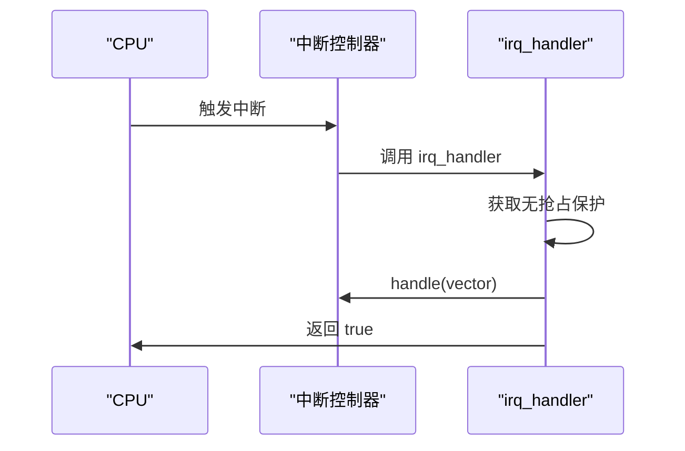
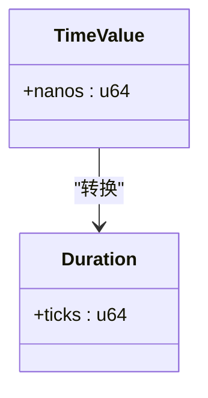
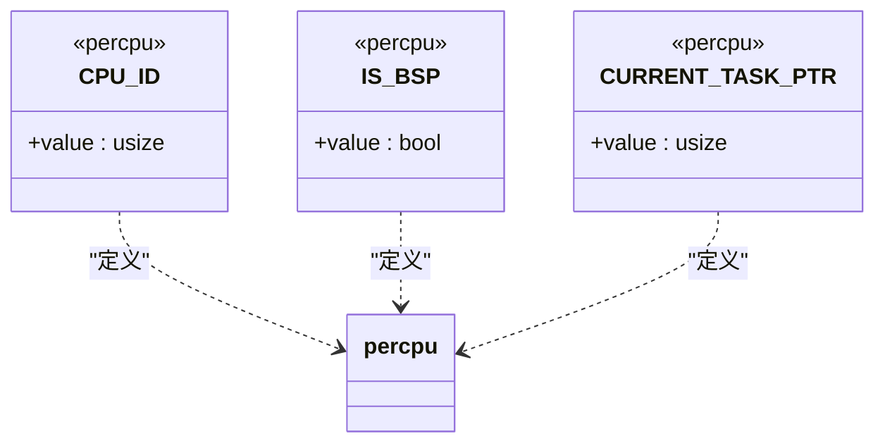
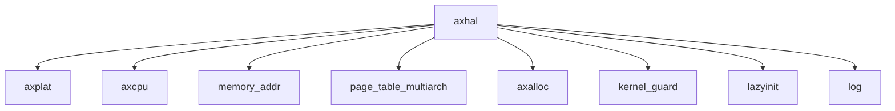

# 硬件抽象层设计

<cite>
**本文档中引用的文件**  
- [lib.rs](file://modules/axhal/src/lib.rs)
- [mem.rs](file://modules/axhal/src/mem.rs)
- [paging.rs](file://modules/axhal/src/paging.rs)
- [irq.rs](file://modules/axhal/src/irq.rs)
- [time.rs](file://modules/axhal/src/time.rs)
- [percpu.rs](file://modules/axhal/src/percpu.rs)
- [Cargo.toml](file://modules/axmm/Cargo.toml)
- [lib.rs](file://modules/axmm/src/lib.rs)
</cite>

## 目录
1. [引言](#引言)
2. [项目结构](#项目结构)
3. [核心组件](#核心组件)
4. [架构概述](#架构概述)
5. [详细组件分析](#详细组件分析)
6. [依赖分析](#依赖分析)
7. [性能考量](#性能考量)
8. [故障排除指南](#故障排除指南)
9. [结论](#结论)

## 引言
`axhal` 模块是 ArceOS 操作系统中的硬件抽象层（HAL），其主要目标是为上层模块屏蔽不同硬件架构（如 x86_64、aarch64、riscv64）和平台（如 QEMU、Raspberry Pi）之间的差异。通过提供统一的 API 接口，`axhal` 使得操作系统内核可以在多种平台上运行而无需修改核心逻辑。该模块负责系统的早期初始化、物理内存管理、页表操作、中断处理、时间服务以及每个 CPU 的本地数据结构管理。

本文档将深入剖析 `axhal` 模块的设计与实现，重点分析 `mem.rs` 中的物理内存布局管理、`paging.rs` 中的页表操作封装、`irq.rs` 中的中断控制器接口抽象、`time.rs` 提供的跨平台时间基准和定时器服务，以及 `percpu.rs` 中每个 CPU 数据结构的实现原理。同时，还将展示上层模块（如 `axmm` 和 `axtask`）如何通过 `axhal` 提供的安全 API 进行底层硬件操作，并讨论静态分发与动态分发在性能和灵活性之间的权衡。

## 项目结构
`axhal` 模块位于 `modules/axhal/src/` 目录下，其源代码由多个关键文件组成，分别负责不同的硬件抽象功能。这些文件包括 `lib.rs`（主入口）、`mem.rs`（物理内存管理）、`paging.rs`（页表操作）、`irq.rs`（中断管理）、`time.rs`（时间相关操作）和 `percpu.rs`（CPU 本地数据结构）。此外，`axhal` 依赖于 `axplat` 平台特定的实现来完成具体的硬件操作，从而实现了对不同平台的适配。

**图示来源**
- [lib.rs](file://modules/axhal/src/lib.rs#L0-L143)
- [mem.rs](file://modules/axhal/src/mem.rs#L0-L126)
- [paging.rs](file://modules/axhal/src/paging.rs#L0-L48)
- [irq.rs](file://modules/axhal/src/irq.rs#L0-L24)
- [time.rs](file://modules/axhal/src/time.rs#L0-L9)
- [percpu.rs](file://modules/axhal/src/percpu.rs#L0-L127)

**章节来源**
- [lib.rs](file://modules/axhal/src/lib.rs#L0-L143)

## 核心组件
`axhal` 模块的核心组件包括物理内存管理、页表操作、中断管理、时间服务和每个 CPU 的本地数据结构。这些组件共同构成了操作系统与硬件之间的桥梁，确保了系统的可移植性和稳定性。

**章节来源**
- [lib.rs](file://modules/axhal/src/lib.rs#L0-L143)
- [mem.rs](file://modules/axhal/src/mem.rs#L0-L126)
- [paging.rs](file://modules/axhal/src/paging.rs#L0-L48)
- [irq.rs](file://modules/axhal/src/irq.rs#L0-L24)
- [time.rs](file://modules/axhal/src/time.rs#L0-L9)
- [percpu.rs](file://modules/axhal/src/percpu.rs#L0-L127)

## 架构概述
`axhal` 模块采用分层设计，顶层提供统一的 API 接口，底层则通过 `axplat` 实现具体平台的操作。这种设计使得上层模块可以独立于具体的硬件平台进行开发，提高了代码的复用性和可维护性。

**图示来源**
- [lib.rs](file://modules/axhal/src/lib.rs#L0-L143)
- [Cargo.toml](file://modules/axmm/Cargo.toml#L0-L23)

## 详细组件分析

### 物理内存管理分析
`mem.rs` 文件负责管理物理内存布局，它定义了 `PhysMemRegion` 结构体来描述物理内存区域，并提供了 `memory_regions()` 函数来遍历所有物理内存区域。初始化过程中，`init()` 函数会收集内核映像、MMIO 区域和保留区域的信息，并计算出可用的自由内存区域。

#### 类图

**图示来源**
- [mem.rs](file://modules/axhal/src/mem.rs#L0-L126)

**章节来源**
- [mem.rs](file://modules/axhal/src/mem.rs#L0-L126)

### 页表操作封装分析
`paging.rs` 文件封装了页表操作，利用 `page_table_multiarch` 库为不同架构提供统一的页表管理接口。`PagingHandlerImpl` 结构体实现了 `PagingHandler` trait，提供了分配和释放页帧的功能。根据目标架构的不同，`PageTable` 类型会被定义为相应的架构特定页表类型。

#### 类图

**图示来源**
- [paging.rs](file://modules/axhal/src/paging.rs#L0-L48)

**章节来源**
- [paging.rs](file://modules/axhal/src/paging.rs#L0-L48)

### 中断控制器接口抽象分析
`irq.rs` 文件抽象了中断控制器接口，提供了 `handle`、`register`、`set_enable` 和 `unregister` 等函数来管理中断。`irq_handler` 函数注册为陷阱处理器，用于处理中断事件。对于支持 IPI（处理器间中断）的平台，还提供了 `send_ipi` 函数。

#### 序列图

**图示来源**
- [irq.rs](file://modules/axhal/src/irq.rs#L0-L24)

**章节来源**
- [irq.rs](file://modules/axhal/src/irq.rs#L0-L24)

### 时间服务分析
`time.rs` 文件提供了跨平台的时间基准和定时器服务，包括 `current_ticks`、`monotonic_time` 和 `wall_time` 等函数。对于支持中断的平台，还可以使用 `set_oneshot_timer` 设置一次性定时器。

#### 类图

**图示来源**
- [time.rs](file://modules/axhal/src/time.rs#L0-L9)

**章节来源**
- [time.rs](file://modules/axhal/src/time.rs#L0-L9)

### 每个CPU数据结构实现分析
`percpu.rs` 文件实现了每个 CPU 的本地数据结构，使用 `#[percpu::def_percpu]` 宏定义了 `CPU_ID`、`IS_BSP` 和 `CURRENT_TASK_PTR` 等静态变量。`this_cpu_id()` 和 `this_cpu_is_bsp()` 函数用于获取当前 CPU 的 ID 和是否为主处理器。`current_task_ptr()` 和 `set_current_task_ptr()` 函数提供了对当前任务指针的安全访问。

#### 类图

**图示来源**
- [percpu.rs](file://modules/axhal/src/percpu.rs#L0-L127)

**章节来源**
- [percpu.rs](file://modules/axhal/src/percpu.rs#L0-L127)

## 依赖分析
`axhal` 模块依赖于多个外部库和内部模块，以实现其功能。这些依赖关系确保了模块的完整性和可扩展性。

**图示来源**
- [lib.rs](file://modules/axhal/src/lib.rs#L0-L143)
- [Cargo.toml](file://modules/axmm/Cargo.toml#L0-L23)

**章节来源**
- [lib.rs](file://modules/axhal/src/lib.rs#L0-L143)
- [Cargo.toml](file://modules/axmm/Cargo.toml#L0-L23)

## 性能考量
`axhal` 模块在设计时充分考虑了性能因素。例如，在 `percpu.rs` 中，针对 aarch64 架构使用 `SP_EL0` 寄存器缓存当前任务指针，减少了每次访问时的开销。此外，`paging.rs` 中的页表操作也经过优化，确保了高效的内存管理。

## 故障排除指南
当遇到与 `axhal` 模块相关的问题时，应首先检查平台配置是否正确，确保选择了正确的 cargo 特性。其次，查看日志输出，特别是内存区域重叠或页表映射错误等警告信息。最后，确认 `axplat` 平台实现是否正确地初始化了硬件资源。

**章节来源**
- [mem.rs](file://modules/axhal/src/mem.rs#L0-L126)
- [paging.rs](file://modules/axhal/src/paging.rs#L0-L48)

## 结论
`axhal` 模块作为 ArceOS 的硬件抽象层，成功地屏蔽了不同硬件架构和平台之间的差异，为上层模块提供了统一的 API 接口。通过对物理内存、页表、中断、时间和每个 CPU 数据结构的精心设计与实现，`axhal` 不仅保证了系统的可移植性，还兼顾了性能和灵活性。未来的工作可以进一步优化中断处理和内存管理的效率，提升系统的整体性能。