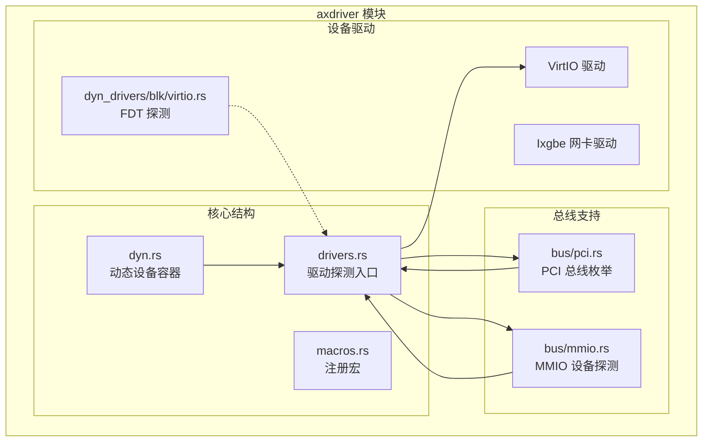
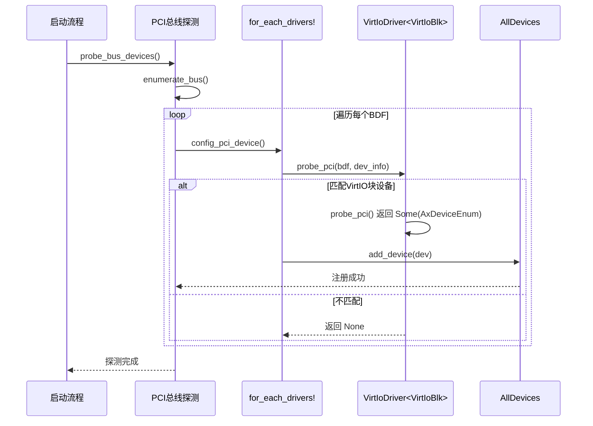
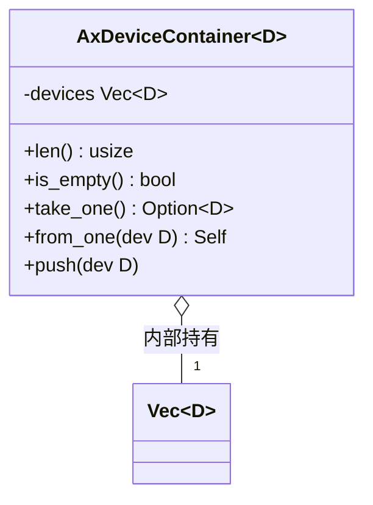
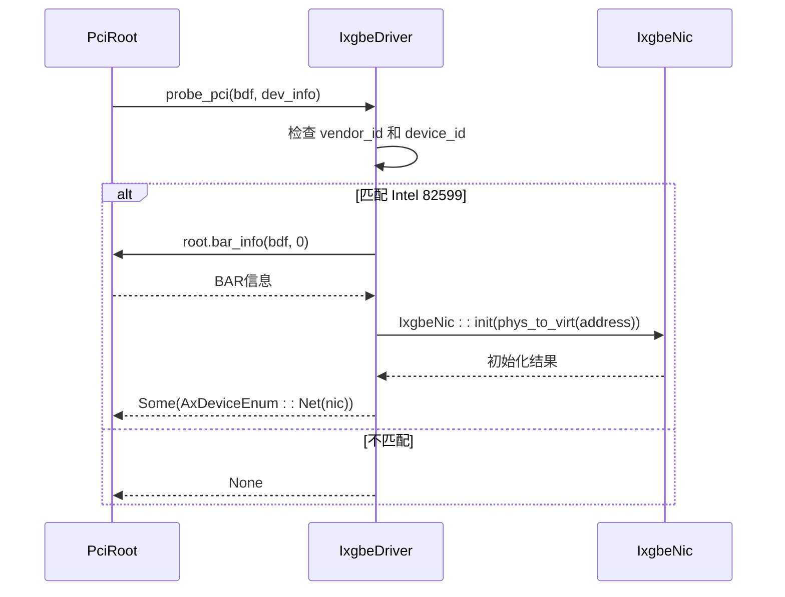
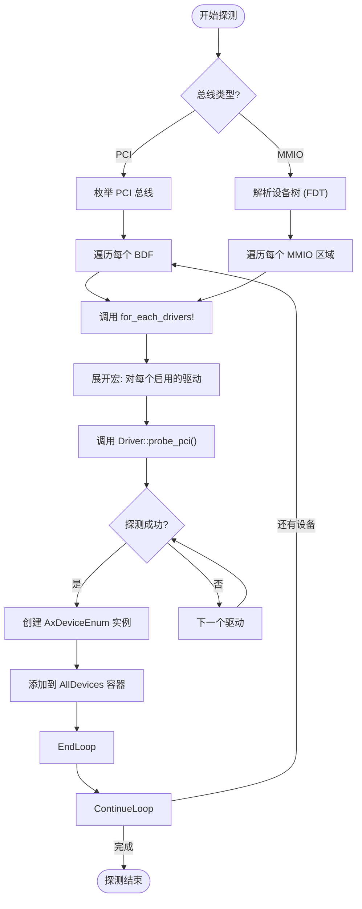

# 动态设备模型

<cite>
**本文档引用的文件**
- [dyn.rs](file://modules/axdriver/src/structs/dyn.rs)
- [drivers.rs](file://modules/axdriver/src/drivers.rs)
- [macros.rs](file://modules/axdriver/src/macros.rs)
- [virtio.rs](file://modules/axdriver/src/virtio.rs)
- [blk/virtio.rs](file://modules/axdriver/src/dyn_drivers/blk/virtio.rs)
- [bus/pci.rs](file://modules/axdriver/src/bus/pci.rs)
</cite>

## 目录
1. [引言](#引言)
2. [项目结构](#项目结构)
3. [核心组件](#核心组件)
4. [架构概述](#架构概述)
5. [详细组件分析](#详细组件分析)
6. [依赖分析](#依赖分析)
7. [性能考量](#性能考量)
8. [故障排除指南](#故障排除指南)
9. [结论](#结论)

## 引言
本文档全面讲解 ArceOS 超级管理程序中的动态设备模型，重点阐述其运行时设备发现与管理机制。文档将深入剖析 `dyn.rs` 中设备对象的生命周期管理、类型安全的设备注册与注销流程，以及 `drivers.rs` 中全局驱动容器的数据结构设计。同时，将解释 `macros.rs` 提供的声明式宏如何降低驱动开发门槛并实现类型安全的驱动注册。通过 VirtIO 设备初始化过程，演示 PCI 总线枚举后如何动态创建设备实例并绑定驱动，并评估该模型在资源管理和并发访问控制方面的性能开销与安全性保障。

## 项目结构
ArceOS 的设备驱动模块（`axdriver`）采用分层和模块化的设计，以支持多种硬件总线和设备类型。核心功能分布在多个子目录中，其中 `structs/dyn.rs` 定义了动态设备的核心数据结构，`drivers.rs` 是全局驱动探测和注册的中心枢纽，而 `macros.rs` 则提供了关键的代码生成宏。

**Diagram sources**
- [dyn.rs](file://modules/axdriver/src/structs/dyn.rs)
- [drivers.rs](file://modules/axdriver/src/drivers.rs)
- [macros.rs](file://modules/axdriver/src/macros.rs)
- [bus/pci.rs](file://modules/axdriver/src/bus/pci.rs)

**Section sources**
- [dyn.rs](file://modules/axdriver/src/structs/dyn.rs)
- [drivers.rs](file://modules/axdriver/src/drivers.rs)
- [macros.rs](file://modules/axdriver/src/macros.rs)

## 核心组件
本节介绍构成动态设备模型的三个最核心的组件：`AxDeviceContainer`、`DriverProbe` 特质和 `for_each_drivers!` 宏。这些组件共同实现了设备的统一管理、自动探测和类型安全的注册。

**Section sources**
- [dyn.rs](file://modules/axdriver/src/structs/dyn.rs#L20-L50)
- [drivers.rs](file://modules/axdriver/src/drivers.rs#L10-L20)
- [macros.rs](file://modules/axdriver/src/macros.rs#L10-L20)

## 架构概述
ArceOS 的动态设备模型遵循“探测-注册-管理”的工作流。系统启动时，根据配置的总线类型（如 PCI 或 MMIO），调用相应的总线探测函数。这些函数会遍历总线上的所有设备，并为每个设备调用 `for_each_drivers!` 宏展开的探测逻辑。一旦某个驱动成功探测到匹配的设备，就会创建一个具体的设备实例，并将其封装为 `AxDeviceEnum` 枚举类型，最终添加到全局的设备容器中进行统一管理。

**Diagram sources**
- [bus/pci.rs](file://modules/axdriver/src/bus/pci.rs#L94-L121)
- [drivers.rs](file://modules/axdriver/src/drivers.rs#L30-L40)
- [virtio.rs](file://modules/axdriver/src/virtio.rs#L100-L120)

## 详细组件分析

### AxDeviceContainer 分析
`AxDeviceContainer<D>` 是动态设备模型的核心数据结构，用于存储特定类别（D）的所有设备实例。当启用 `dyn` 特性时，其内部使用 `Vec<D>` 来容纳多个设备；否则，使用 `Option<D>` 仅允许存在一个设备。它提供了 `len`、`is_empty` 和 `take_one` 等方法来安全地查询和消费设备。

#### 类图

**Diagram sources**
- [dyn.rs](file://modules/axdriver/src/structs/dyn.rs#L20-L50)

**Section sources**
- [dyn.rs](file://modules/axdriver/src/structs/dyn.rs#L20-L70)

### DriverProbe 特质分析
`DriverProbe` 特质定义了所有驱动必须实现的探测接口，包括 `probe_global`、`probe_mmio` 和 `probe_pci`。这是一个典型的策略模式应用，允许不同类型的驱动（如 VirtIO、Ixgbe）提供各自的探测逻辑。`drivers.rs` 文件中的具体驱动结构体（如 `RamDiskDriver`、`IxgbeDriver`）都实现了此特质。

#### 序列图

**Diagram sources**
- [drivers.rs](file://modules/axdriver/src/drivers.rs#L100-L130)
- [ixgbe.rs](file://modules/axdriver/src/ixgbe.rs#L50-L80)

**Section sources**
- [drivers.rs](file://modules/axdriver/src/drivers.rs#L10-L40)

### 声明式宏分析
`macros.rs` 文件中的 `register_block_driver!`、`register_net_driver!` 等宏，以及核心的 `for_each_drivers!` 宏，是实现类型安全和代码复用的关键。`register_*_driver!` 宏根据编译时特性决定 `AxBlockDevice` 等类型的具体实现。`for_each_drivers!` 宏则是一个强大的代码生成工具，它会根据当前启用的设备特性，自动生成对所有可能驱动的探测调用，极大地简化了主探测循环的编写。

#### 流程图

**Diagram sources**
- [macros.rs](file://modules/axdriver/src/macros.rs#L40-L70)
- [bus/pci.rs](file://modules/axdriver/src/bus/pci.rs#L94-L100)

**Section sources**
- [macros.rs](file://modules/axdriver/src/macros.rs#L10-L70)

### VirtIO 设备初始化分析
VirtIO 设备的初始化是动态设备模型的一个典型应用。对于 PCI 总线上的 VirtIO 块设备，`VirtIoDriver<VirtIoBlk>` 的 `probe_pci` 方法首先检查设备 ID 是否为 `0x1001` 或 `0x1042`。如果匹配，则调用 `axdriver_virtio::probe_pci_device` 来建立 VirtIO 传输层，然后通过 `VirtIoBlk::try_new` 创建具体的 `VirtIoBlkDev` 实例，并最终由 `AllDevices::add_device`