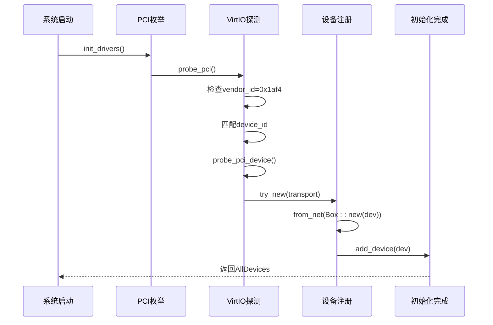
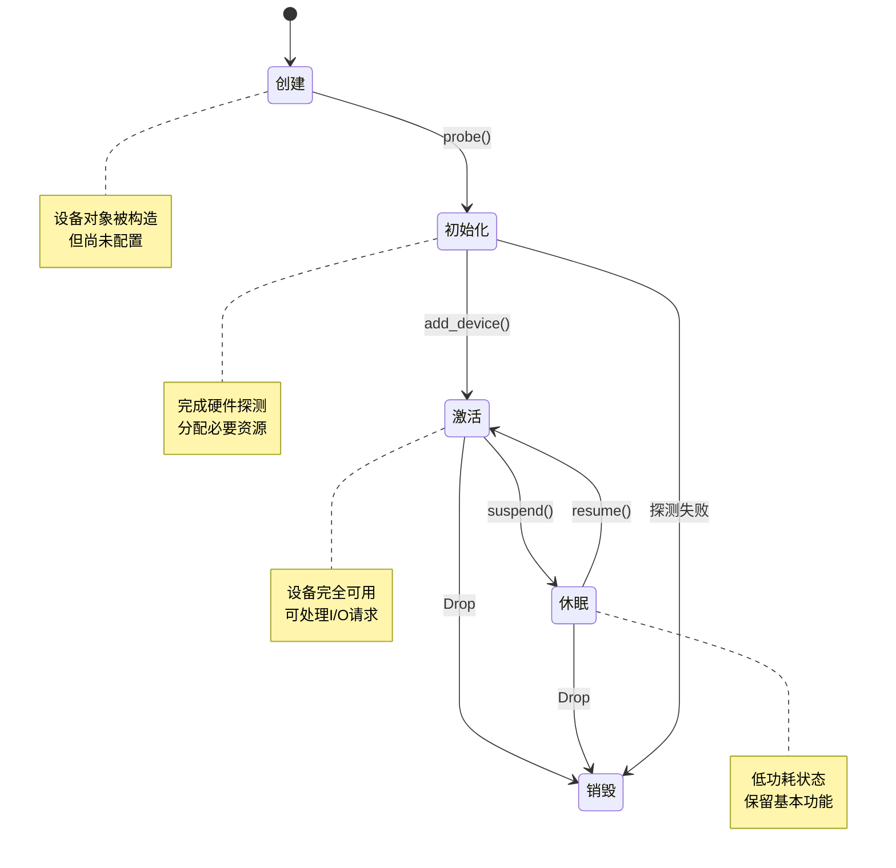

# 设备生命周期管理

<cite>
**本文档引用的文件**
- [dyn.rs](file://modules/axdriver/src/structs/dyn.rs)
- [lib.rs](file://modules/axdriver/src/lib.rs)
- [virtio.rs](file://modules/axdriver/src/virtio.rs)
- [blk/virtio.rs](file://modules/axdriver/src/dyn_drivers/blk/virtio.rs)
</cite>

## 目录
1. [引言](#引言)
2. [设备生命周期概述](#设备生命周期概述)
3. [DeviceRef智能指针与引用计数机制](#deviceref智能指针与引用计数机制)
4. [VirtIO网络设备初始化流程](#virtio网络设备初始化流程)
5. [状态转换图](#状态转换图)
6. [关键方法调用链分析](#关键方法调用链分析)
7. [Drop trait与资源自动回收](#drop-trait与资源自动回收)
8. [常见问题调试指南](#常见问题调试指南)
9. [结论](#结论)

## 引言
本文深入解析ArceOS超算操作系统中动态设备模型的完整生命周期管理机制。重点分析设备对象从创建、初始化、激活、休眠到销毁的各个阶段，详细阐述`dyn.rs`中`DeviceRef`智能指针的设计原理及其引用计数机制如何保障线程安全。通过VirtIO网络设备的实际初始化流程，展示设备描述符从PCI枚举获取到最终注册为可用设备实例的全过程。

## 设备生命周期概述
在ArceOS系统中，设备对象的生命周期包含五个核心阶段：创建、初始化、激活、休眠和销毁。系统支持静态和动态两种设备模型，其中动态模型通过`dyn`特性启用，允许同一类别存在多个设备实例。

设备生命周期由`AllDevices`结构体统一管理，该结构体按设备类别（网络、块存储、显示）组织所有驱动。设备探测过程根据编译时启用的特性决定具体执行路径：动态模型调用`probe_all_devices()`遍历所有支持的设备，而静态模型则通过宏展开逐个探测。

**Section sources**
- [lib.rs](file://modules/axdriver/src/lib.rs#L114-L161)

## DeviceRef智能指针与引用计数机制
`DeviceRef`智能指针基于Rust的`Arc<T>`实现，提供线程安全的共享所有权语义。当设备被多个组件引用时，引用计数自动递增；当任一组件释放引用时，计数递减。只有当所有引用都被释放后，设备才会被真正销毁。

在动态设备模型中，设备以`Box<dyn Trait>`形式存在，通过`AxDeviceContainer<D>`容器管理。该容器内部使用`Vec<D>`存储设备实例，在多线程环境下配合`axsync::Mutex`确保操作原子性。引用计数机制有效防止了悬空指针问题，同时保证了跨线程访问的安全性。

**Section sources**
- [dyn.rs](file://modules/axdriver/src/structs/dyn.rs#L0-L104)

## VirtIO网络设备初始化流程
VirtIO网络设备的初始化始于PCI总线枚举。系统首先检查设备厂商ID是否为`0x1af4`（VirtIO标准），然后根据设备ID判断类型。对于网络设备，支持`0x1000`和`0x1041`两种型号。

初始化流程如下：
1. 调用`probe_pci_device`探测PCI设备并获取传输层接口
2. 验证设备类型匹配`DeviceType::Net`
3. 调用`VirtIoNet::try_new`构造具体设备实例
4. 将设备包装为`AxDeviceEnum::Net`变体
5. 添加至`AllDevices`的网络设备容器中

整个过程在`init_drivers`函数中完成，最终返回包含所有已探测设备的`AllDevices`实例。



**Diagram sources**
- [virtio.rs](file://modules/axdriver/src/virtio.rs#L102-L138)
- [lib.rs](file://modules/axdriver/src/lib.rs#L114-L161)

## 状态转换图


**Diagram sources**
- [lib.rs](file://modules/axdriver/src/lib.rs#L114-L161)
- [dyn.rs](file://modules/axdriver/src/structs/dyn.rs#L0-L104)

## 关键方法调用链分析
设备初始化的关键调用链始于`init_drivers`函数，其主要流程如下：

```mermaid
flowchart TD
A[init_drivers] --> B{feature = "dyn"?}
B --> |是| C[probe_all_devices]
B --> |否| D[for_each_drivers!]
C --> E[遍历所有设备类型]
E --> F[调用具体DriverProbe::probe_*]
F --> G[VirtIoDriver::probe_pci]
G --> H[axdriver_virtio::probe_pci_device]
H --> I[VirtIoNet::try_new]
I --> J[AxDeviceEnum::from_net]
J --> K[add_device]
K --> L[存入AllDevices.net]
style A fill:#f9f,stroke:#333
style L fill:#bbf,stroke:#333
```

该调用链展示了从顶层初始化函数到底层硬件探测的完整路径，体现了系统的模块化设计思想。

**Diagram sources**
- [lib.rs](file://modules/axdriver/src/lib.rs#L114-L161)
- [virtio.rs](file://modules/axdriver/src/virtio.rs#L102-L138)

## Drop trait与资源自动回收
系统广泛使用`Drop` trait实现资源的确定性回收。当设备对象离开作用域时，`Drop`实会被自动调用，确保相关资源被正确释放。

例如，在块设备驱动中，`BlockDivce`结构体持有`Option<Device<MmioTransport>>`，其`Drop`实现会自动清理底层传输层资源。类似的模式也应用于内存页、地址空间等核心组件，形成统一的资源管理范式。

这种RAII（Resource Acquisition Is Initialization）模式有效避免了内存泄漏，无需手动调用释放函数，降低了出错概率。

**Section sources**
- [blk/virtio.rs](file://modules/axdriver/src/dyn_drivers/blk/virtio.rs#L48-L113)

## 常见问题调试指南
### 内存泄漏排查
1. 检查是否存在循环引用：使用`Weak<T>`打破强引用循环
2. 验证`Drop`实现是否被正确触发：添加日志输出
3. 使用工具检测：结合`cargo-valgrind`或`heaptrack`进行运行时分析

### 悬空指针预防
1. 确保所有设备引用都通过`DeviceRef`智能指针管理
2. 避免将原始指针暴露给外部组件
3. 在多线程场景下，始终使用`Mutex`或`RwLock`保护共享数据

### 初始化失败诊断
1. 检查PCI设备ID和厂商ID是否匹配
2. 验证MMIO区域映射是否成功
3. 确认中断配置正确无误
4. 查看系统日志中的具体错误信息

**Section sources**
- [virtio.rs](file://modules/axdriver/src/virtio.rs#L75-L100)
- [blk/virtio.rs](file://modules/axdriver/src/dyn_drivers/blk/virtio.rs#L0-L50)

## 结论
ArceOS的动态设备模型通过精心设计的生命周期管理和智能指针机制，实现了高效且安全的设备驱动架构。`DeviceRef`的引用计数机制保障了线程安全，而`Drop` trait的应用确保了资源的自动回收。VirtIO设备的初始化流程展示了从硬件探测到服务注册的完整链条，体现了系统的模块化和可扩展性。这些设计共同构成了一个健壮可靠的设备管理框架。