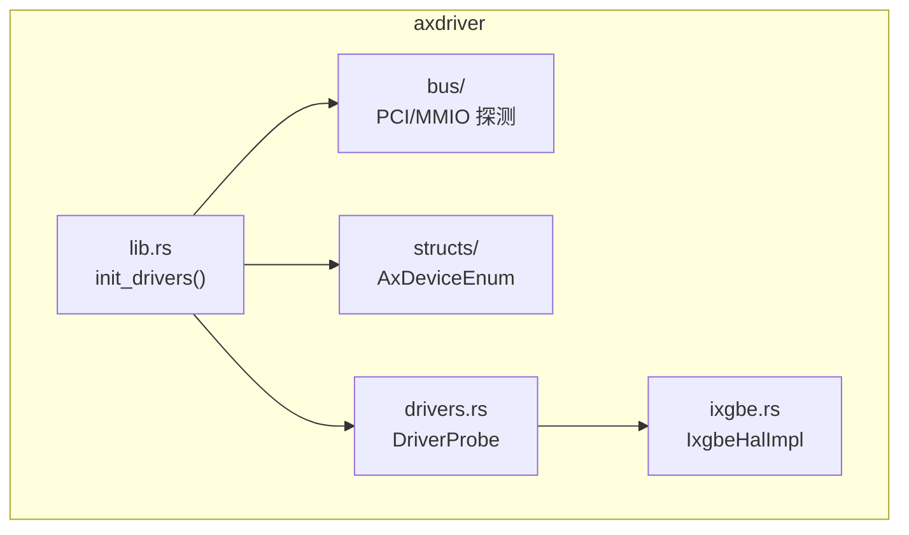
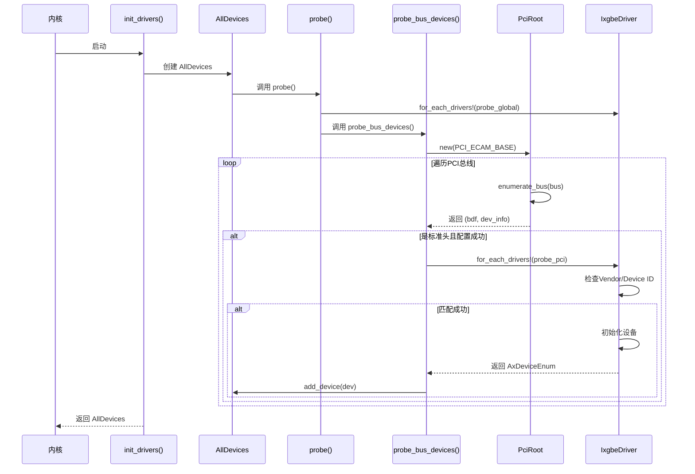
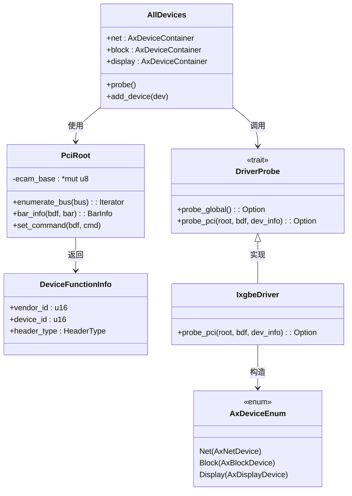
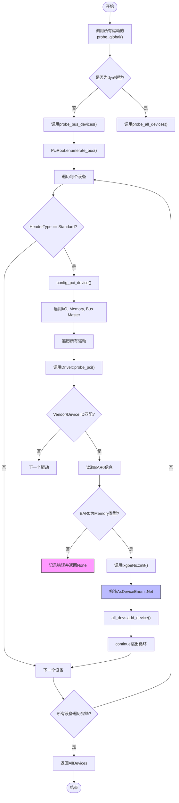

# 设备-驱动绑定流程

<cite>
**本文档引用的文件**
- [lib.rs](file://modules/axdriver/src/lib.rs)
- [pci.rs](file://modules/axdriver/src/bus/pci.rs)
- [drivers.rs](file://modules/axdriver/src/drivers.rs)
- [ixgbe.rs](file://modules/axdriver/src/ixgbe.rs)
- [mod.rs](file://modules/axdriver/src/structs/mod.rs)
- [static.rs](file://modules/axdriver/src/structs/static.rs)
</cite>

## 目录
1. [引言](#引言)
2. [项目结构](#项目结构)
3. [核心组件](#核心组件)
4. [架构概述](#架构概述)
5. [详细组件分析](#详细组件分析)
6. [依赖关系分析](#依赖关系分析)
7. [性能考虑](#性能考虑)
8. [故障排除指南](#故障排除指南)
9. [结论](#结论)

## 引言
本文档系统描述了 ArceOS 超级管理程序中设备探测与驱动匹配的完整生命周期。重点解析 `DriverProbe` trait 定义的 `probe_global` 和 `probe_pci` 探测方法在不同总线架构下的调用时机与执行顺序。以 PCI 总线上的 ixgbe 网卡为例，深入剖析从 `PciRoot` 枚举设备到调用 `probe_pci` 进行 Vendor ID/Device ID 匹配的全过程。阐述匹配成功后如何通过 `AxDeviceEnum` 枚举将具体设备实例注入系统设备树，并触发驱动初始化。涵盖错误处理机制、资源竞争规避策略以及多驱动候选时的选择逻辑，提供性能优化建议和调试日志启用方法。

## 项目结构
ArceOS 的设备驱动模块（`axdriver`）采用分层设计，核心功能位于 `modules/axdriver/src` 目录下。该模块支持静态和动态两种设备模型，并通过条件编译特性（如 `bus-pci`, `virtio-net`, `ixgbe`）来决定编译哪些具体的驱动实现。主要目录包括：
- `bus`: 实现不同总线（MMIO, PCI）的通用探测逻辑。
- `dyn_drivers`: 动态设备模型下的驱动注册与探测。
- `structs`: 定义统一的设备容器和枚举类型。
- `drivers.rs`: 核心入口，定义 `DriverProbe` trait 并注册所有支持的驱动。
- `ixgbe.rs`: Intel X540/X550 系列网卡的硬件抽象层实现。

**Diagram sources**
- [lib.rs](file://modules/axdriver/src/lib.rs#L1-L198)
- [pci.rs](file://modules/axdriver/src/bus/pci.rs#L0-L122)
- [drivers.rs](file://modules/axdriver/src/drivers.rs#L0-L176)

**Section sources**
- [lib.rs](file://modules/axdriver/src/lib.rs#L1-L198)
- [drivers.rs](file://modules/axdriver/src/drivers.rs#L0-L176)

## 核心组件
本系统的核心是 `AllDevices` 结构体和 `DriverProbe` trait。`AllDevices` 作为一个聚合容器，按类别（网络、块设备、显示）组织所有已探测到的设备实例。`DriverProbe` trait 定义了驱动探测的统一接口，其 `probe_global` 和 `probe_pci` 方法是设备发现的关键入口点。当系统调用 `init_drivers()` 函数时，会创建 `AllDevices` 实例并触发其 `probe()` 方法，进而根据配置遍历所有注册的驱动进行探测。

**Section sources**
- [lib.rs](file://modules/axdriver/src/lib.rs#L163-L197)
- [drivers.rs](file://modules/axdriver/src/drivers.rs#L10-L40)

## 架构概述
系统的设备探测流程始于内核初始化阶段对 `init_drivers()` 的调用。该函数首先输出初始化日志，然后创建一个空的 `AllDevices` 实例。在非动态（`!dyn`）模型下，探测分为两个阶段：全局探测和总线探测。全局探测通过宏 `for_each_drivers!` 遍历所有实现了 `DriverProbe` 的驱动，尝试调用其 `probe_global()` 方法。随后，系统进入总线特定的探测阶段，例如对于 PCI 总线，会调用 `probe_bus_devices()` 方法。

**Diagram sources**
- [lib.rs](file://modules/axdriver/src/lib.rs#L163-L197)
- [pci.rs](file://modules/axdriver/src/bus/pci.rs#L94-L121)
- [drivers.rs](file://modules/axdriver/src/drivers.rs#L101-L134)

## 详细组件分析

### PCI设备探测流程分析
此部分详细分析 PCI 总线上的设备探测流程，以 ixgbe 网卡为例。

#### 对象关系图

**Diagram sources**
- [lib.rs](file://modules/axdriver/src/lib.rs#L1-L198)
- [pci.rs](file://modules/axdriver/src/bus/pci.rs#L0-L122)
- [drivers.rs](file://modules/axdriver/src/drivers.rs#L10-L40)
- [ixgbe.rs](file://modules/axdriver/src/ixgbe.rs#L0-L39)

#### 探测方法调用流程

**Diagram sources**
- [pci.rs](file://modules/axdriver/src/bus/pci.rs#L94-L121)
- [drivers.rs](file://modules/axdriver/src/drivers.rs#L101-L134)

**Section sources**
- [pci.rs](file://modules/axdriver/src/bus/pci.rs#L94-L121)
- [drivers.rs](file://modules/axdriver/src/drivers.rs#L101-L134)

### 错误处理与资源竞争
系统在探测过程中集成了健壮的错误处理机制。`config_pci_device()` 函数在分配 BAR 地址或启用设备失败时会返回 `DevResult` 类型的错误，这些错误会被 `warn!` 宏记录，但不会中断