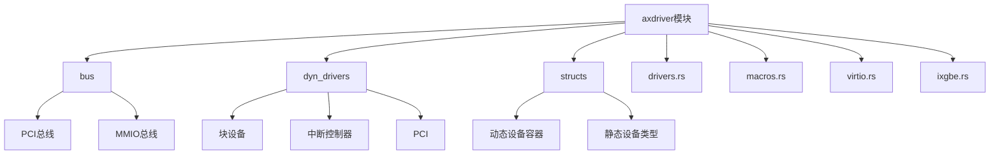
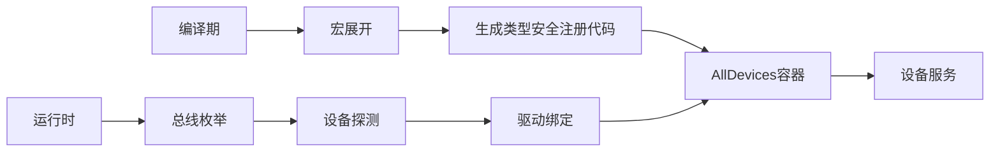
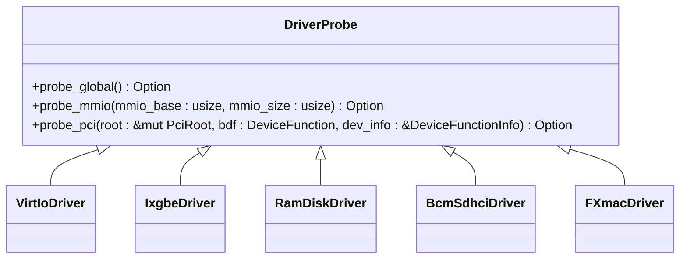
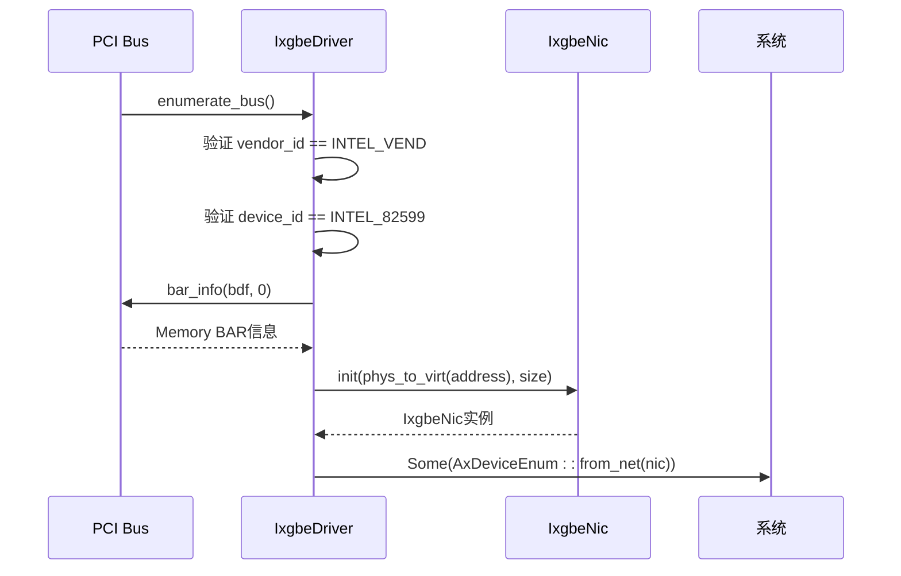
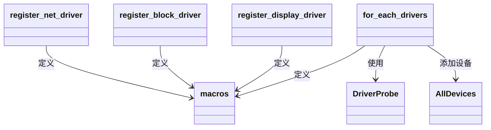

# 驱动注册与绑定机制

<cite>
**本文档引用的文件**
- [drivers.rs](file://modules/axdriver/src/drivers.rs)
- [macros.rs](file://modules/axdriver/src/macros.rs)
- [ixgbe.rs](file://modules/axdriver/src/ixgbe.rs)
- [virtio.rs](file://modules/axdriver/src/virtio.rs)
- [lib.rs](file://modules/axdriver/src/lib.rs)
- [structs/mod.rs](file://modules/axdriver/src/structs/mod.rs)
- [bus/pci.rs](file://modules/axdriver/src/bus/pci.rs)
</cite>

## 目录
1. [引言](#引言)
2. [项目结构](#项目结构)
3. [核心组件](#核心组件)
4. [架构概述](#架构概述)
5. [详细组件分析](#详细组件分析)
6. [依赖分析](#依赖分析)
7. [性能考虑](#性能考虑)
8. [故障排除指南](#故障排除指南)
9. [结论](#结论)

## 引言
本文档系统阐述了ArceOS超算操作系统中动态驱动注册系统的实现原理。重点分析`drivers.rs`中全局DRIVERS容器的数据结构设计及其并发访问控制策略，剖析`macros.rs`提供的`#[driver]`声明式宏如何通过编译期代码生成实现类型安全的驱动注册，消除手动注册的错误风险。通过`ixgbe.rs`和`virtio.rs`驱动的实际注册过程，演示宏展开后的代码形态与运行时行为。详细说明设备与驱动匹配算法的工作流程，包括设备ID匹配、能力协商等环节，并提供自定义驱动注册的最佳实践和常见陷阱规避方案。

## 项目结构
ArceOS的驱动模块位于`modules/axdriver`目录下，采用分层架构设计。核心功能分布在多个子模块中：`bus`处理总线抽象（PCI/MMIO），`dyn_drivers`支持动态驱动加载，`structs`定义统一设备类型，`drivers.rs`作为驱动注册中心，`macros.rs`提供声明式宏接口。



**图示来源**
- [lib.rs](file://modules/axdriver/src/lib.rs#L56-L112)
- [structs/mod.rs](file://modules/axdriver/src/structs/mod.rs#L0-L50)

**本节来源**
- [lib.rs](file://modules/axdriver/src/lib.rs#L56-L112)
- [project_structure](file://#L1-L200)

## 核心组件
驱动注册系统的核心由三个关键组件构成：`DriverProbe`特征定义驱动探测接口，`register_*_driver!`宏实现类型安全注册，`for_each_drivers!`宏提供统一遍历机制。这些组件协同工作，实现了编译期类型安全与运行时灵活性的平衡。

**本节来源**
- [drivers.rs](file://modules/axdriver/src/drivers.rs#L10-L25)
- [macros.rs](file://modules/axdriver/src/macros.rs#L4-L28)

## 架构概述
ArceOS驱动注册系统采用编译期代码生成与运行时探测相结合的混合架构。在编译期，通过声明式宏生成类型特定的设备注册代码；在运行时，通过总线枚举和设备探测完成驱动绑定。该架构既保证了类型安全，又保持了足够的灵活性以适应不同硬件平台。



**图示来源**
- [lib.rs](file://modules/axdriver/src/lib.rs#L163-L197)
- [bus/pci.rs](file://modules/axdriver/src/bus/pci.rs#L94-L121)

## 详细组件分析

### DriverProbe 特征分析
`DriverProbe`特征定义了驱动探测的标准接口，包括全局探测、MMIO探测和PCI探测三种模式。该特征通过条件编译特性（feature-gated）确保只包含目标平台所需的探测方法，实现了零成本抽象。



**图示来源**
- [drivers.rs](file://modules/axdriver/src/drivers.rs#L10-L25)
- [virtio.rs](file://modules/axdriver/src/virtio.rs#L139-L171)

#### ixgbe 驱动探测流程
Intel X520网卡驱动通过PCI总线探测实现设备识别。探测逻辑首先验证厂商ID和设备ID，然后读取BAR0内存映射信息，最后初始化NIC实例。该过程体现了硬件抽象层与具体驱动的协作模式。



**图示来源**
- [drivers.rs](file://modules/axdriver/src/drivers.rs#L88-L134)
- [ixgbe.rs](file://modules/axdriver/src/ixgbe.rs#L0-L39)

#### virtio 驱动通用探测机制
VirtIO驱动采用通用探测框架，支持PCI和MMIO两种传输方式。探测逻辑首先验证VirtIO标准标识（厂商ID 0x1af4），然后根据设备类型和设备ID进行匹配，最后通过`try_new`构造函数创建具体设备实例。

```mermaid
flowchart TD
Start([开始探测]) --> 检查厂商{"厂商ID == 0x1af4?"}
检查厂商 --> |否| 返回空["返回 None"]
检查厂商 --> |是| 匹配设备类型{"设备类型/ID匹配?"}
匹配设备类型 --> |否| 返回空
匹配设备类型 --> |是| 调用探针["调用 axdriver_virtio::probe_pci_device"]
调用探针 --> 获取传输{"获取 Transport 实例"}
获取传输 --> 创建设备["D::try_new(transport)"]
创建设备 --> |成功| 返回设备["Some(dev)"]
创建设备 --> |失败| 记录错误["warn!(\"failed to initialize...\")"]
记录错误 --> 返回空
返回设备 --> End([结束])
返回空 --> End
```

**图示来源**
- [virtio.rs](file://modules/axdriver/src/virtio.rs#L102-L138)
- [drivers.rs](file://modules/axdriver/src/drivers.rs#L36-L48)

### 声明式宏机制分析
`macros.rs`中的声明式宏系统是驱动注册的核心创新。通过`register_net_driver!`、`register_block_driver!`和`register_display_driver!`三个宏，系统在编译期生成类型安全的设备注册代码，避免了运行时类型转换的开销和错误。

#### 宏展开过程
当使用`register_net_driver!(Driver, Device)`时，宏展开为类型别名定义：
```rust
#[cfg(not(feature = "dyn"))]
pub type AxNetDevice = $device_type;
```
这种设计确保了网络设备类型的单一性和类型安全性。



**图示来源**
- [macros.rs](file://modules/axdriver/src/mac