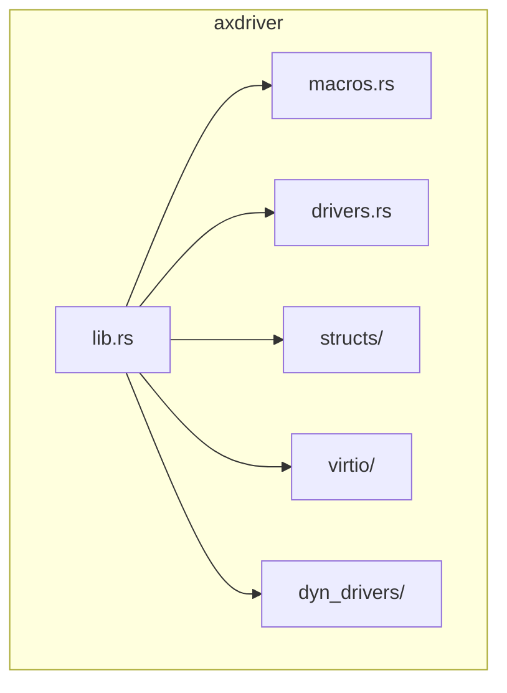
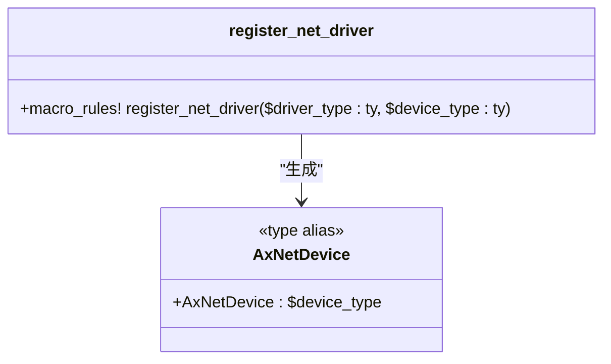
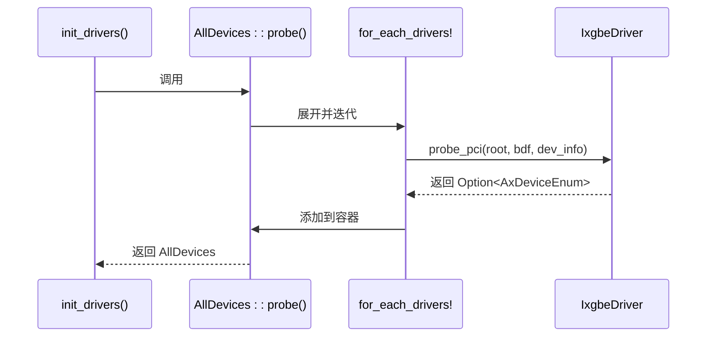
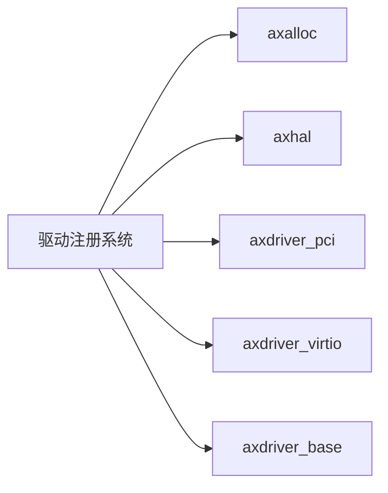

# 驱动注册机制

<cite>
**本文档引用的文件**
- [macros.rs](file://modules/axdriver/src/macros.rs)
- [drivers.rs](file://modules/axdriver/src/drivers.rs)
- [virtio.rs](file://modules/axdriver/src/virtio.rs)
- [lib.rs](file://modules/axdriver/src/lib.rs)
- [static.rs](file://modules/axdriver/src/structs/static.rs)
- [dyn.rs](file://modules/axdriver/src/structs/dyn.rs)
- [blk/mod.rs](file://modules/axdriver/src/dyn_drivers/blk/mod.rs)
- [blk/virtio.rs](file://modules/axdriver/src/dyn_drivers/blk/virtio.rs)
- [dyn_drivers/mod.rs](file://modules/axdriver/src/dyn_drivers/mod.rs)
</cite>

## 目录
1. [引言](#引言)
2. [项目结构](#项目结构)
3. [核心组件](#核心组件)
4. [架构概述](#架构概述)
5. [详细组件分析](#详细组件分析)
6. [依赖分析](#依赖分析)
7. [性能考量](#性能考量)
8. [故障排查指南](#故障排查指南)
9. [结论](#结论)

## 引言
本文深入解析 ArceOS 超级管理器中基于声明式宏的驱动注册系统。重点阐述 `register_net_driver!`、`register_block_driver!` 等宏的实现原理，以及它们如何在编译期生成类型安全的代码。分析这些宏与全局 `DRIVERS` 可变静态变量的协同工作机制，并结合具体驱动实例展示其运行时行为。

## 项目结构
ArceOS 的驱动模块位于 `modules/axdriver` 目录下，采用功能化组织方式，包含总线抽象、设备类型定义、驱动实现及宏定义等子模块。



**图示来源**
- [lib.rs](file://modules/axdriver/src/lib.rs#L1-L10)
- [macros.rs](file://modules/axdriver/src/macros.rs#L1-L5)

**本节来源**
- [lib.rs](file://modules/axdriver/src/lib.rs#L1-L50)
- [project_structure](#project_structure)

## 核心组件
驱动注册系统的核心由声明式宏（如 `register_net_driver!`）、特征（`DriverProbe`）和条件编译控制组成。系统支持静态和动态两种设备模型，通过 `dyn` 特征进行切换。

**本节来源**
- [macros.rs](file://modules/axdriver/src/macros.rs#L1-L73)
- [lib.rs](file://modules/axdriver/src/lib.rs#L1-L50)

## 架构概述
该系统采用编译期代码生成与运行时惰性初始化相结合的方式构建驱动注册表。声明式宏根据启用的特征，在编译期生成特定类型的统一别名（如 `AxNetDevice`），并通过 `for_each_drivers!` 宏遍历所有可能的驱动类型进行探测和注册。

```mermaid
graph TD
A[编译期] --> B[特征配置 net_dev=ixgbe]
A --> C[展开 register_net_driver!]
A --> D[生成 AxNetDevice = IxgbeNic]
A --> E[展开 for_each_drivers!]
F[运行时] --> G[init_drivers()]
G --> H[probe_global/probe_pci]
H --> I[创建 AxDeviceEnum]
I --> J[存入 AllDevices]
```

**图示来源**
- [macros.rs](file://modules/axdriver/src/macros.rs#L1-L73)
- [drivers.rs](file://modules/axdriver/src/drivers.rs#L1-L176)
- [lib.rs](file://modules/axdriver/src/lib.rs#L1-L198)

## 详细组件分析

### 声明式宏实现原理
`register_net_driver!`、`register_block_driver!` 等宏的作用是在编译期为特定设备类别定义统一的类型别名。当未启用 `dyn` 特征时，这些宏会生成 `pub type AxNetDevice = $device_type;` 这样的类型别名，从而实现编译期类型绑定。



**图示来源**
- [macros.rs](file://modules/axdriver/src/macros.rs#L5-L15)
- [drivers.rs](file://modules/axdriver/src/drivers.rs#L1-L176)

#### 编译期类型安全代码生成
宏通过 Rust 的条件编译属性 `#[cfg(...)]` 控制代码生成。例如，当配置 `net_dev = "ixgbe"` 时，`register_net_driver!` 宏会被展开，将 `AxNetDevice` 类型绑定到 `IxgbeNic` 上，确保了类型安全性并避免了运行时开销。

**本节来源**
- [macros.rs](file://modules/axdriver/src/macros.rs#L5-L15)
- [drivers.rs](file://modules/axdriver/src/drivers.rs#L1-L176)

### 全局驱动注册表构建
系统通过 `for_each_drivers!` 宏与 `AllDevices::probe()` 方法协作，在运行时构建驱动注册表。`for_each_drivers!` 宏会展开为多个 `#[cfg(...)]` 块，每个块对应一种可能的驱动类型，并调用其 `probe_global()` 或 `probe_pci()` 方法进行探测。



**图示来源**
- [macros.rs](file://modules/axdriver/src/macros.rs#L50-L73)
- [drivers.rs](file://modules/axdriver/src/drivers.rs#L1-L176)
- [lib.rs](file://modules/axdriver/src/lib.rs#L1-L198)

#### 惰性初始化机制
驱动的探测和初始化是惰性的，只有在 `init_drivers()` 被调用时才会执行。这保证了硬件资源在系统准备好之后才被访问，符合操作系统启动流程。

**本节来源**
- [lib.rs](file://modules/axdriver/src/lib.rs#L1-L198)
- [drivers.rs](file://modules/axdriver/src/drivers.rs#L1-L176)

### 具体驱动实例分析

#### virtio-net 驱动
`virtio-net` 驱动通过 `VirtIoNet` 结构体实现 `VirtIoDevMeta` 特征。在 PCI 总线上，它通过检查厂商 ID (0x1af4) 和设备 ID (0x1000) 来识别设备，并使用 `PciTransport` 初始化网络接口。

**本节来源**
- [virtio.rs](file://modules/axdriver/src/virtio.rs#L1-L171)
- [drivers.rs](file://modules/axdriver/src/drivers.rs#L1-L176)

#### ixgbe 驱动
`ixgbe` 驱动专用于 Intel 82599 千兆网卡。它在 `probe_pci` 方法中检查设备的 PCI ID（厂商 ID: INTEL_VEND, 设备 ID: INTEL_82599），并通过内存映射 I/O (MMIO) 访问设备寄存器来完成初始化。

**本节来源**
- [drivers.rs](file://modules/axdriver/src/drivers.rs#L1-L176)

#### ramdisk 驱动
`ramdisk` 驱动是一个纯内存块设备，不依赖于任何物理硬件。它在 `probe_global` 中直接创建一个固定大小（16 MiB）的内存盘实例并返回。

**本节来源**
- [drivers.rs](file://modules/axdriver/src/drivers.rs#L1-L176)

### 特征条件编译控制
系统的灵活性高度依赖于 Cargo 特征。`net_dev`、`block_dev`、`display_dev` 等特征决定了哪些驱动会被编译和注册。`for_each_drivers!` 宏内的每一个代码块都由相应的 `#[cfg(...)]` 属性保护，确保只有启用的驱动才会参与编译和运行时探测。

**本节来源**
- [macros.rs](file://modules/axdriver/src/macros.rs#L50-L73)
- [lib.rs](file://modules/axdriver/src/lib.rs#L1-L50)

## 依赖分析
驱动注册系统依赖于多个底层模块，包括内存管理 (`axalloc`)、硬件抽象层 (`axhal`)、PCI 总线驱动 (`axdriver_pci`) 以及 VirtIO 协议栈 (`axdriver_virtio`)。



**图示来源**
- [Cargo.toml](file://modules/axdriver/Cargo.toml#L1-L20)
- [lib.rs](file://modules/axdriver/src/lib.rs#L1-L50)

## 性能考量
- **静态模型**: 启用时性能最优，无动态分发开销，但限制每类设备只能有一个实例。
- **动态模型**: 更加灵活，支持多实例，但存在 trait object 调用的间接寻址开销。
- **编译期优化**: 大量使用 `const fn` 和内联，减少运行时计算。
- **惰性初始化**: 避免不必要的硬件探测，加快启动速度。

## 故障排查指南
### 自定义驱动注册规范
1. **命名规范**: 驱动结构体应命名为 `[DriverName]Driver`，如 `MyCustomDriver`。
2. **特征依赖**: 实现 `DriverProbe` 特征，并根据总线类型选择 `probe_global`、`probe_mmio` 或 `probe_pci`。
3. **宏注册**: 使用 `register_net_driver!` 或同类宏注册你的驱动类型。

### 常见编译错误
- **"cannot find type `AxNetDevice`"**: 确保已启用 `net` 或 `net_dev="your_driver"` 特征。
- **驱动未被探测**: 检查 `#[cfg(...)]` 条件是否与你的构建配置匹配。
- **PCI ID 不匹配**: 确认 `probe_pci` 中比较的 `vendor_id` 和 `device_id` 正确无误。

**本节来源**
- [drivers.rs](file://modules/axdriver/src/drivers.rs#L1-L176)
- [lib.rs](file://modules/axdriver/src/lib.rs#L1-L198)

## 结论
ArceOS 的驱动注册机制巧妙地结合了 Rust 的宏系统、条件编译和特征对象，实现了兼具高性能与高灵活性的设备管理方案。通过编译期代码生成确保了类型安全和零成本抽象，而运行时的惰性探测则保证了系统的健壮性和可扩展性。开发者可以通过遵循既定模式轻松集成新的硬件驱动。