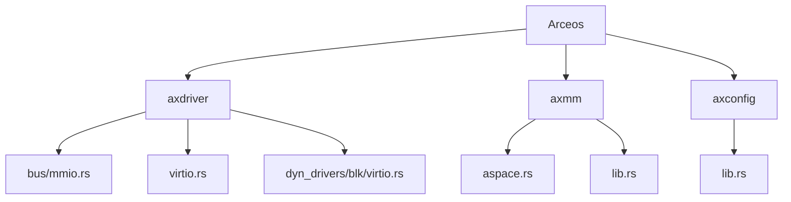
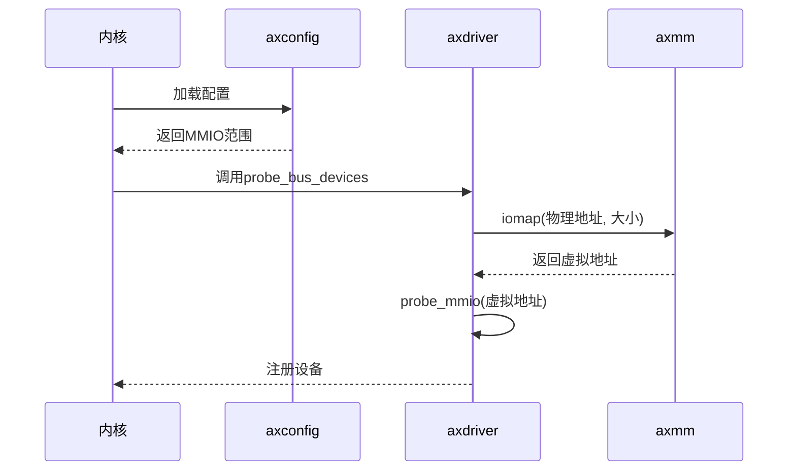
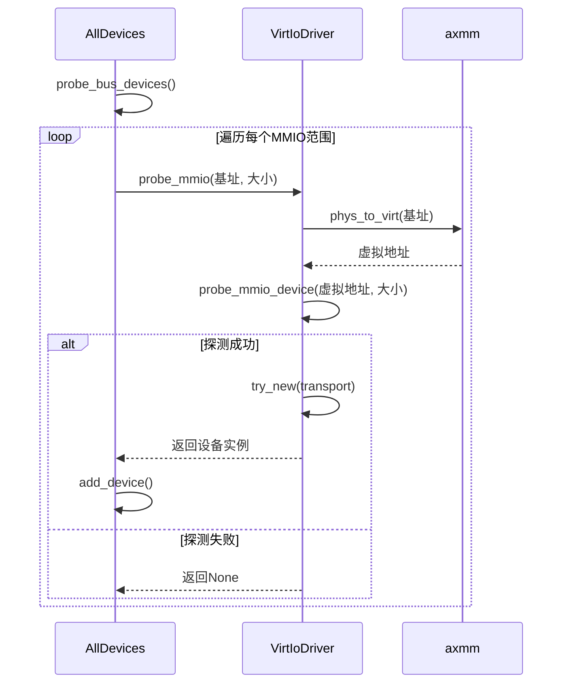
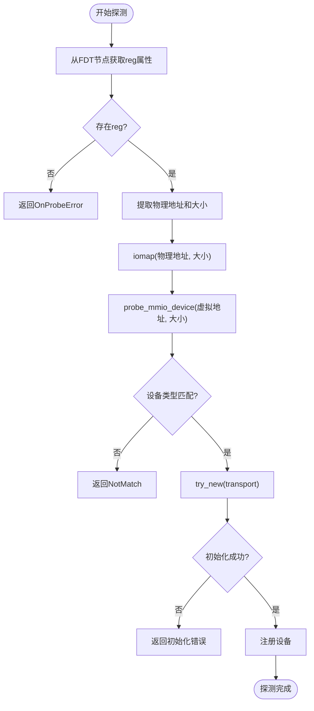
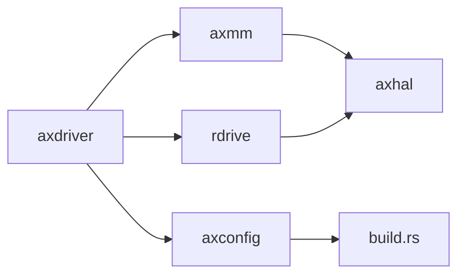

# MMIO总线支持

<cite>
**本文档中引用的文件**  
- [mmio.rs](file://modules/axdriver/src/bus/mmio.rs)
- [virtio.rs](file://modules/axdriver/src/virtio.rs)
- [dyn_drivers/blk/virtio.rs](file://modules/axdriver/src/dyn_drivers/blk/virtio.rs)
- [axconfig/src/lib.rs](file://modules/axconfig/src/lib.rs)
- [axmm/src/lib.rs](file://modules/axmm/src/lib.rs)
- [axklib-impl/src/lib.rs](file://modules/axklib-impl/src/lib.rs)
- [dummy.toml](file://configs/dummy.toml)
- [x86_64-pc-oslab.toml](file://configs/custom/x86_64-pc-oslab.toml)
</cite>

## 目录
1. [引言](#引言)  
2. [项目结构](#项目结构)  
3. [核心组件](#核心组件)  
4. [架构概述](#架构概述)  
5. [详细组件分析](#详细组件分析)  
6. [依赖关系分析](#依赖关系分析)  
7. [性能考量](#性能考量)  
8. [故障排查指南](#故障排查指南)  
9. [结论](#结论)

## 引言
本文档全面介绍Arceos操作系统中内存映射I/O（MMIO）的支持机制，重点分析设备地址空间管理、访问权限设置及设备探测实现逻辑。文档将详细描述如何通过设备树或静态配置获取MMIO设备的物理地址范围，并建立虚拟地址映射以实现安全访问。结合Raspberry Pi平台的UART控制器实例，说明MMIO设备的注册、初始化与读写操作流程。同时探讨MMIO抽象层如何屏蔽底层架构差异，为驱动开发者提供一致的编程接口，并涵盖内存屏障、缓存一致性等关键问题的处理方案。

## 项目结构
Arceos项目的模块化设计清晰地分离了硬件抽象、设备驱动和系统服务。MMIO相关功能主要分布在`axdriver`、`axmm`和`axconfig`模块中。`axdriver`负责设备探测和驱动管理；`axmm`提供内存映射能力；`axconfig`则用于平台特定配置的加载。

**图示来源**  
- [mmio.rs](file://modules/axdriver/src/bus/mmio.rs)
- [axmm/src/lib.rs](file://modules/axmm/src/lib.rs)
- [axconfig/src/lib.rs](file://modules/axconfig/src/lib.rs)

**本节来源**  
- [project_structure](file://.)

## 核心组件
MMIO支持的核心组件包括设备探测器、内存映射管理器和配置解析器。`AllDevices::probe_bus_devices`是MMIO设备探测的入口点，它遍历预定义的VirtIO MMIO地址范围并尝试匹配驱动。`axmm::iomap`函数负责将物理地址映射到虚拟地址空间，确保设备寄存器可被安全访问。`axconfig`模块通过编译时配置或运行时设备树解析提供平台相关的MMIO地址信息。

**本节来源**  
- [mmio.rs](file://modules/axdriver/src/bus/mmio.rs#L0-L22)
- [axmm/src/lib.rs](file://modules/axmm/src/lib.rs#L87-L129)
- [axconfig/src/lib.rs](file://modules/axconfig/src/lib.rs#L0-L13)

## 架构概述
Arceos的MMIO支持架构采用分层设计，上层驱动通过统一接口访问底层硬件资源。系统启动时，首先由`axconfig`加载平台配置，确定MMIO地址范围。随后`axdriver`调用`probe_bus_devices`进行设备探测，利用`axmm`提供的`iomap`服务建立虚拟地址映射。对于动态驱动模型，`rdrive`框架通过设备树进一步细化设备发现过程。

**图示来源**  
- [mmio.rs](file://modules/axdriver/src/bus/mmio.rs#L0-L22)
- [axmm/src/lib.rs](file://modules/axmm/src/lib.rs#L87-L129)
- [axconfig/src/lib.rs](file://modules/axconfig/src/lib.rs#L0-L13)

## 详细组件分析

### 设备探测与注册分析
Arceos通过两种机制探测MMIO设备：静态配置和设备树。静态模式下，`axconfig::devices::VIRTIO_MMIO_RANGES`定义了预设的地址范围，`probe_bus_devices`逐个尝试这些范围。动态模式下，`rdrive`框架解析设备树中的`reg`属性获取物理地址，并调用`iomap`建立映射后进行探测。

#### 对于API/服务组件：

**图示来源**  
- [mmio.rs](file://modules/axdriver/src/bus/mmio.rs#L0-L22)
- [virtio.rs](file://modules/axdriver/src/virtio.rs#L75-L100)

**本节来源**  
- [mmio.rs](file://modules/axdriver/src/bus/mmio.rs#L0-L22)
- [virtio.rs](file://modules/axdriver/src/virtio.rs#L75-L100)

### 动态驱动模型分析
在动态驱动模型中，`module_driver!`宏注册了基于设备树的探测器。以VirtIO块设备为例，其兼容性字符串为"virtio,mmio"，探测函数`probe`从设备节点的`reg`属性提取物理地址和大小，调用`iomap`建立映射，然后使用`axdriver_virtio::probe_mmio_device`验证设备类型。

#### 对于复杂逻辑组件：

**图示来源**  
- [dyn_drivers/blk/virtio.rs](file://modules/axdriver/src/dyn_drivers/blk/virtio.rs#L0-L50)

**本节来源**  
- [dyn_drivers/blk/virtio.rs](file://modules/axdriver/src/dyn_drivers/blk/virtio.rs#L0-L113)

## 依赖关系分析
MMIO子系统依赖多个核心模块协同工作。`axdriver`依赖`axmm`进行地址映射，依赖`axconfig`获取平台配置。`axmm`本身依赖`axhal`的底层内存管理功能。动态驱动模型还引入了对`rdrive`框架的依赖，用于设备树解析和驱动注册。

**图示来源**  
- [mmio.rs](file://modules/axdriver/src/bus/mmio.rs)
- [axmm/src/lib.rs](file://modules/axmm/src/lib.rs)
- [axconfig/src/lib.rs](file://modules/axconfig/src/lib.rs)
- [dyn_drivers/mod.rs](file://modules/axdriver/src/dyn_drivers/mod.rs)

**本节来源**  
- [mmio.rs](file://modules/axdriver/src/bus/mmio.rs)
- [axmm/src/lib.rs](file://modules/axmm