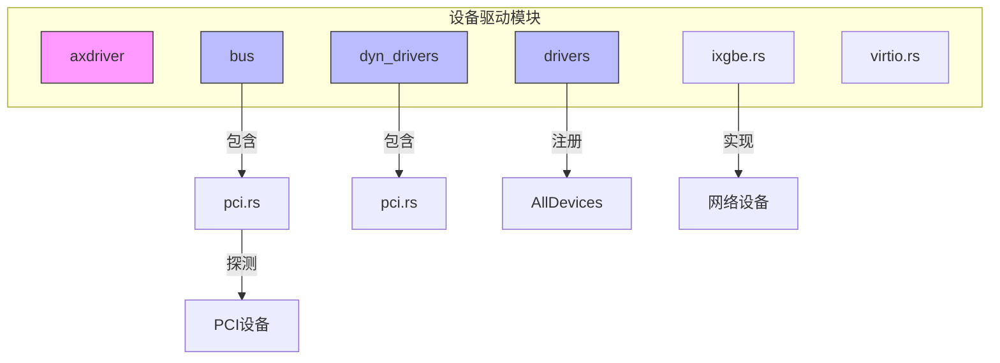
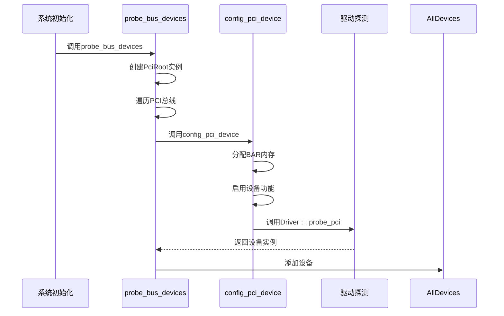
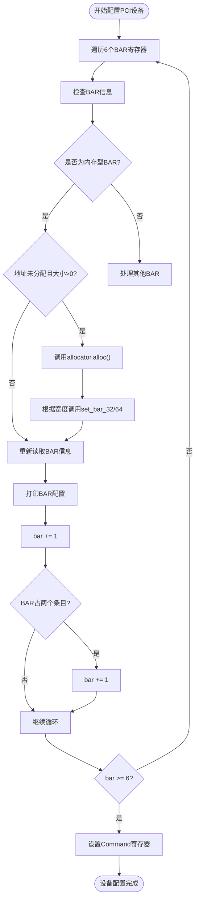
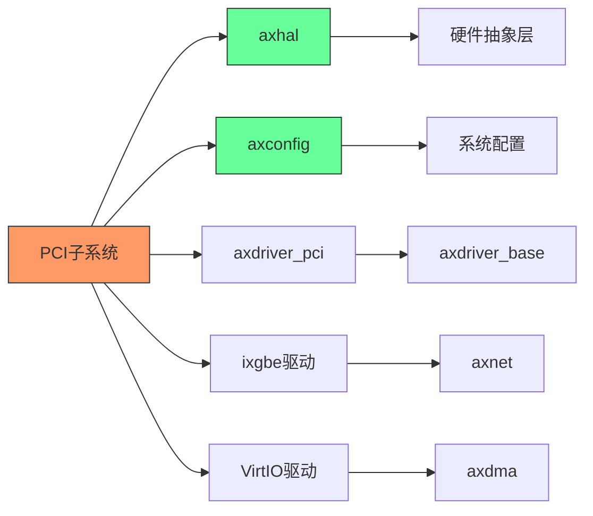

# PCI总线支持

<cite>
**本文档引用的文件**
- [pci.rs](file://modules/axdriver/src/bus/pci.rs)
- [ixgbe.rs](file://modules/axdriver/src/ixgbe.rs)
- [lib.rs](file://modules/axdriver/src/lib.rs)
- [virtio.rs](file://modules/axdriver/src/virtio.rs)
</cite>

## 目录
1. [简介](#简介)
2. [项目结构](#项目结构)
3. [核心组件](#核心组件)
4. [架构概述](#架构概述)
5. [详细组件分析](#详细组件分析)
6. [依赖分析](#依赖分析)
7. [性能考虑](#性能考虑)
8. [故障排除指南](#故障排除指南)
9. [结论](#结论)

## 简介
本文档深入解析Arceos操作系统中PCI总线的实现机制，重点阐述PCI配置空间访问协议、BAR资源解析流程以及中断引脚到中断号的映射机制。文档详细说明了如何通过统一的PCI枚举算法实现跨平台设备发现，包括设备ID识别、功能扫描与资源分配。结合ixgbe网卡驱动的实际初始化过程，展示了PCI设备的探测、配置与启用全流程。同时解释了PCI抽象层如何为上层驱动提供标准化的硬件资源视图，并讨论了性能优化策略如配置缓存和错误处理机制。

## 项目结构
Arceos的PCI支持主要分布在`modules/axdriver`模块中，其结构体现了清晰的分层设计。PCI总线相关的实现位于`bus/pci.rs`，而具体的PCI设备驱动（如ixgbe）则位于同级目录下。系统通过动态和静态两种设备模型来管理设备驱动，其中PCI设备探测是系统初始化的重要环节。



**图示来源**
- [pci.rs](file://modules/axdriver/src/bus/pci.rs#L0-L122)
- [lib.rs](file://modules/axdriver/src/lib.rs#L0-L198)

**本节来源**
- [lib.rs](file://modules/axdriver/src/lib.rs#L0-L198)
- [project_structure](file://#L0-L1000)

## 核心组件
Arceos中的PCI支持由多个核心组件构成：`PciRoot`负责管理PCI根总线和ECAM（Enhanced Configuration Access Mechanism）访问；`AllDevices`作为设备容器，收集并管理所有探测到的设备；`config_pci_device`函数实现了PCI设备的基本配置流程，包括BAR资源分配和设备启用；`probe_bus_devices`方法执行全局PCI总线枚举。这些组件共同构成了PCI设备发现和初始化的基础框架。

**本节来源**
- [pci.rs](file://modules/axdriver/src/bus/pci.rs#L0-L122)
- [lib.rs](file://modules/axdriver/src/lib.rs#L163-L197)

## 架构概述
Arceos的PCI架构采用分层设计，底层通过`PciRoot`直接访问硬件配置空间，中间层实现设备枚举和资源配置，上层为具体设备驱动提供统一接口。系统启动时，首先通过ECAM基地址建立`PciRoot`实例，然后遍历所有PCI总线进行设备枚举。对于每个标准头类型的设备，系统会配置其BAR资源并启用IO、内存和总线主控功能。最后，根据设备类型调用相应的驱动探测函数完成设备注册。



**图示来源**
- [pci.rs](file://modules/axdriver/src/bus/pci.rs#L0-L122)
- [lib.rs](file://modules/axdriver/src/lib.rs#L163-L197)

## 详细组件分析

### PCI设备配置分析
PCI设备配置的核心是`config_pci_device`函数，它负责解析和配置设备的BAR资源。函数首先遍历设备的所有BAR寄存器，对于未分配地址的内存型BAR，使用`PciRangeAllocator`从预定义的PCI内存范围内分配物理地址，并通过`set_bar_32`或`set_bar_64`写回配置空间。配置完成后，函数会读取BAR信息进行验证，并最终启用设备的IO空间、内存空间和总线主控功能。



**图示来源**
- [pci.rs](file://modules/axdriver/src/bus/pci.rs#L0-L36)
- [pci.rs](file://modules/axdriver/src/bus/pci.rs#L38-L92)

**本节来源**
- [pci.rs](file://modules/axdriver/src/bus/pci.rs#L0-L122)

### ixgbe驱动集成分析
ixgbe网卡驱动通过实现`IxgbeHal` trait与PCI子系统集成。该驱动提供了DMA内存分配、物理地址到虚拟地址转换等底层操作的实现。在PCI设备探测阶段，当`probe_pci`函数识别到Intel网卡设备时，会创建相应的设备实例并添加到`AllDevices`容器中。这种设计使得ixgbe驱动能够无缝地利用PCI抽象层提供的标准化硬件资源视图。

```mermaid
classDiagram
class IxgbeHalImpl {
+dma_alloc(size : usize) (IxgbePhysAddr, NonNull<u8>)
+dma_dealloc(paddr : IxgbePhysAddr, vaddr : NonNull<u8>, size : usize) i32
+mmio_phys_to_virt(paddr : IxgbePhysAddr, size : usize) NonNull<u8>
+mmio_virt_to_phys(vaddr : NonNull<u8>, size : usize) IxgbePhysAddr
+wait_until(duration : Duration) Result<(), &str>
}
class PciDevice {
+vendor_id : u16
+device_id : u16
+header_type : HeaderType
}
class AllDevices {
+net : AxDeviceContainer<AxNetDevice>
+block : AxDeviceContainer<AxBlockDevice>
+display : AxDeviceContainer<AxDisplayDevice>
+add_device(dev : AxDeviceEnum)
+probe()
}
IxgbeHalImpl ..|> axdriver_net : : ixgbe : : IxgbeHal : 实现
AllDevices --> PciDevice : 包含
PciDevice --> IxgbeHalImpl : 使用
```

**图示来源**
- [ixgbe.rs](file://modules/axdriver/src/ixgbe.rs#L0-L39)
- [lib.rs](file://modules/axdriver/src/lib.rs#L0-L198)

**本节来源**
- [ixgbe.rs](file://modules/axdriver/src/ixgbe.rs#L0-L39)
- [virtio.rs](file://modules/axdriver/src/virtio.rs#L102-L138)

## 依赖分析
PCI子系统与其他模块存在紧密的依赖关系。它依赖`axhal`模块提供的物理地址到虚拟地址转换功能，依赖`axconfig`模块获取PCI ECAM基地址和内存范围配置。在动态设备模型下，PCI控制器驱动还依赖设备树（FDT）信息进行初始化。同时，PCI子系统为网络、块设备等驱动提供基础支持，形成了清晰的依赖层次。



**图示来源**
- [pci.rs](file://modules/axdriver/src/bus/pci.rs#L0-L122)
- [ixgbe.rs](file://modules/axdriver/src/ixgbe.rs#L0-L39)
- [lib.rs](file://modules/axdriver/src/lib.rs#L0-L198)

**本节来源**
- [pci.rs](file://modules/axdriver/src/bus/pci.rs#L0-L122)
- [ixgbe.rs](file://modules/axdriver/src/ixgbe.rs#L0-L39)
- [lib.rs](file://modules/axdriver/src/lib.rs#L0-L198)

## 性能考虑
Arceos的PCI实现考虑了多项性能优化策略。首先，通过ECAM机制直接映射整个PCI配置空间，避免了频繁的I/O端口访问。其次，在BAR资源分配时使用预配置的内存范围，减少了内存分配的开销。系统还通过合理的调试信息级别控制，避免在生产环境中产生过多的日志输出影响性能。此外，静态设备模型的选择可以消除动态调度的开销，提高驱动调用的效率。

## 故障排除指南
当PCI设备无法正常工作时，应首先检查系统日志中是否有相关错误信息。常见问题包括：PCI内存范围不足导致BAR分配失败、ECAM基地址配置错误导致无法访问配置空间、设备未正确启用总线主控功能等。可以通过验证`axconfig::devices::PCI_ECAM_BASE`和`PCI_RANGES`的配置是否正确来排查这些问题。对于特定设备，还需确认其驱动是否已正确编译并启用相应功能特性。

**本节来源**
- [pci.rs](file://modules/axdriver/src/bus/pci.rs#L0-L122)
- [lib.rs](file://modules/axdriver/src/lib.rs#L163-L197)

## 结论
Arceos通过精心设计的PCI抽象层，实现了高效可靠的PCI设备支持。其核心机制包括基于ECAM的配置空间访问、自动化的BAR资源分配、统一的设备枚举算法以及灵活的驱动注册机制。系统不仅支持传统的PCI设备探测，还能与现代的设备