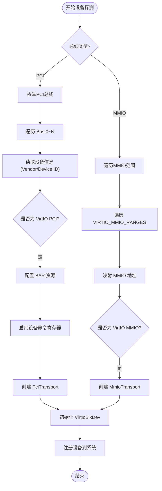

# 总线支持机制

<cite>
**本文档引用的文件**
- [pci.rs](file://modules/axdriver/src/bus/pci.rs)
- [mmio.rs](file://modules/axdriver/src/bus/mmio.rs)
- [ixgbe.rs](file://modules/axdriver/src/ixgbe.rs)
- [virtio.rs](file://modules/axdriver/src/virtio.rs)
- [virtio.rs](file://modules/axdriver/src/dyn_drivers/blk/virtio.rs)
</cite>

## 目录
1. [引言](#引言)
2. [PCI总线支持实现](#pci总线支持实现)
3. [MMIO总线支持实现](#mmio总线支持实现)
4. [设备探测流程对比分析](#设备探测流程对比分析)
5. [总线抽象层设计与统一资源视图](#总线抽象层设计与统一资源视图)
6. [结论](#结论)

## 引言
本系统旨在为不同类型的硬件设备提供统一的驱动加载和资源管理机制。通过PCI和MMIO两种主流总线架构的支持，实现了跨平台的设备枚举与初始化。本文将深入解析`pci.rs`和`mmio.rs`中的核心逻辑，阐述其在设备发现、资源配置及中断映射等方面的关键流程，并结合ixgbe网卡与virtio-blk设备的实际探测过程，展示不同总线下设备发现的共性与差异。

## PCI总线支持实现

在ArceOS中，PCI总线的支持主要由`modules/axdriver/src/bus/pci.rs`实现。该模块通过ECAM（Enhanced Configuration Access Mechanism）方式访问PCI配置空间，完成设备枚举、BAR资源分配以及命令寄存器设置等关键操作。

系统首先根据平台配置获取PCI ECAM基地址，并将其映射为虚拟地址以供访问。随后调用`PciRoot::new`创建根桥实例，遍历所有总线号（0到PCI_BUS_END），对每个总线上的设备进行枚举。对于标准头部类型的设备，执行`config_pci_device`函数进行资源配置。

该函数负责处理六个BAR（Base Address Register）寄存器，识别其类型（I/O或内存）、大小及是否可预取。若BAR未被分配物理地址，则使用`PciRangeAllocator`从预定义的PCI内存范围内为其分配连续的物理地址空间，并通过`set_bar_32`或`set_bar_64`写回配置空间。最后，启用设备的I/O空间、内存空间和总线主控功能，确保设备可以正常响应访问请求。

一旦设备配置完成，系统会遍历所有注册的驱动程序，尝试调用其`probe_pci`方法进行匹配。成功探测后，设备被加入全局设备列表，供上层服务使用。

**Section sources**
- [pci.rs](file://modules/axdriver/src/bus/pci.rs#L0-L122)

## MMIO总线支持实现

MMIO（Memory-Mapped I/O）总线的支持实现在`modules/axdriver/src/bus/mmio.rs`中。与PCI不同，MMIO设备通常通过设备树描述其物理地址范围，当前实现暂未解析设备树，而是依赖静态配置的VIRTIO_MMIO_RANGES数组来枚举设备。

系统遍历每一个预定义的VirtIO MMIO地址区间，尝试调用各驱动的`probe_mmio`方法进行探测。若驱动成功识别并初始化设备，则将其注册到系统中。

具体而言，`probe_mmio`函数接收设备的物理基地址和大小作为参数，将其映射为虚拟地址后，调用`axdriver_virtio::probe_mmio_device`检测是否为有效的VirtIO设备。若匹配成功且设备类型符合预期（如块设备、网络设备等），则进一步构造相应的传输层对象（MmioTransport），并创建具体的设备实例。

此机制简化了嵌入式或虚拟化环境中轻量级设备的接入流程，避免了复杂的总线枚举开销。

**Section sources**
- [mmio.rs](file://modules/axdriver/src/bus/mmio.rs#L0-L23)

## 设备探测流程对比分析

### ixgbe网卡探测流程
ixgbe网卡作为典型的PCI设备，其探测流程始于`pci.rs`中的`probe_bus_devices`。当系统枚举到Vendor ID为0x8086、Device ID为0x10FB的设备时，触发ixgbe驱动的`probe_pci`逻辑。

在`ixgbe.rs`中，驱动通过实现`IxgbeHal` trait 提供底层操作接口，包括DMA内存分配、MMIO地址转换和延迟等待等功能。这些接口封装了平台相关的细节，使得上层驱动代码具有良好的可移植性。

### virtio-blk设备探测流程
virtio-blk设备既可通过PCI也可通过MMIO方式接入。在PCI模式下，系统识别Vendor ID为0x1AF4、Device ID为0x1001或0x1042的设备；在MMIO模式下，则依据设备树中"virtio,mmio"兼容性字符串进行匹配。

`virtio.rs`中定义了通用的`VirtIoDriver`结构体，通过条件编译区分总线类型。对于MMIO设备，调用`probe_mmio_device`解析设备特征并建立MmioTransport；对于PCI设备，则调用`probe_pci_device`获取传输通道。无论哪种方式，最终都通过`VirtIoBlk::try_new`构造块设备实例。

**Diagram sources**
- [pci.rs](file://modules/axdriver/src/bus/pci.rs#L0-L122)
- [mmio.rs](file://modules/axdriver/src/bus/mmio.rs#L0-L23)
- [virtio.rs](file://modules/axdriver/src/virtio.rs#L0-L171)
- [virtio.rs](file://modules/axdriver/src/dyn_drivers/blk/virtio.rs#L0-L179)

**Section sources**
- [ixgbe.rs](file://modules/axdriver/src/ixgbe.rs#L0-L39)
- [virtio.rs](file://modules/axdriver/src/virtio.rs#L0-L171)
- [virtio.rs](file://modules/axdriver/src/dyn_drivers/blk/virtio.rs#L0-L179)

## 总线抽象层设计与统一资源视图

ArceOS通过`AllDevices::probe_bus_devices`统一入口，屏蔽了PCI与MMIO总线的技术差异。上层驱动无需关心设备的具体连接方式，只需实现`DriverProbe` trait 的`probe_pci`或`probe_mmio`方法即可参与设备探测。

总线抽象层的核心在于：
1. **资源隔离**：PCI使用独立的ECAM配置空间和专用内存区域，而MMIO共享系统内存空间。
2. **地址映射**：两者均需将物理地址映射为虚拟地址，但PCI还需动态分配BAR地址。
3. **探测机制**：PCI基于固定总线拓扑枚举，MMIO依赖静态配置或设备树声明。
4. **统一接口**：通过`AxDeviceEnum`枚举类型向上层提供一致的设备视图，隐藏底层传输细节。

这种设计不仅提升了系统的可扩展性，也增强了驱动代码的复用能力。

**Section sources**
- [pci.rs](file://modules/axdriver/src/bus/pci.rs#L0-L122)
- [mmio.rs](file://modules/axdriver/src/bus/mmio.rs#L0-L23)
- [virtio.rs](file://modules/axdriver/src/virtio.rs#L0-L171)

## 结论
ArceOS通过精心设计的总线支持机制，实现了对PCI和MMIO两类主流设备的高效管理。PCI总线采用标准ECAM机制完成设备枚举与资源分配，适用于复杂外设；MMIO总线则以简洁直接的方式支持嵌入式和虚拟化场景下的设备接入。两者在探测流程上虽有差异，但通过统一的驱动模型和抽象接口，为上层提供了无缝的设备资源视图。未来可通过引入设备树解析进一步增强MMIO设备的动态发现能力。