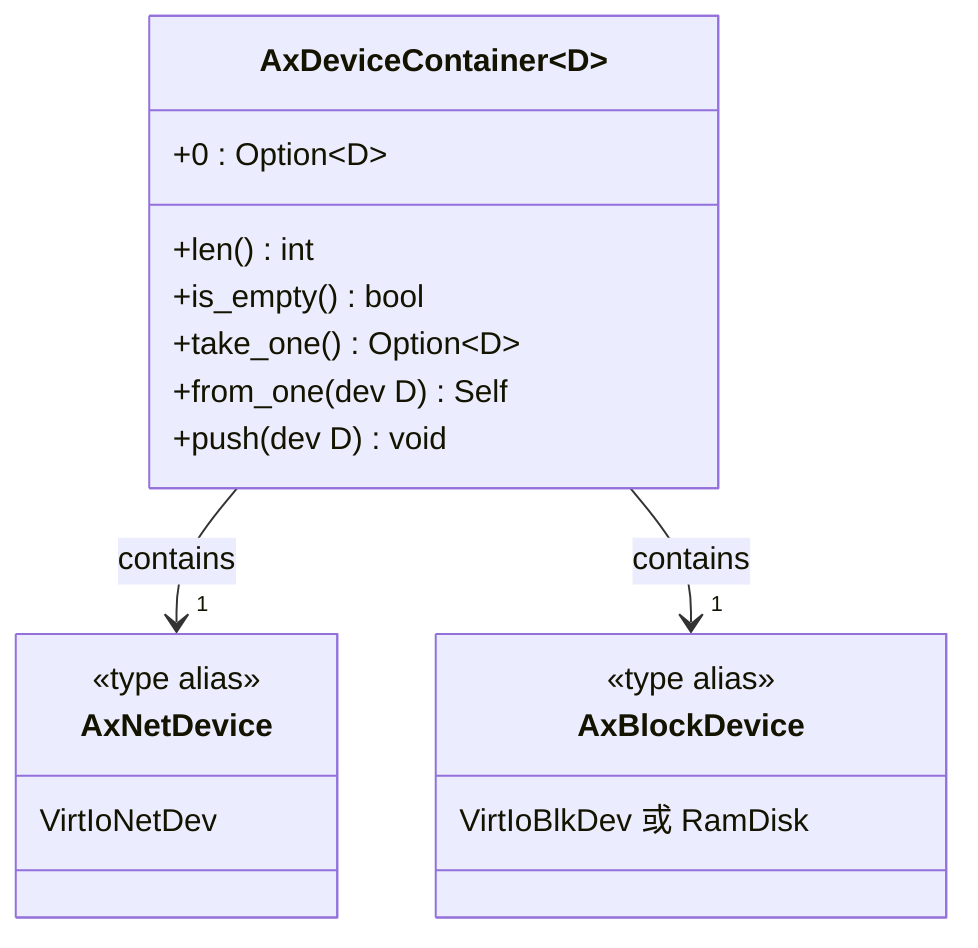
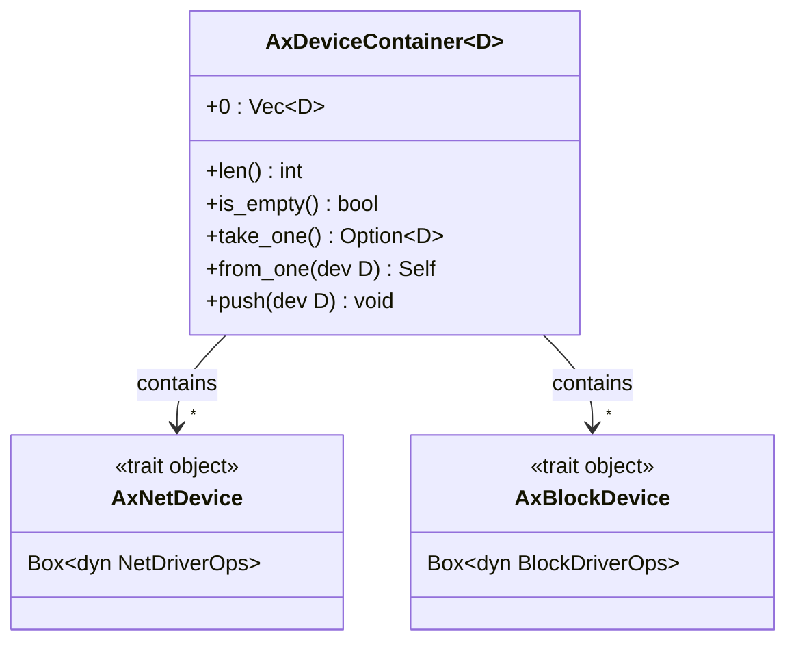
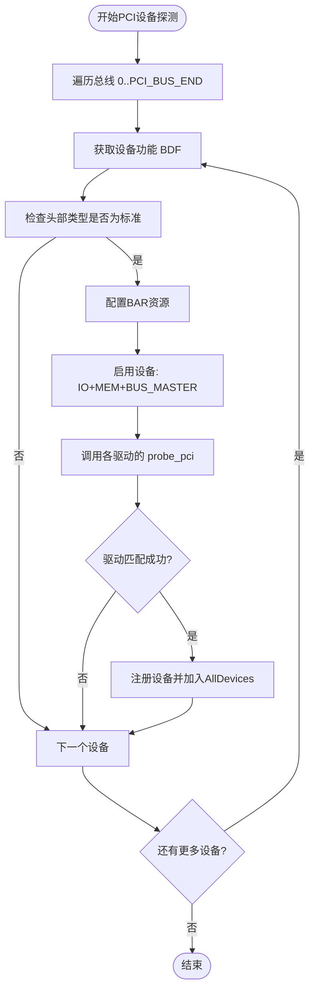
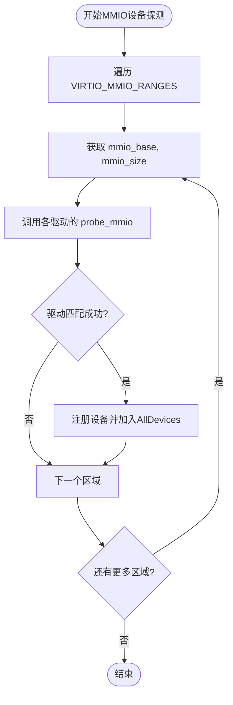
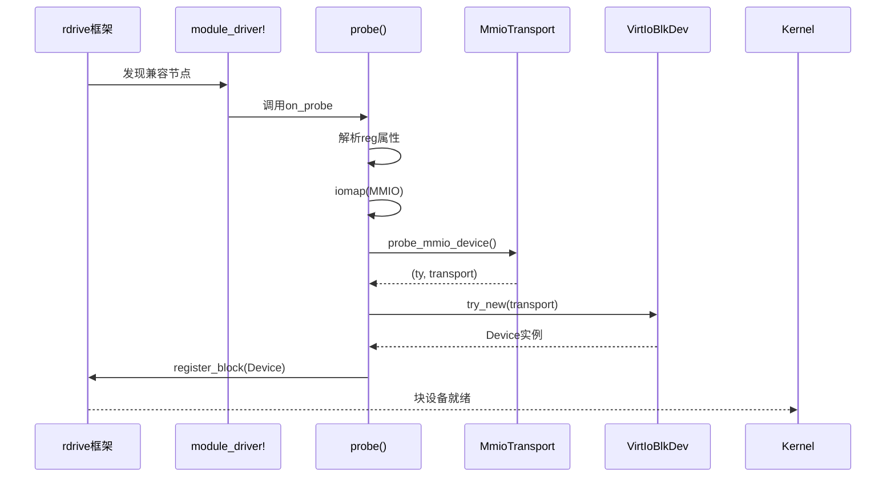

# 设备模型与驱动框架

<cite>
**本文档中引用的文件**
- [lib.rs](file://modules/axdriver/src/lib.rs)
- [static.rs](file://modules/axdriver/src/structs/static.rs)
- [dyn.rs](file://modules/axdriver/src/structs/dyn.rs)
- [pci.rs](file://modules/axdriver/src/bus/pci.rs)
- [mmio.rs](file://modules/axdriver/src/bus/mmio.rs)
- [prelude.rs](file://modules/axdriver/src/prelude.rs)
- [drivers.rs](file://modules/axdriver/src/drivers.rs)
- [macros.rs](file://modules/axdriver/src/macros.rs)
- [virtio.rs](file://modules/axdriver/src/virtio.rs)
- [blk/virtio.rs](file://modules/axdriver/src/dyn_drivers/blk/virtio.rs)
- [blk/mod.rs](file://modules/axdriver/src/dyn_drivers/blk/mod.rs)
- [mod.rs](file://modules/axdriver/src/dyn_drivers/mod.rs)
</cite>

## 目录
1. [引言](#引言)
2. [静态与动态设备模型](#静态与动态设备模型)
3. [PCI与MMIO总线设备枚举](#pcimmio总线设备枚举)
4. [驱动实现规范与案例](#驱动实现规范与案例)
5. [全局驱动管理与宏机制](#全局驱动管理与宏机制)
6. [性能与资源评估](#性能与资源评估)
7. [结论](#结论)

## 引言

ArceOS 的 `axdriver` 模块为操作系统提供了统一的设备驱动框架，支持在嵌入式和虚拟化环境中灵活地管理和使用硬件设备。该模块的核心设计在于实现了静态（static）与动态（dynamic）双重设备模型，允许开发者根据系统需求选择编译时确定或运行时发现的设备注册方式。通过 PCI 和 MMIO 总线的支持，框架能够探测并初始化多种物理和虚拟设备。此外，`prelude.rs` 定义了标准化的驱动接口，使得新驱动的开发遵循一致的模式。本文档将深入分析这些机制的设计原理、实现细节及其在实际场景中的应用。

## 静态与动态设备模型

`axdriver` 模块通过条件编译特性 `dyn` 支持两种截然不同的设备模型：静态模型和动态模型。这两种模型在类型表示、实例数量限制以及性能表现上存在显著差异。

### 静态设备模型

当未启用 `dyn` 特性时，系统采用静态设备模型。在此模型下，所有设备的具体类型在编译期即已确定，并通过类型别名直接绑定到具体的驱动实现。例如，在启用了 `virtio-net` 特性的情况下，`AxNetDevice` 将被定义为 `VirtioNetDev` 的具体类型。

**图示来源**
- [static.rs](file://modules/axdriver/src/structs/static.rs#L1-L75)

**本节来源**
- [lib.rs](file://modules/axdriver/src/lib.rs#L1-L198)
- [static.rs](file://modules/axdriver/src/structs/static.rs#L1-L75)

静态模型的关键优势在于其卓越的性能。由于所有方法调用均为静态分发，避免了虚函数表查找带来的开销，从而实现了零成本抽象。然而，这种模型也带来了明显的局限性：每个设备类别仅能容纳一个设备实例。这由 `AxDeviceContainer<D>` 的内部结构决定——它使用 `Option<D>` 来存储设备，因此无法支持多网卡或多块存储设备等复杂配置。

### 动态设备模型

启用 `dyn` 特性后，系统切换至动态设备模型。在此模型中，设备以 trait 对象的形式存在，统一包装在 `Box<dyn Trait>` 中。例如，`AxNetDevice` 变为 `Box<dyn NetDriverOps>` 类型。

**图示来源**
- [dyn.rs](file://modules/axdriver/src/structs/dyn.rs#L1-L104)

**本节来源**
- [lib.rs](file://modules/axdriver/src/lib.rs#L1-L198)
- [dyn.rs](file://modules/axdriver/src/structs/dyn.rs#L1-L104)

动态模型的最大优势是其灵活性。`AxDeviceContainer<D>` 内部使用 `Vec<D>` 存储设备，允许多个同类型的设备实例共存。这对于需要支持多个网络接口或多种存储介质的应用至关重要。尽管动态分发会引入轻微的性能开销，但现代 CPU 的分支预测机制通常能有效缓解这一问题。此外，该模型依赖于 `rdrive` 框架进行运行时设备探测，能够根据设备树（Device Tree）信息自动加载和注册设备。

## PCI与MMIO总线设备枚举

`axdriver` 模块通过 `bus` 子模块实现了对 PCI 和 MMIO 两种主流总线架构的支持，确保了在不同硬件平台上的广泛兼容性。

### PCI总线设备枚举

PCI 总线的设备探测流程始于 `probe_bus_devices` 函数。该函数首先通过内存映射访问 PCI 配置空间（ECAM），创建 `PciRoot` 实例以遍历指定范围内的所有总线。对于每一个发现的设备功能（Device Function），系统执行以下步骤：

1. **BAR资源配置**：读取设备的基地址寄存器（BAR），若发现未分配的内存空间，则从预定义的内存池中为其分配物理地址。
2. **设备使能**：设置命令寄存器，启用 I/O 空间、内存空间和总线主控功能。
3. **驱动匹配**：调用 `for_each_drivers!` 宏展开的循环，尝试让每个已注册的驱动探查当前设备。

**图示来源**
- [pci.rs](file://modules/axdriver/src/bus/pci.rs#L1-L122)

**本节来源**
- [pci.rs](file://modules/axdriver/src/bus/pci.rs#L1-L122)

### MMIO总线设备枚举

MMIO 总线的探测相对简单，主要针对基于设备树描述的内存映射外设。系统遍历 `axconfig::devices::VIRTIO_MMIO_RANGES` 中预定义的内存区域，对每个区域调用 `for_each_drivers!` 宏生成的探测逻辑。

**图示来源**
- [mmio.rs](file://modules/axdriver/src/bus/mmio.rs#L1-L23)

**本节来源**
- [mmio.rs](file://modules/axdriver/src/bus/mmio.rs#L1-L23)

## 驱动实现规范与案例

`axdriver` 框架通过 `prelude.rs` 提供了一套清晰的驱动开发规范，确保了不同驱动之间的接口一致性。驱动开发者需遵循特定的模式来实现新的设备支持。

### 驱动开发规范

`prelude.rs` 导出了所有核心 trait 和类型，包括 `BaseDriverOps`、`NetDriverOps`、`BlockDriverOps` 等。这些 trait 定义了设备的基本操作，如查询设备类型、名称以及执行读写等。开发者在实现新驱动时，必须实现相应的 trait，并通过 `register_*_driver!` 宏将其注册到全局列表中。

**本节来源**
- [prelude.rs](file://modules/axdriver/src/prelude.rs#L1-L10)

### Virtio网络与块设备案例

以 `virtio-blk` 驱动为例，其在动态模型下的实现位于 `dyn_drivers/blk/virtio.rs`。该驱动利用 `module_driver!` 宏声明自身为一个可被 `rdrive` 探测的模块，指定了兼容的设备树节点名称（`"virtio,mmio"`）。当探测函数 `probe` 被调用时，它会：
1. 从设备树节点解析出 MMIO 基地址和大小。
2. 使用 `iomap` 将物理地址映射到虚拟地址空间。
3. 调用 `axdriver_virtio::probe_mmio_device` 初始化 VirtIO 传输层。
4. 创建 `VirtIoBlkDev` 实例，并通过 `PlatformDevice::register_block` 将其注册为块设备接口。

此过程展示了如何将底层硬件抽象与高层驱动逻辑分离，同时利用 `rdif_block::Interface` 提供的标准接口与上层文件系统交互。

**图示来源**
- [dyn_drivers/blk/virtio.rs](file://modules/axdriver/src/dyn_drivers/blk/virtio.rs#L1-L179)
- [dyn_drivers/blk/mod.rs](file://modules/axdriver/src/dyn_drivers/blk/mod.rs#L1-L105)

**本节来源**
- [dyn_drivers/blk/virtio.rs](file://modules/axdriver/src/dyn_drivers/blk/virtio.rs#L1-L179)
- [dyn_drivers/blk/mod.rs](file://modules/axdriver/src/dyn_drivers/blk/mod.rs#L1-L105)
- [virtio.rs](file://modules/axdriver/src/virtio.rs#L1-L171)

## 全局驱动管理与宏机制

`axdriver` 框架通过巧妙的宏设计和全局数据结构实现了高效的驱动管理。

### 全局驱动列表管理

`drivers.rs` 文件中的 `DriverProbe` trait 定义了三种探测方式：全局探测、MMIO 探测和 PCI 探测。`AllDevices::probe` 方法根据是否启用 `dyn` 特性，分别采用不同的策略来收集设备。在静态模型中，`for_each_drivers!` 宏会展开为一系列 `if let Some(dev) = Driver::probe_global()` 的调用，逐一尝试每个可能的驱动。

### 声明性宏简化注册

`macros.rs` 中的 `register_net_driver!`、`register_block_driver!` 等宏负责在编译期生成正确的类型别名。更重要的是，`for_each_drivers!` 宏通过条件编译，自动生成一个包含所有启用驱动的探测循环。这不仅减少了样板代码，还保证了只有被选中的驱动才会参与编译和链接，优化了最终二进制文件的大小。

**本节来源**
- [drivers.rs](file://modules/axdriver/src/drivers.rs#L1-L176)
- [macros.rs](file://modules/axdriver/src/macros.rs#L1-L73)

## 性能与资源评估

在嵌入式资源受限场景下，`axdriver` 框架的表现取决于所选的设备模型。

- **静态模型**：提供最佳性能，无动态分发开销，且内存占用极小。但由于只能支持单实例，适用场景有限。
- **动态模型**：虽然引入了 `Vec` 和 `Box` 带来的堆分配开销，以及 trait 对象的间接调用成本，但其灵活性使其更适合复杂的系统。通过 `rdrive` 的惰性探测机制，未使用的驱动不会消耗运行时资源。

总体而言，该框架在设计上充分考虑了嵌入式系统的约束，允许开发者在性能和功能之间做出权衡。

**本节来源**
- [lib.rs](file://modules/axdriver/src/lib.rs#L1-L198)
- [dyn.rs](file://modules/axdriver/src/structs/dyn.rs#L1-L104)

## 结论

`axdriver` 模块通过静态与动态双重设备模型，为 ArceOS 提供了一个既高效又灵活的驱动框架。静态模型适用于对性能要求极高且设备配置固定的场景，而动态模型则满足了复杂系统对多设备支持的需求。PCI 和 MMIO 总线的完善支持确保了广泛的硬件兼容性。通过 `prelude.rs` 定义的规范和强大的宏系统，新驱动的开发变得简单而一致。尽管动态模型在资源受限环境下有一定开销，但其设计合理，整体上是一个成熟且可扩展的解决方案。