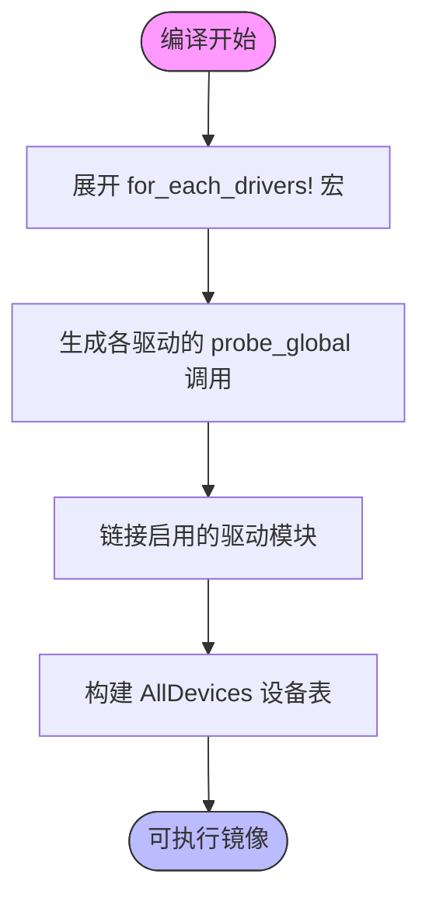

# 静态设备模型

<cite>
**本文档中引用的文件**  
- [static.rs](file://modules/axdriver/src/structs/static.rs)
- [lib.rs](file://modules/axdriver/src/lib.rs)
- [mod.rs](file://modules/axdriver/src/structs/mod.rs)
- [drivers.rs](file://modules/axdriver/src/drivers.rs)
- [axhal/lib.rs](file://modules/axhal/src/lib.rs)
</cite>

## 目录
1. [引言](#引言)  
2. [项目结构与核心模块](#项目结构与核心模块)  
3. [静态设备模型的设计原理](#静态设备模型的设计原理)  
4. [编译期设备注册机制分析](#编译期设备注册机制分析)  
5. [内存布局与访问效率](#内存布局与访问效率)  
6. [特定平台BSP实现示例：Raspberry Pi 4](#特定平台bsp实现示例raspberry-pi-4)  
7. [确定性系统与安全关键场景的适用性](#确定性系统与安全关键场景的适用性)  
8. [静态模型的局限性](#静态模型的局限性)  
9. [结论](#结论)

## 引言
静态设备模型是一种在编译时完成设备注册和配置的系统设计方法，广泛应用于嵌入式操作系统、Hypervisor 和实时系统中。该模型通过 Rust 的宏系统和常量求值能力，在编译阶段构建不可变的设备表，从而避免运行时动态分配和类型擦除带来的性能开销。本文深入解析 ArceOS 中 `static.rs` 模块所实现的静态设备模型，阐述其如何利用编译期计算构建高效、安全的设备管理系统，并结合 `axhal` 层对 Raspberry Pi 4 等平台的 BSP 实现，展示 CPU、UART 等核心外设如何以零运行时开销被系统识别。

## 项目结构与核心模块
ArceOS 的设备驱动架构位于 `modules/axdriver` 模块中，采用条件编译机制支持静态（`static`）与动态（`dyn`）两种设备模型。当未启用 `dyn` 特性时，系统默认使用静态模型，所有设备类型在编译时确定，仅允许每个设备类别存在一个实例。

```mermaid
graph TB
subgraph "设备驱动模块 (axdriver)"
A[lib.rs] --> B[structs/mod.rs]
B --> C[static.rs]
B --> D[dyn.rs]
A --> E[drivers.rs]
A --> F[virtio.rs]
A --> G[ixgbe.rs]
end
subgraph "硬件抽象层 (axhal)"
H[lib.rs] --> I[mem.rs]
H --> J[irq.rs]
H --> K[time.rs]
end
A --> H : "依赖"
```

**Diagram sources**  
- [lib.rs](file://modules/axdriver/src/lib.rs#L1-L199)
- [mod.rs](file://modules/axdriver/src/structs/mod.rs#L1-L52)

**Section sources**  
- [lib.rs](file://modules/axdriver/src/lib.rs#L1-L199)
- [mod.rs](file://modules/axdriver/src/structs/mod.rs#L1-L52)

## 静态设备模型的设计原理
静态设备模型的核心思想是将设备驱动的类型绑定在编译期，通过 Rust 的泛型和条件编译特性消除运行时多态性。在 `axdriver` 中，这一机制由 `features` 控制：例如启用 `virtio-net` 特性后，`AxNetDevice` 将被定义为具体的 `VirtioNetDev` 类型，而非 `Box<dyn NetDriverOps>`。

这种设计避免了虚函数调用和堆分配，显著提升了性能。同时，由于设备数量和类型在编译时已知，系统可精确规划内存布局，确保设备表的紧凑性和可预测性。

**Section sources**  
- [lib.rs](file://modules/axdriver/src/lib.rs#L20-L60)

## 编译期设备注册机制分析
静态模型通过宏和全局常量在编译期完成设备探测与注册。`AllDevices::probe()` 函数中使用 `for_each_drivers!` 宏遍历所有注册的驱动类型，并调用其 `probe_global()` 方法尝试初始化设备。

```rust
#[cfg(not(feature = "dyn"))]
{
    for_each_drivers!(type Driver, {
        if let Some(dev) = Driver::probe_global() {
            info!("registered a new {:?} device: {:?}", dev.device_type(), dev.device_name());
            self.add_device(dev);
        }
    });
}
```

该过程完全在编译期展开，生成直接调用各驱动探测函数的代码，无任何运行时迭代或条件判断开销。设备一旦注册即存入 `AxDeviceContainer<D>`，其内部为 `Option<D>`，保证单类别设备唯一性。



**Diagram sources**  
- [lib.rs](file://modules/axdriver/src/lib.rs#L150-L170)
- [drivers.rs](file://modules/axdriver/src/drivers.rs#L1-L177)

**Section sources**  
- [lib.rs](file://modules/axdriver/src/lib.rs#L150-L190)
- [drivers.rs](file://modules/axdriver/src/drivers.rs#L1-L177)

## 内存布局与访问效率
静态设备模型的内存布局具有高度可预测性。`AxDeviceContainer<D>` 结构体大小等于 `Option<D>`，而 `AllDevices` 则是一个包含若干 `AxDeviceContainer` 字段的聚合体。由于所有字段均为 `const` 或 `static` 初始化，整个设备表位于 `.rodata` 或 `.data` 段，访问无需页表查找或锁同步。

访问路径极短：`AllDevices.net.0.as_ref().unwrap()` 即可获取网络设备引用，编译器可进一步内联优化为直接字段访问，实现零成本抽象。

**Section sources**  
- [static.rs](file://modules/axdriver/src/structs/static.rs#L1-L75)
- [lib.rs](file://modules/axdriver/src/lib.rs#L100-L120)

## 特定平台BSP实现示例：Raspberry Pi 4
在 `aarch64-raspi` 平台中，`axhal` 层通过 `init_early` 和 `init_percpu` 初始化 CPU 与内存子系统。外设如 UART 通过 BCM2835 GPIO 和 PL011 UART 驱动在 `drivers.rs` 中注册：

```rust
#[cfg(block_dev = "bcm2835-sdhci")]
impl DriverProbe for BcmSdhciDriver {
    fn probe_global() -> Option<AxDeviceEnum> {
        axdriver_block::bcm2835sdhci::SDHCIDriver::try_new().ok().map(AxDeviceEnum::from_block)
    }
}
```

这些驱动在编译时被链接进内核镜像，启动时由 `init_drivers()` 统一探测并注册，无需设备树解析或运行时枚举，极大缩短了启动时间，满足嵌入式系统的快速启动需求。

**Section sources**  
- [drivers.rs](file://modules/axdriver/src/drivers.rs#L100-L130)
- [lib.rs](file://modules/axhal/src/lib.rs#L1-L144)

## 确定性系统与安全关键场景的适用性
静态设备模型因其可预测的行为和零运行时开销，特别适用于确定性系统和安全关键领域（如航空航天、工业控制）。其优势包括：

- **确定性延迟**：设备访问路径固定，中断响应时间可精确建模。
- **内存安全**：无动态分配，杜绝内存泄漏与碎片化。
- **攻击面小**：无运行时设备枚举逻辑，减少潜在漏洞。
- **形式化验证友好**：整个设备状态空间有限且已知，便于验证。

因此，该模型符合高可靠性系统对可预测性、安全性和性能的严格要求。

**Section sources**  
- [lib.rs](file://modules/axdriver/src/lib.rs#L20-L60)
- [static.rs](file://modules/axdriver/src/structs/static.rs#L1-L75)

## 静态模型的局限性
尽管静态模型具备诸多优势，但其灵活性受限，主要体现在：

- **不支持热插拔**：设备必须在编译时确定，无法在运行时添加或移除。
- **配置不灵活**：切换设备需重新编译内核，不适合通用操作系统。
- **资源浪费**：即使设备未物理连接，驱动代码仍占用镜像空间。
- **扩展性差**：新增设备需修改源码并重新构建工具链。

这些限制使其更适合专用嵌入式系统，而非通用计算平台。

**Section sources**  
- [lib.rs](file://modules/axdriver/src/lib.rs#L20-L60)
- [drivers.rs](file://modules/axdriver/src/drivers.rs#L1-L177)

## 结论
ArceOS 的静态设备模型通过 Rust 的编译期计算能力，在 `static.rs` 中实现了高效、安全的设备管理机制。该模型利用宏和常量定义，在编译时完成设备注册，构建不可变的设备表，显著提升了内存访问效率和系统确定性。结合 `axhal` 层对 Raspberry Pi 4 等平台的 BSP 支持，CPU、UART 等核心外设得以零运行时开销被系统识别。虽然该模型在热插拔和配置灵活性方面存在局限，但其在嵌入式、实时和安全关键系统中的优势使其成为构建高可靠性系统的重要基石。