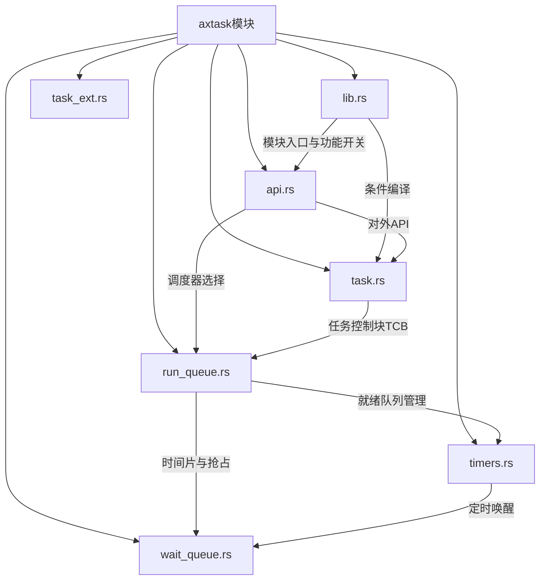
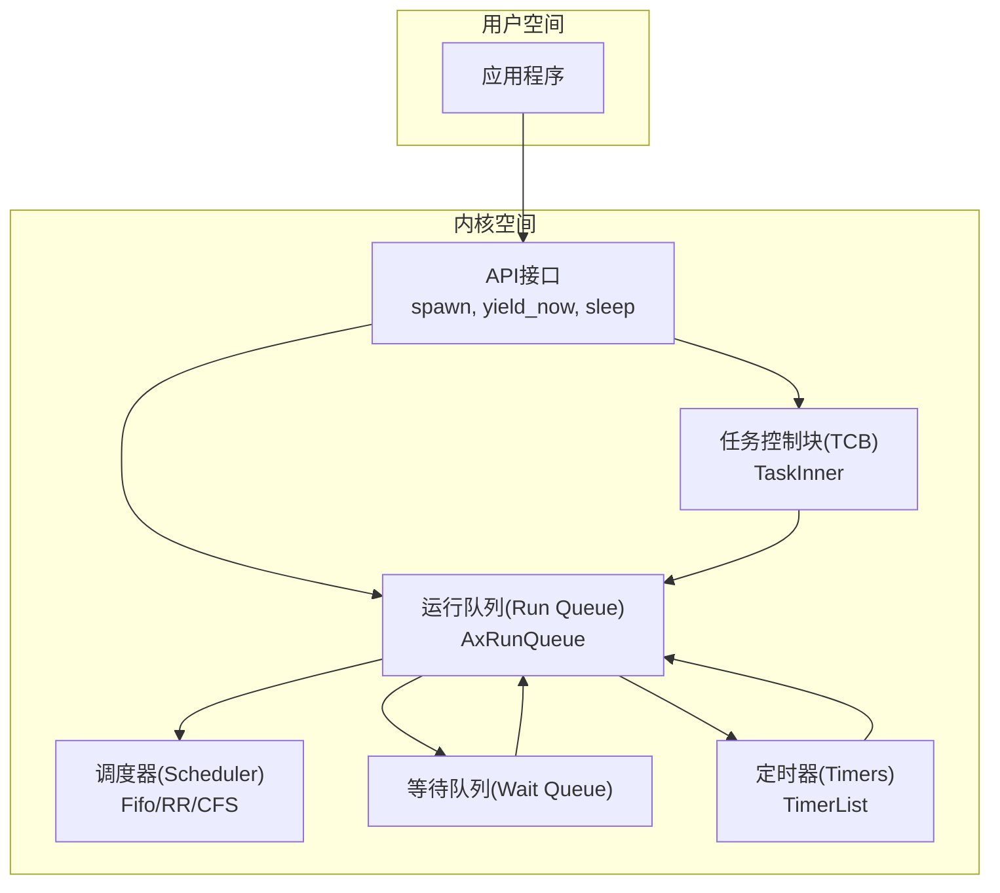
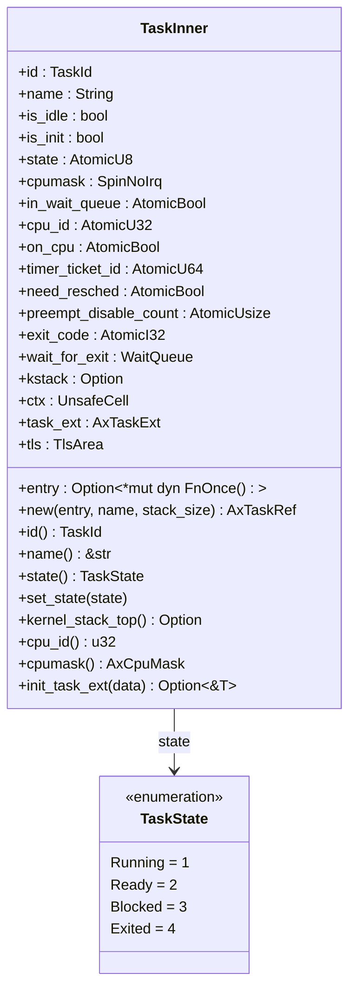
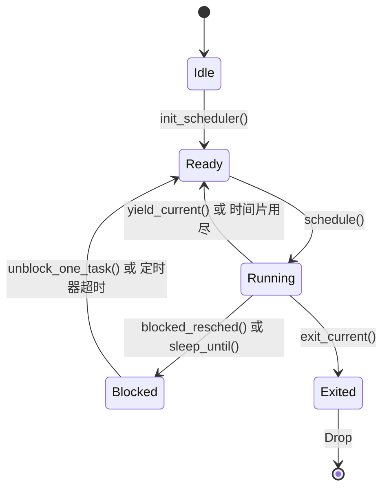
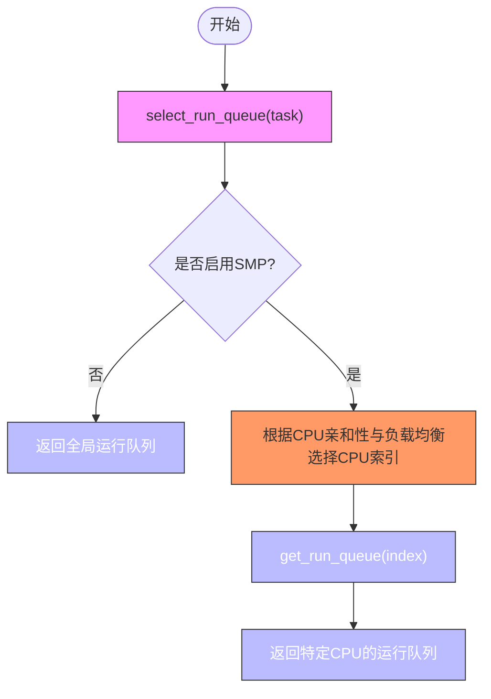
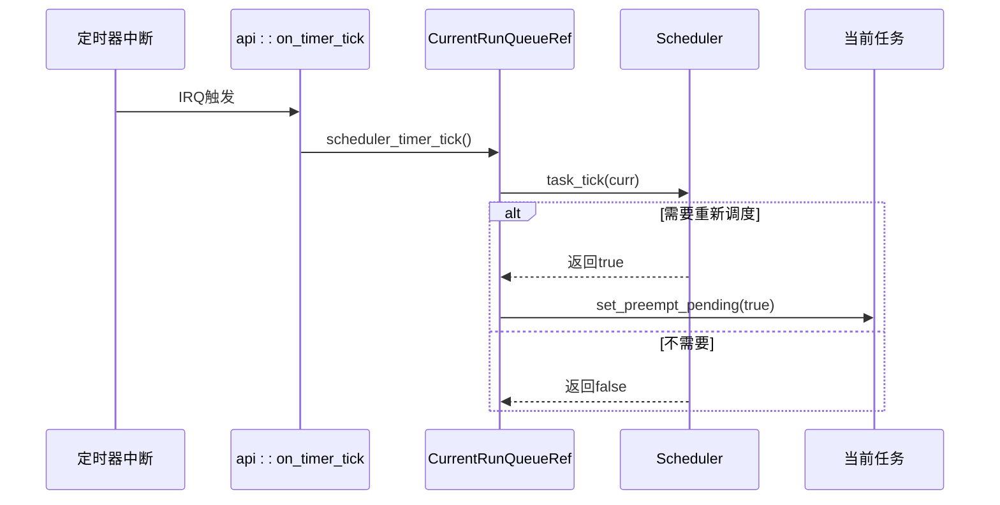
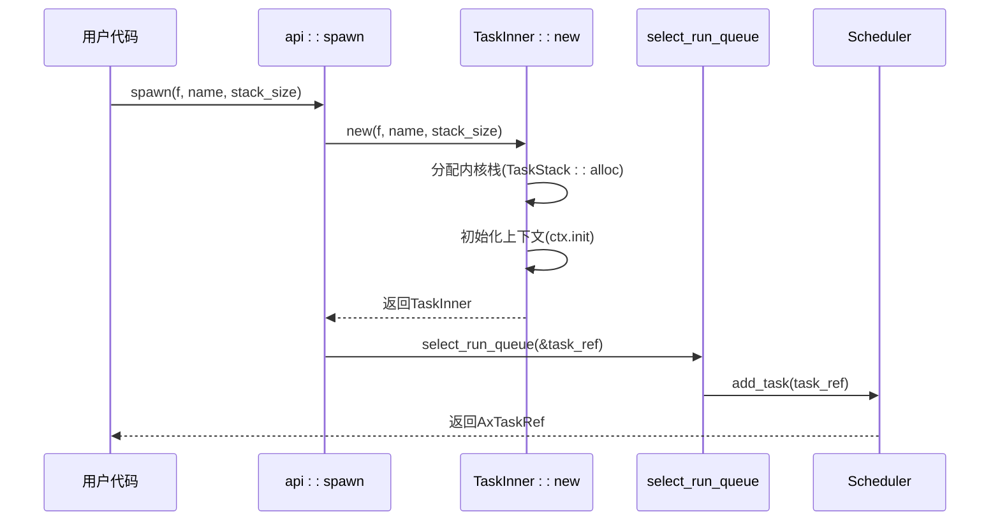
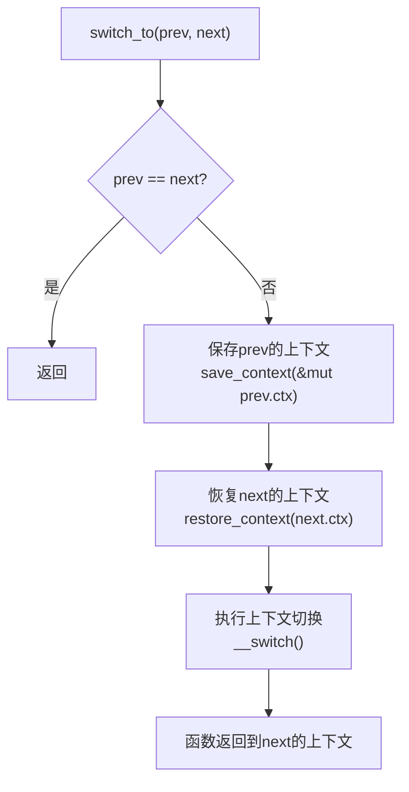

# 任务调度 (axtask)

<cite>
**本文档中引用的文件**   
- [lib.rs](file://modules/axtask/src/lib.rs)
- [api.rs](file://modules/axtask/src/api.rs)
- [task.rs](file://modules/axtask/src/task.rs)
- [run_queue.rs](file://modules/axtask/src/run_queue.rs)
- [timers.rs](file://modules/axtask/src/timers.rs)
- [wait_queue.rs](file://modules/axtask/src/wait_queue.rs)
</cite>

## 目录
1. [简介](#简介)
2. [项目结构](#项目结构)
3. [核心组件](#核心组件)
4. [架构概述](#架构概述)
5. [详细组件分析](#详细组件分析)
6. [依赖分析](#依赖分析)
7. [性能考虑](#性能考虑)
8. [故障排除指南](#故障排除指南)
9. [结论](#结论)

## 简介
`axtask` 模块是 ArceOS 操作系统中的核心任务管理组件，负责实现多任务环境下的任务创建、调度、同步和生命周期管理。该模块支持多种可配置的调度算法（FIFO、RR、CFS），并为单核与多核（SMP）环境提供了完整的任务控制机制。其设计目标是在保证实时性的同时，提供公平且高效的 CPU 资源分配策略。

## 项目结构
`axtask` 模块位于 `modules/axtask` 目录下，是 ArceOS 内核的关键组成部分。它通过清晰的文件划分实现了高内聚、低耦合的设计。



**Diagram sources**
- [lib.rs](file://modules/axtask/src/lib.rs)
- [api.rs](file://modules/axtask/src/api.rs)
- [task.rs](file://modules/axtask/src/task.rs)
- [run_queue.rs](file://modules/axtask/src/run_queue.rs)
- [timers.rs](file://modules/axtask/src/timers.rs)
- [wait_queue.rs](file://modules/axtask/src/wait_queue.rs)

**Section sources**
- [lib.rs](file://modules/axtask/src/lib.rs)
- [api.rs](file://modules/axtask/src/api.rs)

## 核心组件

`axtask` 模块的核心由任务控制块（TCB）、运行队列（Run Queue）、调度器（Scheduler）和等待队列（Wait Queue）构成。这些组件协同工作，实现了从任务创建到销毁的完整生命周期管理。任务的状态转换由 `TaskState` 枚举精确描述，并通过原子操作保证了在并发环境下的安全性。

**Section sources**
- [task.rs](file://modules/axtask/src/task.rs#L44-L91)
- [run_queue.rs](file://modules/axtask/src/run_queue.rs#L180-L219)

## 架构概述

`axtask` 模块采用分层架构，将任务抽象、调度逻辑和底层硬件交互分离。其核心是一个可插拔的调度器框架，允许在编译时通过 Cargo 特性（feature）选择不同的调度算法。



**Diagram sources**
- [api.rs](file://modules/axtask/src/api.rs)
- [task.rs](file://modules/axtask/src/task.rs)
- [run_queue.rs](file://modules/axtask/src/run_queue.rs)

## 详细组件分析

### 任务控制块(TCB)分析
`TaskInner` 结构体是任务控制块（TCB）的具体实现，封装了任务的所有元数据和状态信息。

#### TCB数据结构


**Diagram sources**
- [task.rs](file://modules/axtask/src/task.rs#L44-L91)

#### 任务状态机


**Diagram sources**
- [task.rs](file://modules/axtask/src/task.rs#L44-L91)
- [run_queue.rs](file://modules/axtask/src/run_queue.rs#L381-L411)

### 运行队列与调度器分析
运行队列是调度器管理就绪任务的核心数据结构。

#### 就绪队列组织方式


**Diagram sources**
- [run_queue.rs](file://modules/axtask/src/run_queue.rs#L137-L178)

#### 调度算法实现流程


**Diagram sources**
- [api.rs](file://modules/axtask/src/api.rs#L88-L129)
- [run_queue.rs](file://modules/axtask/src/run_queue.rs#L270-L293)

### 关键流程分析
#### 任务创建流程


**Diagram sources**
- [api.rs](file://modules/axtask/src/api.rs#L88-L129)
- [task.rs](file://modules/axtask/src/task.rs#L87-L141)

#### 上下文切换流程


**Diagram sources**
- [run_queue.rs](file://modules/axtask/src/run_queue.rs#L409-L458)

## 依赖分析

`axtask` 模块与其他内核模块存在紧密的依赖关系，形成了一个完整的系统服务链。

```mermaid
graph LR
    axtask --> axhal["axhal (硬件抽象层)"]
    axtask --> axconfig["axconfig (配置)"]
    axtask --> cpumask["cpumask (CPU掩码)"]
    axtask --> axsched["axsched (调度算法库)"]
    axtask --> kernel_guard["kernel_guard (内核保护)"]
    axtask --> timer_list["timer_list (定时器列表)"]
    axtask --> memory_addr["memory_addr (内存地址)"]
    axtask --> kspin["kspin (自旋锁)"]

    axhal -->|提供| time["时间(wall_time)"]
    axhal -->|提供| per