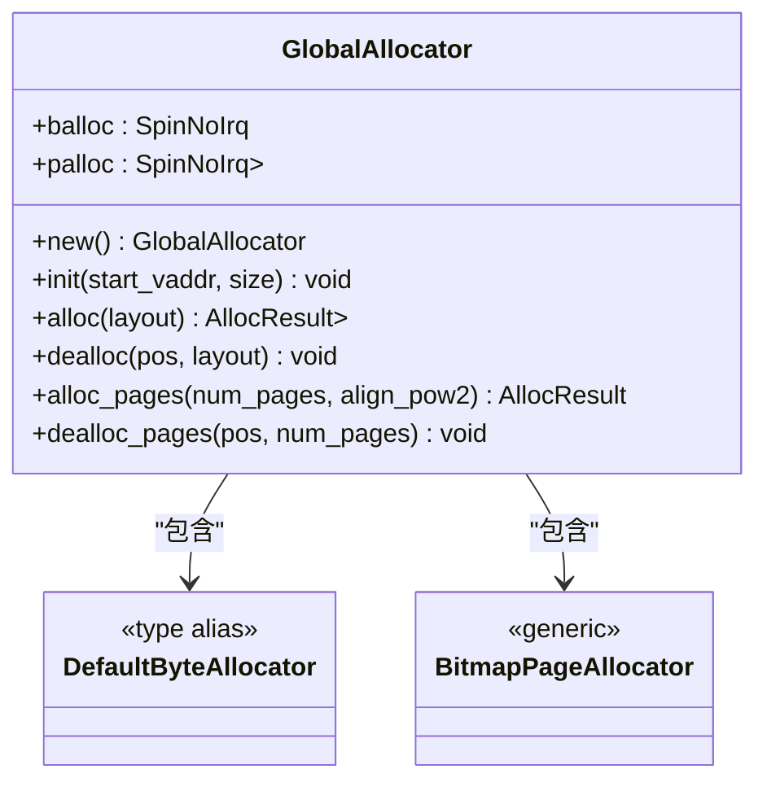
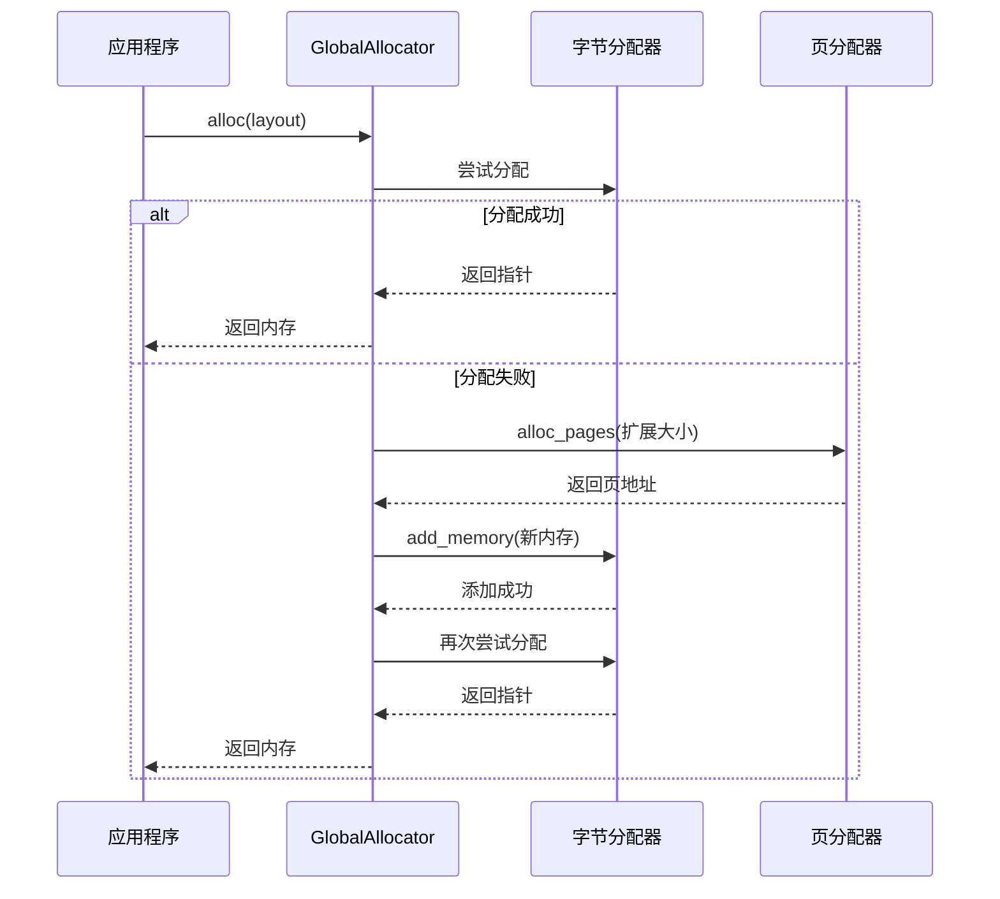
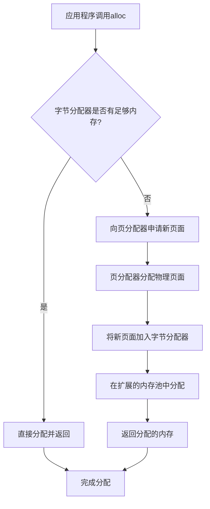

# 内存分配器 (axalloc)

<cite>
**本文档中引用的文件**
- [lib.rs](file://modules/axalloc/src/lib.rs)
- [page.rs](file://modules/axalloc/src/page.rs)
- [Cargo.toml](file://modules/axalloc/Cargo.toml)
- [mem.rs](file://api/arceos_api/src/imp/mem.rs)
- [alloc.rs](file://modules/axmm/src/backend/alloc.rs)
- [sys.rs](file://api/arceos_posix_api/src/imp/sys.rs)
- [dma.rs](file://modules/axdma/src/dma.rs)
</cite>

## 目录
1. [简介](#简介)
2. [核心职责与GlobalAlloc实现](#核心职责与globalalloc实现)
3. 两级分配架构
   - [前端线程本地缓存(TLAB)](#前端线程本地缓存tlab)
   - [后端页级分配器](#后端页级分配器)
4. [Slab分配器与碎片管理](#slab分配器与碎片管理)
5. [内存分配路径分析](#内存分配路径分析)
6. [NUMA架构下的内存局部性优化](#numa架构下的内存局部性优化)
7. [监控与统计信息](#监控与统计信息)
8. [内存耗尽处理策略](#内存耗尽处理策略)
9. [实际调用场景示例](#实际调用场景示例)

## 简介

axalloc是ArceOS操作系统的全局内存分配器，为系统提供统一的内存管理服务。它实现了Rust标准库中的`GlobalAlloc` trait，并通过`#[global_allocator]`属性注册为默认分配器。该分配器采用两级架构设计，结合了细粒度的字节分配器和粗粒度的页分配器，以满足不同场景下的内存需求。

**Section sources**
- [lib.rs](file://modules/axalloc/src/lib.rs#L0-L36)

## 核心职责与GlobalAlloc实现

axalloc的核心职责是作为系统的全局内存分配中枢，负责所有动态内存的分配与回收。其主要功能包括：

1. 实现`core::alloc::GlobalAlloc` trait，为Rust运行时提供标准内存接口
2. 管理系统级的堆内存区域
3. 提供高效的内存分配与释放机制
4. 支持多种分配策略的配置

在`GlobalAllocator`结构体中，通过`unsafe impl GlobalAlloc`实现了两个关键方法：
- `alloc`: 根据指定布局分配内存，失败时调用`handle_alloc_error`
- `dealloc`: 释放指定指针指向的内存块

分配器支持多种后端实现，可通过编译特征选择：
- **slab**: 使用slab分配器作为默认字节分配器
- **buddy**: 使用伙伴系统分配器
- **tlsf**: 使用TLSF（Two-Level Segregated Fit）分配器



**Diagram sources**
- [lib.rs](file://modules/axalloc/src/lib.rs#L38-L82)

**Section sources**
- [lib.rs](file://modules/axalloc/src/lib.rs#L249-L292)

## 两级分配架构

### 前端线程本地缓存(TLAB)

axalloc采用两级分配架构，前端使用字节分配器（ByteAllocator）作为主要分配路径。当前端分配器无法满足请求时，会向后端页分配器申请更多内存。

在初始化过程中，分配器首先将整个内存区域添加到页分配器，然后从中分配32KB的小区域来初始化字节分配器。这种设计确保了即使在初始阶段也能快速响应小内存分配请求。



**Diagram sources**
- [lib.rs](file://modules/axalloc/src/lib.rs#L114-L136)

**Section sources**
- [lib.rs](file://modules/axalloc/src/lib.rs#L138-L171)

### 后端页级分配器

后端页级分配器基于`BitmapPageAllocator`实现，负责管理4KB页面级别的内存分配。每个页面的分配状态通过位图进行跟踪，提供了高效的页面分配和释放操作。

页分配器的主要功能包括：
- `alloc_pages`: 分配指定数量的连续页面
- `dealloc_pages`: 释放指定起始地址的页面
- `used_pages`: 获取已使用页面数
- `available_pages`: 获取可用页面数

当系统需要大块内存或前端分配器耗尽时，会通过页分配器获取新的内存页，并将其加入前端分配器的管理范围。

**Section sources**
- [lib.rs](file://modules/axalloc/src/lib.rs#L173-L217)

## Slab分配器与碎片管理

虽然默认配置使用TLSF分配器，但axalloc支持通过编译特征切换到slab分配器。Slab分配器通过对象大小分类管理空闲块，有效减少了内存碎片。

Slab分配器的工作原理：
1. 将内存划分为不同大小的slab，每个slab专门管理特定大小的对象
2. 对于频繁分配/释放的相同大小对象，直接从对应slab获取
3. 减少了因大小不匹配导致的内部碎片
4. 提高了缓存局部性和分配效率

通过`cfg_if!`宏定义，可以根据编译特征选择不同的默认字节分配器类型，实现了灵活的分配策略配置。

**Section sources**
- [lib.rs](file://modules/axalloc/src/lib.rs#L36-L55)

## 内存分配路径分析

完整的内存分配路径涉及多个层次的协作：

1. **应用层请求**: 应用程序调用`alloc`或相关API
2. **全局分配器**: `GlobalAllocator`接收请求并转发给字节分配器
3. **前端分配**: 字节分配器尝试在现有内存池中分配
4. **后端补充**: 若前端不足，则向页分配器申请新页面
5. **内存扩展**: 新页面被添加到字节分配器的管理范围
6. **最终分配**: 在扩展后的内存池中完成分配

释放路径相对简单，直接由字节分配器处理，将内存块返回到空闲列表中等待重用。



**Diagram sources**
- [lib.rs](file://modules/axalloc/src/lib.rs#L114-L171)

**Section sources**
- [lib.rs](file://modules/axalloc/src/lib.rs#L114-L171)

## NUMA架构下的内存局部性优化

虽然当前代码未显式实现NUMA感知的内存分配，但其架构为未来的NUMA优化提供了基础。通过以下方式可以实现内存局部性优化：

1. **节点感知分配**: 根据CPU亲和性选择最近的内存节点
2. **本地内存池**: 每个NUMA节点维护独立的前端分配器实例
3. **跨节点回收**: 当本地节点内存不足时，可从远程节点借用内存

目前的`SpinNoIrq`锁机制保证了分配操作的原子性，为多核环境下的安全访问提供了保障。未来可以通过引入per-NUMA-node分配器实例来进一步优化内存局部性。

**Section sources**
- [lib.rs](file://modules/axalloc/src/lib.rs#L38-L82)

## 监控与统计信息

axalloc提供了丰富的监控接口，用于获取内存使用情况的统计信息：

- `used_bytes()`: 返回字节分配器中已使用的字节数
- `available_bytes()`: 返回字节分配器中可用的字节数
- `used_pages()`: 返回页分配器中已使用的页面数
- `available_pages()`: 返回页分配器中可用的页面数

这些统计信息对于系统性能调优和内存泄漏检测非常重要。例如，在POSIX API实现中，`sysconf`函数利用`available_pages()`来报告可用物理页面数。

```mermaid
graph TB
    subgraph "监控接口"
        A[used_bytes