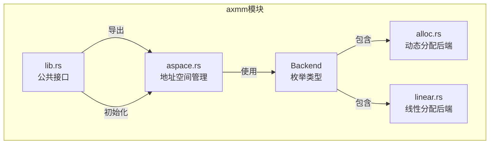
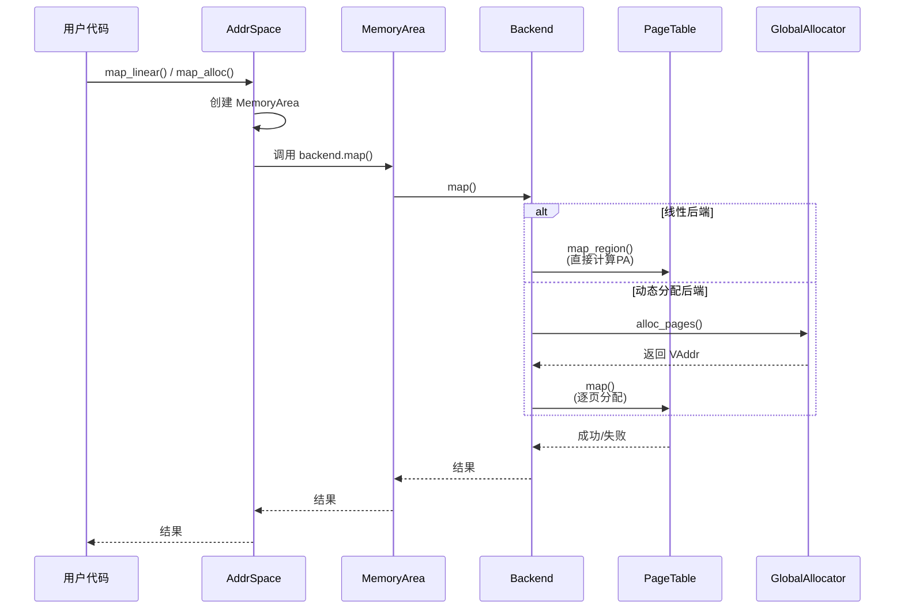
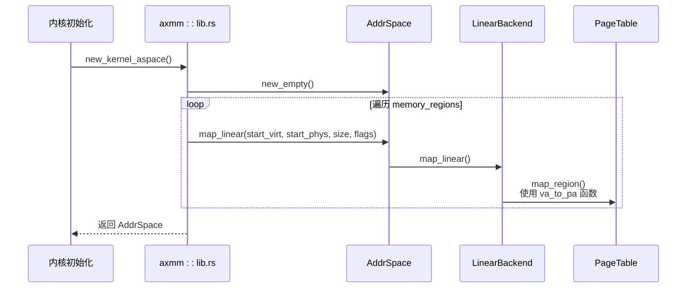

# 内存分配后端策略

<cite>
**本文档引用的文件**  
- [alloc.rs](file://modules/axmm/src/backend/alloc.rs)
- [linear.rs](file://modules/axmm/src/backend/linear.rs)
- [mod.rs](file://modules/axmm/src/backend/mod.rs)
- [lib.rs](file://modules/axconfig/src/lib.rs)
- [aspace.rs](file://modules/axmm/src/aspace.rs)
- [lib.rs](file://modules/axmm/src/lib.rs)
</cite>

## 目录
1. [引言](#引言)
2. [项目结构](#项目结构)
3. [核心组件](#核心组件)
4. [架构概述](#架构概述)
5. [详细组件分析](#详细组件分析)
6. [依赖分析](#依赖分析)
7. [性能考量](#性能考量)
8. [故障排除指南](#故障排除指南)
9. [结论](#结论)

## 引言
本文档全面介绍 ArceOS 操作系统中 `axmm` 模块支持的两种内存后端分配策略：基于伙伴系统的动态分配器与线性分配器。重点阐述 `alloc.rs` 中页帧分配器的设计原理，包括空闲链表管理、内存合并与分裂机制；对比 `linear.rs` 中线性分配器在启动阶段快速分配的优势及其不可回收的局限性。分析不同场景下的选择策略——例如大块连续内存申请优先使用线性分配，而运行时小对象分配则交由伙伴系统处理。结合 `axconfig` 配置项说明如何通过编译期 feature 开关切换后端实现，并提供性能基准测试建议以评估不同工作负载下的表现差异。

## 项目结构
`axmm` 模块位于 `/modules/axmm` 目录下，是 ArceOS 的虚拟内存管理核心模块。其主要功能是为内核和用户进程提供地址空间管理和物理内存映射服务。该模块通过 `backend` 子模块实现了两种不同的内存映射后端：`alloc`（基于全局分配器的动态分配）和 `linear`（线性映射）。这两种后端通过 `Backend` 枚举进行统一抽象，并在 `aspace.rs` 中被用于构建完整的地址空间。



**图示来源**
- [mod.rs](file://modules/axmm/src/backend/mod.rs#L0-L87)
- [aspace.rs](file://modules/axmm/src/aspace.rs#L0-L100)
- [lib.rs](file://modules/axmm/src/lib.rs#L0-L130)

**本节来源**
- [mod.rs](file://modules/axmm/src/backend/mod.rs#L0-L87)
- [aspace.rs](file://modules/axmm/src/aspace.rs#L0-L100)

## 核心组件
`axmm` 模块的核心在于其灵活的内存映射后端设计。`Backend` 枚举定义了 `Linear` 和 `Alloc` 两种模式，分别对应于线性映射和动态分配。`Linear` 后端适用于已知物理地址且需要高性能直接映射的场景，如内核初始化期间对设备内存或固件区域的映射。`Alloc` 后端则更为通用，它利用 `axalloc` 模块提供的全局分配器来按需分配物理页帧，支持延迟分配（lazy allocation），即在发生页面错误时才实际分配物理内存，从而提高内存利用率。

**本节来源**
- [mod.rs](file://modules/axmm/src/backend/mod.rs#L0-L87)
- [alloc.rs](file://modules/axmm/src/backend/alloc.rs#L0-L108)
- [linear.rs](file://modules/axmm/src/backend/linear.rs#L0-L46)

## 架构概述
`axmm` 模块的架构围绕 `AddrSpace`（地址空间）和 `Backend`（后端）两个核心概念展开。`AddrSpace` 负责管理一个独立的虚拟地址空间，内部维护着多个 `MemoryArea` 区域，每个区域都关联一个具体的 `Backend` 实例。当进行内存映射操作（如 `map_linear` 或 `map_alloc`）时，`AddrSpace` 会根据请求创建相应的 `MemoryArea` 并调用其后端的 `map` 方法。对于 `Linear` 后端，映射过程是直接的地址转换；而对于 `Alloc` 后端，则涉及从 `axalloc` 全局分配器获取物理页帧并建立页表条目。



**图示来源**
- [aspace.rs](file://modules/axmm/src/aspace.rs#L91-L119)
- [mod.rs](file://modules/axmm/src/backend/mod.rs#L0-L87)
- [alloc.rs](file://modules/axmm/src/backend/alloc.rs#L0-L108)
- [linear.rs](file://modules/axmm/src/backend/linear.rs#L0-L46)

## 详细组件分析

### 动态分配器 (alloc.rs) 分析
`alloc.rs` 实现了 `Backend::Alloc` 类型，它是一个基于伙伴系统或 TLSF 等算法的动态页帧分配器。其核心机制是通过 `global_allocator()` 从 `axalloc` 模块获取物理页帧。在 `map_alloc` 函数中，如果 `populate` 参数为 `true`，则会在映射时立即为整个区域分配所有物理页帧并清零；若为 `false`，则仅创建页表项而不分配物理内存，待访问时触发页面错误再通过 `handle_page_fault_alloc` 进行惰性分配。这种设计有效避免了内存浪费。空闲内存的管理由 `axalloc` 内部的 `BitmapPageAllocator` 或 `TlsfByteAllocator` 完成，它们负责跟踪已分配和空闲的内存块，并在 `dealloc_frame` 时将页帧归还给分配器，实现内存的回收与合并。

#### 动态分配器类图
```mermaid
classDiagram
class Backend {
<<enumeration>>
+Linear{pa_va_offset}
+Alloc{populate}
}
class AllocBackend {
+map_alloc()
+unmap_alloc()
+handle_page_fault_alloc()
-alloc_frame(zeroed)
-dealloc_frame(frame)
}
class GlobalAllocator {
+alloc_pages(num, align)
+dealloc_pages(pos, num)
+init(start, size)
}
class PageTable {
+map(vaddr, paddr, flags)
+unmap(vaddr)
+remap(vaddr, new_paddr, flags)
}
Backend <|-- AllocBackend : 实现
AllocBackend --> GlobalAllocator : 使用
AllocBackend --> PageTable : 使用
```

**图示来源**
- [alloc.rs](file://modules/axmm/src/backend/alloc.rs#L0-L108)
- [lib.rs](file://modules/axalloc/src/lib.rs#L0-L324)

**本节来源**
- [alloc.rs](file://modules/axmm/src/backend/alloc.rs#L0-L108)
- [lib.rs](file://modules/axalloc/src/lib.rs#L0-L324)

### 线性分配器 (linear.rs) 分析
`linear.rs` 实现了 `Backend::Linear` 类型，这是一种极其高效的静态映射策略。其核心思想是利用一个固定的偏移量 (`pa_va_offset`) 来实现虚拟地址 (VA) 和物理地址 (PA) 之间的直接转换，公式为 `PA = VA - pa_va_offset`。这种映射方式无需查询复杂的分配数据结构，也不涉及物理内存的分配与释放，因此速度极快。它通常在系统启动早期被大量使用，例如在 `new_kernel_aspace()` 函数中，遍历 `memory_regions()` 并为每一个已知的物理内存区域（如内核代码段、设备内存）创建线性映射。然而，其最大的局限性在于无法回收映射所“占用”的物理内存，因为这些内存并非真正由分配器分配，而是直接暴露的物理地址。

#### 线性分配器序列图


**图示来源**
- [linear.rs](file://modules/axmm/src/backend/linear.rs#L0-L46)
- [lib.rs](file://modules/axmm/src/lib.rs#L55-L90)
- [aspace.rs](file://modules/axmm/src/aspace.rs#L91-L119)

**本节来源**
- [linear.rs](file://modules/axmm/src/backend/linear.rs#L0-L46)
- [lib.rs](file://modules/axmm/src/lib.rs#L55-L90)

### 不同场景下的选择策略
选择合适的内存分配后端是优化系统性能的关键。一般遵循以下原则：
1.  **启动阶段与大块连续内存**：优先使用**线性分配器**。在系统引导时，许多关键区域（如内核镜像、设备MMIO区域）的物理地址是已知且固定的。使用线性映射可以实现最快速度的地址空间建立，且由于这些区域在整个系统生命周期内都不会被释放，其不可回收的缺点可以忽略。
2.  **运行时与小对象/可变大小内存**：必须使用**动态分配器**。对于进程堆内存、内核运行时数据结构等需要频繁分配和释放的场景，动态分配器提供的内存回收能力至关重要。其惰性分配特性也能显著提升内存使用效率，避免为未使用的虚拟内存预留物理页。

**本节来源**
- [lib.rs](file://modules/