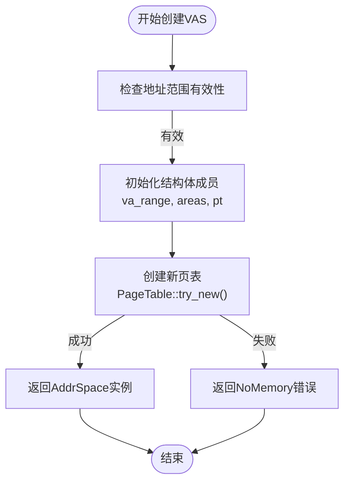
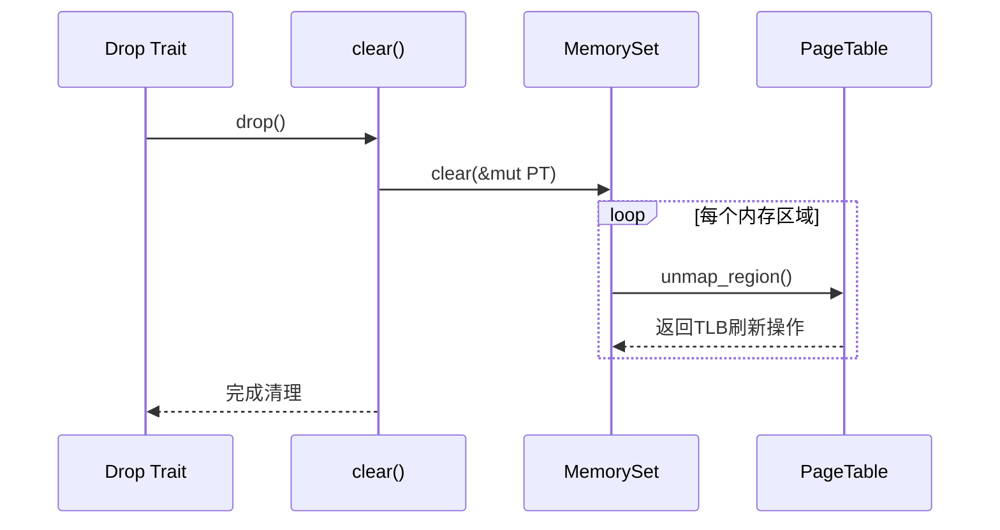
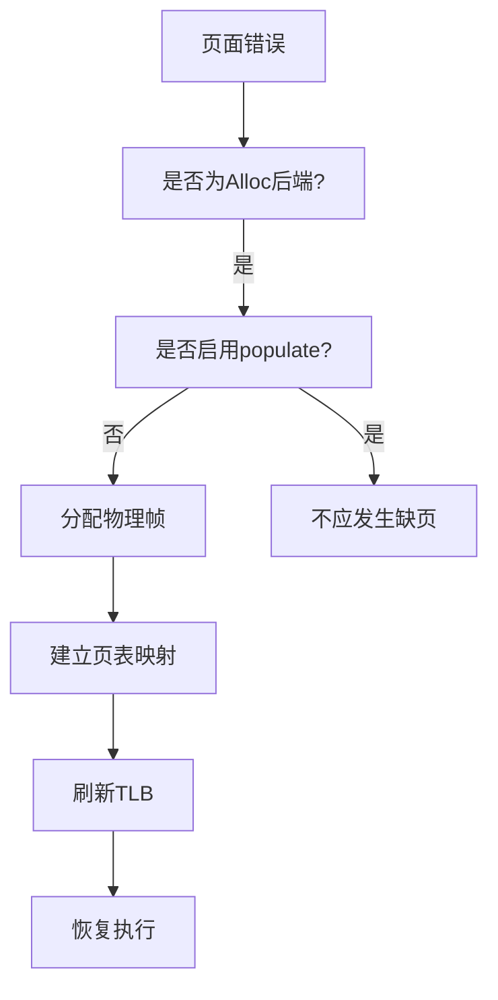
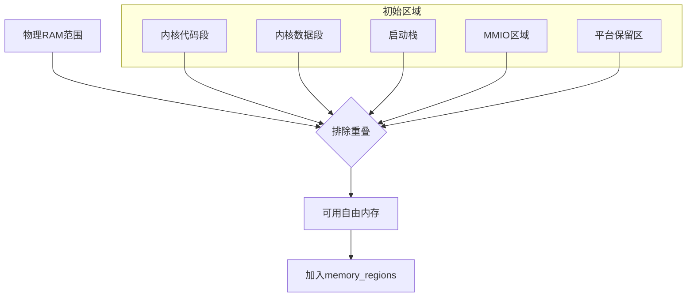

# 内存管理 (axmm)

<cite>
**本文档引用的文件**  
- [aspace.rs](file://modules/axmm/src/aspace.rs)
- [alloc.rs](file://modules/axmm/src/backend/alloc.rs)
- [linear.rs](file://modules/axmm/src/backend/linear.rs)
- [mod.rs](file://modules/axmm/src/backend/mod.rs)
- [lib.rs](file://modules/axmm/src/lib.rs)
- [mem.rs](file://modules/axhal/src/mem.rs)
- [paging.rs](file://modules/axhal/src/paging.rs)
</cite>

## 目录
1. [引言](#引言)
2. [虚拟地址空间(VAS)管理](#虚拟地址空间vas管理)
3. [页表项(PTE)操作接口](#页表项pte操作接口)
4. [内存映射类型支持](#内存映射类型支持)
5. [后端分配策略](#后端分配策略)
6. [物理内存初始化流程](#物理内存初始化流程)
7. [TLB刷新机制与跨核同步](#tlb刷新机制与跨核同步)
8. [内存泄漏排查方法](#内存泄漏排查方法)
9. [大页映射优化技巧](#大页映射优化技巧)
10. [总结](#总结)

## 引言

axmm模块是ArceOS操作系统中的核心内存管理组件，负责虚拟内存系统的构建与维护。该模块通过抽象化的地址空间（AddrSpace）设计，实现了对虚拟地址空间的统一管理，并支持多种内存映射模式和灵活的后端分配策略。本文档系统性地阐述axmm模块的虚拟内存管理系统架构，涵盖虚拟地址空间的创建与销毁、页表项操作、映射类型支持、分配器实现、物理内存初始化以及性能优化等关键方面。

## 虚拟地址空间(VAS)管理

### VAS创建流程

axmm模块通过`AddrSpace::new_empty()`函数创建新的虚拟地址空间，该过程包括：
1. 初始化虚拟地址范围（VirtAddrRange）
2. 创建空的内存区域集合（MemorySet）
3. 构建新的页表实例（PageTable）

内核地址空间在系统初始化时由`init_memory_management()`函数创建，其基址和大小由平台配置决定（`axconfig::plat::KERNEL_ASPACE_BASE` 和 `KERNEL_ASPACE_SIZE`）。用户进程的地址空间则通过`new_user_aspace()`函数创建，若非aarch64或loongarch64架构，则会从内核地址空间复制映射关系以共享内核视图。

**Diagram sources**
- [aspace.rs](file://modules/axmm/src/aspace.rs#L58-L72)
- [lib.rs](file://modules/axmm/src/lib.rs#L75-L90)

### VAS销毁流程

当`AddrSpace`实例被释放时，Rust的Drop trait自动调用`clear()`方法清理所有映射。此过程遍历所有内存区域并解除页表映射，同时释放关联的物理内存帧。

**Diagram sources**
- [aspace.rs](file://modules/axmm/src/aspace.rs#L312-L318)
- [backend/mod.rs](file://modules/axmm/src/backend/mod.rs#L55-L65)

**Section sources**
- [aspace.rs](file://modules/axmm/src/aspace.rs#L312-L318)

## 页表项(PTE)操作接口

### 映射操作

axmm提供两类主要映射接口：

- **线性映射**：`map_linear()` 将连续的物理地址直接映射到虚拟地址，适用于已知物理布局的场景。
- **动态分配映射**：`map_alloc()` 使用全局分配器按需分配物理页帧，支持延迟分配（lazy allocation）。

两种映射均要求地址和大小按4KB对齐，并通过`MappingFlags`指定访问权限。

### 解除映射操作

`unmap()`接口用于移除指定虚拟地址范围内的映射。对于分配式后端，该操作还会触发物理页帧的回收；而对于线性映射，则仅更新页表条目。

### 保护属性更新

`protect()`接口允许修改现有映射的访问权限（如只读→可写），底层调用页表的`protect_region()`实现，并确保TLB一致性。

**Section sources**
- [aspace.rs](file://modules/axmm/src/aspace.rs#L118-L248)

## 内存映射类型支持

axmm通过`MappingFlags`枚举支持多种内存属性组合：

| 映射类型 | 标志位 | 说明 |
|---------|-------|------|
| 只读映射 | READ | 允许读取，禁止写入和执行 |
| 可写映射 | READ \| WRITE | 支持读写访问 |
| 可执行映射 | READ \| EXECUTE | 支持代码执行 |
| 设备内存 | DEVICE \| READ \| WRITE | 非缓存设备I/O内存 |
| 非缓存内存 | UNCACHED \| READ \| WRITE | 禁用缓存的普通内存 |

这些标志由`reg_flag_to_map_flag()`函数从`MemRegionFlags`转换而来，确保物理内存区域属性正确传递至虚拟映射层。

**Section sources**
- [lib.rs](file://modules/axmm/src/lib.rs#L44-L63)
- [paging.rs](file://modules/axhal/src/paging.rs#L18-L20)

## 后端分配策略

### 基于伙伴系统的动态分配器

`Backend::Alloc`后端利用axalloc模块提供的伙伴系统进行物理页帧管理。其特点包括：

- 支持按需分配（populate=false）：首次访问触发病态缺页中断，延迟分配物理页
- 支持预分配（populate=true）：创建时即分配全部所需页帧
- 分配粒度为4KB标准页

**Diagram sources**
- [alloc.rs](file://modules/axmm/src/backend/alloc.rs#L85-L108)

### 线性分配器

`Backend::Linear`后端用于建立虚拟地址与物理地址之间的固定偏移映射，典型应用场景包括：

- 内核镜像映射
- MMIO设备寄存器映射
- 引导栈等静态区域映射

此类映射不涉及运行时分配，因此不会触发页面错误。

**Section sources**
- [backend/mod.rs](file://modules/axmm/src/backend/mod.rs#L15-L45)
- [linear.rs](file://modules/axmm/src/backend/linear.rs#L10-L46)

## 物理内存初始化流程

### axhal物理内存探测

axhal模块通过`init()`函数完成物理内存区域的初始化，主要步骤如下：

1. 注册内核镜像各段（.text, .rodata, .data, .bss）为保留区域
2. 添加启动栈（boot stack）为保留内存
3. 注册MMIO和平台保留内存区域
4. 计算可用RAM：从物理RAM范围中减去所有保留区域
5. 构建最终的物理内存区域列表

**Diagram sources**
- [mem.rs](file://modules/axhal/src/mem.rs#L45-L120)

### 内存区域初始化

在`new_kernel_aspace()`中，系统遍历`memory_regions()`获取的所有物理区域，并调用`map_linear()`建立线性映射。每个区域的访问权限由`reg_flag_to_map_flag()`函数转换得到。

**Section sources**
- [mem.rs](file://modules/axhal/src/mem.rs#L25-L126)
- [lib.rs](file://modules/axmm/src/lib.rs#L75-L90)

## TLB刷新机制与跨核同步

### TLB刷新策略

axmm在关键操作中采用精细化的TLB刷新策略：

- **映射建立时**：使用`tlb.ignore()`避免不必要的刷新，因为新映射不会与旧条目冲突
- **映射删除时**：逐页调用`tlb.flush()`刷新特定条目，而非全局刷新
- **保护属性变更时**：强制刷新相关TLB条目以保证权限一致性

### 跨核同步作用

在多核环境下，TLB刷新通过硬件机制（如x86的INVLPG指令或ARM的TLBI指令）确保所有CPU核心的页表缓存同步。这防止了因缓存不一致导致的安全漏洞或数据损坏。

**Section sources**
- [linear.rs](file://modules/axmm/src/backend/linear.rs#L29-L42)
- [lib.rs](file://modules/axmm/src/lib.rs#L126)

## 内存泄漏排查方法

### 资源跟踪建议

虽然axmm本身基于RAII原则自动管理资源，但在复杂场景下仍需注意：

1. 确保`AddrSpace`实例生命周期正确管理
2. 监控`global_allocator`的分配/释放平衡
3. 利用调试日志观察`map_alloc`和`unmap_alloc`的调用匹配情况

### 调试工具使用

启用`debug!`日志可追踪关键操作：
- 映射创建：显示虚拟/物理地址范围及标志
- 映射删除：记录解除映射的地址区间
- 页面错误处理：标识缺页地址及处理结果

**Section sources**
- [alloc.rs](file://modules/axmm/src/backend/alloc.rs#L23-L25)
- [linear.rs](file://modules/axmm/src/backend/linear.rs#L20-L21)

## 大页映射优化技巧

尽管当前代码主要展示4KB页操作，但可通过以下方式实现大页优化：

1. **启用巨页支持**：在`PageSize`枚举中添加`Size2M`或`Size1G`选项
2. **对齐检查增强**：确保映射请求符合大页对齐要求
3. **批量映射优化**：连续多个4KB页映射可合并为单个大页条目
4. **减少TLB压力**：大页显著降低TLB未命中率，提升性能

未来扩展可在`map_region()`调用中增加大页提示参数，由页表实现自动选择最优页大小。

## 总结

axmm模块构建了一个高效且灵活的虚拟内存管理系统，其核心优势在于：
- 清晰分离地址空间管理与后端分配策略
- 支持多种内存属性和映射模式
- 与ax