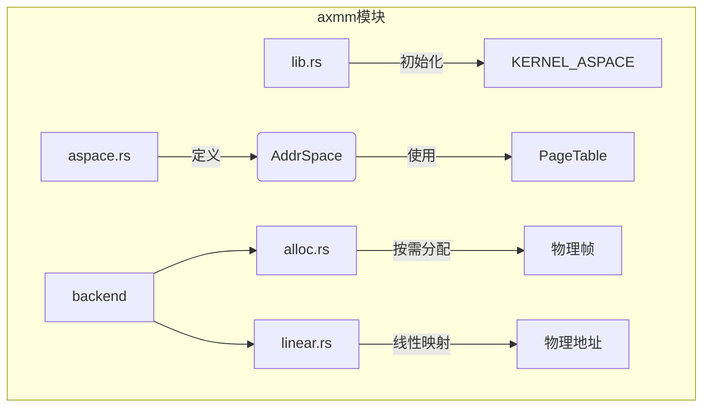
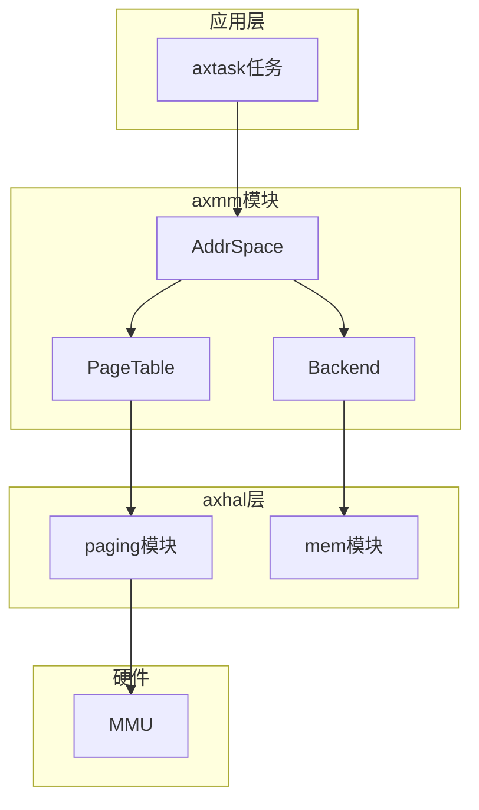
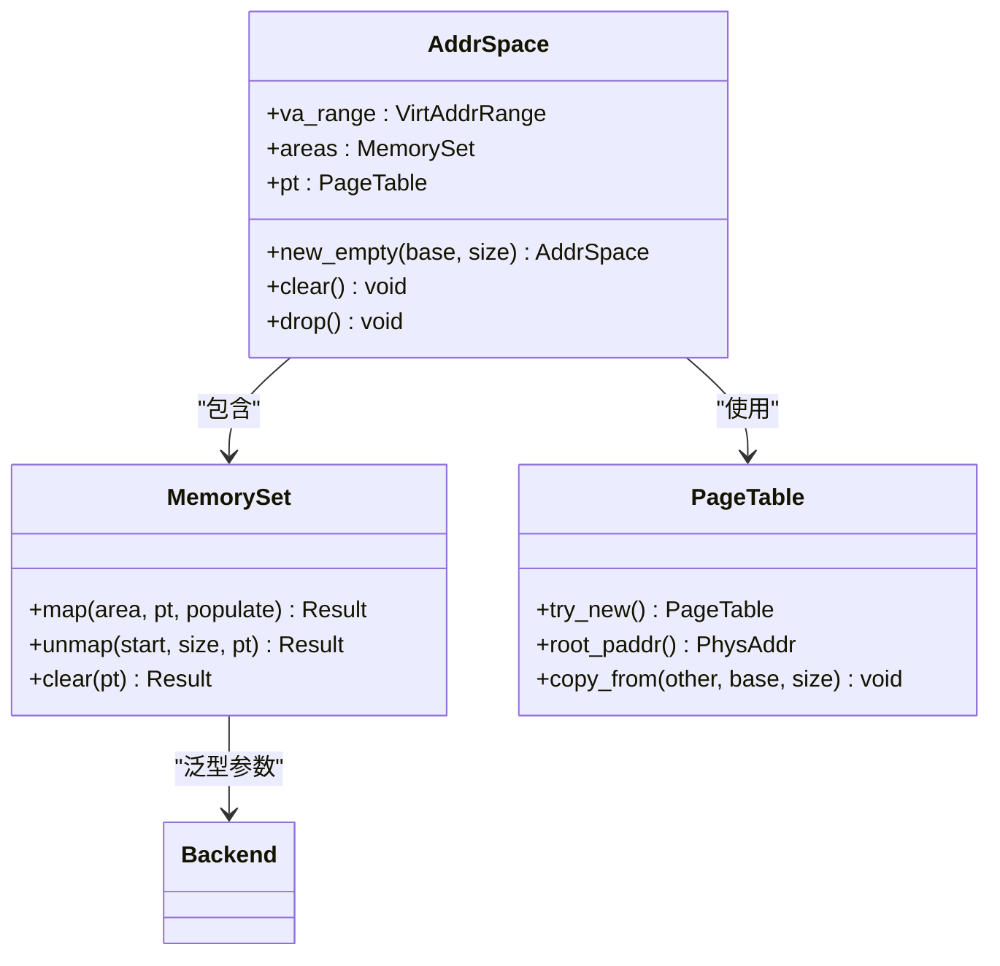
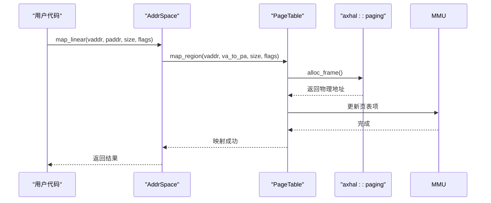
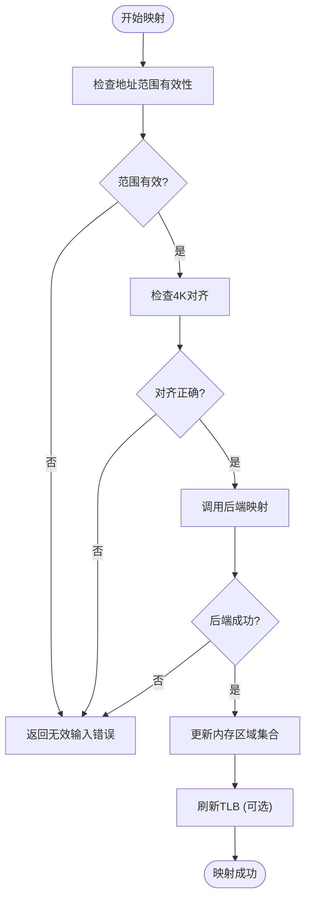
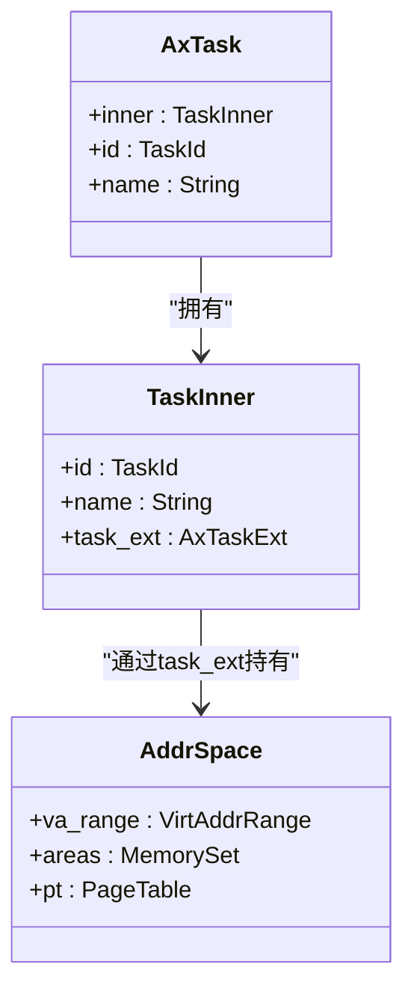
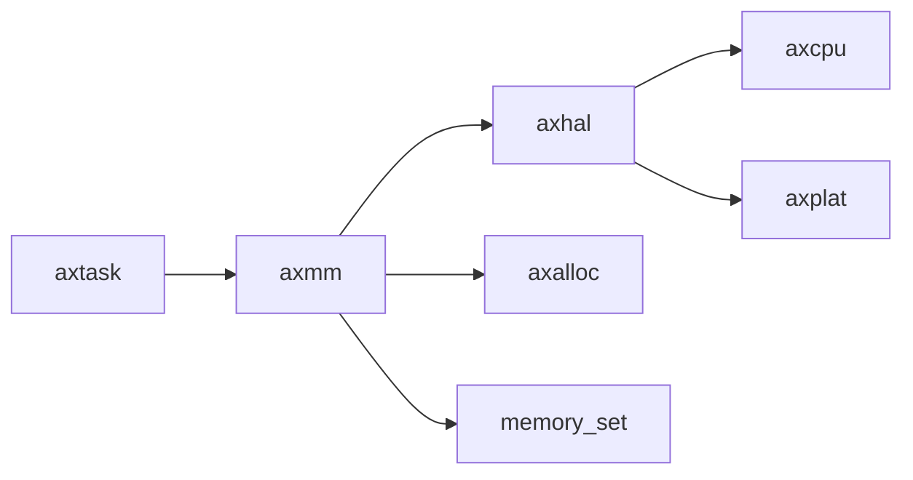

# 虚拟地址空间管理

<cite>
**本文档中引用的文件**  
- [aspace.rs](file://modules/axmm/src/aspace.rs)
- [alloc.rs](file://modules/axmm/src/backend/alloc.rs)
- [linear.rs](file://modules/axmm/src/backend/linear.rs)
- [lib.rs](file://modules/axmm/src/lib.rs)
- [task.rs](file://modules/axtask/src/task.rs)
- [paging.rs](file://modules/axhal/src/paging.rs)
- [mem.rs](file://modules/axhal/src/mem.rs)
- [defconfig.toml](file://configs/defconfig.toml)
</cite>

## 目录
1. [简介](#简介)
2. [项目结构](#项目结构)
3. [核心组件](#核心组件)
4. [架构概述](#架构概述)
5. [详细组件分析](#详细组件分析)
6. [依赖分析](#依赖分析)
7. [性能考虑](#性能考虑)
8. [故障排除指南](#故障排除指南)
9. [结论](#结论)

## 简介
本文档深入解析ArceOS操作系统中`axmm`模块的虚拟地址空间（VAS）架构设计与实现机制。重点阐述VAS的创建与销毁流程、页表根节点初始化过程以及多级页表遍历算法。文档详细说明内存映射接口`map_range`和`unmap_range`的调用逻辑，涵盖读/写/执行权限位、缓存属性及设备内存映射的配置方式。结合`axtask`任务模型，解释每个任务如何持有独立的VAS实例，并分析跨任务内存共享的安全边界控制。此外，提供实际代码示例展示在内核中动态映射DMA缓冲区的方法，并讨论TLB一致性维护策略在上下文切换中的作用。

## 项目结构
`axmm`模块是ArceOS操作系统的核心内存管理单元，位于`modules/axmm`目录下。该模块主要负责虚拟内存地址空间的管理，包括地址空间的创建、映射、保护和销毁等操作。其源码结构清晰，包含`aspace.rs`用于定义地址空间结构，`backend`子模块处理不同类型的内存映射后端，以及`lib.rs`作为模块入口点。

**Diagram sources**
- [aspace.rs](file://modules/axmm/src/aspace.rs#L0-L51)
- [alloc.rs](file://modules/axmm/src/backend/alloc.rs#L0-L108)
- [linear.rs](file://modules/axmm/src/backend/linear.rs#L0-L46)

**Section sources**
- [aspace.rs](file://modules/axmm/src/aspace.rs#L0-L51)
- [lib.rs](file://modules/axmm/src/lib.rs#L0-L130)

## 核心组件
`axmm`模块的核心是`AddrSpace`结构体，它代表一个完整的虚拟地址空间。该结构体封装了虚拟地址范围`va_range`、内存区域集合`areas`和页表`pt`。通过`new_empty`方法可以创建一个新的空地址空间，而`copy_mappings_from`方法则允许从另一个地址空间复制页表条目，通常用于将内核空间映射复制到用户空间。`find_free_area`方法用于在指定范围内查找可用的虚拟地址区域。

**Section sources**
- [aspace.rs](file://modules/axmm/src/aspace.rs#L53-L89)

## 架构概述
`axmm`模块的架构围绕`AddrSpace`对象构建，它通过`PageTable`与底层硬件抽象层（HAL）交互来管理多级页表。地址空间支持两种主要的映射后端：`alloc`用于按需分配物理内存，`linear`用于建立虚拟地址与物理地址之间的线性映射。整个系统由`kernel_aspace()`全局单例管理内核地址空间，并通过`init_memory_management()`函数进行初始化。

**Diagram sources**
- [aspace.rs](file://modules/axmm/src/aspace.rs#L0-L51)
- [paging.rs](file://modules/axhal/src/paging.rs#L0-L48)

## 详细组件分析

### 地址空间创建与销毁分析
`AddrSpace`的创建通过`new_empty`方法完成，该方法接受基地址和大小作为参数，初始化一个空的虚拟地址范围，并创建一个新的页表实例。销毁过程由`Drop` trait自动触发，调用`clear()`方法移除所有映射并释放资源。`clear()`方法会遍历所有内存区域并解除映射，确保内存被正确回收。

#### 对于对象导向组件：

**Diagram sources**
- [aspace.rs](file://modules/axmm/src/aspace.rs#L0-L51)
- [aspace.rs](file://modules/axmm/src/aspace.rs#L53-L89)

**Section sources**
- [aspace.rs](file://modules/axmm/src/aspace.rs#L0-L321)

### 页表与映射机制分析
页表的初始化由`PageTable::try_new()`完成，它依赖于`axhal::paging`模块提供的架构特定实现。多级页表的遍历由`query`和`map`等方法实现。`map_linear`方法建立线性映射，计算虚拟地址与物理地址之间的偏移量；`map_alloc`方法则用于分配式映射，支持立即填充或按需分配。

#### 对于API/服务组件：

**Diagram sources**
- [linear.rs](file://modules/axmm/src/backend/linear.rs#L0-L46)
- [alloc.rs](file://modules/axmm/src/backend/alloc.rs#L0-L108)

**Section sources**
- [linear.rs](file://modules/axmm/src/backend/linear.rs#L0-L46)
- [alloc.rs](file://modules/axmm/src/backend/alloc.rs#L0-L108)

### 内存映射接口分析
`map_range`和`unmap_range`的功能由`map_linear`、`map_alloc`和`unmap`等方法实现。这些方法首先检查虚拟地址范围是否在地址空间内且对齐，然后调用后端进行具体映射操作。权限位通过`MappingFlags`枚举控制，支持读、写、执行、设备和非缓存等属性。设备内存映射通过设置`DEVICE`和`UNCACHED`标志来配置。

#### 对于复杂逻辑组件：

**Diagram sources**
- [aspace.rs](file://modules/axmm/src/aspace.rs#L100-L150)
- [lib.rs](file://modules/axmm/src/lib.rs#L0-L130)

**Section sources**
- [aspace.rs](file://modules/axmm/src/aspace.rs#L100-L200)

### 任务模型与地址空间分析
每个`axtask`任务通过其扩展数据持有独立的`AddrSpace`实例。`new_user_aspace`函数为新用户任务创建地址空间，可以选择性地复制内核空间映射。安全边界通过地址空间隔离实现，不同任务的VAS完全独立，无法直接访问彼此的内存，从而保证了内存安全。

**Diagram sources**
- [task.rs](file://modules/axtask/src/task.rs#L0-L555)
- [aspace.rs](file://modules/axmm/src/aspace.rs#L0-L51)

**Section sources**
- [task.rs](file://modules/axtask/src/task.rs#L0-L555)
- [lib.rs](file://modules/axmm/src/lib.rs#L0-L130)

## 依赖分析
`axmm`模块依赖多个其他模块以实现其功能。它直接依赖`axhal`模块获取分页和内存操作，依赖`axalloc`进行物理内存分配，依赖`memory_set`管理内存区域集合。`axtask`模块依赖`axmm`来为每个任务提供独立的地址空间。这种依赖关系形成了一个清晰的层次结构，其中低层模块提供基础服务，高层模块构建更复杂的抽象。

**Diagram sources**
- [Cargo.toml](file://modules/axmm/Cargo.toml#