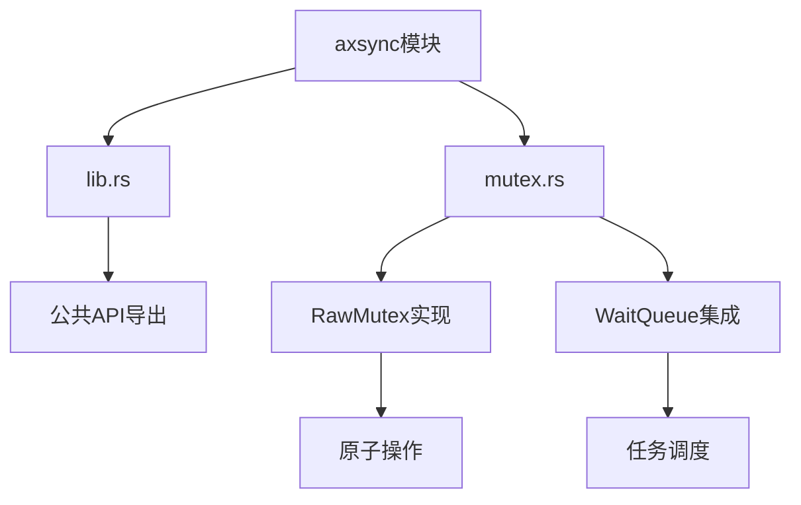
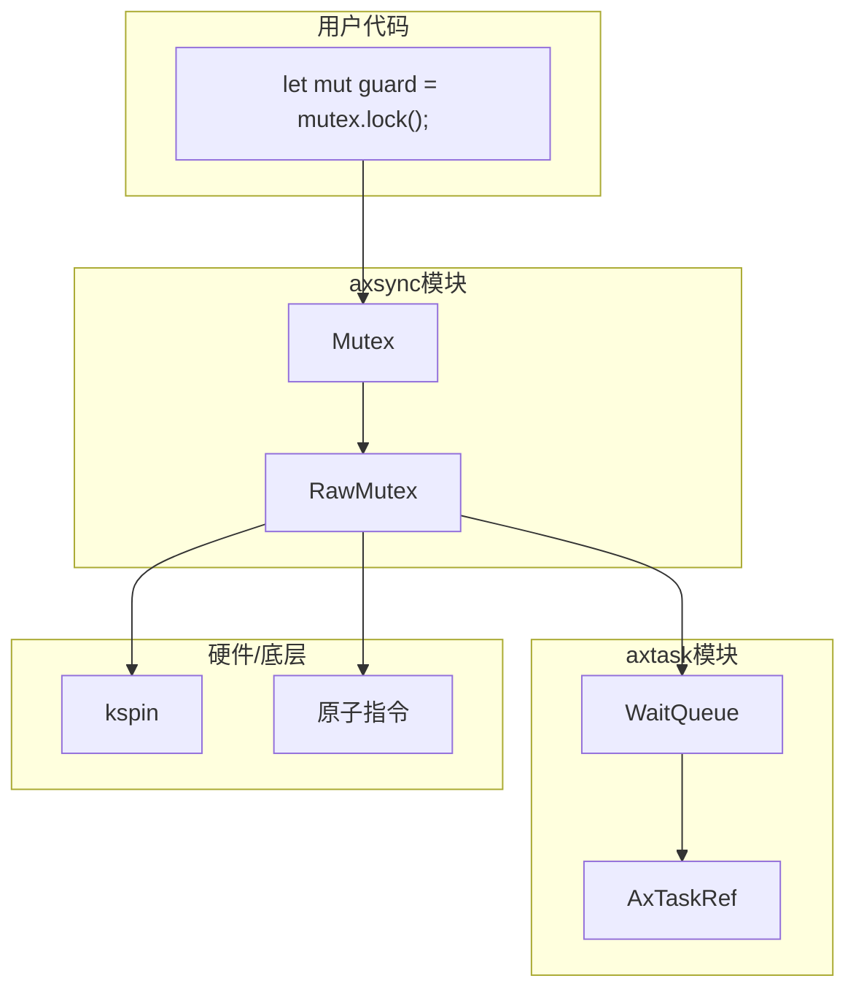
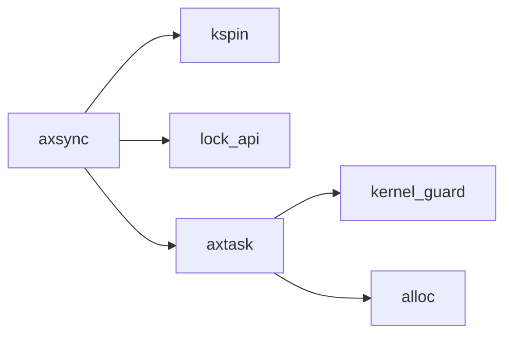

# 同步原语 (axsync)

<cite>
**本文档引用的文件**
- [lib.rs](file://modules/axsync/src/lib.rs)
- [mutex.rs](file://modules/axsync/src/mutex.rs)
- [wait_queue.rs](file://modules/axtask/src/wait_queue.rs)
- [task.rs](file://modules/axtask/src/task.rs)
</cite>

## 目录
1. [简介](#简介)
2. [项目结构](#项目结构)
3. [核心组件](#核心组件)
4. [架构概述](#架构概述)
5. [详细组件分析](#详细组件分析)
6. [依赖分析](#依赖分析)
7. [性能考量](#性能考量)
8. [故障排除指南](#故障排除指南)
9. [结论](#结论)

## 简介
axsync模块为ArceOS操作系统提供了一套同步原语，用于在多任务环境中安全地管理共享资源。该模块主要实现了互斥锁（Mutex）、自旋锁（SpinLock）和条件变量（Condvar）等基本同步机制。通过利用kspin等底层原语，axsync确保了无饥饿保障和中断安全性，使其适用于实时性要求高的场景。本文档将深入分析这些同步工具的Rust实现，并探讨如何在实际应用中正确使用它们来保护文件描述符表、网络连接池等共享资源。

## 项目结构
axsync模块位于ArceOS项目的`modules/axsync`目录下，其结构相对简洁明了。该模块主要包含两个源文件：`lib.rs`作为模块的入口点，定义了公共API；`mutex.rs`则具体实现了互斥锁的核心逻辑。axsync依赖于外部crates如`kspin`和`lock_api`，并通过Cargo特性（feature）机制灵活地支持单线程和多线程环境。当启用`multitask`特性时，模块提供功能完整的睡眠互斥锁；否则，它退化为一个简单的自旋锁别名，以适应更基础的运行环境。



**Diagram sources**
- [lib.rs](file://modules/axsync/src/lib.rs#L0-L27)
- [mutex.rs](file://modules/axsync/src/mutex.rs#L0-L150)

**Section sources**
- [lib.rs](file://modules/axsync/src/lib.rs#L0-L27)
- [mutex.rs](file://modules/axsync/src/mutex.rs#L0-L150)

## 核心组件
axsync模块的核心在于其实现的`RawMutex`结构体，这是一个符合`lock_api::RawMutex` trait的原始互斥锁。`RawMutex`的设计巧妙地结合了原子操作和等待队列（WaitQueue），实现了高效的睡眠锁机制。每个`RawMutex`实例都持有一个`WaitQueue`和一个`AtomicU64`类型的`owner_id`，前者用于管理等待获取锁的任务，后者则记录当前持有锁的任务ID，从而实现了所有权跟踪和死锁检测。

**Section sources**
- [mutex.rs](file://modules/axsync/src/mutex.rs#L7-L150)

## 架构概述
axsync模块的架构建立在ArceOS内核的任务管理和底层同步原语之上。其设计遵循分层原则，上层提供易于使用的`Mutex<T>`类型，底层则是与任务调度器紧密集成的`RawMutex`。当一个任务尝试获取已被占用的锁时，它不会忙等消耗CPU，而是被优雅地放入由`axtask::WaitQueue`管理的等待队列中并进入阻塞状态。一旦锁被释放，等待队列中的一个或多个任务会被唤醒，重新参与调度。这种设计显著提高了系统在高竞争场景下的能效比。



**Diagram sources**
- [lib.rs](file://modules/axsync/src/lib.rs#L0-L27)
- [mutex.rs](file://modules/axsync/src/mutex.rs#L0-L150)
- [wait_queue.rs](file://modules/axtask/src/wait_queue.rs#L0-L247)

## 详细组件分析

### RawMutex 实现分析
`RawMutex`是axsync模块的心脏，其行为完全由`lock_api::RawMutex` trait定义。它的`lock()`方法采用了一个循环加`compare_exchange_weak`的模式来尝试获取锁。如果失败，它会断言当前任务不是锁的所有者（防止递归死锁），然后调用`wait_until(|| !self.is_locked())`将当前任务挂起，直到锁看起来处于未锁定状态才重试。这种方法避免了不必要的忙等，实现了“无饥饿”特性。

#### 锁定与解锁流程
```mermaid
sequenceDiagram
participant Task as 任务
participant Mutex as RawMutex
participant WaitQueue as WaitQueue
participant Scheduler as 调度器
Task->>Mutex : lock()
alt 锁空闲
Mutex-->>Task : 成功获取
else 锁被占用
Mutex->>Mutex : compare_exchange_weak 失败
Mutex->>Mutex : 断言非自身持有
Mutex->>WaitQueue : wait_until(条件)
WaitQueue->>Scheduler : 阻塞当前任务
Scheduler->>Task : 切换上下文
... 时间流逝 ...
Mutex->>WaitQueue : notify_one(true)
WaitQueue->>Scheduler : 唤醒一个任务
Scheduler->>Task : 重新调度
Task->>Mutex : 继续执行lock()循环
end
Mutex-->>Task : 最终获取锁
```

**Diagram sources**
- [mutex.rs](file://modules/axsync/src/mutex.rs#L35-L72)
- [wait_queue.rs](file://modules/axtask/src/wait_queue.rs#L100-L120)

#### 递归锁与死锁检测
虽然axsync的`RawMutex`本身不直接支持递归锁，但它内置了强大的死锁检测机制。在`lock()`方法中，当`compare_exchange_weak`失败后，代码会检查错误返回的`owner_id`是否等于当前任务的ID。如果是，则触发一个`assert_ne!`断言，明确指出“某个任务试图获取它已经拥有的互斥锁”。这是一种简单而有效的预防措施，强制开发者避免编写可能导致死锁的递归锁定代码。

**Section sources**
- [mutex.rs](file://modules/axsync/src/mutex.rs#L45-L55)

### 条件变量与自旋锁
尽管文档的主要焦点是互斥锁，但axsync模块也通过`pub use kspin as spin;`公开了来自`kspin` crate的自旋锁。`kspin`提供了多种变体，如`SpinNoIrq`，这些锁在禁用中断的上下文中使用，保证了极高的响应速度，适用于对延迟极其敏感的实时场景。然而，关于条件变量（Condvar）的具体实现并未在提供的代码片段中出现，可能存在于其他未列出的文件中，或者其功能由`WaitQueue`和`Mutex`组合实现。

## 依赖分析
axsync模块的依赖关系清晰且精简。它直接依赖于`kspin` crate来获得底层的原子自旋锁原语，这为其实现提供了中断安全的基础。同时，它重度依赖`axtask`模块的`WaitQueue`和`current()`函数，这是实现睡眠锁而非忙等锁的关键。`WaitQueue`允许任务在等待时被阻塞，从而释放CPU资源给其他任务。此外，`lock_api` crate提供了一个标准化的接口，使得axsync的`Mutex`可以无缝集成到更广泛的Rust生态系统中。



**Diagram sources**
- [lib.rs](file://modules/axsync/src/lib.rs#L10-L11)
- [Cargo.toml](file://modules/axsync/Cargo.toml#L15-L18)

**Section sources**
- [lib.rs](file://modules/axsync/src/lib.rs#L0-L27)
- [Cargo.toml](file://modules/axsync/Cargo.toml#L15-L18)

## 性能考量
选择合适的同步原语对系统性能至关重要。axsync的`Mutex`是一种“睡眠锁”，在锁竞争激烈时表现优异，因为它不会浪费CPU周期进行忙等。然而，在锁持有时间极短且竞争不激烈的场景下，其上下文切换的开销可能大于简单的自旋锁。此时，来自`kspin`的`SpinNoIrq`可能是更好的选择，因为它避免了任务调度的开销，但代价是在等待期间持续占用CPU。因此，在实时性要求高的场景中，应根据具体的临界区长度和预期的竞争程度来权衡选择。对于超短临界区，自旋锁更优；对于较长或不可预测的临界区，睡眠互斥锁是更安全、更高效的选择。

## 故障排除指南
在使用axsync同步原语时，最常见的问题是死锁和误用。死锁通常源于不正确的锁获取顺序或意外的递归锁定。得益于内置的断言，axsync能有效捕获后者。对于前者，最佳实践是始终按照固定的全局顺序获取多个锁。另一个