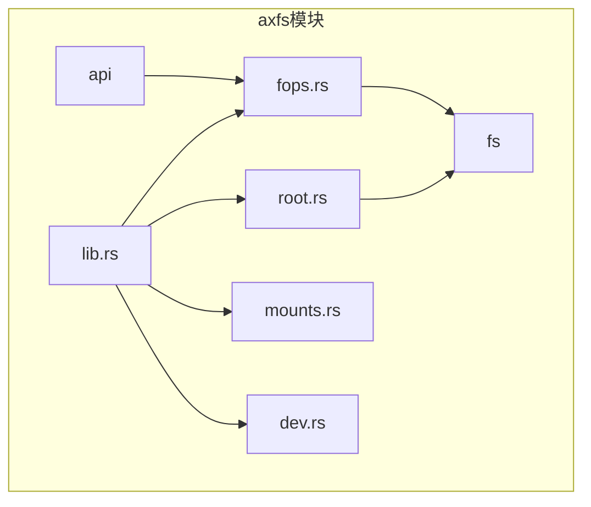
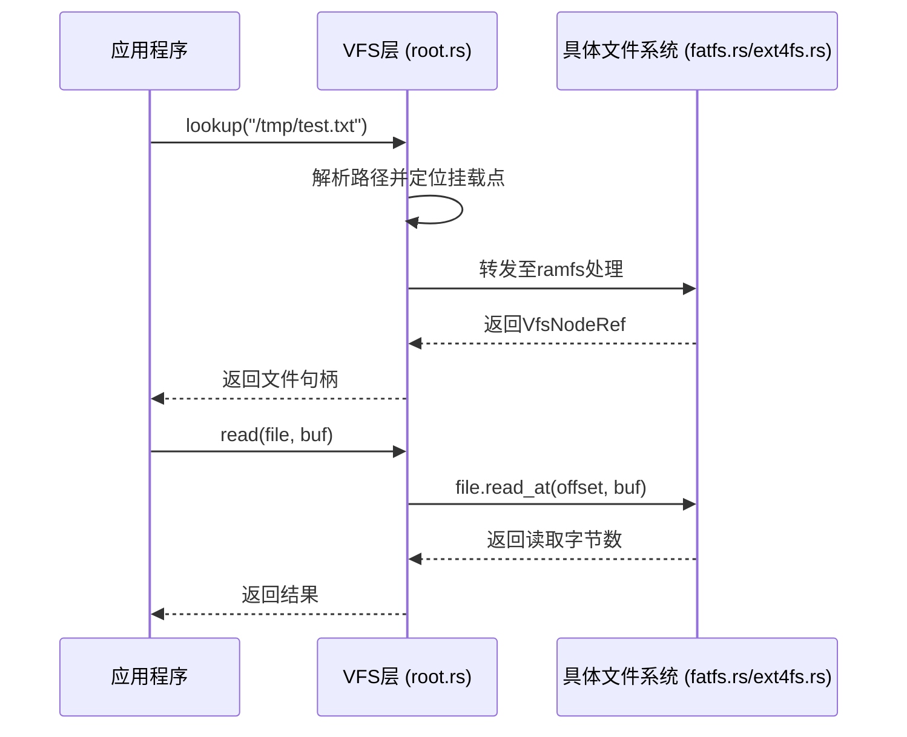
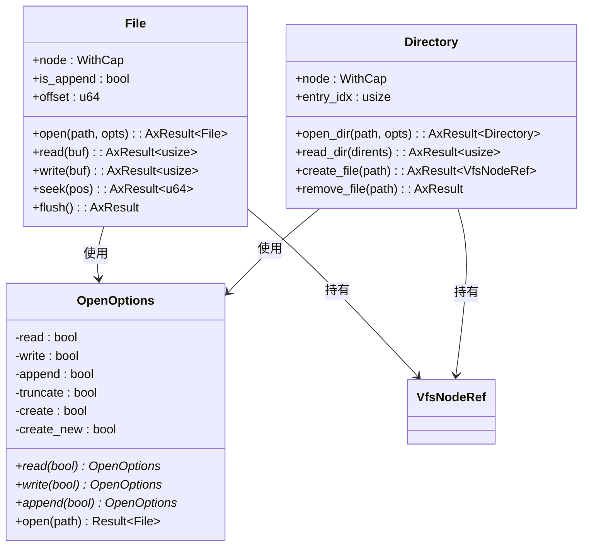
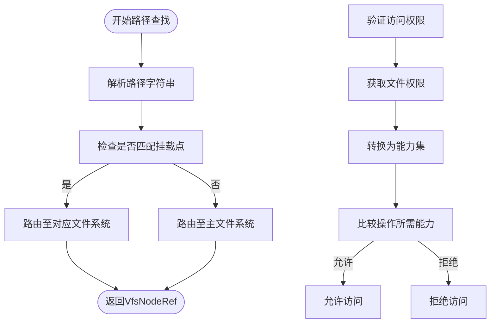
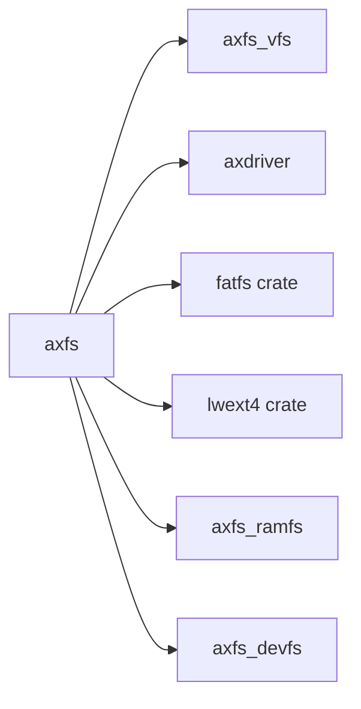

# VFS抽象层架构

<cite>
**本文档中引用的文件**  
- [lib.rs](file://modules/axfs/src/lib.rs)
- [fops.rs](file://modules/axfs/src/fops.rs)
- [root.rs](file://modules/axfs/src/root.rs)
- [fatfs.rs](file://modules/axfs/src/fs/fatfs.rs)
- [ext4fs.rs](file://modules/axfs/src/fs/ext4fs.rs)
- [dir.rs](file://modules/axfs/src/api/dir.rs)
- [file.rs](file://modules/axfs/src/api/file.rs)
- [mod.rs](file://modules/axfs/src/api/mod.rs)
</cite>

## 目录
1. [简介](#简介)
2. [项目结构](#项目结构)
3. [核心组件](#核心组件)
4. [架构概述](#架构概述)
5. [详细组件分析](#详细组件分析)
6. [依赖分析](#依赖分析)
7. [性能考虑](#性能考虑)
8. [故障排除指南](#故障排除指南)
9. [结论](#结论)

## 简介
`axfs`模块是ArceOS操作系统中的虚拟文件系统（VFS）实现，旨在为多种具体文件系统提供统一的接口层。该模块通过抽象inode、dentry和superblock等核心数据结构，实现了对FAT、EXT4、RAMFS等多种文件系统的集成与管理。其设计支持动态挂载机制，并通过`file_operations`函数表分发open、read、write等系统调用，确保上层POSIX API语义的一致性。此外，路径查找、权限验证及扩展新文件系统的能力均在该抽象层中得到充分支持。

## 项目结构
`axfs`模块位于`modules/axfs`目录下，主要包含以下子模块：
- `api/`：提供高层文件与目录操作接口。
- `fs/`：实现具体的文件系统，如FAT、EXT4和自定义文件系统。
- `dev.rs`：块设备访问封装。
- `fops.rs`：低级文件操作抽象。
- `mounts.rs`：挂载点管理。
- `root.rs`：根目录与全局路径解析逻辑。
- `lib.rs`：模块初始化入口。

**Diagram sources**
- [lib.rs](file://modules/axfs/src/lib.rs#L1-L47)
- [root.rs](file://modules/axfs/src/root.rs#L1-L318)

**Section sources**
- [lib.rs](file://modules/axfs/src/lib.rs#L1-L47)
- [root.rs](file://modules/axfs/src/root.rs#L1-L318)

## 核心组件
`axfs`的核心在于其VFS抽象层，它将不同文件系统的差异屏蔽，向上提供一致的文件操作接口。关键组件包括：
- **File** 和 **Directory** 结构体：分别代表打开的文件和目录对象，封装了节点引用、访问权限和读写偏移。
- **OpenOptions**：配置文件打开行为的选项集合。
- **RootDirectory**：管理根目录及其挂载点，负责跨文件系统路径解析。
- **FatFileSystem / Ext4FileSystem**：具体文件系统的实现，遵循VFS操作规范。

这些组件共同构成了一个可扩展、类型安全且高效运行的文件系统框架。

**Section sources**
- [fops.rs](file://modules/axfs/src/fops.rs#L1-L419)
- [root.rs](file://modules/axfs/src/root.rs#L1-L318)
- [fatfs.rs](file://modules/axfs/src/fs/fatfs.rs#L1-L302)

## 架构概述
`axfs`采用典型的VFS分层架构，以`RootDirectory`作为全局入口点，协调多个具体文件系统的挂载与访问。当用户发起文件操作时，请求首先经过VFS层进行路径解析和权限检查，随后根据挂载信息路由至对应的具体文件系统处理。

**Diagram sources**
- [root.rs](file://modules/axfs/src/root.rs#L1-L318)
- [fatfs.rs](file://modules/axfs/src/fs/fatfs.rs#L1-L302)
- [ext4fs.rs](file://modules/axfs/src/fs/ext4fs.rs#L1-L252)

## 详细组件分析

### 文件与目录操作分析
`axfs`通过`File`和`Directory`结构体暴露统一的操作接口。所有操作最终都映射到`VfsNodeOps` trait的实现上，由底层具体文件系统完成实际工作。

#### 对象导向组件

**Diagram sources**
- [fops.rs](file://modules/axfs/src/fops.rs#L1-L419)
- [file.rs](file://modules/axfs/src/api/file.rs#L1-L194)
- [dir.rs](file://modules/axfs/src/api/dir.rs#L1-L100)

**Section sources**
- [fops.rs](file://modules/axfs/src/fops.rs#L1-L419)
- [file.rs](file://modules/axfs/src/api/file.rs#L1-L194)

### 路径查找与权限验证
路径查找由`RootDirectory::lookup_mounted_fs`完成，采用最长前缀匹配策略确定目标文件系统。权限验证则通过`perm_to_cap`函数将文件权限转换为能力集，并与操作所需权限进行比对。

**Diagram sources**
- [root.rs](file://modules/axfs/src/root.rs#L85-L125)
- [fops.rs](file://modules/axfs/src/fops.rs#L390-L418)

**Section sources**
- [root.rs](file://modules/axfs/src/root.rs#L85-L125)
- [fops.rs](file://modules/axfs/src/fops.rs#L390-L418)

## 依赖分析
`axfs`模块依赖于`axfs_vfs`库提供的VFS基础接口（如`VfsNodeOps`、`VfsOps`），并与`axdriver`模块交互以访问底层块设备。同时，通过条件编译特性（如`fatfs`、`ext4fs`）引入具体文件系统实现。

**Diagram sources**
- [lib.rs](file://modules/axfs/src/lib.rs#L1-L47)
- [Cargo.toml](file://modules/axfs/Cargo.toml#L1-L20)

**Section sources**
- [lib.rs](file://modules/axfs/src/lib.rs#L1-L47)

## 性能考虑
- **路径查找效率**：当前使用线性扫描寻找最长匹配挂载点，未来可优化为Trie树结构提升性能。
- **I/O缓冲**：未显式实现缓冲机制，依赖具体文件系统自身优化。
- **