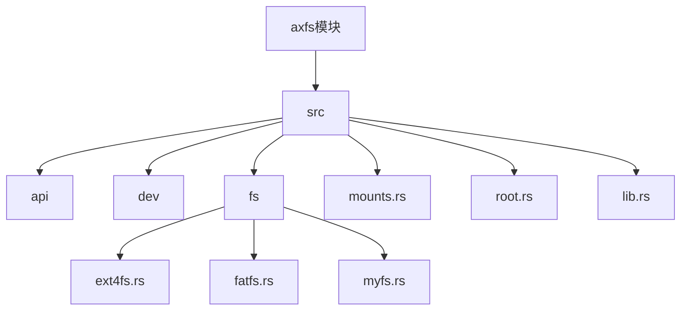
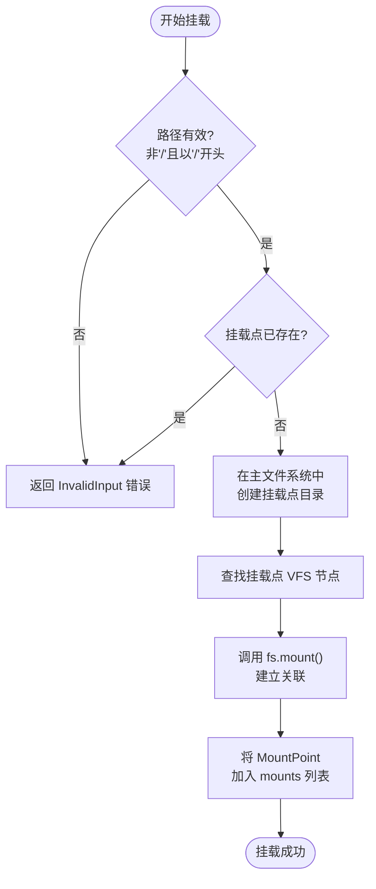
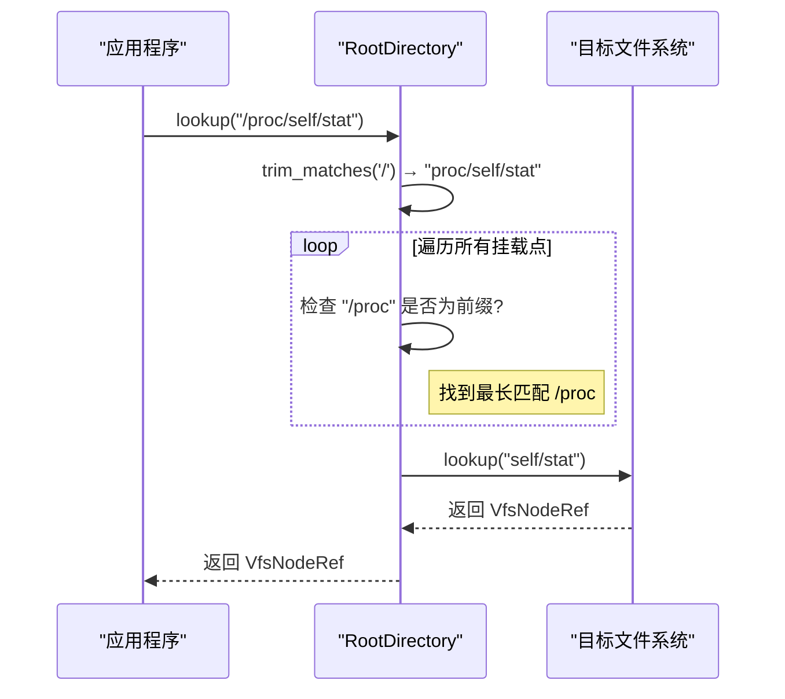

# 挂载机制与多文件系统集成

<cite>
**本文档引用的文件**
- [mounts.rs](file://modules/axfs/src/mounts.rs)
- [root.rs](file://modules/axfs/src/root.rs)
- [lib.rs](file://modules/axfs/src/lib.rs)
- [ext4fs.rs](file://modules/axfs/src/fs/ext4fs.rs)
- [fatfs.rs](file://modules/axfs/src/fs/fatfs.rs)
- [mod.rs](file://modules/axfs/src/fs/mod.rs)
- [myfs.rs](file://modules/axfs/src/fs/myfs.rs)
</cite>

## 目录
1. [引言](#引言)
2. [项目结构](#项目结构)
3. [核心组件](#核心组件)
4. [架构概述](#架构概述)
5. [详细组件分析](#详细组件分析)
6. [依赖分析](#依赖分析)
7. [性能考虑](#性能考虑)
8. [故障排除指南](#故障排除指南)
9. [结论](#结论)

## 引言
本文档全面阐述了ArceOS中axfs模块的挂载点管理机制。重点分析了`mount`系统调用在内核中的处理流程、挂载命名空间的组织方式以及跨文件系统路径解析的实现细节。文档解释了如何通过`vfsmount`结构（在本实现中为`RootDirectory`和`MountPoint`）维护挂载树，并演示了从根文件系统到子挂载点的遍历算法。同时，结合配置特性讨论了bind mount和递归挂载的行为差异，以及挂载选项（如只读、noexec）的传递与生效机制，确保在多文件系统环境下的安全与灵活性。

## 项目结构
axfs模块是ArceOS操作系统的核心文件系统抽象层，它提供了一个统一的接口来操作多种不同的文件系统。该模块位于`modules/axfs`目录下，其主要结构包括：
- `src/api`: 提供用户态可调用的文件系统API。
- `src/dev`: 定义块设备（Disk）的抽象。
- `src/fs`: 包含具体文件系统的实现，如FAT、EXT4、MyFS等。
- `src/mounts.rs`: 负责创建和初始化各种临时或特殊用途的文件系统实例（如devfs, ramfs）。
- `src/root.rs`: 核心文件，实现了根目录管理和挂载点的核心逻辑。
- `src/lib.rs`: 模块入口，负责初始化整个文件系统。

**挂载机制的核心在于`root.rs`和`mounts.rs`两个文件**，它们共同协作，构建了一个以主文件系统为基础，并在其上叠加多个独立文件系统的层次化结构。



**图示来源**
- [root.rs](file://modules/axfs/src/root.rs)
- [mounts.rs](file://modules/axfs/src/mounts.rs)
- [lib.rs](file://modules/axfs/src/lib.rs)

**节来源**
- [root.rs](file://modules/axfs/src/root.rs)
- [mounts.rs](file://modules/axfs/src/mounts.rs)

## 核心组件
axfs挂载机制的核心由以下几个关键组件构成：
1.  **`RootDirectory`**: 代表整个虚拟文件系统的根节点，是所有文件系统操作的起点。它内部持有一个主文件系统（`main_fs`）和一个挂载点列表（`mounts`）。
2.  **`MountPoint`**: 表示一个具体的挂载点，包含挂载路径（`path`）和被挂载的文件系统实例（`fs`）。
3.  **`VfsOps` trait**: 定义了文件系统必须实现的操作集，如获取根目录、挂载、卸载等。`RootDirectory`正是通过此trait与不同类型的文件系统进行交互。
4.  **`init_rootfs`函数**: 系统启动时的关键初始化函数，负责创建`RootDirectory`实例并根据编译特性挂载预定义的文件系统（如/dev, /tmp, /proc, /sys）。

这些组件协同工作，使得用户可以像访问单一文件系统一样访问分布在多个物理或逻辑存储上的数据。

**节来源**
- [root.rs](file://modules/axfs/src/root.rs#L0-L48)
- [mounts.rs](file://modules/axfs/src/mounts.rs#L0-L82)

## 架构概述
axfs的挂载架构采用了一种中心化的“根目录代理”模式。所有的文件系统请求都首先发送给`RootDirectory`。`RootDirectory`充当一个智能路由器，它会检查请求的路径是否匹配任何一个已注册的挂载点。如果匹配，则将请求转发给对应的文件系统；如果不匹配，则由主文件系统处理。

这种设计的优点是解耦了上层应用与底层具体文件系统的直接依赖，使得添加新的文件系统类型变得非常简单，只需实现`VfsOps` trait即可。

```mermaid
graph LR
subgraph "用户空间"
App[应用程序]
end
subgraph "内核空间 - axfs"
Root[RootDirectory]
MainFS[主文件系统<br>(e.g., FAT/EXT4)]
DevFS[DeviceFileSystem<br>/dev]
RamFS1[RamFileSystem<br>/tmp]
RamFS2[RamFileSystem<br>/proc]
RamFS3[RamFileSystem<br>/sys]
end
App --> |open("/dev/null")| Root
App --> |read("/tmp/data.txt")| Root
App --> |stat("/")| Root
Root --> |路径匹配: /dev| DevFS
Root --> |路径匹配: /tmp| RamFS1
Root --> |路径匹配: /proc| RamFS2
Root --> |路径匹配: /sys| RamFS3
Root --> |无匹配| MainFS
style Root fill:#f9f,stroke:#333
```

**图示来源**
- [root.rs](file://modules/axfs/src/root.rs#L50-L86)
- [mounts.rs](file://modules/axfs/src/mounts.rs#L0-L82)

## 详细组件分析

### RootDirectory 分析
`RootDirectory`是整个挂载机制的核心控制器。

#### 挂载流程 (`mount` 方法)
当执行挂载操作时，`RootDirectory::mount`方法会执行以下步骤：
1.  **参数校验**: 检查挂载路径不能是根目录`/`，且必须以`/`开头。
2.  **避免重复**: 检查该路径是否已被挂载。
3.  **创建挂载点**: 在主文件系统中创建一个目录作为挂载点。
4.  **关联文件系统**: 调用新文件系统的`mount`方法，将其与主文件系统中的挂载点目录关联。
5.  **注册挂载点**: 将新的`MountPoint`加入`mounts`向量中。

这个过程确保了新文件系统能够正确地“覆盖”在主文件系统的指定目录之上。



**图示来源**
- [root.rs](file://modules/axfs/src/root.rs#L50-L65)

#### 路径解析与遍历 (`lookup_mounted_fs` 方法)
这是实现跨文件系统路径解析的关键。当需要查找一个路径时，`RootDirectory`会调用`lookup_mounted_fs`方法：
1.  **路径预处理**: 去除路径首尾的`/`。
2.  **最长前缀匹配**: 遍历`mounts`列表，寻找与请求路径具有最长公共前缀的挂载点。例如，对于路径`/proc/sys/net`，它会优先匹配`/proc`而非`/`。
3.  **请求分发**: 找到匹配的挂载点后，将剩余的路径部分（如`sys/net`）和该文件系统的句柄一起传递给回调函数`f`，由目标文件系统完成最终的查找。

这种方法保证了挂载点的层级关系能够被正确解析。



**图示来源**
- [root.rs](file://modules/axfs/src/root.rs#L85-L125)

### 特殊文件系统实例化 (mounts.rs)
`mounts.rs`文件提供了几个辅助函数，用于创建常见的特殊文件系统实例，这些实例通常基于内存文件系统（ramfs）。
- `devfs()`: 创建一个设备文件系统，用于在`/dev`目录下提供对硬件设备的访问接口。
- `ramfs()`: 创建一个纯粹的内存文件系统，用于挂载在`/tmp`等需要高速读写的目录。
- `procfs()` 和 `sysfs()`: 这两个函数也创建基于ramfs的实例，但会在初始化时预先创建一些特定的虚拟文件（如`/proc/sys/net/core/somaxconn`），用于暴露内核运行时的状态信息。

这些函数体现了代码复用的思想，通过共享同一个高效的内存文件系统后端，实现了功能各异的虚拟文件系统。

**节来源**
- [mounts.rs](file://modules/axfs/src/mounts.rs#L0-L82)

## 依赖分析
axfs模块的依赖关系清晰，遵循了良好的分层设计原则。

```mermaid
graph BT
    lib[L<sub>ib</sub>.rs] --> root[root.rs]
    lib --> mounts[mounts.rs]
    lib --> fs[fs/mod.rs]

    root --> api[api]
    root --> dev[dev]
    root --> fs
    root --> mounts

    mounts --> fs

    fs --> ext4fs[ext4fs.rs]
    fs --> fatfs[fatfs.rs]
    fs --> myfs[myfs.rs]

    style lib fill:#ccf,stroke:#333
    style root fill:#cfc,stroke:#333
    style mounts fill:#fcc