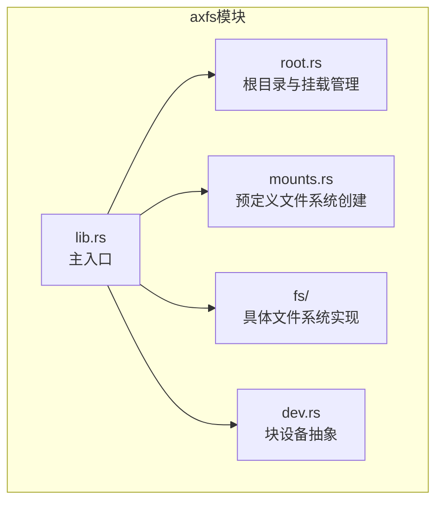
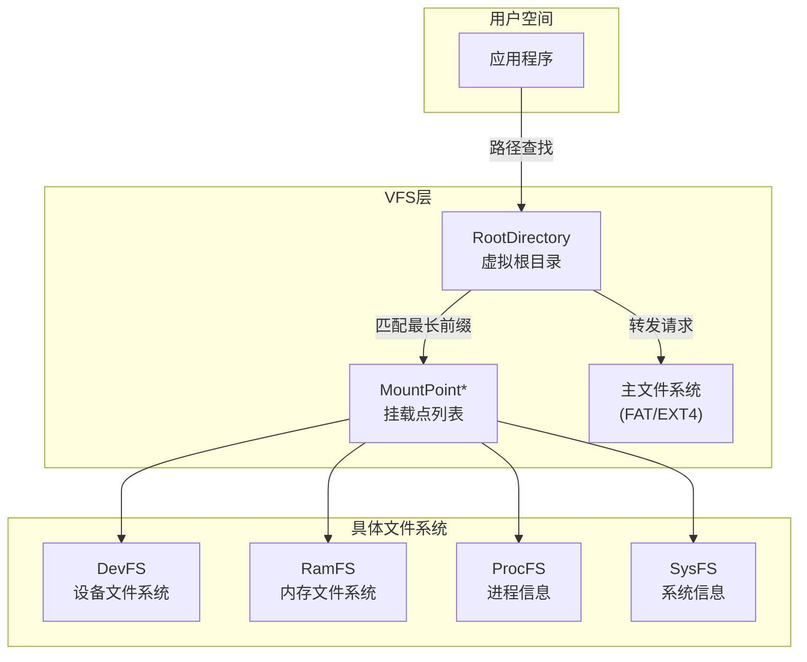
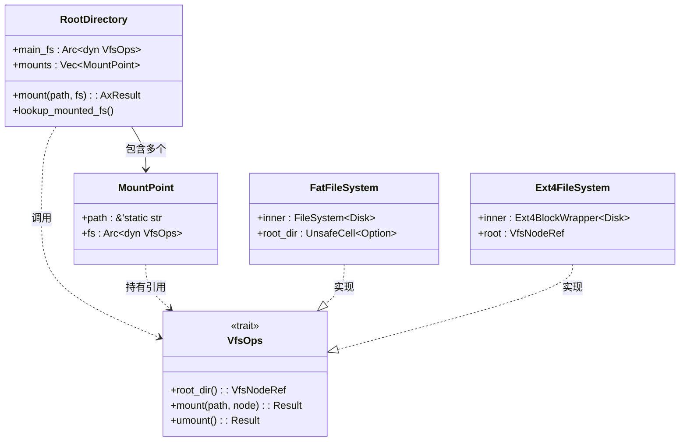
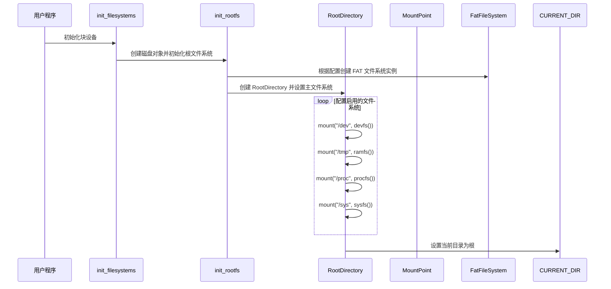
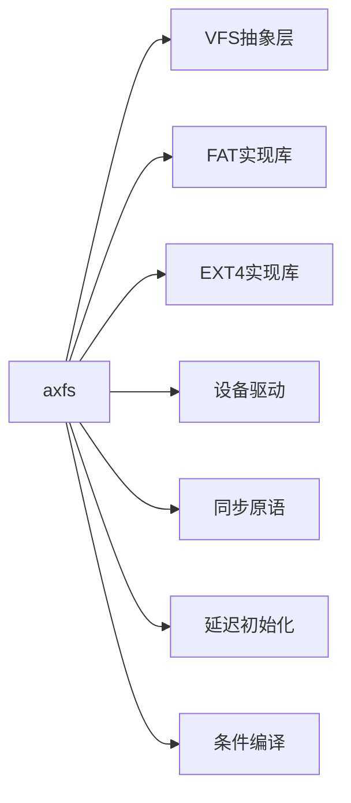

# 挂载点注册与文件系统绑定

<cite>
**本文档引用的文件**
- [lib.rs](file://modules/axfs/src/lib.rs)
- [root.rs](file://modules/axfs/src/root.rs)
- [mounts.rs](file://modules/axfs/src/mounts.rs)
- [fatfs.rs](file://modules/axfs/src/fs/fatfs.rs)
- [ext4fs.rs](file://modules/axfs/src/fs/ext4fs.rs)
- [mod.rs](file://modules/axfs/src/fs/mod.rs)
</cite>

## 目录
1. [简介](#简介)
2. [项目结构](#项目结构)
3. [核心组件](#核心组件)
4. [架构概述](#架构概述)
5. [详细组件分析](#详细组件分析)
6. [依赖分析](#依赖分析)
7. [性能考虑](#性能考虑)
8. [故障排除指南](#故障排除指南)
9. [结论](#结论)

## 简介
ArceOS 的 `axfs` 模块提供了一个统一的虚拟文件系统（VFS）接口，支持多种具体文件系统的挂载和管理。本文档详细说明了挂载点的注册机制、vfsmount 结构体的设计作用、超级块初始化流程以及 mount 系统调用在内核态的处理路径。

## 项目结构
`axfs` 模块是 ArceOS 文件系统的核心部分，位于 `/modules/axfs` 目录下，其主要功能包括设备抽象、文件操作封装、具体文件系统实现及挂载管理。

**图源**
- [lib.rs](file://modules/axfs/src/lib.rs#L0-L45)
- [root.rs](file://modules/axfs/src/root.rs#L0-L48)
- [mounts.rs](file://modules/axfs/src/mounts.rs#L0-L82)

**节源**
- [lib.rs](file://modules/axfs/src/lib.rs#L0-L45)
- [root.rs](file://modules/axfs/src/root.rs#L0-L48)

## 核心组件
`axfs` 的核心在于通过 `RootDirectory` 和 `MountPoint` 实现多文件系统的统一视图，并利用 VFS 抽象层对接 FAT、EXT4 等具体实现。

**节源**
- [root.rs](file://modules/axfs/src/root.rs#L50-L86)
- [mounts.rs](file://modules/axfs/src/mounts.rs#L0-L82)

## 架构概述
整个文件系统架构采用典型的 VFS 设计模式：以一个统一的虚拟文件系统为枢纽，将不同类型的物理或内存文件系统挂载到统一的命名空间中。

**图源**
- [root.rs](file://modules/axfs/src/root.rs#L50-L86)
- [mounts.rs](file://modules/axfs/src/mounts.rs#L0-L82)

## 详细组件分析

### 挂载点注册机制分析
`axfs` 使用 `register_filesystem` 和 `mount_fs` 类似的语义来完成文件系统的注册与挂载。实际由 `init_filesystems()` 启动流程驱动。

#### 挂载流程类图

**图源**
- [root.rs](file://modules/axfs/src/root.rs#L50-L86)
- [fatfs.rs](file://modules/axfs/src/fs/fatfs.rs#L0-L301)
- [ext4fs.rs](file://modules/axfs/src/fs/ext4fs.rs#L0-L377)

#### 挂载系统调用序列图

**图源**
- [lib.rs](file://modules/axfs/src/lib.rs#L0-L45)
- [root.rs](file://modules/axfs/src/root.rs#L127-L164)
- [mounts.rs](file://modules/axfs/src/mounts.rs#L0-L82)

**节源**
- [lib.rs](file://modules/axfs/src/lib.rs#L0-L45)
- [root.rs](file://modules/axfs/src/root.rs#L127-L164)

### vfsmount结构体设计分析
虽然 `axfs` 未显式定义名为 `vfsmount` 的结构体，但其功能由 `MountPoint` 和 `RootDirectory.mounts` 字段承担，用于维护挂载关系链表。

`MountPoint` 结构体包含两个关键字段：
- `path`: 挂载路径（如 `/dev`, `/tmp`）
- `fs`: 具体文件系统的操作接口引用（`Arc<dyn VfsOps>`）

当进行路径查找时，`RootDirectory::lookup_mounted_fs` 会遍历所有挂载点，寻找最长匹配前缀，从而决定应路由到哪个子文件系统。

**节源**
- [root.rs](file://modules/axfs/src/root.rs#L50-L86)

### 超级块初始化与引用计数管理
在 `axfs` 中，每个具体文件系统（如 `FatFileSystem` 或 `Ext4FileSystem`）在其构造函数中完成“超级块”的初始化工作。例如：

- `FatFileSystem::new()` 创建 `fatfs::FileSystem` 实例
- `Ext4FileSystem::new()` 创建 `Ext4BlockWrapper` 实例

这些对象即相当于传统意义上的超级块，保存了文件系统的元数据和状态。

引用计数通过 Rust 的 `Arc<T>`（原子引用计数智能指针）自动管理。所有对文件系统实例的共享引用均使用 `Arc` 包装，确保资源在不再被引用时安全释放。

此外，`Drop` 特性为 `MountPoint` 提供了卸载钩子，在挂载点被移除时自动调用 `fs.umount()` 清理资源。

**节源**
- [fatfs.rs](file://modules/axfs/src/fs/fatfs.rs#L0-L301)
- [ext4fs.rs](file://modules/axfs/src/fs/ext4fs.rs#L0-L377)
- [root.rs](file://modules/axfs/src/root.rs#L50-L86)

## 依赖分析
`axfs` 模块高度依赖于外部 crate 和内部组件协同工作。

**图源**
- [lib.rs](file://modules/axfs/src/lib.rs#L0-L45)
- [mod.rs](file://modules/axfs/src/fs/mod.rs#L0-L15)

**节源**
- [lib.rs](file://modules/axfs/src/lib.rs#L0-L45)
- [mod.rs](file://modules/axfs/src/fs/mod.rs#L0-L15)

## 性能考虑
- **路径查找效率**：当前 `lookup_mounted_fs` 使用线性扫描寻找最长匹配挂载点，时间复杂度为 O(n)，未来可优化为 Trie 树结构。
- **缓存机制**：目前缺乏路径解析结果缓存，频繁访问同一路径可能导致重复查找开销。
- **并发控制**：`Arc<Mutex<T>>` 提供线程安全，但在高并发场景下可能成为瓶颈，建议引入读写锁优化。

## 故障排除指南
常见问题及其排查方法：

| 问题现象 | 可能原因 | 解决方案 |
|--------|--------|--------|
| 无法挂载文件系统 | 块设备未正确初始化 | 检查 `blk_devs.take_one()` 是否成功获取设备 |
| 找不到 `/dev` 或 `/tmp` | 对应 feature 未启用 | 确保 Cargo.toml 中启用了 `devfs` 和 `ramfs` 特性 |
| 路径查找失败 | 挂载点路径格式错误 | 确认路径以 `/` 开头且不重复挂载 |
| 写入失败 | 文件系统只读或空间不足 | 检查设备权限与可用空间 |

**节源**
- [root.rs](file://modules/axfs/src/root.rs#L50-L86)
- [mounts.rs](file://modules/axfs/src/mounts.rs#L0-L82)

## 结论
`axfs` 模块通过清晰的分层设计实现了灵活的文件系统挂载机制。它利用 VFS 抽象屏蔽底层差异，通过 `RootDirectory` 统一管理多个挂载点，并借助 Rust 的所有权与生命周期机制保障内存安全。尽管当前路径查找算法有待优化，整体架构已具备良好的扩展性与稳定性，适合作为轻量级操作系统文件系统的基础。