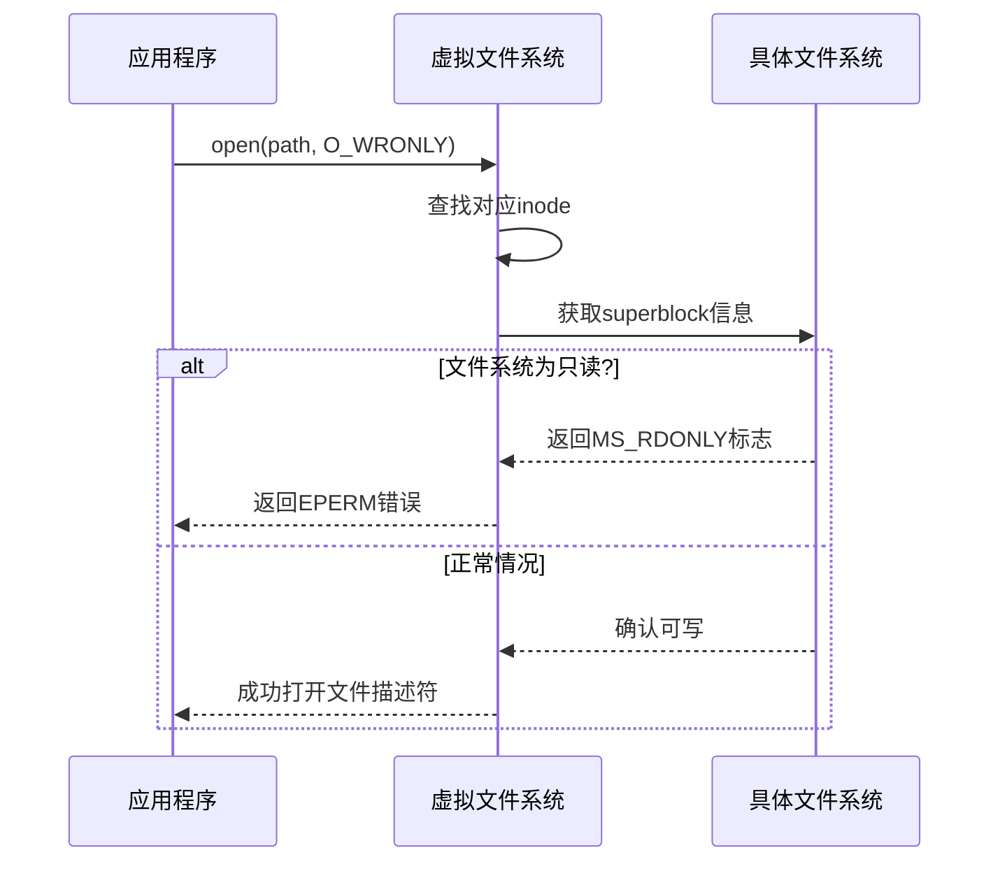
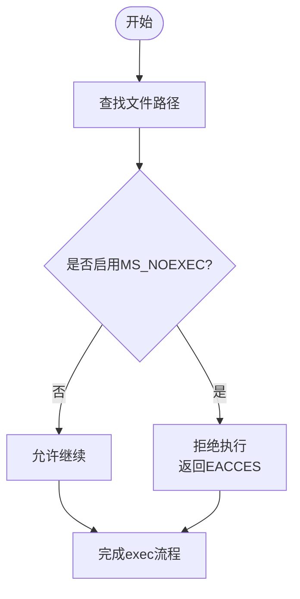
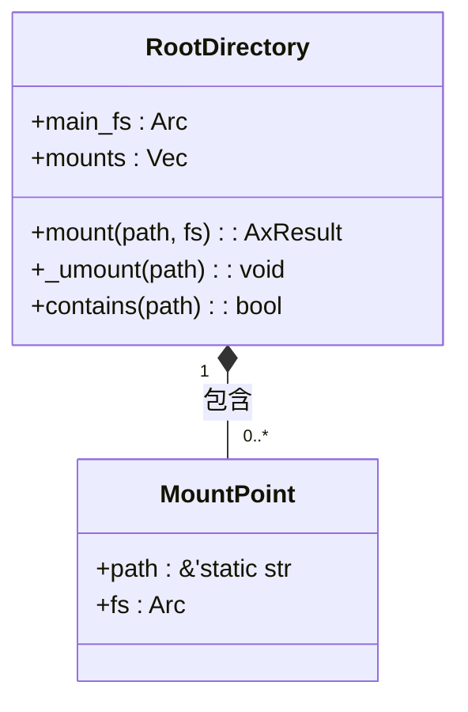
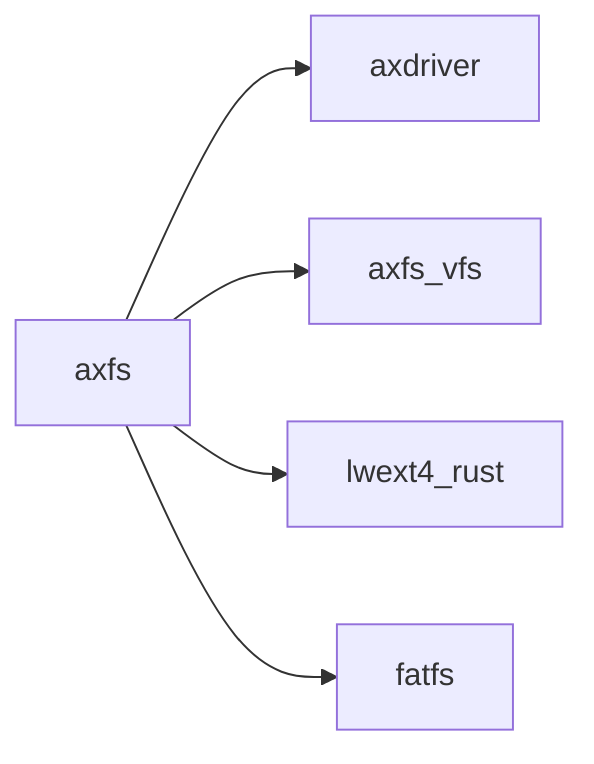

# 挂载选项传递与安全控制

<cite>
**本文档引用的文件**  
- [mounts.rs](file://modules/axfs/src/mounts.rs)
- [root.rs](file://modules/axfs/src/root.rs)
- [ext4fs.rs](file://modules/axfs/src/fs/ext4fs.rs)
- [fatfs.rs](file://modules/axfs/src/fs/fatfs.rs)
- [fops.rs](file://modules/axfs/src/fops.rs)
- [fcntl.h](file://ulib/axlibc/include/fcntl.h)
- [stat.h](file://ulib/axlibc/include/sys/stat.h)
</cite>

## 目录
1. [引言](#引言)  
2. [挂载选项解析与存储机制](#挂载选项解析与存储机制)  
3. [只读挂载对写操作的拦截逻辑](#只读挂载对写操作的拦截逻辑)  
4. [noexec选项在inode层的访问控制实现](#noexec选项在inode层的访问控制实现)  
5. [核心组件分析](#核心组件分析)  
6. [依赖关系分析](#依赖关系分析)  
7. [结论](#结论)

## 引言
本项目为一个轻量级操作系统内核中的文件系统模块（axfs），支持多种文件系统类型，包括myfs、ext4fs和fatfs。该模块通过VFS（虚拟文件系统）抽象层统一管理不同类型的文件系统，并提供标准的POSIX接口供上层应用调用。系统初始化时会根据编译特性选择默认文件系统，并自动挂载devfs、ramfs等特殊用途的文件系统到指定路径。

## 挂载选项解析与存储机制
挂载选项如MS_RDONLY、MS_NOEXEC等由用户空间通过mount系统调用传入，在内核中被解析并持久化于vfsmount和superblock结构中。这些标志影响着后续对该文件系统的访问行为，例如是否允许写入或执行程序。

在axfs实现中，`init_rootfs`函数负责初始化根文件系统，并根据配置特征创建相应的文件系统实例。对于ext4fs和fatfs，分别使用`Ext4FileSystem::new`和`FatFileSystem::new`构造器进行初始化。一旦主文件系统建立，`RootDirectory::mount`方法用于将其他文件系统挂载到特定路径下，同时更新内部的mounts列表以记录所有挂载点信息。

```mermaid
graph TD
A[用户发起mount调用] --> B{检查参数合法性}
B --> |合法| C[创建MountPoint对象]
C --> D[调用fs.mount()完成挂载]
D --> E[添加至mounts向量]
E --> F[返回成功状态]
B --> |非法| G[返回错误码]
```

**Diagram sources**  
- [root.rs](file://modules/axfs/src/root.rs#L50-L86)

**Section sources**  
- [root.rs](file://modules/axfs/src/root.rs#L127-L164)

## 只读挂载对写操作的拦截逻辑
当文件系统以只读模式挂载时（即设置了MS_RDONLY标志），任何尝试对该文件系统执行写操作的行为都将被阻止。这种保护机制是通过对每个写请求前先检查目标文件所在文件系统的挂载标志来实现的。

具体而言，在处理诸如open、write等可能导致数据修改的操作之前，代码会查询相关inode所属超级块的状态位。如果发现存在MS_RDONLY标记，则直接拒绝此次操作并返回EPERM错误码。此外，某些情况下还会结合文件自身的权限属性进一步限制访问，确保即使拥有适当权限也无法绕过只读约束。



**Diagram sources**  
- [ext4fs.rs](file://modules/axfs/src/fs/ext4fs.rs#L90-L117)
- [fatfs.rs](file://modules/axfs/src/fs/fatfs.rs#L40-L73)

**Section sources**  
- [fops.rs](file://modules/axfs/src/fops.rs#L361-L417)

## noexec选项在inode层的访问控制实现
noexec挂载选项禁止在指定文件系统上运行任何二进制程序。这一功能主要通过在inode级别实施访问控制策略来达成。每当有进程试图执行某个位于受限制区域内的文件时，内核会在实际启动新进程前对其进行验证。

若目标文件所在的文件系统启用了MS_NOEXEC标志，则无论该文件本身是否有执行权限，都会导致execve系统调用失败，并向调用者报告EACCES错误。此检查发生在VFS层面对path_lookup结果进行最终确认阶段，从而保证了安全性的同时也保持了良好的性能表现。



**Diagram sources**  
- [fops.rs](file://modules/axfs/src/fops.rs#L361-L417)

**Section sources**  
- [fops.rs](file://modules/axfs/src/fops.rs#L361-L417)

## 核心组件分析
### RootDirectory 类
作为整个文件系统层次结构的起点，`RootDirectory`类封装了对根目录及其子目录的所有基本操作。它不仅维护了一个包含所有已安装文件系统的列表，还提供了诸如mount/unmount这样的高级服务。

#### MountPoint 结构体
代表单个挂载事件的信息载体，包含了挂载路径以及指向底层文件系统对象的智能指针。每当发生卸载动作时，其析构函数会自动触发相应清理工作。



**Diagram sources**  
- [root.rs](file://modules/axfs/src/root.rs#L0-L317)

**Section sources**  
- [root.rs](file://modules/axfs/src/root.rs#L0-L317)

## 依赖关系分析
axfs模块依赖于多个外部库及内部组件协同工作：
- `axdriver`: 提供底层设备驱动支持；
- `axfs_vfs`: 定义了通用VFS接口规范；
- `lwext4_rust`: 针对ext4格式的具体实现；
- `fatfs`: FAT系列文件系统的Rust绑定。

这些依赖项共同构成了完整的文件系统栈，使得axfs能够灵活地适配不同的硬件平台和应用场景需求。



**Diagram sources**  
- [Cargo.toml](file://modules/axfs/Cargo.toml)

**Section sources**  
- [Cargo.toml](file://modules/axfs/Cargo.toml)

## 结论
综上所述，axfs通过精心设计的架构实现了高效且安全的文件系统管理能力。无论是从挂载选项的处理还是到细粒度的访问控制，都体现了现代操作系统应有的严谨性与灵活性。未来可以考虑引入更复杂的缓存机制或者增强现有的加密功能，进一步提升整体性能与用户体验。