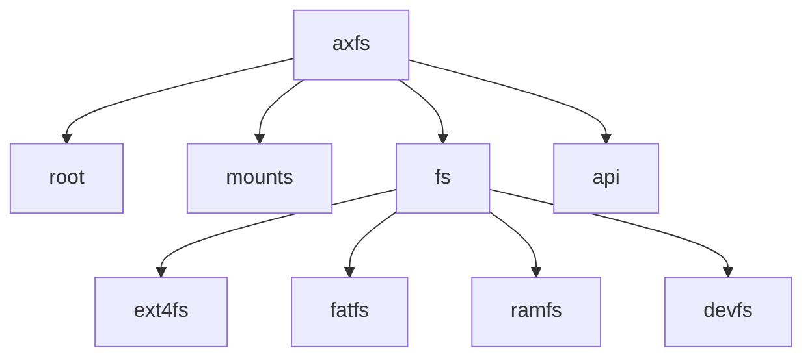
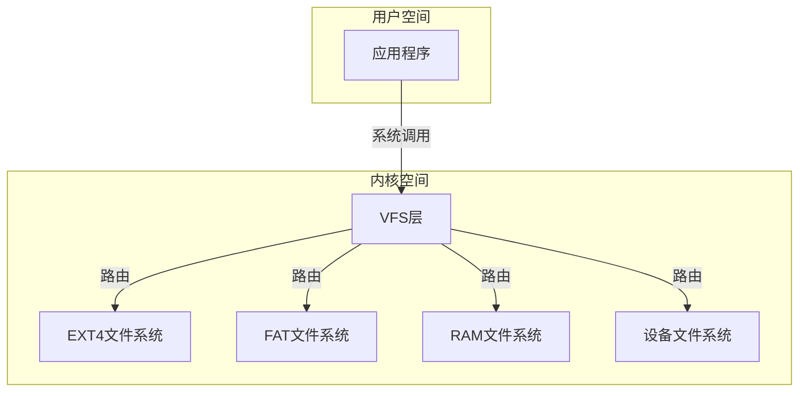
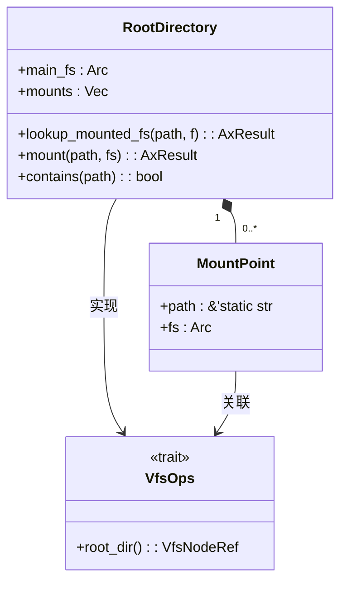
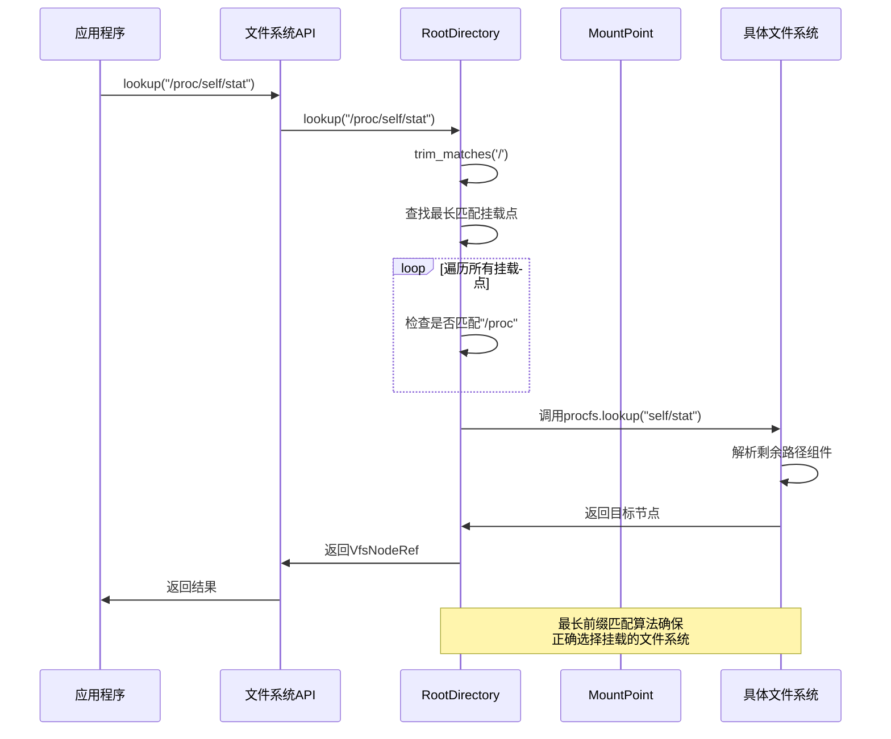
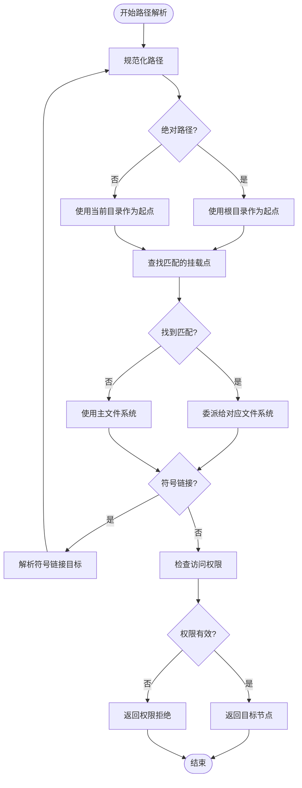
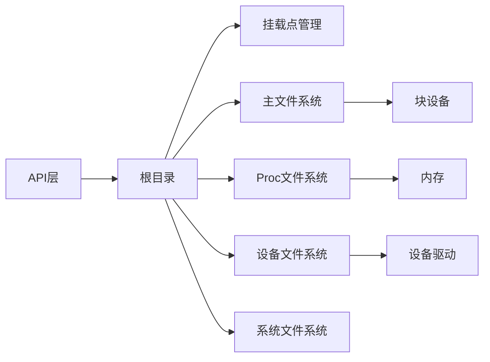

# 跨文件系统路径解析机制

<cite>
**本文档引用的文件**
- [root.rs](file://modules/axfs/src/root.rs)
- [mounts.rs](file://modules/axfs/src/mounts.rs)
- [ext4fs.rs](file://modules/axfs/src/fs/ext4fs.rs)
- [fatfs.rs](file://modules/axfs/src/fs/fatfs.rs)
- [dir.rs](file://modules/axfs/src/api/dir.rs)
- [fs.rs](file://api/arceos_posix_api/src/imp/fs.rs)
</cite>

## 目录
1. [引言](#引言)
2. [项目结构](#项目结构)
3. [核心组件](#核心组件)
4. [架构概述](#架构概述)
5. [详细组件分析](#详细组件分析)
6. [依赖分析](#依赖分析)
7. [性能考虑](#性能考虑)
8. [故障排除指南](#故障排除指南)
9. [结论](#结论)

## 引言
本文深入分析axfs在多挂载环境下实现路径解析的技术细节，涵盖从根目录开始逐级遍历组件名称并跨越不同文件系统边界的完整过程。重点解释lookup函数如何协同dentry缓存进行快速定位，并处理符号链接跳转与挂载点穿越的边界情况。

## 项目结构
ArceOS的文件系统模块采用分层架构设计，核心功能位于`modules/axfs`目录下。该模块提供统一的文件系统操作接口，支持多种文件系统类型。

**图示来源**
- [root.rs](file://modules/axfs/src/root.rs)
- [mounts.rs](file://modules/axfs/src/mounts.rs)
- [fs/mod.rs](file://modules/axfs/src/fs/mod.rs)

**本节来源**
- [root.rs](file://modules/axfs/src/root.rs)
- [lib.rs](file://modules/axfs/src/lib.rs)

## 核心组件
核心组件包括根目录管理、挂载点管理、文件系统实现和API接口。根目录作为所有文件系统的入口点，负责协调多个文件系统的挂载和查找操作。

**本节来源**
- [root.rs](file://modules/axfs/src/root.rs)
- [mounts.rs](file://modules/axfs/src/mounts.rs)

## 架构概述
系统采用虚拟文件系统(VFS)架构，通过统一接口抽象不同文件系统的差异。根目录维护一个挂载点列表，每个挂载点关联特定的文件系统实例。

**图示来源**
- [root.rs](file://modules/axfs/src/root.rs)
- [fs/mod.rs](file://modules/axfs/src/fs/mod.rs)

## 详细组件分析

### 根目录与挂载点管理
根目录组件负责管理所有挂载点，实现跨文件系统的路径解析。当接收到路径查找请求时，系统会遍历挂载点列表，寻找最长匹配的挂载路径。

**图示来源**
- [root.rs](file://modules/axfs/src/root.rs#L0-L318)

#### 路径解析执行时序
路径解析过程涉及多个组件的协同工作，从接收路径到返回目标节点的完整流程如下：

**图示来源**
- [root.rs](file://modules/axfs/src/root.rs#L50-L125)
- [mounts.rs](file://modules/axfs/src/mounts.rs#L0-L82)

**本节来源**
- [root.rs](file://modules/axfs/src/root.rs#L0-L318)
- [mounts.rs](file://modules/axfs/src/mounts.rs#L0-L82)

### 符号链接与权限检查
系统在路径解析过程中集成权限检查和符号链接处理机制。对于符号链接，系统会递归解析其指向的目标路径；对于权限检查，则验证用户对目标资源的访问权限。

**图示来源**
- [root.rs](file://modules/axfs/src/root.rs#L210-L251)
- [ext4fs.rs](file://modules/axfs/src/fs/ext4fs.rs#L226-L252)

**本节来源**
- [root.rs](file://modules/axfs/src/root.rs#L210-L251)
- [fs.rs](file://api/arceos_posix_api/src/imp/fs.rs#L118-L152)

## 依赖分析
系统各组件之间存在明确的依赖关系，根目录依赖于具体的文件系统实现，而API层则依赖于根目录提供的服务。

**图示来源**
- [root.rs](file://modules/axfs/src/root.rs)
- [mounts.rs](file://modules/axfs/src/mounts.rs)

**本节来源**
- [root.rs](file://modules/axfs/src/root.rs)
- [mounts.rs](file://modules/axfs/src/mounts.rs)

## 性能考虑
路径解析的性能关键在于挂载点查找效率。当前实现采用线性搜索算法，时间复杂度为O(n)，其中n为挂载点数量。对于大量挂载点的场景，建议优化为基于trie树的数据结构以提高查找效率。

## 故障排除指南
常见问题包括挂载点冲突、路径不存在和权限不足等。调试时应首先检查挂载点配置，然后验证路径格式，最后确认用户权限设置。

**本节来源**
- [root.rs](file://modules/axfs/src/root.rs#L50-L86)
- [dir.rs](file://modules/axfs/src/api/dir.rs#L0-L150)

## 结论
axfs通过精心设计的根目录管理和挂载点机制，实现了高效的跨文件系统路径解析。系统采用最长前缀匹配算法确保正确选择目标文件系统，并集成权限检查和符号链接处理功能，提供了完整的文件系统服务。