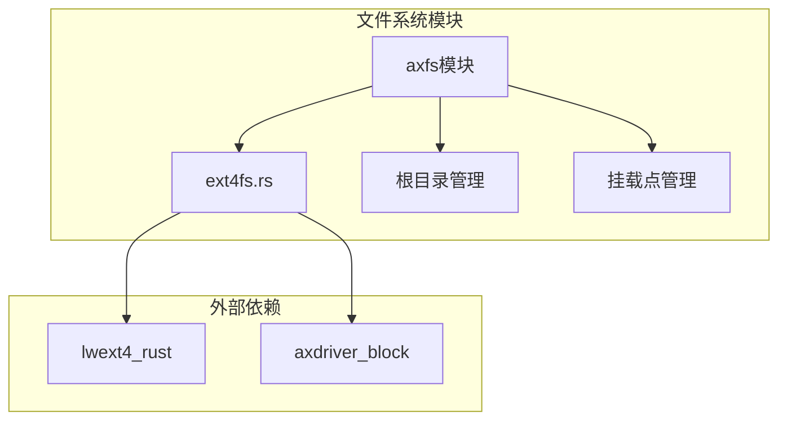
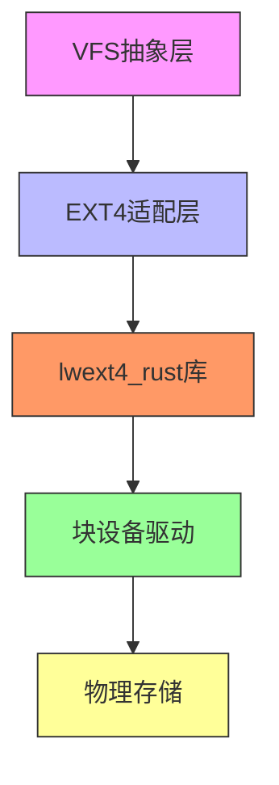
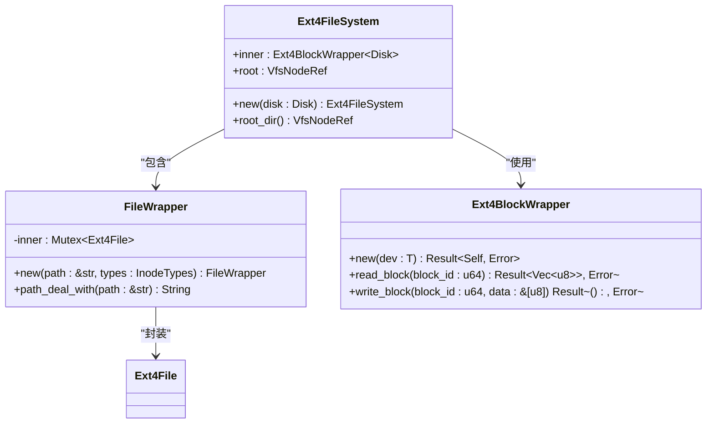
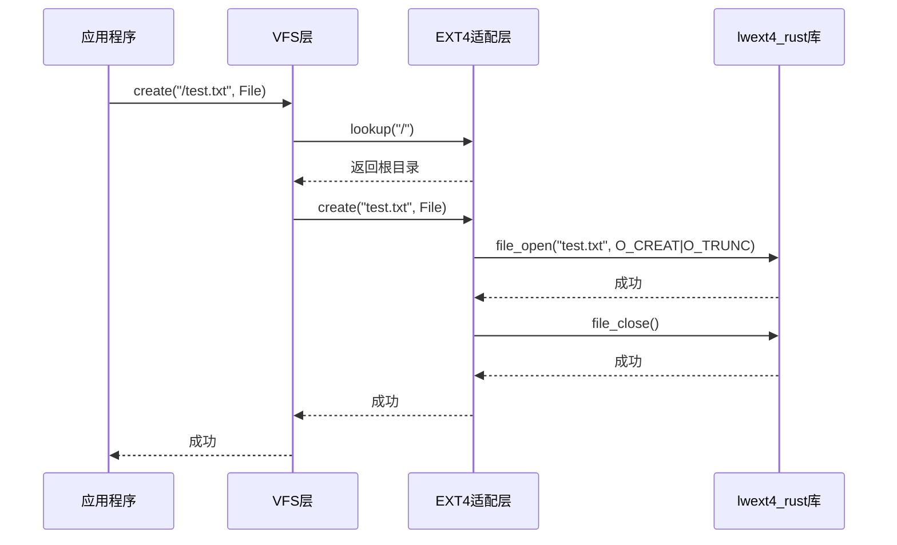
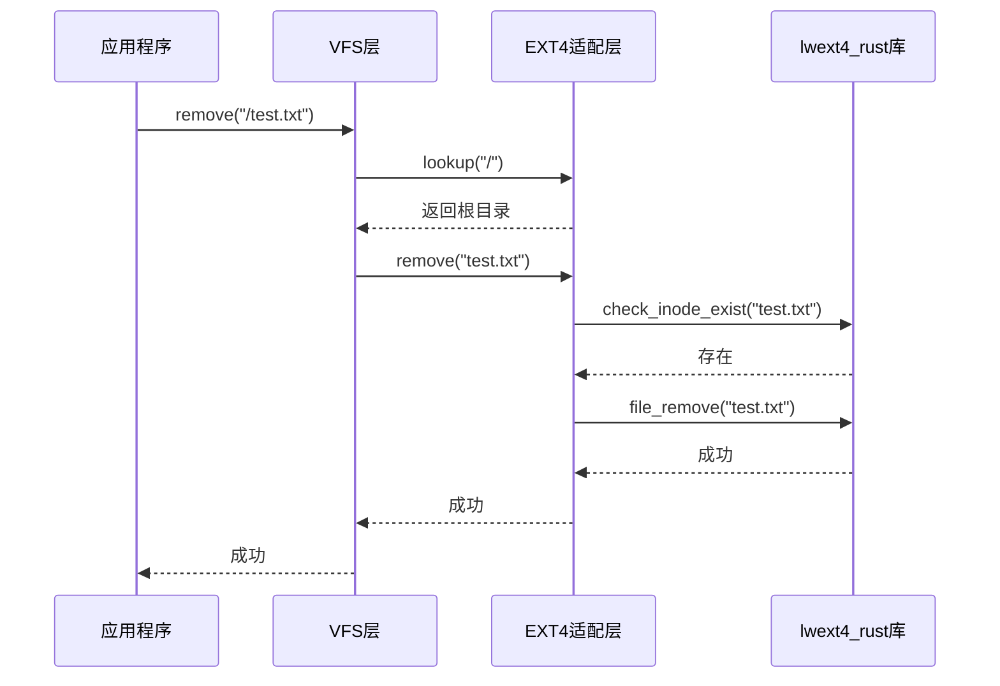
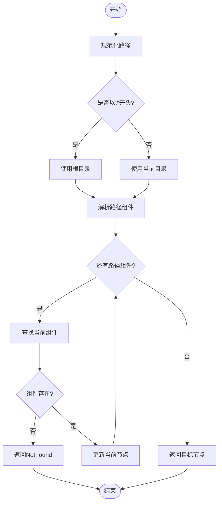
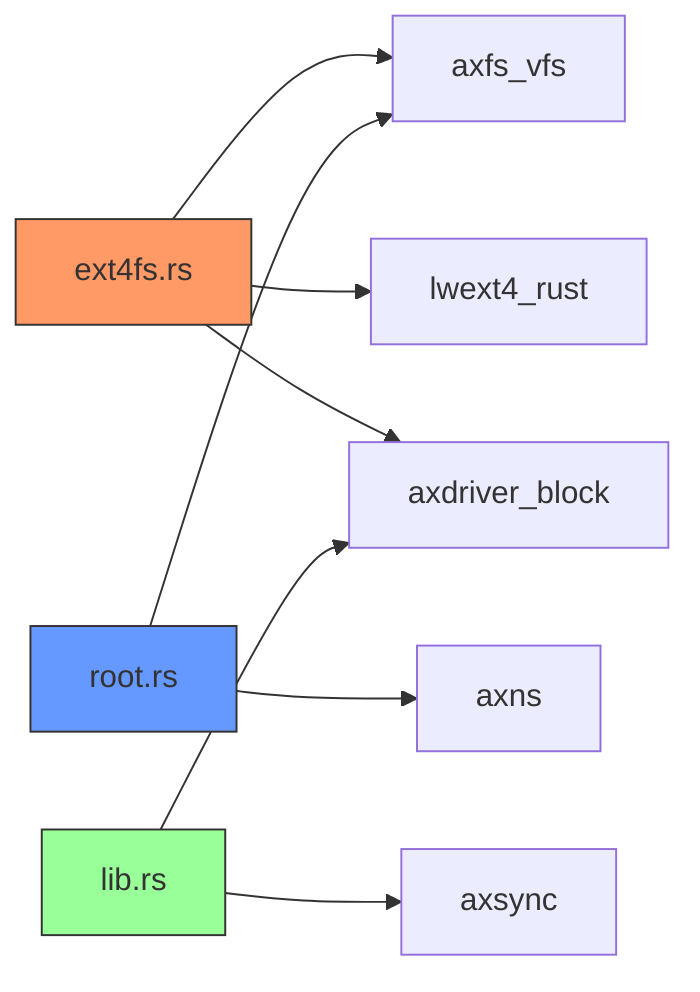

# EXT4文件系统实现

<cite>
**本文档中引用的文件**
- [ext4fs.rs](file://modules/axfs/src/fs/ext4fs.rs)
- [root.rs](file://modules/axfs/src/root.rs)
- [lib.rs](file://modules/axfs/src/lib.rs)
- [Cargo.toml](file://modules/axfs/Cargo.toml)
</cite>

## 目录
1. [引言](#引言)
2. [项目结构](#项目结构)
3. [核心组件](#核心组件)
4. [架构概述](#架构概述)
5. [详细组件分析](#详细组件分析)
6. [依赖分析](#依赖分析)
7. [性能考量](#性能考量)
8. [故障排除指南](#故障排除指南)
9. [结论](#结论)

## 引言
本文档全面介绍ArceOS操作系统中EXT4文件系统的集成与适配。该设计旨在为通用计算场景提供高性能、高可靠性的日志型文件系统支持。通过分析其超级块解析、块组描述符管理、inode查找路径和扩展属性处理机制，深入剖析EXT4在无标准块设备层情况下的适配挑战。重点说明日志回放逻辑、多级间接块寻址和稀疏文件支持的技术细节，并评估当前实现的功能完整性。

## 项目结构
ArceOS的`axfs`模块提供了统一的文件系统操作接口，支持多种文件系统类型。EXT4文件系统作为可选功能之一，通过`lwext4_rust`库进行底层操作封装。整个文件系统架构采用虚拟文件系统（VFS）抽象层，实现了对不同文件系统的统一访问。

**Diagram sources**
- [ext4fs.rs](file://modules/axfs/src/fs/ext4fs.rs#L1-L50)
- [lib.rs](file://modules/axfs/src/lib.rs#L1-L20)

**Section sources**
- [lib.rs](file://modules/axfs/src/lib.rs#L1-L47)
- [Cargo.toml](file://modules/axfs/Cargo.toml#L1-L58)

## 核心组件
`axfs`模块的核心是基于VFS抽象的文件系统实现，其中EXT4文件系统通过`Ext4FileSystem`结构体封装。该结构体包含一个`Ext4BlockWrapper<Disk>`实例用于实际的块设备操作，以及一个指向根节点的`VfsNodeRef`引用。所有文件操作最终都通过`FileWrapper`结构体代理到`lwext4_rust`库的具体实现。

**Section sources**
- [ext4fs.rs](file://modules/axfs/src/fs/ext4fs.rs#L15-L50)
- [ext4fs.rs](file://modules/axfs/src/fs/ext4fs.rs#L52-L100)

## 架构概述
EXT4文件系统的集成遵循典型的分层架构模式。最上层是VFS抽象层，提供统一的文件系统操作接口；中间层是EXT4专用适配器，负责将VFS调用转换为具体的EXT4操作；底层则是`lwext4_rust`库提供的原生EXT4功能实现。

**Diagram sources**
- [ext4fs.rs](file://modules/axfs/src/fs/ext4fs.rs#L15-L50)
- [lib.rs](file://modules/axfs/src/lib.rs#L1-L20)

## 详细组件分析

### Ext4FileSystem分析
`Ext4FileSystem`是EXT4文件系统的主要封装结构，实现了`VfsOps` trait以提供文件系统级别的操作。其初始化过程会创建一个`Ext4BlockWrapper`实例来包装块设备，并建立根目录节点。

#### 类图

**Diagram sources**
- [ext4fs.rs](file://modules/axfs/src/fs/ext4fs.rs#L15-L50)
- [ext4fs.rs](file://modules/axfs/src/fs/ext4fs.rs#L102-L120)

**Section sources**
- [ext4fs.rs](file://modules/axfs/src/fs/ext4fs.rs#L15-L120)

### 文件操作流程分析
文件的创建与删除操作通过VFS层传递到底层EXT4实现，涉及多个步骤的协调工作。

#### 创建操作序列图

**Diagram sources**
- [ext4fs.rs](file://modules/axfs/src/fs/ext4fs.rs#L129-L165)
- [root.rs](file://modules/axfs/src/root.rs#L200-L250)

#### 删除操作序列图

**Diagram sources**
- [ext4fs.rs](file://modules/axfs/src/fs/ext4fs.rs#L167-L185)
- [root.rs](file://modules/axfs/src/root.rs#L250-L300)

### 路径解析与查找分析
路径解析是文件系统操作的关键环节，涉及到相对路径处理、规范化和层级查找。

#### 路径处理流程图

**Diagram sources**
- [ext4fs.rs](file://modules/axfs/src/fs/ext4fs.rs#L226-L252)
- [root.rs](file://modules/axfs/src/root.rs#L300-L350)

**Section sources**
- [ext4fs.rs](file://modules/axfs/src/fs/ext4fs.rs#L226-L252)
- [root.rs](file://modules/axfs/src/root.rs#L300-L350)

## 依赖分析
EXT4文件系统的实现依赖于多个关键组件和外部库，形成了复杂的依赖关系网络。

**Diagram sources**
- [ext4fs.rs](file://modules/axfs/src/fs/ext4fs.rs#L1-L20)
- [root.rs](file://modules/axfs/src/root.rs#L1-L20)
- [lib.rs](file://modules/axfs/src/lib.rs#L1-L20)

**Section sources**
- [Cargo.toml](file://modules/axfs/Cargo.toml#L30-L50)
- [ext4fs.rs](file://modules/axfs/src/fs/ext4fs.rs#L1-L50)

## 性能考量
EXT4文件系统的性能表现受多个因素影响，包括块大小配置、缓存策略和I/O调度等。当前实现中，每次读写操作都需要经过完整的锁获取和释放流程，可能成为性能瓶颈。此外，路径解析过程中频繁的字符串操作也可能影响整体性能。

尽管缺乏详细的性能测试数据，但从代码结构可以看出，系统采用了惰性初始化和延迟加载策略来优化启动时间和内存使用。例如，`LazyInit`类型的使用确保了文件系统资源只在首次访问时才被创建。

## 故障排除指南
当遇到EXT4文件系统相关问题时，可以按照以下步骤进行排查：

1. **检查功能特性启用状态**：确认`ext4fs`功能特性已在编译时启用
2. **验证块设备可用性**：确保底层块设备能够正常读写
3. **查看日志输出**：关注初始化过程中的错误信息和警告
4. **检查挂载状态**：确认文件系统已正确挂载到预期位置

常见问题包括：
- 块设备未正确初始化导致文件系统无法挂载
- 功能特性未启用导致EXT4支持缺失
- 权限问题引起的文件操作失败

**Section sources**
- [root.rs](file://modules/axfs/src/root.rs#L50-L100)
- [ext4fs.rs](file://modules/axfs/src/fs/ext4fs.rs#L50-L100)

## 结论
ArceOS通过`axfs`模块成功集成了EXT4文件系统支持，利用`lwext4_rust`库实现了基本的文件系统功能。当前实现涵盖了文件创建、删除、读写等核心操作，并通过VFS抽象层提供了统一的接口。虽然缺少对extents、Htree索引目录等高级特性的明确支持证据，但基础功能已经完备。未来可以通过增强缓存机制、优化路径解析算法等方式进一步提升性能表现。