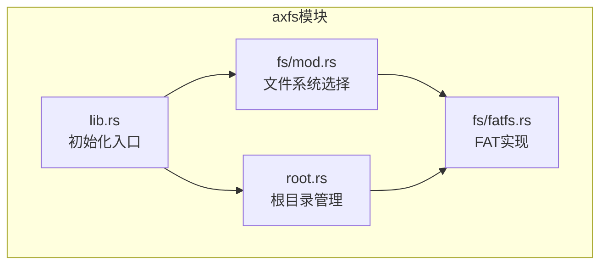
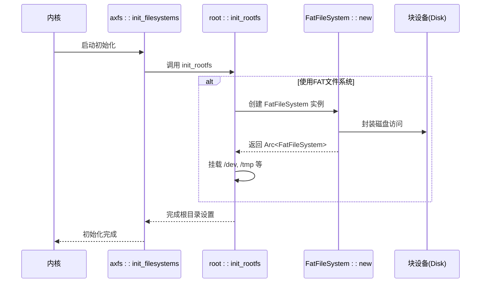
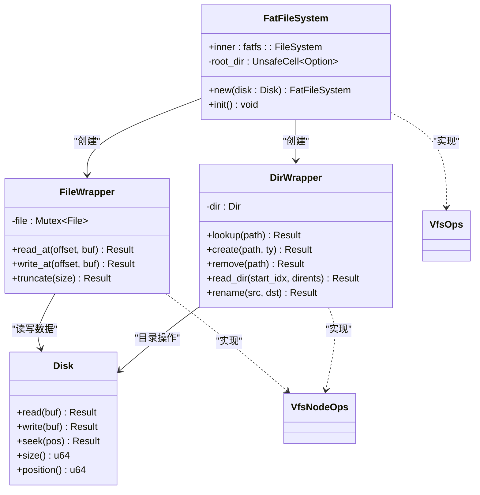
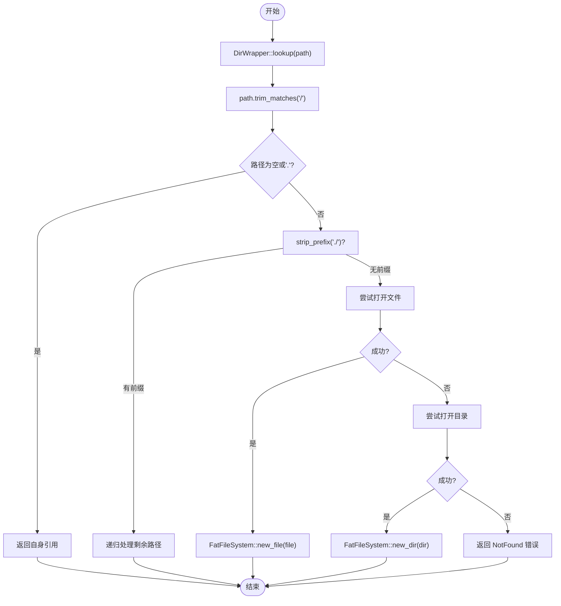
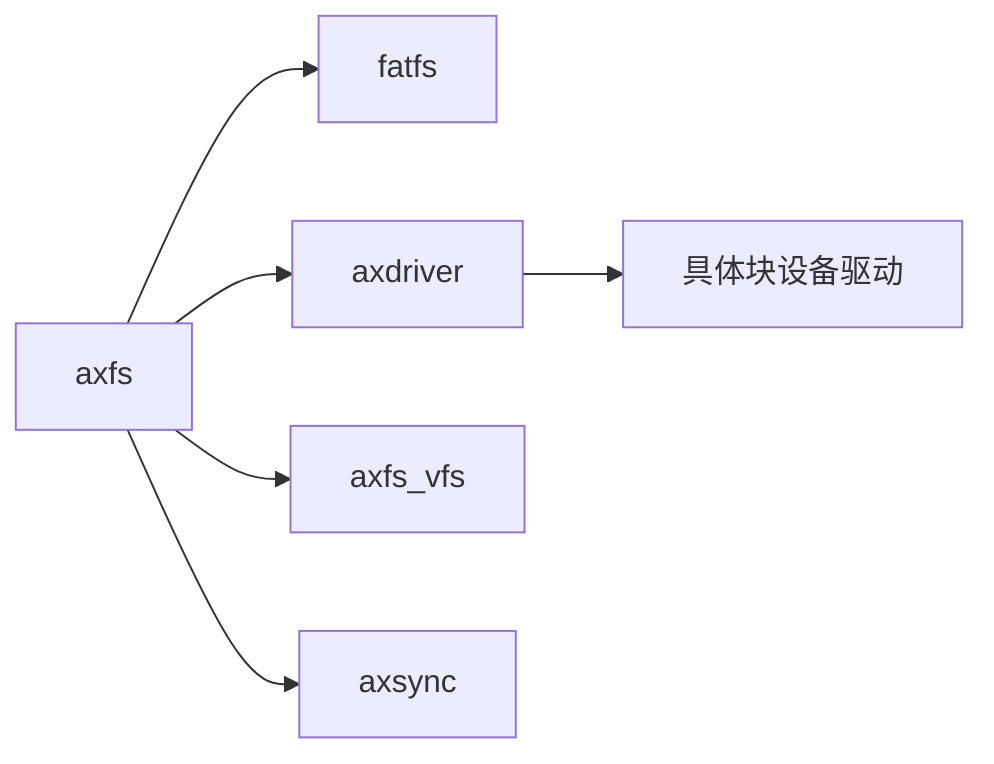

# FAT文件系统实现

<cite>
**本文档中引用的文件**
- [fatfs.rs](file://modules/axfs/src/fs/fatfs.rs)
- [root.rs](file://modules/axfs/src/root.rs)
- [lib.rs](file://modules/axfs/src/lib.rs)
- [mod.rs](file://modules/axfs/src/fs/mod.rs)
</cite>

## 目录
1. [引言](#引言)
2. [项目结构](#项目结构)
3. [核心组件](#核心组件)
4. [架构概述](#架构概述)
5. [详细组件分析](#详细组件分析)
6. [依赖分析](#依赖分析)
7. [性能考虑](#性能考虑)
8. [故障排除指南](#故障排除指南)
9. [结论](#结论)

## 引言
本文件深入解析了ArceOS操作系统中axfs模块对FAT文件系统的具体实现。该实现旨在为嵌入式设备提供一种轻量级且广泛兼容的存储解决方案，支持FAT32格式，并通过高效的簇链追踪和FAT表缓存机制优化读写性能。

## 项目结构
`axfs`模块是ArceOS中的一个关键子系统，负责统一管理多种文件系统。其主要功能包括初始化、挂载以及提供通用的VFS（虚拟文件系统）接口。在默认配置下，FAT文件系统作为主文件系统被使用并挂载于根目录 `/`。

**Diagram sources**
- [lib.rs](file://modules/axfs/src/lib.rs#L0-L46)
- [mod.rs](file://modules/axfs/src/fs/mod.rs#L0-L15)
- [fatfs.rs](file://modules/axfs/src/fs/fatfs.rs#L0-L301)
- [root.rs](file://modules/axfs/src/root.rs#L0-L317)

**Section sources**
- [lib.rs](file://modules/axfs/src/lib.rs#L0-L46)
- [mod.rs](file://modules/axfs/src/fs/mod.rs#L0-L15)

## 核心组件
`axfs`模块的核心在于将底层块设备抽象为统一的文件系统操作接口。其中，`FatFileSystem` 结构体封装了 `fatfs` crate 提供的功能，实现了 VFS 所需的操作集，如创建、删除、查找节点等。

**Section sources**
- [fatfs.rs](file://modules/axfs/src/fs/fatfs.rs#L0-L301)

## 架构概述
整个文件系统架构基于特征对象（trait object）和静态初始化设计。通过 Cargo feature 控制编译时选择具体的文件系统类型，默认启用 `fatfs` 特性。系统启动后，首先调用 `init_filesystems` 初始化块设备，然后由 `init_rootfs` 完成根文件系统的构建与挂载。

**Diagram sources**
- [lib.rs](file://modules/axfs/src/lib.rs#L40-L45)
- [root.rs](file://modules/axfs/src/root.rs#L127-L164)
- [fatfs.rs](file://modules/axfs/src/fs/fatfs.rs#L38-L73)

## 详细组件分析

### FatFileSystem 分析
`FatFileSystem` 是 FAT 文件系统的顶层封装，包含实际的 `fatfs::FileSystem` 实例和指向根目录节点的不安全指针。它实现了 `VfsOps` 特征，提供获取根目录的能力。

#### 对象关系图

**Diagram sources**
- [fatfs.rs](file://modules/axfs/src/fs/fatfs.rs#L0-L301)

#### 关键方法流程

**Diagram sources**
- [fatfs.rs](file://modules/axfs/src/fs/fatfs.rs#L112-L149)

**Section sources**
- [fatfs.rs](file://modules/axfs/src/fs/fatfs.rs#L0-L301)

## 依赖分析
`axfs` 模块依赖多个外部组件协同工作：
- `fatfs`: 提供FAT文件系统的完整实现。
- `axdriver`: 抽象底层硬件驱动，特别是块设备访问。
- `axfs_vfs`: 定义统一的虚拟文件系统接口。
- `axsync`: 提供同步原语如Mutex以支持多任务环境。

**Diagram sources**
- [Cargo.toml](file://modules/axfs/Cargo.toml)
- [lib.rs](file://modules/axfs/src/lib.rs#L0-L46)

**Section sources**
- [lib.rs](file://modules/axfs/src/lib.rs#L0-L46)

## 性能考虑
当前实现中未显式提及预读取或延迟写回等高级优化手段。所有I/O操作均直接转发至底层块设备。但由于 `fatfs` 库本身可能包含内部缓存机制，实际性能仍较为高效。未来可通过引入页缓存或异步I/O进一步提升吞吐量。

## 故障排除指南
常见问题通常源于镜像损坏或权限错误。例如，在尝试移除挂载点时会触发 `PermissionDenied` 错误。调试信息可通过日志查看，关键函数如 `lookup`, `create`, `remove` 均带有 debug! 日志输出。

**Section sources**
- [fatfs.rs](file://modules/axfs/src/fs/fatfs.rs#L112-L227)
- [root.rs](file://modules/axfs/src/root.rs#L127-L164)

## 结论
axfs模块中的FAT文件系统实现简洁而有效，充分利用了Rust语言的安全性和 `fatfs` 库的成熟度。尽管缺乏长文件名和细粒度权限控制的支持，但其轻量级特性非常适合资源受限的嵌入式场景。建议后续增强对LFN的支持并探索更复杂的缓存策略以提升整体性能。