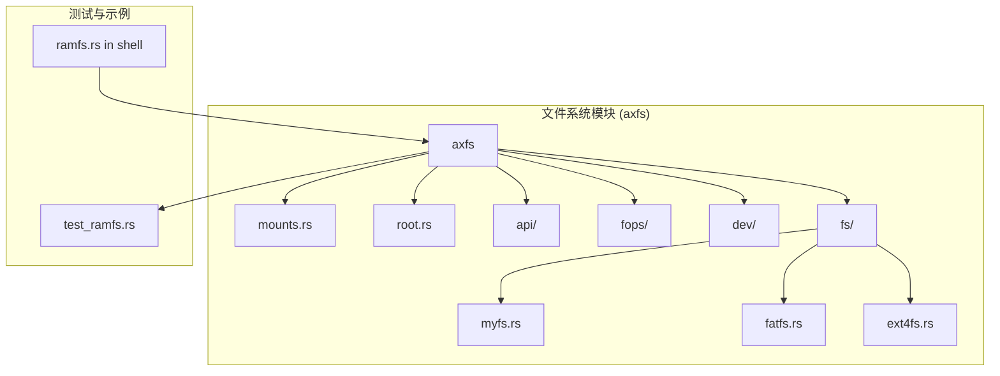
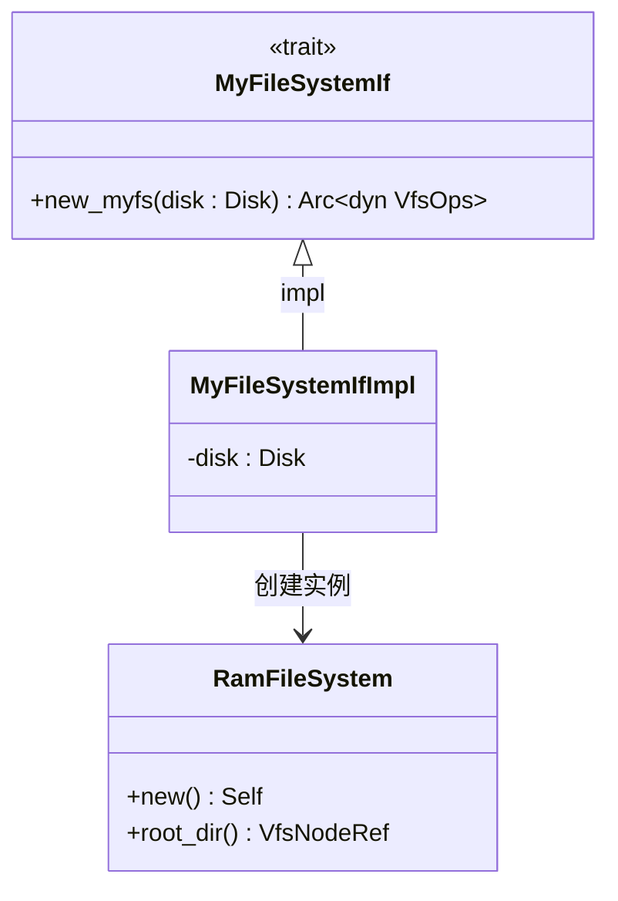
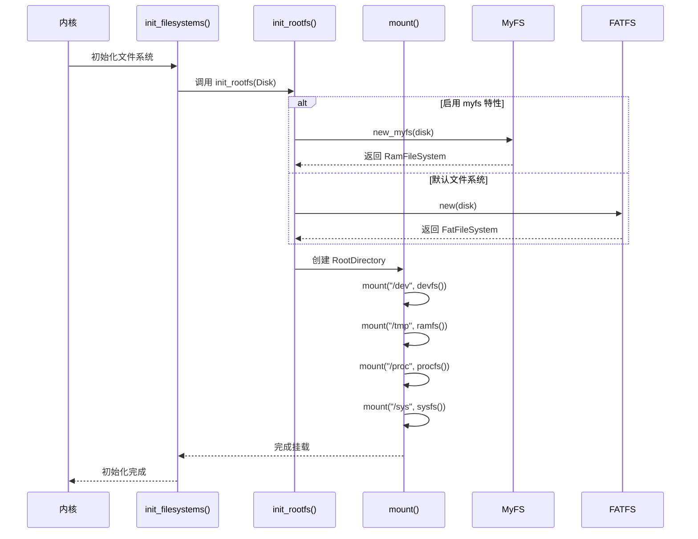

# MyFS（RAMFS）内存文件系统

<cite>
**本文档引用的文件**
- [myfs.rs](file://modules/axfs/src/fs/myfs.rs)
- [test_ramfs.rs](file://modules/axfs/tests/test_ramfs.rs)
- [ramfs.rs](file://examples/shell/src/ramfs.rs)
- [root.rs](file://modules/axfs/src/root.rs)
- [mounts.rs](file://modules/axfs/src/mounts.rs)
- [Cargo.toml](file://modules/axfs/Cargo.toml)
</cite>

## 目录
1. [简介](#简介)
2. [项目结构](#项目结构)
3. [核心组件](#核心组件)
4. [架构概述](#架构概述)
5. [详细组件分析](#详细组件分析)
6. [依赖分析](#依赖分析)
7. [性能考虑](#性能考虑)
8. [故障排除指南](#故障排除指南)
9. [结论](#结论)

## 简介
MyFS 是一种基于内存的简单文件系统（RAMFS），专为启动初期或临时存储场景设计，提供快速、易管理的文件接口。该系统完全运行于内存中，不涉及持久化存储，因此在断电后数据会丢失。其主要用途包括作为根文件系统、挂载 `/tmp`、`/proc` 和 `/sys` 等临时目录。本文档将深入探讨 MyFS 的设计与实现机制，涵盖其数据结构组织方式、superblock 初始化时的内存池绑定、文件数据的连续缓冲区管理策略以及目录遍历算法，并通过 shell 示例说明其典型用法。

## 项目结构
MyFS 的实现位于 ArceOS 操作系统的 `axfs` 模块中，采用模块化设计，支持多种文件系统特性。通过 Cargo 特性（feature）机制可灵活启用 RAMFS、FATFS、EXT4FS 等不同文件系统。MyFS 作为用户自定义文件系统的接口抽象，实际由 `axfs_ramfs` 提供具体实现。

**图源**
- [root.rs](file://modules/axfs/src/root.rs#L0-L48)
- [mounts.rs](file://modules/axfs/src/mounts.rs#L0-L36)
- [myfs.rs](file://modules/axfs/src/fs/myfs.rs#L0-L16)

**节源**
- [root.rs](file://modules/axfs/src/root.rs#L0-L48)
- [mounts.rs](file://modules/axfs/src/mounts.rs#L0-L36)

## 核心组件
MyFS 的核心在于其轻量级的内存文件系统接口定义和基于 `axfs_ramfs` 的具体实现。它通过 `MyFileSystemIf` 接口允许用户自定义文件系统类型，在初始化时动态创建 `RamFileSystem` 实例。该系统利用纯内存存储语义，inode 与 dentry 动态分配，无任何磁盘 I/O 开销，适用于对速度要求极高但无需持久化的场景。

**节源**
- [myfs.rs](file://modules/axfs/src/fs/myfs.rs#L0-L16)
- [test_ramfs.rs](file://modules/axfs/tests/test_ramfs.rs#L0-L55)

## 架构概述
MyFS 的整体架构遵循虚拟文件系统（VFS）的设计模式，通过统一的 `VfsOps` 接口对外暴露文件操作能力。系统启动时，根据编译时启用的 feature 决定主文件系统类型。若启用了 `myfs` 特性，则使用用户实现的 `MyFileSystemIf::new_myfs` 来创建文件系统实例；否则默认使用 FATFS 或 EXT4FS。RAMFS 被广泛用于挂载 `/tmp`、`/proc`、`/sys` 等临时路径。

**图源**
- [root.rs](file://modules/axfs/src/root.rs#L127-L164)
- [mounts.rs](file://modules/axfs/src/mounts.rs#L0-L36)

## 详细组件分析

### MyFileSystemIf 接口分析
`MyFileSystemIf` 是一个通过 `crate_interface` 宏定义的可插拔接口，允许用户在应用层实现自己的文件系统初始化逻辑。该接口仅包含一个方法 `new_myfs`，接收一个 `Disk` 类型参数（尽管在 RAMFS 中并未实际使用），返回一个实现了 `VfsOps` 的动态对象引用。

**图源**
- [myfs.rs](file://modules/axfs/src/fs/myfs.rs#L4-L16)
- [ramfs.rs](file://examples/shell/src/ramfs.rs#L0-L14)

**节源**
- [myfs.rs](file://modules/axfs/src/fs/myfs.rs#L4-L16)
- [ramfs.rs](file://examples/shell/src/ramfs.rs#L0-L14)

### 文件系统挂载流程分析
当系统初始化时，`init_rootfs` 函数根据 feature 配置决定主文件系统类型。随后调用 `RootDirectory::new` 创建根目录，并依次挂载 `devfs`、`ramfs`（至 `/tmp`）、`procfs` 和 `sysfs`。这些挂载点均基于 `axfs_ramfs::RamFileSystem` 实现，确保了高性能的内存访问。

**图源**
- [root.rs](file://modules/axfs/src/root.rs#L127-L208)
- [mounts.rs](file://modules/axfs/src/mounts.rs#L0-L81)

**节源**
- [root.rs](file://modules/axfs/src/root.rs#L127-L208)
- [mounts.rs](file://modules/axfs/src/mounts.rs#L0-L81)

### 数据结构与内存管理分析
MyFS 使用纯内存存储语义，所有 inode 与 dentry 均在堆上动态分配，由 Rust 的智能指针 `Arc<dyn VfsOps>` 管理生命周期。文件数据以连续缓冲区形式存储于内存中，避免了传统文件系统的块分配开销。目录遍历通过 `VfsNodeRef` 引用链进行递归查找，路径解析支持规范化处理（如 `..` 和 `.`）。

**图源**
- [root.rs](file://modules/axfs/src/root.rs#L164-L208)
- [test_common/mod.rs](file://modules/axfs/tests/test_common/mod.rs#L238-L261)

**节源**
- [root.rs](file://modules