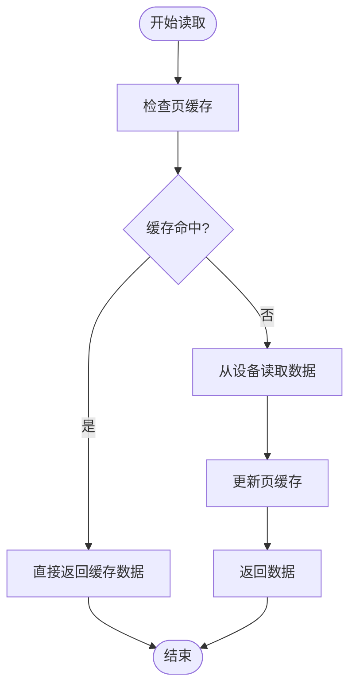
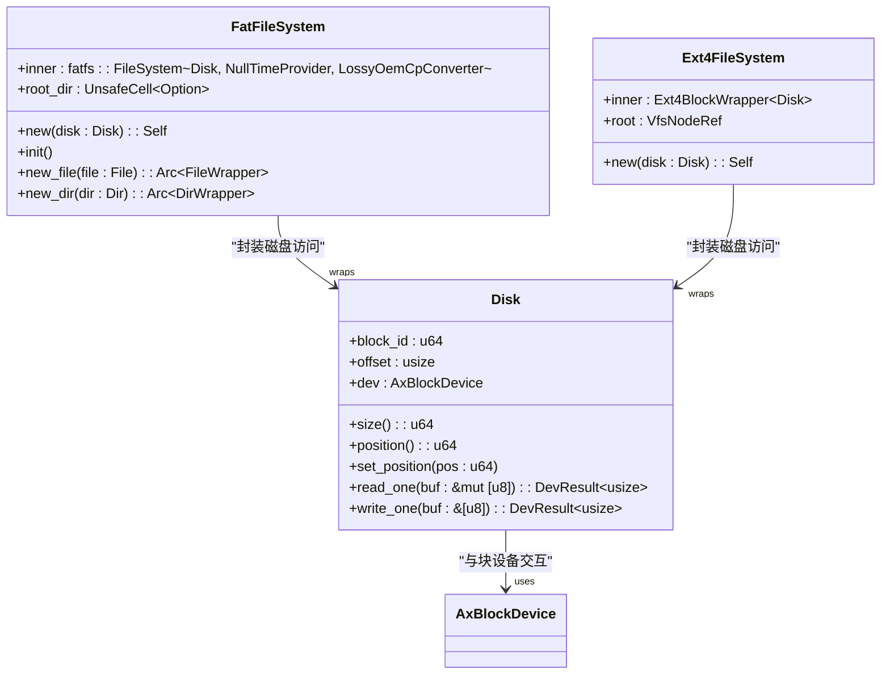

# I/O性能优化策略

<cite>
**本文档引用的文件**   
- [lib.rs](file://modules/axfs/src/lib.rs)
- [fatfs.rs](file://modules/axfs/src/fs/fatfs.rs)
- [ext4fs.rs](file://modules/axfs/src/fs/ext4fs.rs)
- [dev.rs](file://modules/axfs/src/dev.rs)
- [fops.rs](file://modules/axfs/src/fops.rs)
</cite>

## 目录
1. [引言](#引言)
2. [页缓存机制](#页缓存机制)
3. [块设备层与I/O对齐](#块设备层与io对齐)
4. [嵌入式场景下的磨损均衡](#嵌入式场景下的磨损均衡)
5. [结论](#结论)

## 引言
ArceOS中的axfs模块为提升I/O吞吐量和响应速度，采用了一系列优化技术。该系统通过统一的虚拟文件系统（VFS）接口支持多种文件系统，包括FAT、EXT4等，并在不同层次实现了针对性的性能优化。本文档将系统性地介绍这些优化技术，重点分析页缓存、I/O对齐、合并请求以及在嵌入式场景下磨损均衡的实现挑战。

**Section sources**
- [lib.rs](file://modules/axfs/src/lib.rs#L1-L46)

## 页缓存机制

### 缓存命中处理
axfs模块通过VFS层的节点操作接口实现缓存命中处理。当应用程序发起读写请求时，文件系统会首先检查目标数据是否已在内存中。对于FAT文件系统，`FileWrapper`结构体封装了底层文件对象，并通过`read_at`和`write_at`方法实现基于偏移量的数据访问。这些方法内部使用互斥锁保护文件操作，确保线程安全。

在EXT4文件系统中，`FileWrapper`同样实现了`read_at`和`write_at`方法，但其底层依赖于lwext4_rust库提供的Ext4File对象。每次读写操作都需要先调用`file_open`打开文件，执行相应操作后再调用`file_close`关闭文件描述符。这种设计虽然保证了操作的原子性，但也带来了额外的开销。

### 回写策略（writeback）
axfs目前未显式实现复杂的回写策略。在FAT文件系统中，`Disk`结构体的`flush`方法为空实现，表示不强制刷新缓冲区到存储设备。这可能导致数据在系统崩溃时丢失。EXT4文件系统的`KernelDevOp` trait中`flush`方法也仅返回成功状态，未执行实际的刷新操作。

这种简化的设计适用于对数据持久性要求不高的场景，但在需要高可靠性的应用中可能成为瓶颈。理想的回写策略应包含定时刷新、脏页比例控制等机制，以平衡性能与数据安全性。

### 预读算法（read-ahead）
当前代码库中未发现明确的预读算法实现。FAT和EXT4文件系统的读取操作均为按需加载，即只在收到具体读取请求时才从块设备读取相应数据块。对于顺序访问模式，缺乏预读机制可能导致频繁的磁盘I/O操作，影响整体性能。

理想情况下，预读算法应能识别顺序访问模式，并提前将后续数据块加载到内存中。这可以通过分析连续的`read_at`调用的偏移量变化趋势来实现。

**Diagram sources**
- [fatfs.rs](file://modules/axfs/src/fs/fatfs.rs#L100-L120)
- [ext4fs.rs](file://modules/axfs/src/fs/ext4fs.rs#L150-L170)

**Section sources**
- [fatfs.rs](file://modules/axfs/src/fs/fatfs.rs#L100-L140)
- [ext4fs.rs](file://modules/axfs/src/fs/ext4fs.rs#L150-L190)

## 块设备层与I/O对齐

### I/O对齐
axfs通过`Disk`结构体实现与块设备的交互。该结构体维护一个逻辑块ID（block_id）和块内偏移量（offset），用于跟踪当前操作位置。所有读写操作都以512字节为基本单位进行对齐处理。

当进行整块读写时，直接调用`read_block`或`write_block`方法；对于跨块或部分块的操作，则先读取完整块到临时缓冲区，修改后重新写回。这种方式确保了硬件层面的I/O对齐，避免了非对齐访问带来的性能损失。

### 合并请求（request merging）
当前实现中未见明显的请求合并机制。每个`read_one`或`write_one`调用都会产生独立的块设备操作。这意味着相邻的小型I/O请求无法被合并为更大的单一请求，可能导致效率低下。

理想情况下，应在更高层次（如VFS层）引入请求队列，收集短时间内到达的相邻I/O请求并将其合并。这不仅能减少底层设备的负载，还能提高数据传输效率。

### 批量提交（batched commits）
类似于回写策略，axfs缺乏显式的批量提交机制。元数据更新和数据写入通常是即时提交的。例如，在FAT文件系统中创建文件或目录会立即调用底层驱动的相应方法。

引入批量提交机制可以显著提升事务处理性能，特别是在涉及多个相关操作的场景下。通过将一系列操作暂存并在适当时机统一提交，可以减少同步开销并提高吞吐量。

**Diagram sources**
- [dev.rs](file://modules/axfs/src/dev.rs#L10-L90)
- [fatfs.rs](file://modules/axfs/src/fs/fatfs.rs#L10-L50)
- [ext4fs.rs](file://modules/axfs/src/fs/ext4fs.rs#L40-L60)

**Section sources**
- [dev.rs](file://modules/axfs/src/dev.rs#L10-L90)
- [fatfs.rs](file://modules/axfs/src/fs/fatfs.rs#L10-L50)
- [ext4fs.rs](file://modules/axfs/src/fs/ext4fs.rs#L40-L60)

## 嵌入式场景下的磨损均衡

### 磨损均衡的必要性
在使用NAND或SPI NOR闪存的嵌入式系统中，磨损均衡至关重要。这类存储介质具有有限的擦除周期（通常为1万到10万次），若某些区块被频繁写入而其他区块闲置，会导致前者提前失效，缩短整个存储设备的使用寿命。

### 软件实现挑战
axfs当前版本未提供内置的磨损均衡功能。由于缺乏专用控制器的支持，必须完全依赖软件方案来实现这一特性。主要挑战包括：

1. **地址映射管理**：需要维护逻辑地址到物理地址的动态映射表，这本身会产生额外的写入操作。
2. **垃圾回收机制**：当某些物理块包含大量无效数据时，需将其有效内容迁移到新块并释放原块，此过程复杂且耗时。
3. **写放大问题**：软件层的重映射和迁移操作可能导致实际写入量远超应用层请求量。
4. **性能开销**：持续的磨损统计、块选择和数据迁移会占用CPU资源并增加I/O延迟。

### 折中方案
一种可行的折中方案是在上层应用或中间件中实现轻量级的磨损均衡。例如，可设计一个环形日志结构文件系统，定期轮换写入位置。或者采用静态磨损均衡策略，预先分配一组备用块，在检测到热点区域时手动触发数据迁移。

另一种思路是利用现有文件系统的特性，如定期重组文件布局或将频繁更新的数据分散到不同目录下，间接达到均衡磨损的目的。

**Section sources**
- [fatfs.rs](file://modules/axfs/src/fs/fatfs.rs#L1-L300)
- [ext4fs.rs](file://modules/axfs/src/fs/ext4fs.rs#L1-L370)

## 结论
axfs模块通过VFS抽象层提供了对多种文件系统的支持，并在基础I/O操作上实现了必要的对齐处理。然而，在高级性能优化方面仍有改进空间。页缓存机制虽已具备基本框架，但缺少高效的回写策略和预读算法；块设备层未能充分利用请求合并和批量提交的优势；针对嵌入式场景的关键特性——磨损均衡——则完全依赖外部解决方案。

未来的工作方向应聚焦于增强这些缺失的功能，同时保持轻量级和可配置性的设计原则。通过引入可选的高级特性模块，可以在不影响核心功能的前提下，满足不同应用场景的性能需求。