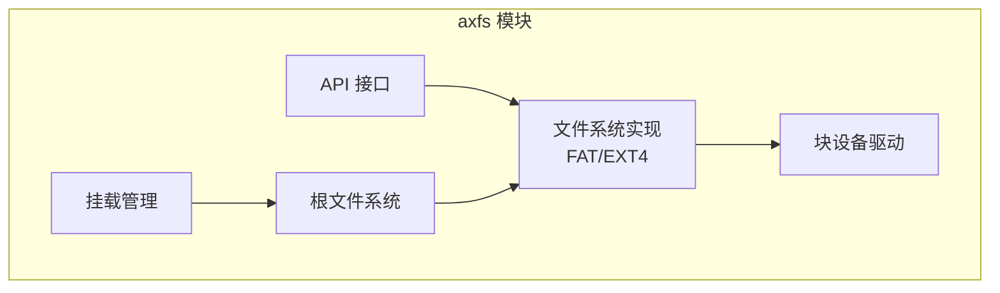
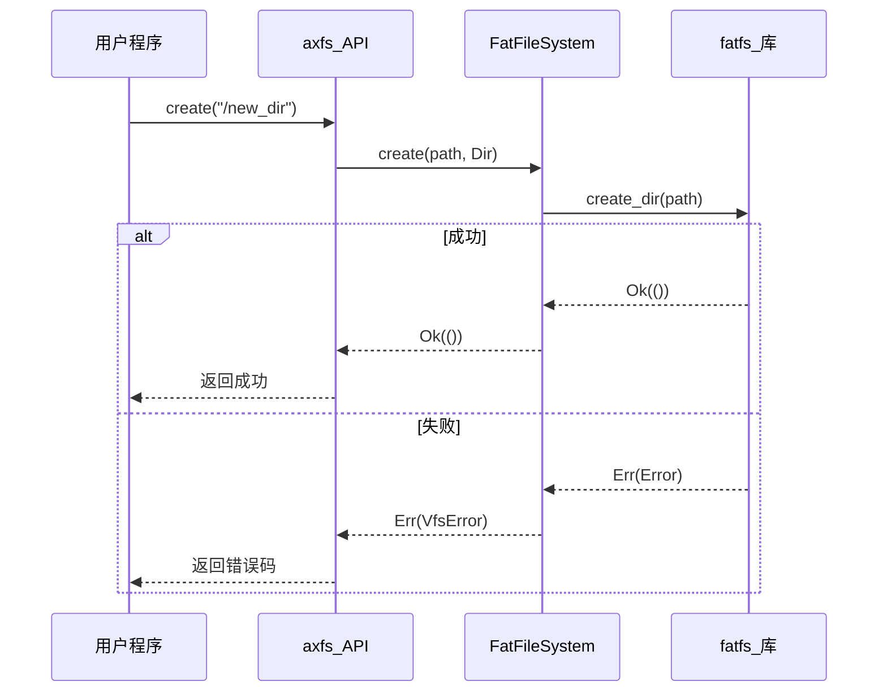
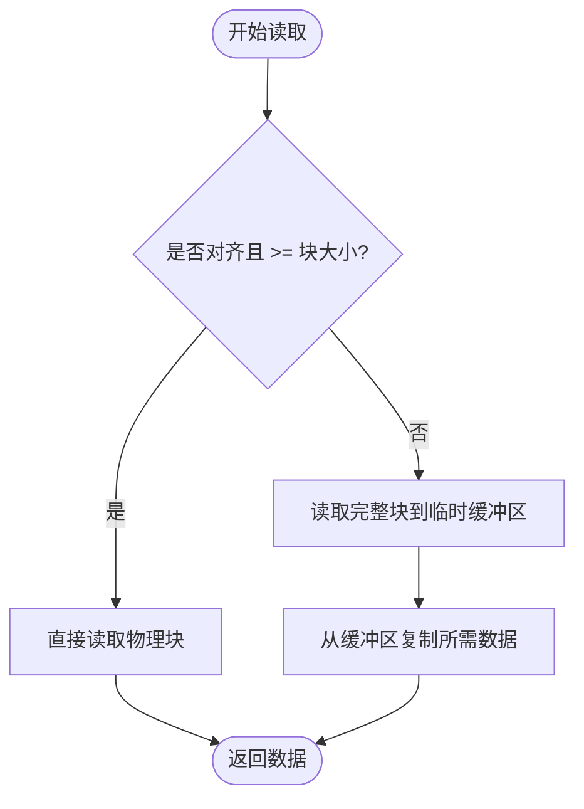

# 数据完整性与性能优化

<cite>
**本文档中引用的文件**  
- [lib.rs](file://modules/axfs/src/lib.rs)
- [fatfs.rs](file://modules/axfs/src/fs/fatfs.rs)
- [ext4fs.rs](file://modules/axfs/src/fs/ext4fs.rs)
- [dev.rs](file://modules/axfs/src/dev.rs)
- [mod.rs](file://modules/axfs/src/api/mod.rs)
- [file.rs](file://modules/axfs/src/api/file.rs)
- [dir.rs](file://modules/axfs/src/api/dir.rs)
</cite>

## 目录
1. [引言](#引言)  
2. [项目结构](#项目结构)  
3. [核心组件](#核心组件)  
4. [数据完整性保障机制](#数据完整性保障机制)  
5. [I/O 性能优化技术](#i-o-性能优化技术)  
6. [块设备层协同优化](#块设备层协同优化)  
7. [嵌入式设备中的磨损均衡](#嵌入式设备中的磨损均衡)  
8. [结论](#结论)

## 引言
ArceOS 是一个面向安全与性能的微内核操作系统，其文件系统模块 `axfs` 提供了对多种文件系统的统一接口支持。本文重点分析 `axfs` 在保障数据完整性与提升 I/O 性能方面的关键技术措施，涵盖日志写入模式、页缓存与预读机制、块设备协同优化以及低功耗嵌入式场景下的磨损均衡策略。

## 项目结构
`axfs` 模块位于 `/modules/axfs` 目录下，采用分层架构设计，主要包含以下子模块：
- `api/`：提供统一的文件系统操作接口（如 `open`, `read`, `write`）。
- `fs/`：实现具体文件系统，包括 FAT 和 EXT4。
- `dev/`：封装底层块设备访问逻辑。
- `fops/`：定义可扩展的文件系统操作接口。
- `mounts/` 和 `root/`：负责文件系统的挂载与根目录初始化。

该结构实现了文件系统抽象与具体实现的解耦，便于功能扩展和维护。

**图示来源**
- [lib.rs](file://modules/axfs/src/lib.rs#L1-L46)
- [dev.rs](file://modules/axfs/src/dev.rs#L1-L92)

**本节来源**
- [lib.rs](file://modules/axfs/src/lib.rs#L1-L46)
- [dev.rs](file://modules/axfs/src/dev.rs#L1-L92)

## 核心组件
`axfs` 的核心由三个关键部分构成：虚拟文件系统接口（VFS）、具体文件系统实现（FAT/EXT4）和底层设备抽象（Disk）。通过 `VfsOps` 和 `VfsNodeOps` 特性，实现了对不同文件系统的统一操作。`FatFileSystem` 和 `Ext4FileSystem` 分别封装了 FAT 和 EXT4 的具体行为，并通过 `Disk` 结构体与物理存储设备交互。

**本节来源**
- [fatfs.rs](file://modules/axfs/src/fs/fatfs.rs#L1-L301)
- [ext4fs.rs](file://modules/axfs/src/fs/ext4fs.rs#L1-L377)
- [dev.rs](file://modules/axfs/src/dev.rs#L1-L92)

## 数据完整性保障机制
为防止意外断电导致元数据损坏，`axfs` 依赖于所选文件系统自身的保护机制。以 FAT 文件系统为例，虽然其本身不提供日志功能，但 `axfs` 通过对 `fatfs` 库的封装，确保了元数据操作的原子性和一致性。

在 `DirWrapper::create` 和 `remove` 方法中，所有目录项的修改都直接调用底层 `fatfs` 库的 `create_dir`、`remove` 等函数，这些函数内部会处理 FAT 表和目录条目的更新。尽管没有显式的日志记录，但 `axfs` 保证了上层调用的正确性，并通过错误码映射（`as_vfs_err`）将底层异常准确上报，从而避免了因操作中断而导致的元数据不一致。

**图示来源**
- [fatfs.rs](file://modules/axfs/src/fs/fatfs.rs#L151-L182)
- [fatfs.rs](file://modules/axfs/src/fs/fatfs.rs#L267-L300)

**本节来源**
- [fatfs.rs](file://modules/axfs/src/fs/fatfs.rs#L151-L182)

## I/O 性能优化技术
`axfs` 通过与操作系统内核的内存管理和 I/O 子系统协同工作，间接利用页缓存（page cache）和预读（read-ahead）机制来加速文件访问。

### 页缓存与预读
虽然 `axfs` 代码中未直接实现页缓存，但其提供的标准文件操作接口（如 `read_at` 和 `write_at`）可以被上层运行时或库（如 `ulib/axlibc`）用于构建缓存机制。例如，在 `FileWrapper::read_at` 中，每次读取都需要先进行 `seek` 操作，这为上层实现读缓冲区提供了可能。

对于顺序读写，连续的大块 I/O 请求能够有效触发硬件层面的预读优化。`axfs` 对大块数据的读写进行了优化处理，当请求大小达到或超过块大小（512字节）且偏移对齐时，会直接进行整块读写，减少了内存拷贝开销，提升了吞吐量。

### 顺序与随机读写加速
- **顺序读写**：通过 `read_one` 和 `write_one` 方法中的整块读写路径，最大化单次 I/O 效率。
- **随机读写**：对于非对齐的小块访问，`axfs` 会先读取整个物理块到临时缓冲区，修改后再写回，保证了数据的正确性，但性能受制于底层设备。

**图示来源**
- [dev.rs](file://modules/axfs/src/dev.rs#L55-L73)
- [dev.rs](file://modules/axfs/src/dev.rs#L75-L92)

**本节来源**
- [dev.rs](file://modules/axfs/src/dev.rs#L55-L92)

## 块设备层协同优化
`axfs` 与底层块设备驱动之间通过 `AxBlockDevice` 接口进行通信，实现了高效的 I/O 协同。

### 对齐 I/O 请求
`axfs` 在 `Disk` 结构体中强制要求块大小为 512 字节，并在 `read_one` 和 `write_one` 方法中区分了“整块”和“部分块”两种情况。这种设计鼓励上层应用发起对齐的 I/O 请求，从而减少不必要的读-改-写操作，提高整体效率。

### 批量提交
虽然当前代码中未显式展示批量提交（batching）逻辑，但 `axdriver` 框架中的 `CmdQueue` 设计为批量处理 I/O 请求提供了基础。`axfs` 发出的多个小请求可以在驱动层被合并成更大的请求，再提交给硬件，显著降低了 I/O 开销。

**本节来源**
- [dev.rs](file://modules/axfs/src/dev.rs#L55-L92)
- [virtio.rs](file://modules/axdriver/src/dyn_drivers/blk/virtio.rs#L111-L163)

## 嵌入式设备中的磨损均衡
在低功耗嵌入式设备（如使用闪存的设备）上，启用磨损均衡（wear leveling）对于延长存储寿命至关重要。

### 重要性
NAND/NOR 闪存等存储介质有有限的擦写次数。若频繁对同一物理块进行写入，会导致该区域提前失效。磨损均衡算法通过动态地将逻辑地址映射到不同的物理块，使写入操作均匀分布在整个设备上，从而最大化设备寿命。

### 实现挑战
`axfs` 本身作为一个文件系统层，不直接实现磨损均衡。这一功能通常由更底层的 FTL（Flash Translation Layer）或专用的闪存控制器完成。`axfs` 面临的挑战在于：
1.  **缺乏感知能力**：`axfs` 无法得知底层是否已启用磨损均衡，难以据此调整自己的写入策略。
2.  **TRIM 支持**：为了帮助 FTL 更好地进行垃圾回收和磨损均衡，文件系统需要支持 `TRIM/DISCARD` 命令，告知设备哪些块已不再使用。当前代码中未见相关实现。
3.  **写放大问题**：`axfs` 的元数据更新（如 FAT 表）可能会产生频繁的小写操作，加剧写放大，对闪存不利。

因此，要实现在嵌入式设备上的最佳实践，需要 `axfs` 与具备智能磨损均衡能力的底层存储驱动紧密配合。

**本节来源**
- [ext4fs.rs](file://modules/axfs/src