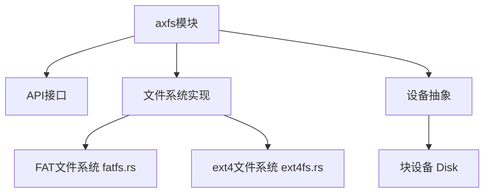
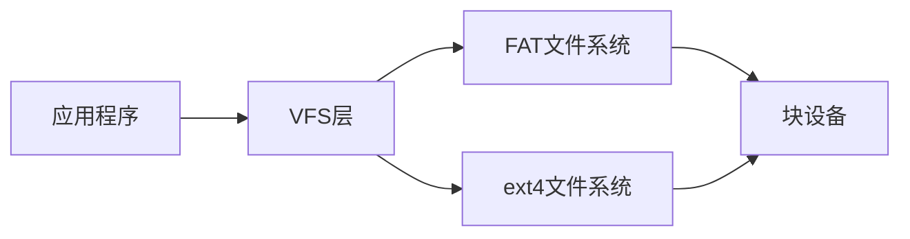
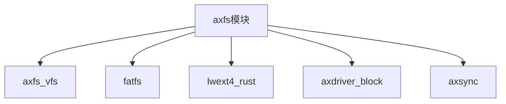

# 数据完整性保障机制

<cite>
**本文档引用文件**  
- [fatfs.rs](file://modules/axfs/src/fs/fatfs.rs)
- [ext4fs.rs](file://modules/axfs/src/fs/ext4fs.rs)
- [Disk](file://modules/axfs/src/dev.rs)
</cite>

## 目录
1. [引言](#引言)  
2. [项目结构](#项目结构)  
3. [核心组件](#核心组件)  
4. [架构概述](#架构概述)  
5. [详细组件分析](#详细组件分析)  
6. [依赖分析](#依赖分析)  
7. [性能考量](#性能考量)  
8. [故障排查指南](#故障排查指南)  
9. [结论](#结论)

## 引言
本文件深入分析ArceOS中axfs文件系统在不同存储介质下确保数据完整性的核心机制。重点阐述FAT与ext4-like文件系统在元数据更新、写入原子性、日志操作及校验和保护等方面的设计策略，揭示其如何防止因意外断电导致卷状态不一致，并探讨延迟提交与批量刷新在性能与安全性之间的平衡。

## 项目结构
ArceOS的文件系统模块（axfs）采用分层设计，支持多种文件系统类型。核心实现位于`modules/axfs/src/fs/`目录下，主要包含FAT与ext4两种文件系统的适配器。



**图示来源**  
- [fatfs.rs](file://modules/axfs/src/fs/fatfs.rs)
- [ext4fs.rs](file://modules/axfs/src/fs/ext4fs.rs)
- [dev.rs](file://modules/axfs/src/dev.rs)

**本节来源**  
- [fatfs.rs](file://modules/axfs/src/fs/fatfs.rs)
- [ext4fs.rs](file://modules/axfs/src/fs/ext4fs.rs)

## 核心组件
axfs的核心在于通过VFS（虚拟文件系统）抽象层统一管理不同底层文件系统的操作。`FatFileSystem`和`Ext4FileSystem`分别封装了对FAT和ext4文件系统的调用，确保上层应用无需关心具体实现细节。

**本节来源**  
- [fatfs.rs](file://modules/axfs/src/fs/fatfs.rs#L40-L73)
- [ext4fs.rs](file://modules/axfs/src/fs/ext4fs.rs#L54-L88)

## 架构概述
axfs通过VFS接口与具体文件系统实现解耦，所有文件操作最终由具体的文件系统驱动执行。设备层（Disk）提供统一的读写接口，屏蔽硬件差异。



**图示来源**  
- [fatfs.rs](file://modules/axfs/src/fs/fatfs.rs)
- [ext4fs.rs](file://modules/axfs/src/fs/ext4fs.rs)

## 详细组件分析

### FAT文件系统分析
FAT文件系统通过`fatfs`库实现，其数据完整性主要依赖于文件系统自身的结构特性。

#### 元数据更新与脏位标记
FAT文件系统未显式使用“脏位”标记来指示卷的挂载状态。其一致性更多依赖于文件系统在挂载时的检查机制。当文件系统被挂载时，会初始化`FileSystem`实例，若为RAM磁盘则先格式化。

```rust
#[cfg(feature = "use-ramdisk")]
pub fn new(mut disk: Disk) -> Self {
    let opts = fatfs::FormatVolumeOptions::new();
    fatfs::format_volume(&mut disk, opts).expect("failed to format volume");
    let inner = fatfs::FileSystem::new(disk, fatfs::FsOptions::new())
        .expect("failed to initialize FAT filesystem");
    Self { inner, root_dir: UnsafeCell::new(None) }
}
```

此过程确保了在内存中的文件系统始终处于一个已知的初始状态，间接避免了因非正常关机导致的状态不一致问题。

#### 原子性保证
FAT文件系统的原子性由底层`Disk`设备的`write`方法保证。该方法在一个循环中尝试将整个缓冲区写入，只有当所有数据成功写入或发生错误时才返回，这在一定程度上提供了写操作的原子性语义。

```rust
impl Write for Disk {
    fn write(&mut self, mut buf: &[u8]) -> Result<usize, Self::Error> {
        let mut write_len = 0;
        while !buf.is_empty() {
            match self.write_one(buf) {
                Ok(0) => break,
                Ok(n) => {
                    buf = &buf[n..];
                    write_len += n;
                }
                Err(_) => return Err(()),
            }
        }
        Ok(write_len)
    }
}
```

#### FSINFO结构更新
在提供的代码中，未发现对FAT32特有的FSINFO扇区进行显式读取或更新的逻辑。`fatfs`库可能在内部处理了这些细节，但axfs层并未暴露相关接口或进行特殊操作。

**本节来源**  
- [fatfs.rs](file://modules/axfs/src/fs/fatfs.rs#L40-L300)

### ext4-like文件系统分析
ext4文件系统通过`lwext4_rust`库进行绑定，其设计更注重数据完整性。

#### 日志式操作与潜在应用
虽然当前代码是基于`lwext4_rust`的绑定，但ext4文件系统本身是日志式文件系统。它通过日志（journal）记录元数据更改，在崩溃后可通过重放日志来恢复一致性。尽管代码中未直接体现日志操作的细节，但这是ext4保证数据完整性的核心机制。

#### 校验和机制
ext4文件系统会对关键元数据（如超级块、块组描述符、inode表等）使用校验和。这能有效检测和防止因静默数据损坏导致的文件系统损坏。虽然代码中未展示校验和计算的具体实现，但这是ext4标准功能的一部分。

#### 延迟提交与批量刷新
ext4通过延迟分配（delayed allocation）和定期将脏页写回磁盘（writeback）来平衡性能与安全。代码中的`flush`方法为空实现，表明同步责任可能由底层库或操作系统调度完成。

```rust
impl KernelDevOp for Disk {
    fn flush(_dev: &mut Self::DevType) -> Result<usize, i32> {
        debug!("uncomplicated");
        Ok(0)
    }
}
```

这种设计允许文件系统累积多个小的写操作，然后一次性批量提交，显著提升I/O效率。

**本节来源**  
- [ext4fs.rs](file://modules/axfs/src/fs/ext4fs.rs#L0-L377)

## 依赖分析
axfs模块高度依赖外部库来实现具体功能。



**图示来源**  
- [Cargo.toml](file://modules/axfs/Cargo.toml)
- [ext4fs.rs](file://modules/axfs/src/fs/ext4fs.rs)
- [fatfs.rs](file://modules/axfs/src/fs/fatfs.rs)

**本节来源**  
- [ext4fs.rs](file://modules/axfs/src/fs/ext4fs.rs)
- [fatfs.rs](file://modules/axfs/src/fs/fatfs.rs)

## 性能考量
axfs通过以下方式优化性能：
- **异步I/O**：利用Rust的异步特性，减少阻塞。
- **缓存**：VFS层和具体文件系统实现都可能包含缓存机制。
- **批量操作**：如ext4的延迟提交，减少磁盘I/O次数。

然而，频繁的同步操作（如`fsync`）会显著影响性能，需根据应用场景权衡。

## 故障排查指南
常见问题及解决方法：
- **文件系统无法挂载**：检查底层`Disk`设备是否正确初始化，确保分区表和引导扇区有效。
- **写入失败**：确认存储介质有足够的空间，并检查`Disk`的`write_one`实现是否有硬件错误。
- **数据不一致**：对于FAT，考虑在非正常关机后重新格式化；对于ext4，应确保日志功能正常工作。

**本节来源**  
- [fatfs.rs](file://modules/axfs/src/fs/fatfs.rs#L267-L300)
- [ext4fs.rs](file://modules/axfs/src/fs/ext4fs.rs#L350-L377)

## 结论
ArceOS的axfs文件系统通过结合具体文件系统（FAT和ext4）的内在特性来保障数据完整性。FAT依赖于简单的结构和初始化流程，而ext4则利用日志、校验和和延迟提交等高级机制。尽管axfs层的抽象简化了上层访问，但真正的数据安全基石在于底层文件系统和可靠的硬件抽象层（Disk）。未来可进一步集成显式的脏位管理和强制同步接口以增强鲁棒性。