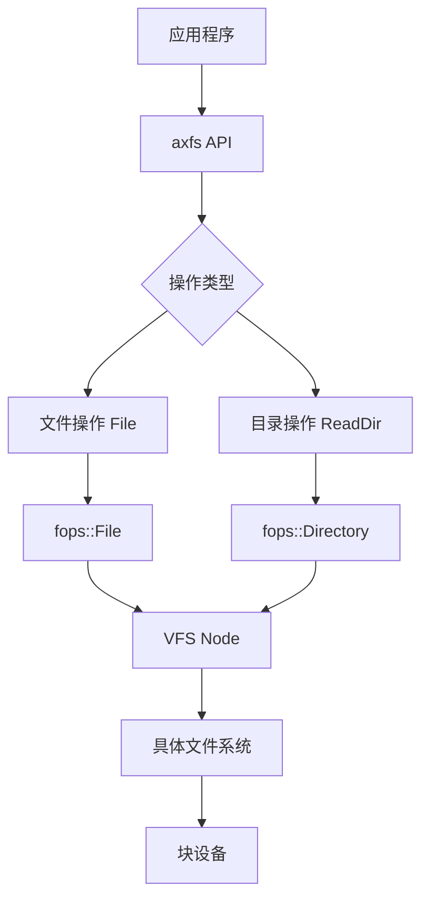
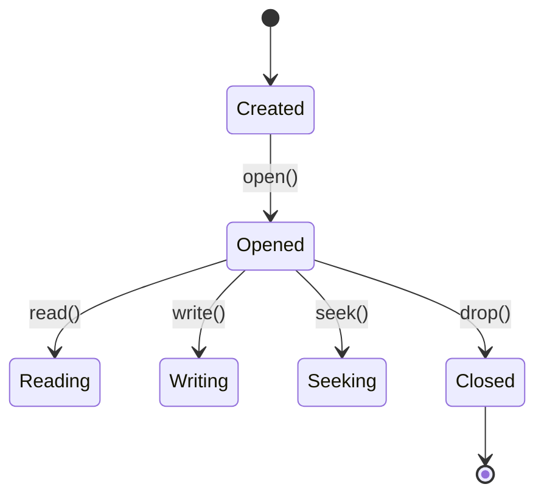
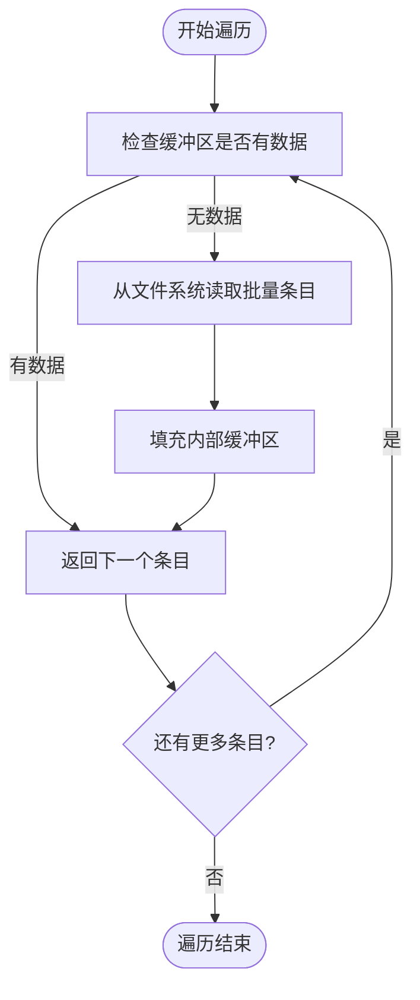

# 文件与目录操作API

<cite>
**本文档引用的文件**
- [file.rs](file://modules/axfs/src/api/file.rs)
- [dir.rs](file://modules/axfs/src/api/dir.rs)
- [fops.rs](file://modules/axfs/src/fops.rs)
- [root.rs](file://modules/axfs/src/root.rs)
- [lib.rs](file://modules/axfs/src/lib.rs)
</cite>

## 目录
1. [简介](#简介)
2. [核心接口概览](#核心接口概览)
3. [文件操作API](#文件操作api)
4. [目录操作API](#目录操作api)
5. [异步I/O支持现状](#异步io支持现状)
6. [文件描述符生命周期管理](#文件描述符生命周期管理)
7. [目录项缓存对readdir性能的影响](#目录项缓存对readdir性能的影响)
8. [错误码定义](#错误码定义)

## 简介
ArceOS（Arceos）文件系统模块为多种文件系统提供了统一的操作接口。该文档系统性地文档化了axfs对外暴露的核心文件和目录操作接口，包括create、open、read、write、close、mkdir、readdir等关键功能。

这些API通过Rust语言实现，并在内核态运行，为上层应用提供高效的底层文件系统访问能力。文档将深入分析每个API的参数约束、返回值语义及错误处理机制，并结合代码片段展示其典型调用模式。

**Section sources**
- [lib.rs](file://modules/axfs/src/lib.rs#L1-L47)

## 核心接口概览
axfs模块提供的文件与目录操作接口主要分为两大类：文件操作和目录操作。所有操作都基于虚拟文件系统（VFS）抽象层实现，支持多种具体文件系统如FAT、ext4和自定义文件系统。

文件操作通过`File`结构体提供，实现了标准的读写、定位和属性查询功能。目录操作则通过`ReadDir`迭代器实现高效遍历。底层使用`fops`模块封装了与具体文件系统的交互细节。



**Diagram sources**
- [file.rs](file://modules/axfs/src/api/file.rs#L1-L194)
- [dir.rs](file://modules/axfs/src/api/dir.rs#L1-L151)
- [fops.rs](file://modules/axfs/src/fops.rs#L1-L419)

## 文件操作API

### 创建与打开文件
文件的创建和打开通过`OpenOptions`结构体进行配置。该结构体允许设置读、写、追加、截断、创建等标志位，提供了灵活的文件访问控制。

`File::open()`方法以只读模式打开文件，而`File::create()`则以写入模式创建或覆盖文件。`create_new()`确保仅在文件不存在时创建新文件，避免意外覆盖。

```rust
// 示例：创建并写入文件
let mut file = File::create("/tmp/test.txt")?;
file.write_all(b"Hello, ArceOS!")?;
```

**Section sources**
- [file.rs](file://modules/axfs/src/api/file.rs#L100-L130)

### 读写操作
文件的读写操作实现了标准的`Read`和`Write`trait，支持同步I/O操作。`read()`和`write()`方法分别用于从当前偏移量读取和写入数据，操作后会自动更新文件指针。

对于需要精确控制位置的场景，可以通过`seek()`方法调整文件指针，支持从起始、当前位置或文件末尾开始定位。

```rust
// 示例：随机访问
file.seek(SeekFrom::Start(10))?;
let mut buffer = [0; 8];
file.read(&mut buffer)?;
```

**Section sources**
- [file.rs](file://modules/axfs/src/api/file.rs#L150-L180)
- [fops.rs](file://modules/axfs/src/fops.rs#L200-L250)

### 文件属性与元数据
通过`metadata()`方法可以获取文件的元数据信息，包括文件类型、权限、大小等属性。`set_len()`方法可用于调整文件大小，实现文件截断或扩展功能。

```rust
let metadata = file.metadata()?;
if metadata.is_file() {
    println!("文件大小: {} 字节", metadata.len());
}
```

**Section sources**
- [file.rs](file://modules/axfs/src/api/file.rs#L132-L148)
- [fops.rs](file://modules/axfs/src/fops.rs#L260-L270)

## 目录操作API

### 创建目录
目录创建通过`DirBuilder`结构体实现，目前仅支持单级目录创建（非递归）。`create()`方法根据路径创建新的空目录节点。

```rust
DirBuilder::new().create("/tmp/newdir")?;
```

**Section sources**
- [dir.rs](file://modules/axfs/src/api/dir.rs#L100-L130)

### 遍历目录内容
`ReadDir`迭代器提供了高效的目录遍历功能。它采用批量读取策略，每次从底层文件系统读取多个目录项到缓冲区，减少了系统调用次数。

迭代过程中会自动过滤`.`和`..`特殊条目，只返回实际的子文件和子目录信息。每个`DirEntry`对象包含条目的名称、类型和完整路径。

```rust
for entry in ReadDir::new("/tmp")? {
    let dir_entry = entry?;
    println!("{:?}: {:?}", dir_entry.file_name(), dir_entry.file_type());
}
```

**Section sources**
- [dir.rs](file://modules/axfs/src/api/dir.rs#L20-L90)
- [fops.rs](file://modules/axfs/src/fops.rs#L300-L330)

## 异步I/O支持现状
当前axfs实现主要基于同步I/O模型。所有的文件读写操作都是阻塞式的，直到完成相应的存储设备访问才会返回。

虽然API设计考虑了未来扩展性，但目前尚未实现真正的异步I/O支持。这意味着在高延迟存储设备上执行大量I/O操作时，可能会导致任务阻塞。

建议在需要高性能I/O的场景中，通过多任务并发来提高整体吞吐量，而不是依赖单个任务的异步操作。

**Section sources**
- [fops.rs](file://modules/axfs/src/fops.rs#L200-L250)

## 文件描述符生命周期管理
文件描述符的生命周期由Rust的所有权系统严格管理。当`File`或`Directory`对象超出作用域时，其`Drop`实现会自动释放相关资源。



**Diagram sources**
- [fops.rs](file://modules/axfs/src/fops.rs#L355-L360)

这种RAII（Resource Acquisition Is Initialization）模式确保了资源的确定性释放，有效防止了文件描述符泄漏问题。开发者无需手动调用close方法，编译器会自动插入必要的清理代码。

**Section sources**
- [fops.rs](file://modules/axfs/src/fops.rs#L355-L360)

## 目录项缓存对readdir性能的影响
`ReadDir`迭代器内置了目录项缓存机制，显著提升了目录遍历性能。其工作原理如下：

1. 每次调用`next()`时，首先检查内部缓冲区是否有未处理的目录项
2. 如果缓冲区为空，则批量从底层文件系统读取最多31个目录项
3. 后续的`next()`调用直接从内存缓冲区返回数据，避免频繁的磁盘访问

这种预取策略将多次小规模I/O合并为一次大规模I/O，大大降低了文件系统开销。对于包含大量文件的目录，性能提升尤为明显。



**Diagram sources**
- [dir.rs](file://modules/axfs/src/api/dir.rs#L30-L60)
- [fops.rs](file://modules/axfs/src/fops.rs#L320-L330)

**Section sources**
- [dir.rs](file://modules/axfs/src/api/dir.rs#L30-L90)

## 错误码定义
axfs使用`AxError`枚举类型表示各种错误情况，常见的错误码包括：

| 错误码 | 含义 | 触发条件 |
|--------|------|----------|
| `NotFound` | 文件或目录不存在 | 访问不存在的路径 |
| `AlreadyExists` | 文件已存在 | 使用create_new创建已存在的文件 |
| `IsADirectory` | 是一个目录 | 对目录执行文件操作 |
| `NotADirectory` | 不是目录 | 对文件执行目录操作 |
| `PermissionDenied` | 权限被拒绝 | 访问权限不足 |
| `InvalidInput` | 无效输入 | 参数不符合要求 |
| `Unsupported` | 不支持的操作 | 调用未实现的功能 |

这些错误通过`Result<T, AxError>`类型返回，开发者应妥善处理可能出现的各种错误情况。

**Section sources**
- [fops.rs](file://modules/axfs/src/fops.rs#L10-L50)