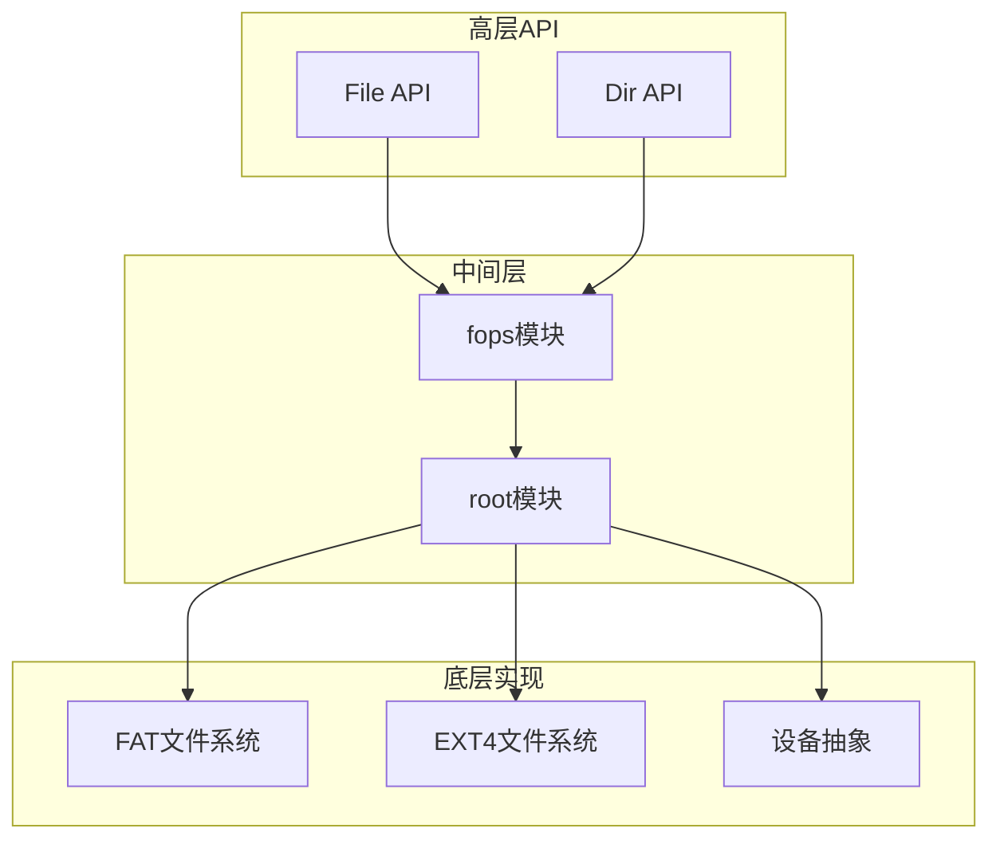
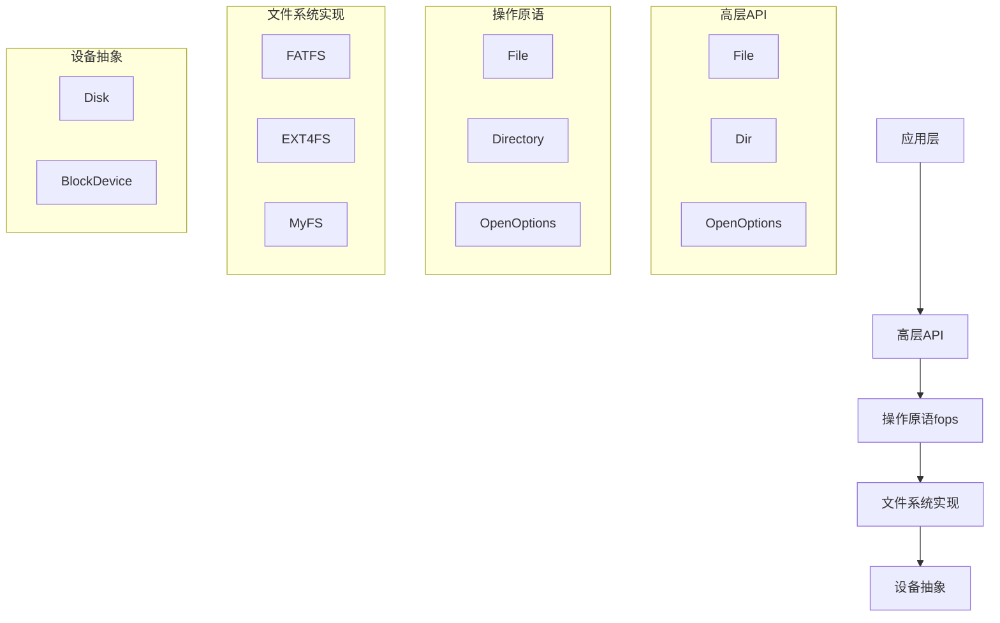
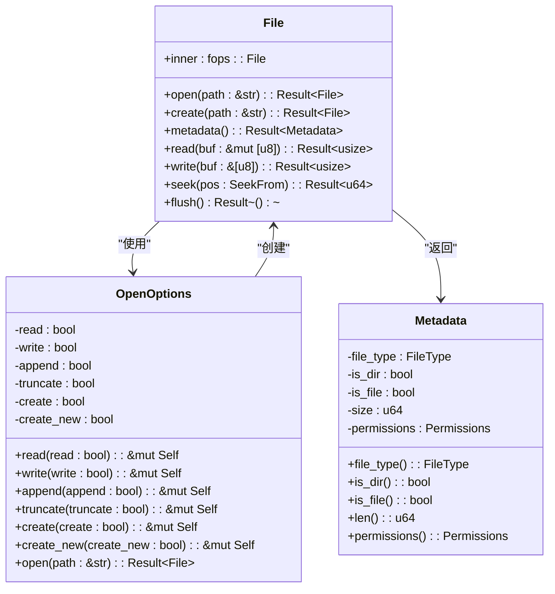
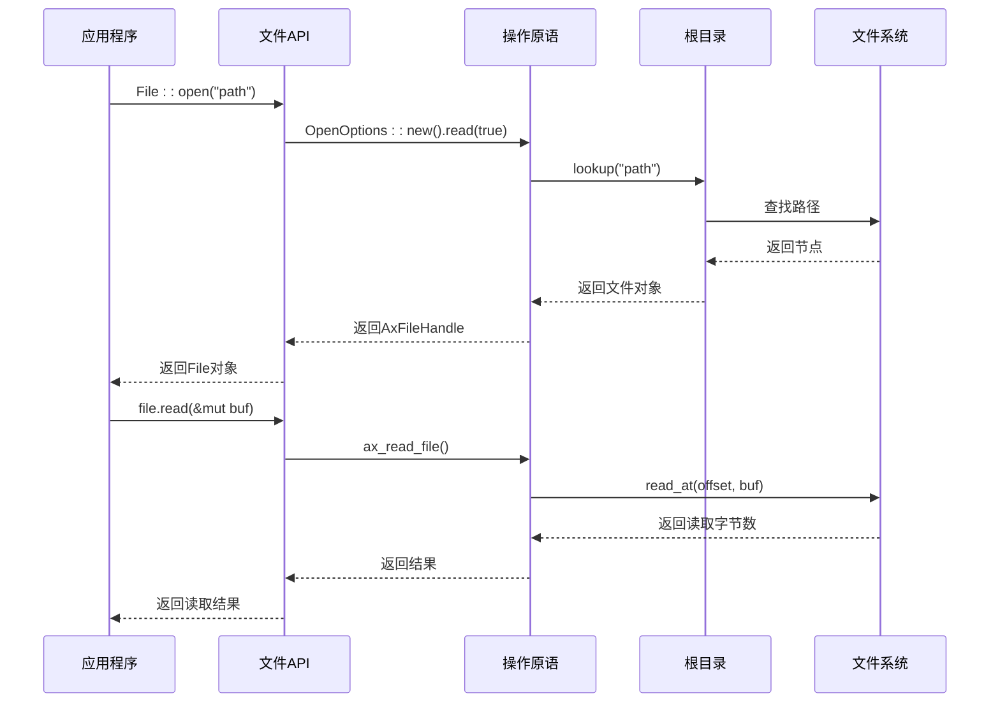
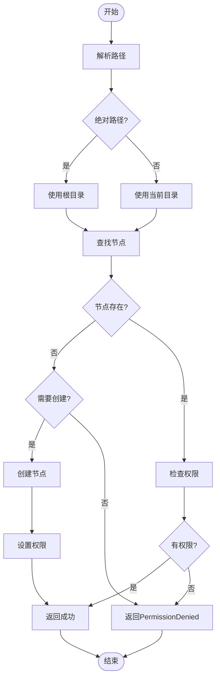
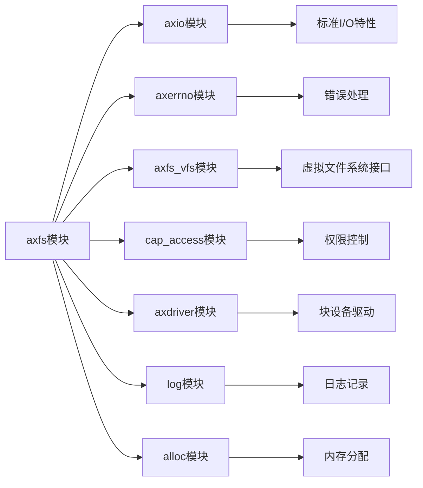

# 文件操作API

<cite>
**本文档中引用的文件**
- [file.rs](file://modules/axfs/src/api/file.rs)
- [fops.rs](file://modules/axfs/src/fops.rs)
- [dir.rs](file://modules/axfs/src/api/dir.rs)
- [root.rs](file://modules/axfs/src/root.rs)
- [fatfs.rs](file://modules/axfs/src/fs/fatfs.rs)
- [ext4fs.rs](file://modules/axfs/src/fs/ext4fs.rs)
- [dev.rs](file://modules/axfs/src/dev.rs)
- [lib.rs](file://modules/axfs/src/lib.rs)
- [fs.rs](file://api/arceos_api/src/imp/fs.rs)
</cite>

## 目录
1. [简介](#简介)
2. [项目结构](#项目结构)
3. [核心组件](#核心组件)
4. [架构概述](#架构概述)
5. [详细组件分析](#详细组件分析)
6. [依赖分析](#依赖分析)
7. [性能考虑](#性能考虑)
8. [故障排除指南](#故障排除指南)
9. [结论](#结论)

## 简介
本文件深入文档化了ArceOS操作系统中axfs模块的核心文件操作API。这些API提供了对文件系统进行创建、打开、读取、写入和关闭等基本操作的Rust接口，支持多种访问模式和权限控制机制。文档详细说明了每个函数的参数类型、返回值语义以及错误处理策略，并结合内核代码片段展示了如何在任务上下文中安全地进行文件I/O操作。

## 项目结构
axfs模块是Arceos操作系统中的核心文件系统组件，提供统一的文件系统操作接口。该模块采用分层架构设计，上层提供类似标准库的高级API，底层实现具体的文件系统操作。

**图示来源**
- [file.rs](file://modules/axfs/src/api/file.rs#L1-L194)
- [fops.rs](file://modules/axfs/src/fops.rs#L1-L419)
- [root.rs](file://modules/axfs/src/root.rs#L1-L318)

**章节来源**
- [lib.rs](file://modules/axfs/src/lib.rs#L1-L47)
- [mod.rs](file://modules/axfs/src/api/mod.rs#L1-L90)

## 核心组件
axfs模块的核心组件包括文件操作API、目录操作API、文件系统操作原语(fops)以及根目录管理。这些组件共同构成了一个完整的文件系统操作框架，支持多种文件系统类型和复杂的文件操作需求。

**章节来源**
- [file.rs](file://modules/axfs/src/api/file.rs#L1-L194)
- [dir.rs](file://modules/axfs/src/api/dir.rs#L1-L151)
- [fops.rs](file://modules/axfs/src/fops.rs#L1-L419)

## 架构概述
axfs模块采用分层架构设计，从上到下分为四个主要层次：高层API层、操作原语层、文件系统实现层和设备抽象层。这种设计实现了良好的关注点分离，使得不同层次可以独立演化和替换。

**图示来源**
- [lib.rs](file://modules/axfs/src/lib.rs#L1-L47)
- [fops.rs](file://modules/axfs/src/fops.rs#L1-L419)
- [root.rs](file://modules/axfs/src/root.rs#L1-L318)

## 详细组件分析

### 文件操作API分析
文件操作API提供了对文件进行各种操作的接口，包括创建、打开、读取、写入和关闭等基本操作。这些API的设计遵循Rust的惯用模式，使用Result类型进行错误处理，并提供了丰富的配置选项。

#### 对象导向组件：

**图示来源**
- [file.rs](file://modules/axfs/src/api/file.rs#L1-L194)
- [fops.rs](file://modules/axfs/src/fops.rs#L1-L419)

#### API/服务组件：

**图示来源**
- [fs.rs](file://api/arceos_api/src/imp/fs.rs#L1-L86)
- [fops.rs](file://modules/axfs/src/fops.rs#L1-L419)

### 复杂逻辑组件分析
文件系统的复杂逻辑主要体现在路径解析、权限检查和文件操作的原子性保证上。这些逻辑确保了文件系统操作的安全性和一致性。

#### 复杂逻辑组件：

**图示来源**
- [root.rs](file://modules/axfs/src/root.rs#L1-L318)
- [fops.rs](file://modules/axfs/src/fops.rs#L1-L419)

**章节来源**
- [file.rs](file://modules/axfs/src/api/file.rs#L1-L194)
- [fops.rs](file://modules/axfs/src/fops.rs#L1-L419)

## 依赖分析
axfs模块与其他系统组件有着紧密的依赖关系，这些依赖关系确保了文件系统能够正常工作并与操作系统其他部分协同。

**图示来源**
- [lib.rs](file://modules/axfs/src/lib.rs#L1-L47)
- [Cargo.toml](file://modules/axfs/Cargo.toml#L1-L20)

**章节来源**
- [fops.rs](file://modules/axfs/src/fops.rs#L1-L419)
- [dev.rs](file://modules/axfs/src/dev.rs#L1-L93)

## 性能考虑
axfs模块在设计时充分考虑了性能因素，通过多种优化策略来提高文件系统的整体性能。这些优化包括缓存机制、批量操作和异步I/O支持。

文件系统的性能主要受以下几个因素影响：磁盘I/O效率、内存使用情况、锁竞争程度和系统调用开销。axfs模块通过合理的数据结构设计和算法选择来最小化这些开销。

## 故障排除指南
当遇到文件系统相关的问题时，可以按照以下步骤进行排查：

1. **检查路径有效性**：确保文件路径格式正确，不存在非法字符
2. **验证权限设置**：确认当前用户有足够的权限执行所需操作
3. **检查文件系统状态**：确保文件系统已正确挂载且处于可用状态
4. **查看日志信息**：检查系统日志以获取更详细的错误信息
5. **验证资源限制**：确认没有达到文件描述符或存储空间的限制

常见的错误码及其含义：
- NotFound：指定的文件或目录不存在
- PermissionDenied：没有足够的权限执行操作
- InvalidInput：提供的输入参数无效
- AlreadyExists：尝试创建已存在的文件或目录
- IsADirectory：对目录执行了不适用的操作
- NotADirectory：对非目录执行了目录专用操作

**章节来源**
- [fops.rs](file://modules/axfs/src/fops.rs#L1-L419)
- [root.rs](file://modules/axfs/src/root.rs#L1-L318)

## 结论
axfs模块为ArceOS操作系统提供了一个功能完整、性能优良的文件系统解决方案。通过清晰的分层架构和模块化设计，该模块不仅实现了基本的文件操作功能，还支持多种文件系统类型和复杂的权限控制机制。

文件描述符与底层inode的映射关系由fops模块维护，生命周期管理通过Rust的所有权系统和Drop trait自动处理，有效避免了资源泄漏问题。当前实现主要支持同步读写操作，异步操作的支持可以通过Future和async/await模式进一步扩展。

总体而言，axfs模块的设计充分体现了Rust语言的安全性和并发优势，为构建可靠的操作系统组件提供了坚实的基础。