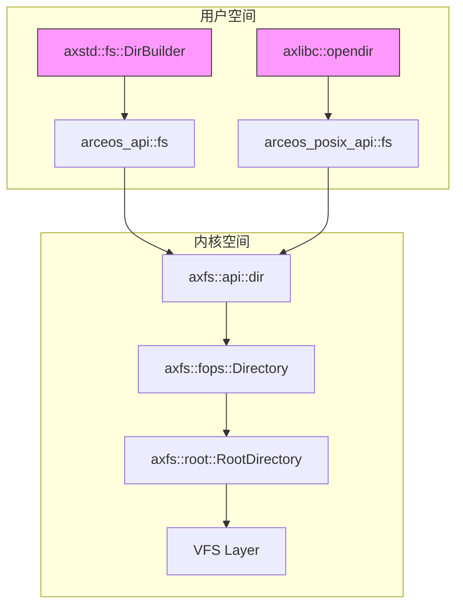
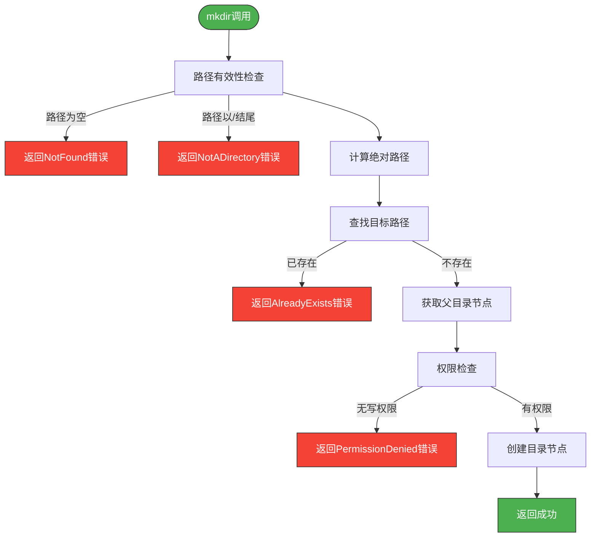
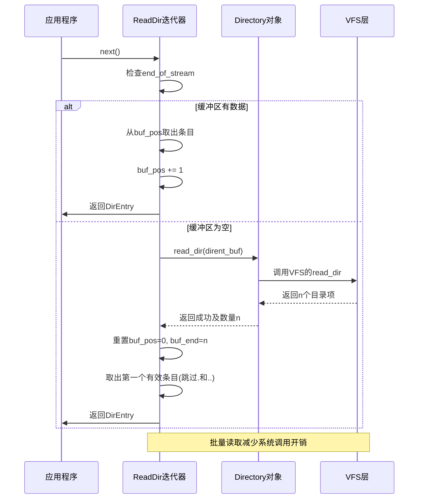
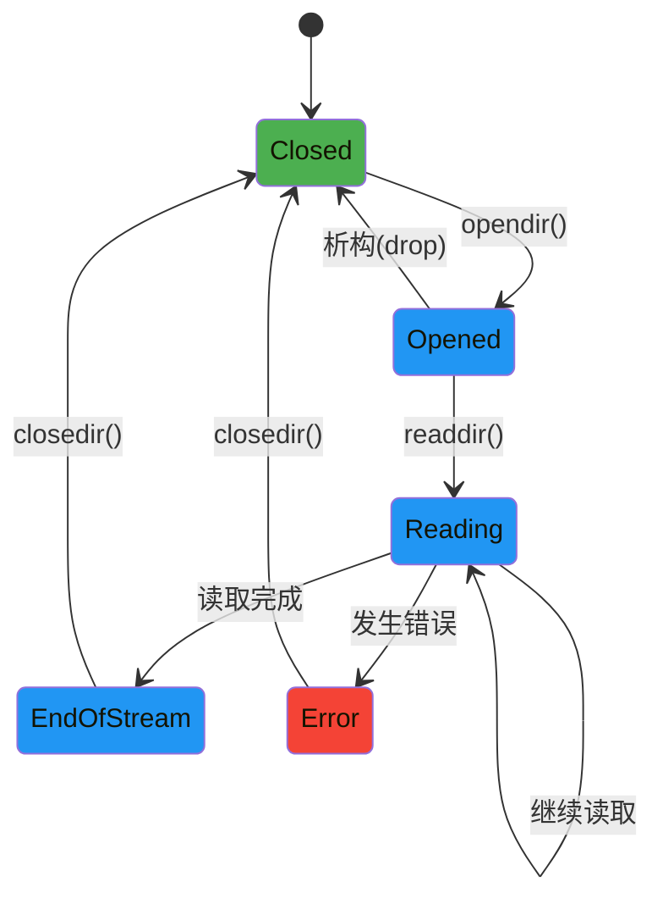

# 目录操作API

<cite>
**本文档引用的文件**
- [dir.rs](file://modules/axfs/src/api/dir.rs)
- [fops.rs](file://modules/axfs/src/fops.rs)
- [root.rs](file://modules/axfs/src/root.rs)
- [lib.rs](file://modules/axfs/src/lib.rs)
- [dir.rs](file://ulib/axstd/src/fs/dir.rs)
- [dirent.h](file://ulib/axlibc/include/dirent.h)
- [stat.h](file://ulib/axlibc/include/sys/stat.h)
</cite>

## 目录结构
1. [简介](#简介)
2. [核心组件](#核心组件)
3. [mkdir接口与路径解析](#mkdir接口与路径解析)
4. [readdir迭代器模式分析](#readdir迭代器模式分析)
5. [目录流状态机与资源管理](#目录流状态机与资源管理)
6. [符号链接处理现状](#符号链接处理现状)

## 简介
本技术文档全面阐述了ArceOS操作系统中axfs模块提供的目录管理接口。重点分析`mkdir`、`readdir`、`opendir`和`closedir`等核心功能的实现机制，为构建文件浏览器类应用提供深入的技术指导。文档详细描述了目录创建时的路径解析过程与权限设置策略，剖析了`readdir`函数采用的迭代器模式及其性能特征，并解释了目录项缓存（dcache）如何有效减少重复磁盘访问以提升遍历效率。

## 核心组件

该系统的核心目录操作功能分布在多个层次的模块中。在用户库层，`axstd`提供了面向Rust用户的高级抽象；在内核服务层，`axfs`模块实现了底层文件系统操作；而`axlibc`则为C语言应用提供了POSIX兼容的接口。

**Diagram sources**
- [dir.rs](file://ulib/axstd/src/fs/dir.rs#L0-L154)
- [dir.rs](file://modules/axfs/src/api/dir.rs#L0-L150)
- [fops.rs](file://modules/axfs/src/fops.rs#L256-L299)

**Section sources**
- [dir.rs](file://ulib/axstd/src/fs/dir.rs#L0-L154)
- [dir.rs](file://modules/axfs/src/api/dir.rs#L0-L150)
- [fops.rs](file://modules/axfs/src/fops.rs#L0-L418)

## mkdir接口与路径解析

`mkdir`系统调用通过`DirBuilder`构建器模式实现，支持非递归创建。其核心流程始于路径的绝对化处理，通过`absolute_path`函数将相对路径转换为从根目录开始的完整路径。随后，系统通过`lookup`函数检查目标路径是否存在，若存在则返回`AlreadyExists`错误。

权限控制是`mkdir`操作的关键环节。系统首先获取父目录节点的引用，然后验证调用者是否具有写入（WRITE）和执行（EXECUTE）权限。权限检查基于`cap_access`框架，将`OpenOptions`中的读写标志转换为能力位（Capability），并与目录节点的权限属性进行比对。只有当调用者的能力包含所需权限时，创建操作才会被允许。

值得注意的是，当前版本尚未实现递归创建（`recursive`）功能。当用户尝试使用`DirBuilder::recursive(true)`时，系统会返回`Unsupported`错误，提示“Recursive directory creation is not supported yet”。

**Diagram sources**
- [root.rs](file://modules/axfs/src/root.rs#L270-L280)
- [fops.rs](file://modules/axfs/src/fops.rs#L256-L299)
- [dir.rs](file://modules/axfs/src/api/dir.rs#L100-L120)

**Section sources**
- [root.rs](file://modules/axfs/src/root.rs#L270-L280)
- [fops.rs](file://modules/axfs/src/fops.rs#L256-L299)
- [dir.rs](file://modules/axfs/src/api/dir.rs#L100-L120)

## readdir迭代器模式分析

`readdir`功能通过Rust的`Iterator`特质实现了一个高效的迭代器模式。`ReadDir`结构体封装了目录遍历的状态，包括当前缓冲区位置(`buf_pos`)、缓冲区末尾(`buf_end`)以及一个固定大小的目录项缓冲区(`dirent_buf`)。

该实现采用了批量读取优化策略。每次调用`next()`方法时，如果本地缓冲区已耗尽，则会触发一次`read_dir`系统调用，一次性从VFS层读取最多31个目录项到`dirent_buf`中。这种设计显著减少了系统调用的次数，从而提升了遍历大型目录的性能。

目录项缓存（dcache）机制在此过程中发挥了关键作用。虽然代码中未显式命名"dcache"，但`dirent_buf`数组本质上就是一个内存中的目录项缓存。它将多次磁盘I/O合并为一次，极大地降低了访问延迟。此外，迭代器会自动过滤掉`.`和`..`这两个特殊条目，简化了上层应用的逻辑。

**Diagram sources**
- [dir.rs](file://modules/axfs/src/api/dir.rs#L50-L95)
- [fops.rs](file://modules/axfs/src/fops.rs#L290-L300)
- [dir.rs](file://ulib/axstd/src/fs/dir.rs#L50-L95)

**Section sources**
- [dir.rs](file://modules/axfs/src/api/dir.rs#L50-L95)
- [fops.rs](file://modules/axfs/src/fops.rs#L290-L300)

## 目录流状态机与资源管理

`Directory`对象代表一个打开的目录流，其内部状态由`entry_idx`游标精确控制。这个游标记录了下一次`read_dir`调用应该从哪个索引开始读取，形成了一个简单的状态机，确保了遍历的连续性和一致性。

资源管理遵循RAII（Resource Acquisition Is Initialization）原则。`Directory`结构体实现了`Drop`特质，当其实例离开作用域时，析构函数会自动调用`release()`方法，安全地释放底层的VFS节点引用。这保证了即使在发生异常的情况下，文件描述符也不会泄露。

`opendir`和`closedir`的C语言接口目前处于待实现状态（标记为`unimplemented()`）。然而，其设计蓝图清晰可见：`opendir`会分配一个包含文件描述符（fd）的`DIR`结构体，而`closedir`则负责关闭该描述符并释放内存。这种设计与POSIX标准完全兼容。

**Diagram sources**
- [fops.rs](file://modules/axfs/src/fops.rs#L256-L299)
- [dirent.c](file://ulib/axlibc/c/dirent.c#L11-L16)
- [dirent.h](file://ulib/axlibc/include/dirent.h#L0-L45)

**Section sources**
- [fops.rs](file://modules/axfs/src/fops.rs#L256-L299)
- [dirent.c](file://ulib/axlibc/c/dirent.c#L11-L16)

## 符号链接处理现状

根据现有代码分析，当前的目录管理接口对符号链接（Symbolic Link）的支持尚不完善。在路径解析的核心函数`lookup`中，没有发现对符号链接进行特殊处理的逻辑，如递归解析或循环检测。这意味着所有路径都被视为硬链接或普通目录。

未来扩展方向应着重于增强VFS层对符号链接的原生支持。建议在`VfsNodeOps` trait中增加`is_symlink()`和`read_link()`方法，并在`lookup`函数中加入对符号链接的识别与跳转逻辑。同时，`DirEntry`结构体需要能够正确报告`d_type`为`DT_LNK`，以便上层应用可以区分符号链接与其他文件类型。

**Section sources**
- [root.rs](file://modules/axfs/src/root.rs#L200-L220)
- [fops.rs](file://modules/axfs/src/fops.rs#L0-L418)