# 文件系统 (axfs)

<cite>
**本文档引用的文件**
- [lib.rs](file://modules/axfs/src/lib.rs)
- [root.rs](file://modules/axfs/src/root.rs)
- [fops.rs](file://modules/axfs/src/fops.rs)
- [ext4fs.rs](file://modules/axfs/src/fs/ext4fs.rs)
- [fatfs.rs](file://modules/axfs/src/fs/fatfs.rs)
- [mounts.rs](file://modules/axfs/src/mounts.rs)
- [api/file.rs](file://modules/axfs/src/api/file.rs)
</cite>

## 目录
1. [介绍](#介绍)
2. [项目结构](#项目结构)
3. [核心组件](#核心组件)
4. [架构概述](#架构概述)
5. [详细组件分析](#详细组件分析)
6. [依赖分析](#依赖分析)
7. [性能考虑](#性能考虑)
8. [故障排除指南](#故障排除指南)
9. [结论](#结论)

## 介绍
ArceOS 的 axfs 模块提供了一个统一的文件系统操作接口，支持多种文件系统类型。该模块通过虚拟文件系统（VFS）抽象层实现了对 FAT、EXT4 和 RAMFS 等不同文件系统的统一管理，并提供了挂载点注册、路径解析和系统调用传递等核心功能。

## 项目结构
axfs 模块采用分层设计，主要包含以下目录结构：
- `api`：提供高层文件系统操作接口
- `fs`：实现具体的文件系统类型（FAT、EXT4、RAMFS）
- `dev`：设备驱动相关代码
- `fops`：底层文件操作实现
- `mounts`：挂载点管理
- `root`：根目录和全局文件系统管理

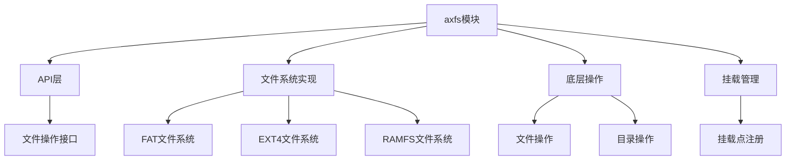

**Diagram sources**
- [lib.rs](file://modules/axfs/src/lib.rs)
- [root.rs](file://modules/axfs/src/root.rs)

**Section sources**
- [lib.rs](file://modules/axfs/src/lib.rs)
- [root.rs](file://modules/axfs/src/root.rs)

## 核心组件
axfs 模块的核心组件包括 VFS 抽象层、具体文件系统实现和挂载管理系统。VFS 层定义了统一的 inode 操作函数表（file_operations）和超级块管理机制，为上层应用提供了统一的文件系统接口。

**Section sources**
- [fops.rs](file://modules/axfs/src/fops.rs)
- [root.rs](file://modules/axfs/src/root.rs)

## 架构概述
axfs 模块采用虚拟文件系统（VFS）架构，通过抽象层统一管理多种文件系统类型。系统启动时初始化主文件系统，并在指定路径挂载其他文件系统。

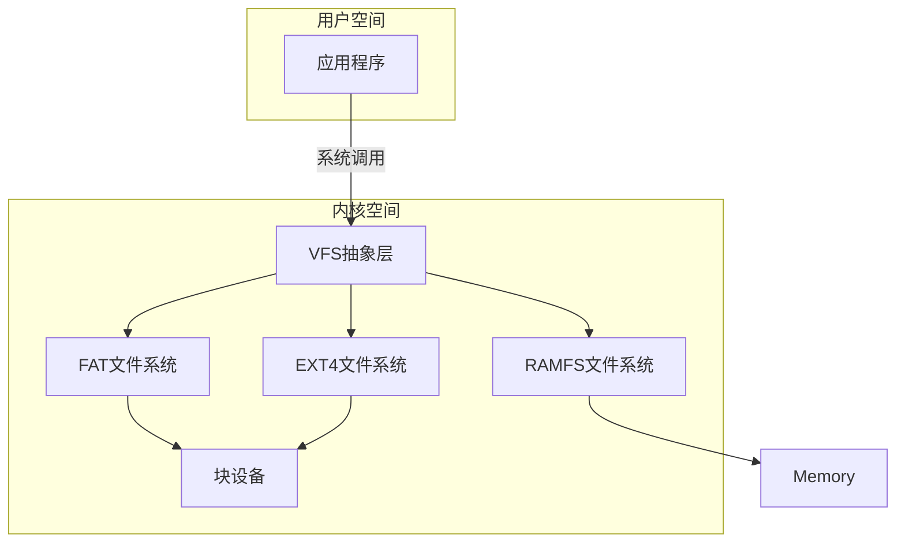

**Diagram sources**
- [lib.rs](file://modules/axfs/src/lib.rs)
- [root.rs](file://modules/axfs/src/root.rs)

## 详细组件分析

### 支持的文件系统类型
axfs 模块支持多种文件系统类型，每种都有其特定的适用场景：

#### FAT文件系统
FAT 文件系统适用于嵌入式设备和可移动存储介质。它具有良好的兼容性和简单的结构，适合资源受限的环境。

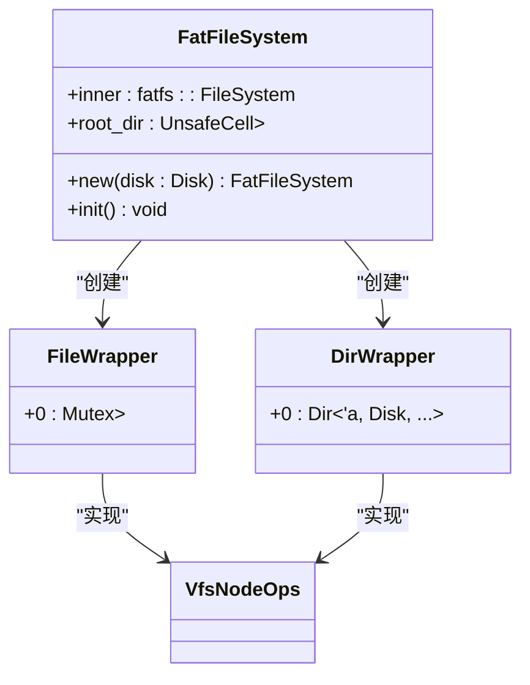

**Diagram sources**
- [fatfs.rs](file://modules/axfs/src/fs/fatfs.rs)

**Section sources**
- [fatfs.rs](file://modules/axfs/src/fs/fatfs.rs)

#### EXT4文件系统
EXT4 文件系统适用于需要高性能和数据完整性的场景。它支持日志功能，能够有效防止数据损坏。

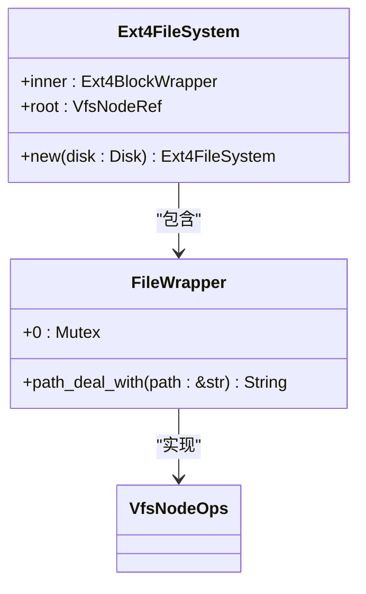

**Diagram sources**
- [ext4fs.rs](file://modules/axfs/src/fs/ext4fs.rs)

**Section sources**
- [ext4fs.rs](file://modules/axfs/src/fs/ext4fs.rs)

#### RAMFS文件系统
RAMFS 是基于内存的文件系统，适用于临时文件存储和高速缓存场景。它具有极快的读写速度，但数据在系统重启后会丢失。

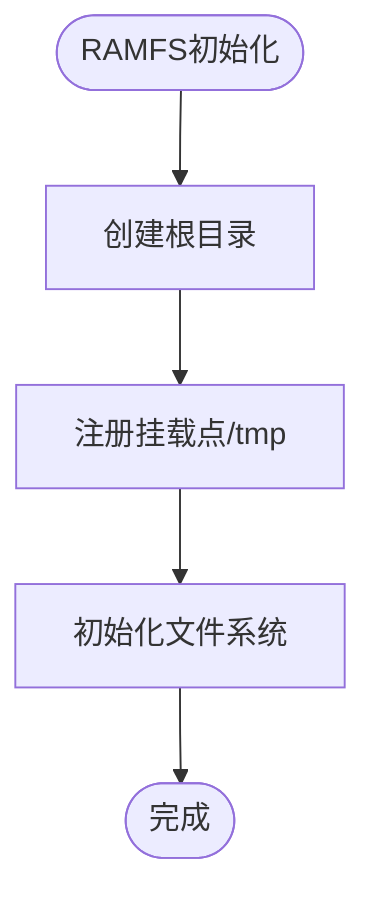

**Diagram sources**
- [mounts.rs](file://modules/axfs/src/mounts.rs)

**Section sources**
- [mounts.rs](file://modules/axfs/src/mounts.rs)

### VFS抽象层设计
VFS 抽象层是 axfs 模块的核心，它通过统一的接口管理不同类型的文件系统。

#### inode操作函数表
inode 操作函数表（file_operations）定义了文件系统的基本操作接口：

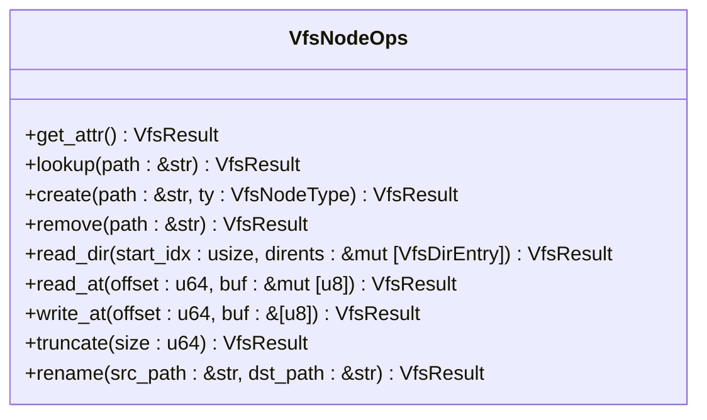

**Diagram sources**
- [fops.rs](file://modules/axfs/src/fops.rs)

**Section sources**
- [fops.rs](file://modules/axfs/src/fops.rs)

#### 超级块管理机制
超级块管理机制负责跟踪文件系统的全局状态信息：

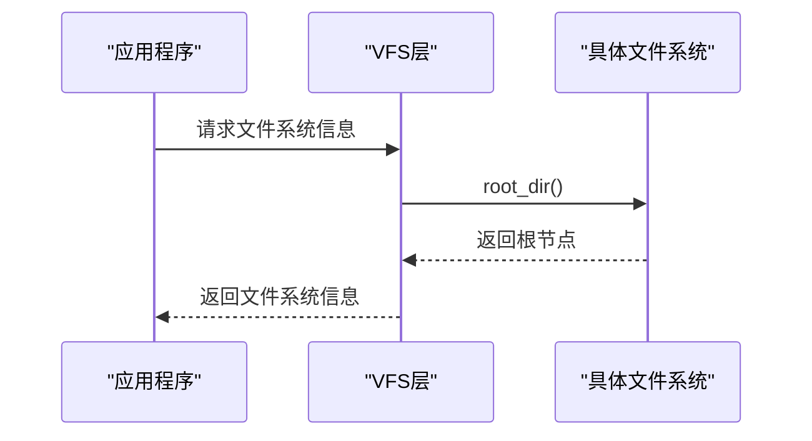

**Diagram sources**
- [root.rs](file://modules/axfs/src/root.rs)

**Section sources**
- [root.rs](file://modules/axfs/src/root.rs)

### 挂载点注册流程
挂载点注册流程确保了多个文件系统可以无缝集成到统一的命名空间中：

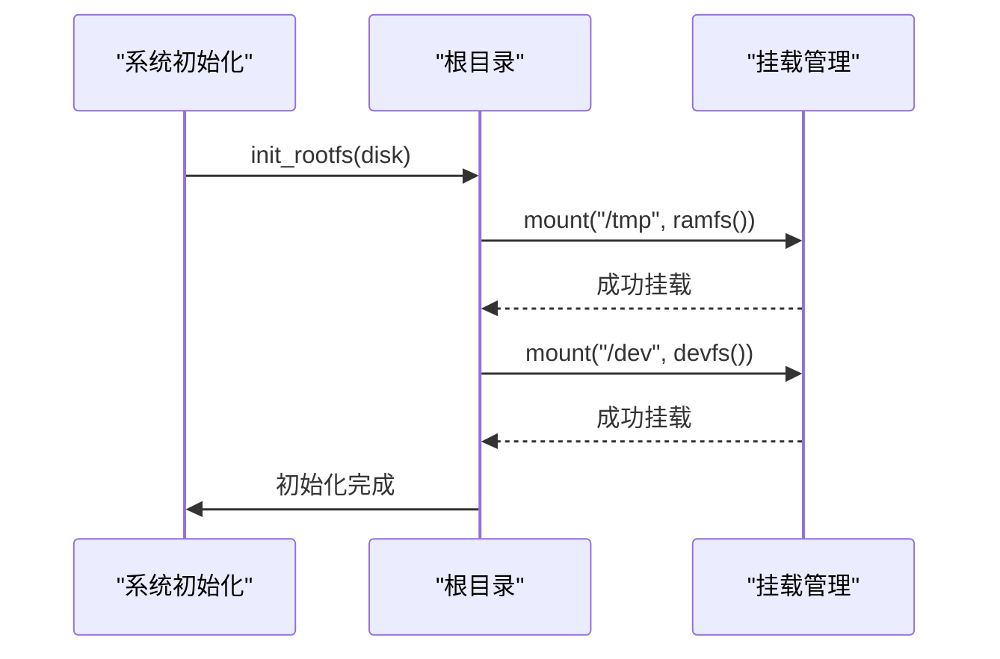

**Diagram sources**
- [root.rs](file://modules/axfs/src/root.rs)
- [mounts.rs](file://modules/axfs/src/mounts.rs)

**Section sources**
- [root.rs](file://modules/axfs/src/root.rs)
- [mounts.rs](file://modules/axfs/src/mounts.rs)

### 跨文件系统路径解析
跨文件系统路径解析逻辑处理了复杂的路径查找需求：

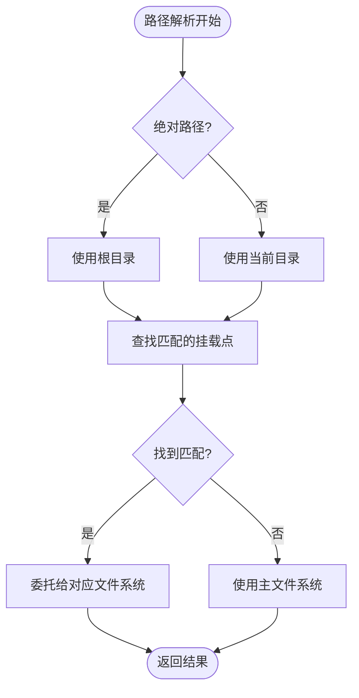

**Diagram sources**
- [root.rs](file://modules/axfs/src/root.rs)

**Section sources**
- [root.rs](file://modules/axfs/src/root.rs)

### 系统调用传递路径
系统调用在内核中的传递路径展示了从用户空间到设备的完整流程：

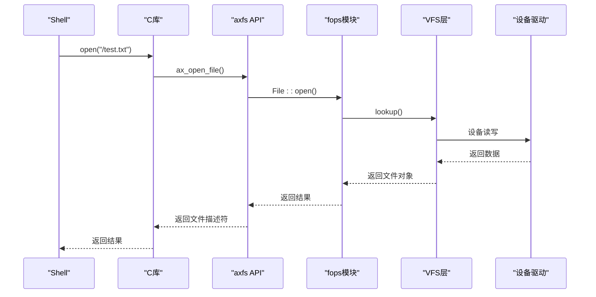

**Diagram sources**
- [api/file.rs](file://modules/axfs/src/api/file.rs)
- [fops.rs](file://modules/axfs/src/fops.rs)

**Section sources**
- [api/file.rs](file://modules/axfs/src/api/file.rs)
- [fops.rs](file://modules/axfs/src/fops.rs)

### 缓存一致性与数据完整性
缓存一致性和日志写入模式保障了数据的完整性和可靠性：

#### 缓存一致性维护策略
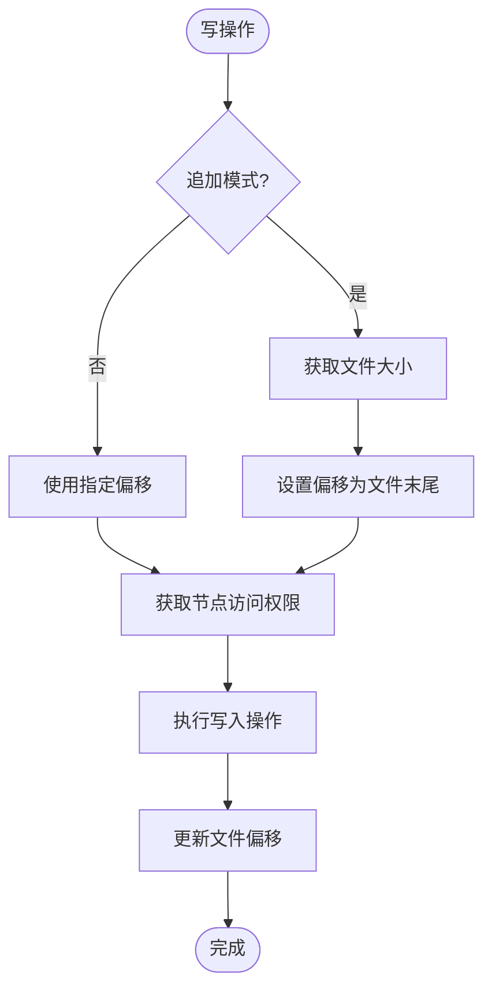

**Diagram sources**
- [fops.rs](file://modules/axfs/src/fops.rs)

**Section sources**
- [fops.rs](file://modules/axfs/src/fops.rs)

#### 日志写入模式
EXT4 文件系统通过日志机制确保数据完整性，即使在系统崩溃的情况下也能恢复到一致状态。

## 依赖分析
axfs 模块与其他组件存在紧密的依赖关系：

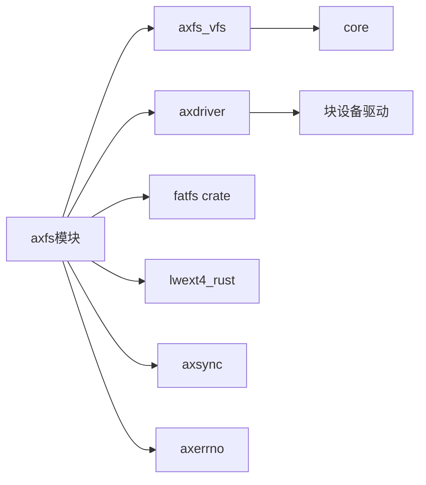

**Diagram sources**
- [Cargo.toml](file://modules/axfs/Cargo.toml)

**Section sources**
- [Cargo.toml](file://modules/axfs/Cargo.toml)

## 性能考虑
在嵌入式设备上使用 axfs 模块时需要注意磨损均衡问题。对于频繁写入的场景，建议使用支持磨损均衡的存储介质，并合理配置文件系统的写入策略。

## 故障排除指南
常见问题及解决方案：
- **挂载失败**：检查设备是否正确初始化，确认挂载路径的有效性
- **文件访问权限错误**：验证文件权限设置，确保有足够的访问权限
- **路径解析失败**：检查路径格式是否正确，确认是否存在对应的挂载点

**Section sources**
- [root.rs](file://modules/axfs/src/root.rs)
- [fops.rs](file://modules/axfs/src/fops.rs)

## 结论
axfs 模块通过精心设计的 VFS 抽象层和多种文件系统实现，为 ArceOS 提供了强大而灵活的文件系统支持。其模块化的设计使得可以轻松扩展新的文件系统类型，同时保持了接口的一致性和易用性。