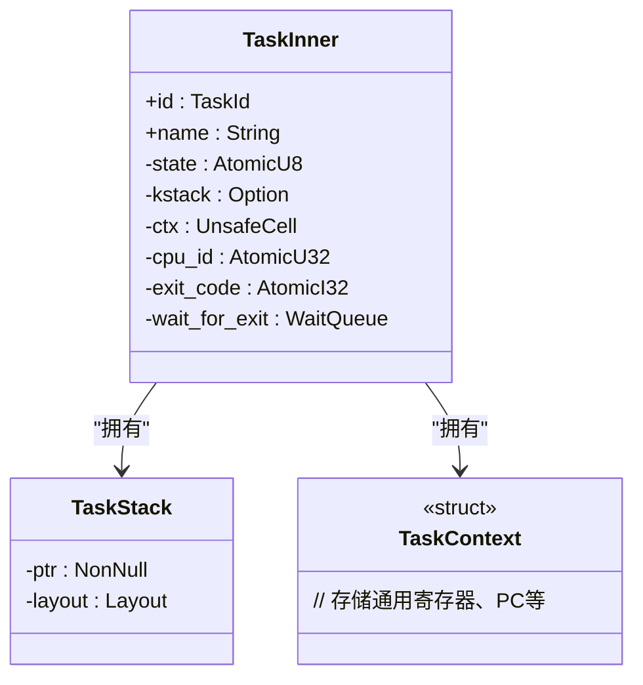
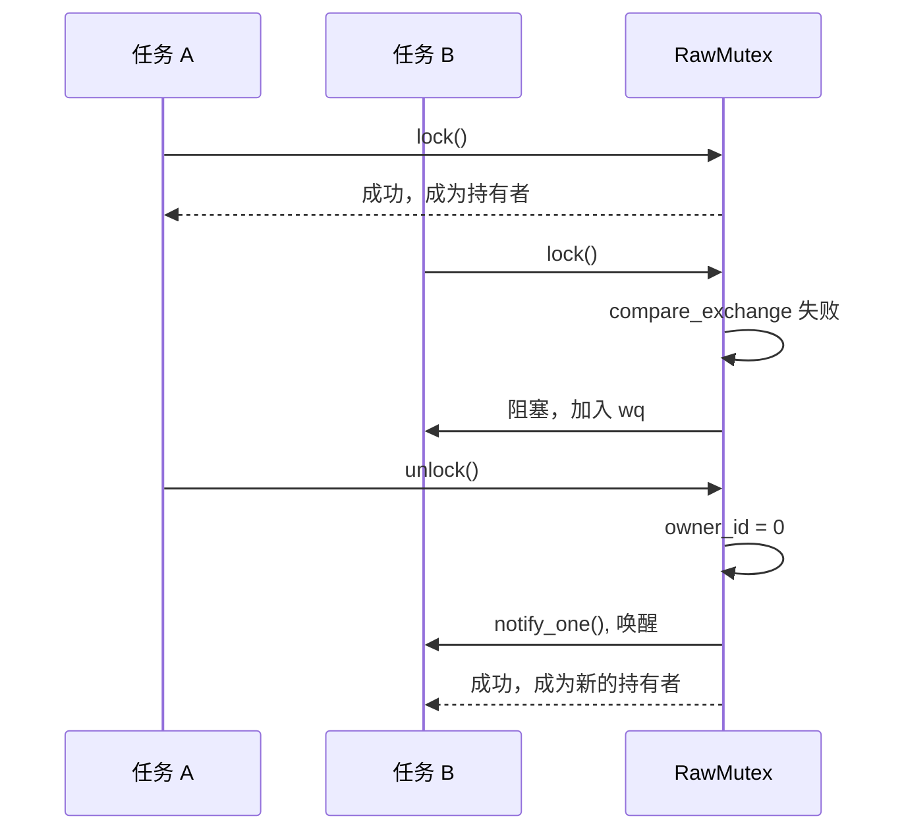
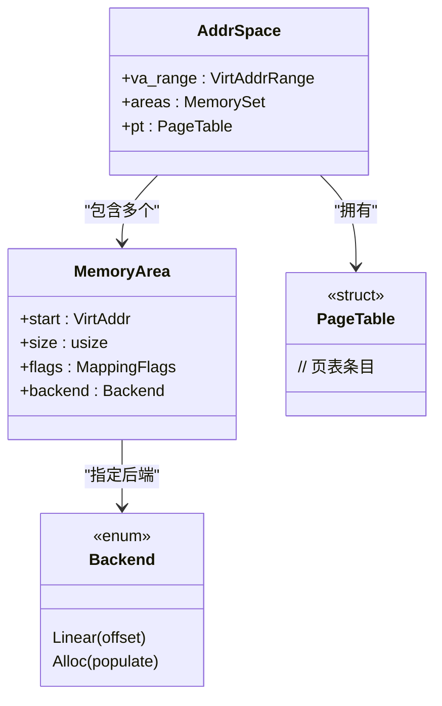
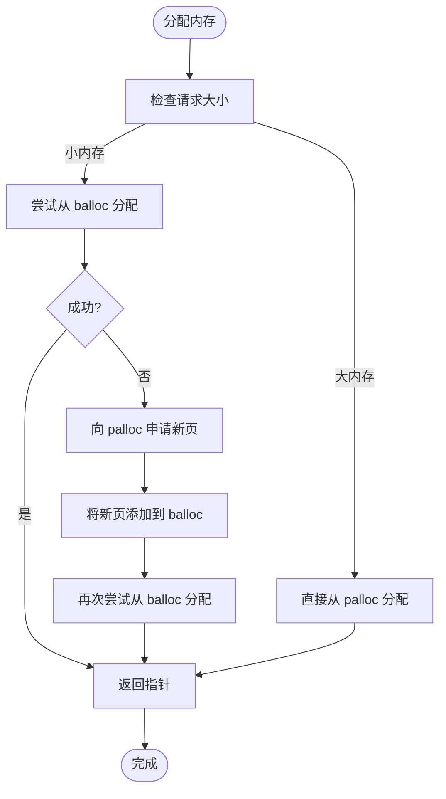

# 核心模块详解

<cite>
**本文档中引用的文件**
- [task.rs](file://modules/axtask/src/task.rs)
- [aspace.rs](file://modules/axmm/src/aspace.rs)
- [lib.rs](file://modules/axmm/src/lib.rs)
- [page.rs](file://modules/axalloc/src/page.rs)
- [lib.rs](file://modules/axalloc/src/lib.rs)
- [fops.rs](file://modules/axfs/src/fops.rs)
- [lib.rs](file://modules/axfs/src/lib.rs)
- [lib.rs](file://modules/axnet/src/lib.rs)
- [mod.rs](file://modules/axnet/src/smoltcp_impl/mod.rs)
- [mutex.rs](file://modules/axsync/src/mutex.rs)
- [lib.rs](file://modules/axsync/src/lib.rs)
- [api.rs](file://modules/axtask/src/api.rs)
</cite>

## 目录
1. [引言](#引言)
2. [任务调度模块 (axtask)](#任务调度模块-axtask)
3. [同步原语模块 (axsync)](#同步原语模块-axsync)
4. [内存管理模块 (axmm)](#内存管理模块-axmm)
5. [分配器模块 (axalloc)](#分配器模块-axalloc)
6. [文件系统模块 (axfs)](#文件系统模块-axfs)
7. [网络栈模块 (axnet)](#网络栈模块-axnet)

## 引言
Arceos 是一个微内核操作系统，其核心功能由一系列独立的 Rust 模块构成。本文档旨在深入剖析这些核心模块的实现细节，包括 `axtask` 任务调度、`axsync` 同步原语、`axmm` 内存管理、`axalloc` 分配器、`axfs` 文件系统以及 `axnet` 网络栈。我们将详细阐述每个模块的设计目标、内部架构、关键数据结构和核心算法，并分析其公共接口的使用方式，为开发者提供一份全面的技术参考。

## 任务调度模块 (axtask)

该模块是 Arceos 的多任务处理核心，负责任务的创建、调度、状态管理和生命周期控制。

### 设计目标与架构
`axtask` 模块的设计目标是提供一个灵活且可配置的任务管理系统。它通过 Cargo 特性（如 `sched-fifo`, `sched-rr`, `sched-cfs`）支持多种调度策略，允许用户根据需求选择最适合的调度器。模块的核心是一个运行队列（run queue），所有就绪任务都存放于此，由调度器从中选择下一个执行的任务。

### 关键数据结构：任务控制块 (TCB)
任务的核心数据结构是 `TaskInner`，它充当了传统意义上的任务控制块（TCB）。其主要字段包括：
- **`id`**: 唯一的任务标识符 (`TaskId`)。
- **`name`**: 任务名称，用于调试。
- **`state`**: 任务当前状态（运行、就绪、阻塞、已退出）。
- **`kstack`**: 任务的内核栈，用于存储函数调用信息。
- **`ctx`**: 任务上下文 (`TaskContext`)，保存 CPU 寄存器状态，是任务切换的基础。
- **`cpu_id` 和 `on_cpu`**: 用于 SMP（对称多处理）环境下的 CPU 亲和性和迁移。
- **`wait_for_exit`**: 一个等待队列，供其他任务等待此任务结束。



**图源**
- [task.rs](file://modules/axtask/src/task.rs#L100-L300)

### 核心算法与公共接口
模块的核心算法围绕任务的生命周期展开：
1.  **任务创建**: 通过 `spawn` 或 `spawn_raw` 函数创建新任务。`spawn_task` 将 `TaskInner` 实例包装成 `Arc<AxTask>` 并加入到合适的运行队列中。
2.  **任务调度**: 调度器（如 FIFO, RR）从运行队列中选择最高优先级或最符合策略的任务。`yield_now()` 让出 CPU，`sleep()` 和 `sleep_until()` 使任务进入阻塞状态并设置唤醒时间。
3.  **任务切换**: 当发生调度时，会保存当前任务的 `ctx`，并加载下一个任务的 `ctx`，从而恢复其执行。
4.  **任务终止**: `exit()` 函数将当前任务的状态设为“已退出”，并通知所有等待它的任务。

**公共接口示例**:
- `spawn(|| { println!("Hello from a new task!"); });`: 创建并启动一个新任务。
- `set_current_affinity(AxCpuMask::from_cpu(1));`: 设置当前任务只能在 CPU 1 上运行。
- `current().join();`: 等待当前任务所创建的子任务结束。

**性能优化点与限制**:
- **优化点**: 支持抢占式调度 (`preempt` 特性)，确保高优先级任务能及时响应。CPU 亲和性可以减少缓存失效。
- **限制**: 不同调度器的特性决定了其适用场景，例如 CFS 更公平但开销略大，FIFO 则更简单直接。

**本节来源**
- [task.rs](file://modules/axtask/src/task.rs)
- [api.rs](file://modules/axtask/src/api.rs)

## 同步原语模块 (axsync)

该模块为多任务环境提供了基本的同步机制，确保共享资源的安全访问。

### 设计目标与架构
`axsync` 模块的主要目标是提供一个简单的互斥锁（Mutex）。当 `multitask` 特性启用时，其实现为一个“睡眠锁”（sleeping mutex），即无法获取锁的任务会被阻塞并放入等待队列，直到持有锁的任务释放它。这比自旋锁更高效，因为它不会浪费 CPU 时间。

### 关键数据结构与核心算法
核心是 `RawMutex` 结构体，它包含：
- **`wq`**: 一个 `WaitQueue`，用于存放所有因等待此锁而被阻塞的任务。
- **`owner_id`**: 一个原子变量，存储当前持有锁的任务 ID。

**核心算法**:
- **加锁 (`lock`)**: 使用 `compare_exchange_weak` 原子操作尝试将 `owner_id` 从 0（未锁定）改为当前任务 ID。如果失败（说明已被占用），则调用 `wq.wait_until()` 将当前任务阻塞，直到锁被释放。
- **解锁 (`unlock`)**: 使用 `swap` 原子操作将 `owner_id` 重置为 0，并调用 `wq.notify_one()` 唤醒一个等待中的任务。



**图源**
- [mutex.rs](file://modules/axsync/src/mutex.rs#L10-L100)

### 公共接口
模块导出了标准的 `Mutex<T>` 和 `MutexGuard<'a, T>` 类型，使用方式与其他 Rust 库一致：
```rust
let mutex = axsync::Mutex::new(0);
{
    let mut data = mutex.lock();
    *data += 1;
} // 锁在此处自动释放
```

**性能优化点与限制**:
- **优化点**: “睡眠”机制避免了忙等，节省了 CPU 资源。
- **限制**: 由于涉及任务阻塞和唤醒，其开销比自旋锁大。不支持递归锁（同一个任务不能多次加锁）。

**本节来源**
- [mutex.rs](file://modules/axsync/src/mutex.rs)
- [lib.rs](file://modules/axsync/src/lib.rs)

## 内存管理模块 (axmm)

该模块负责虚拟内存地址空间的管理，为内核和用户进程提供内存映射服务。

### 设计目标与架构
`axmm` 模块的目标是抽象底层分页机制，提供统一的地址空间（`AddrSpace`）管理接口。它利用 `memory_set` crate 来管理内存区域（`MemoryArea`），并通过 `PageTable` 进行实际的页表操作。

### 关键数据结构：虚拟地址空间 (VAS)
`AddrSpace` 是核心数据结构，代表一个独立的虚拟地址空间。
- **`va_range`**: 定义了该地址空间的起始和结束虚拟地址。
- **`areas`**: 一个 `MemorySet<Backend>`，记录了所有已映射的内存区域及其后端类型。
- **`pt`**: 该地址空间的根页表。



**图源**
- [aspace.rs](file://modules/axmm/src/aspace.rs#L20-L50)

### 核心算法与公共接口
- **创建地址空间**: `new_kernel_aspace()` 初始化内核地址空间，将物理内存区域线性映射到虚拟地址。`new_user_aspace()` 为用户进程创建地址空间。
- **内存映射**: 
  - `map_linear()`: 将一段物理内存线性映射到虚拟地址，常用于设备 I/O 映射。
  - `map_alloc()`: 为动态分配的内存（如堆）创建映射，按需分配物理页。
- **页面错误处理**: `handle_page_fault()` 在发生缺页异常时被调用，它会查询对应的 `MemoryArea`，并根据其 `Backend` 类型（如 `Alloc`）来分配物理页并建立映射。

**公共接口示例**:
- `iomap(phys_addr, size)`: 将设备物理地址映射到内核虚拟地址，返回虚拟地址。
- `kernel_aspace().lock().read(vaddr, buf)`: 从指定的虚拟地址读取数据。

**性能优化点与限制**:
- **优化点**: 按需分页（demand paging）减少了物理内存的占用。
- **限制**: 目前的实现可能没有复杂的 TLB 刷新优化，在频繁的地址空间切换时可能存在性能瓶颈。

**本节来源**
- [aspace.rs](file://modules/axmm/src/aspace.rs)
- [lib.rs](file://modules/axmm/src/lib.rs)

## 分配器模块 (axalloc)

该模块实现了系统的全局内存分配器，为 `malloc` 等操作提供底层支持。

### 设计目标与架构
`axalloc` 模块的目标是提供一个高效的、两级的内存分配器。它结合了一个字节分配器（ByteAllocator）和一个页分配器（PageAllocator），以应对不同大小的内存请求。

### 关键数据结构与核心算法
- **`GlobalAllocator`**: 全局分配器的主结构。
  - **`balloc`**: 字节分配器（如 TLSF, Buddy），用于分配小块内存。
  - **`palloc`**: 页分配器（`BitmapPageAllocator`），管理以页（4KB）为单位的大块内存。

**核心算法**:
- **分配 (`alloc`)**: 对于小内存请求，首先尝试从 `balloc` 分配。如果 `balloc` 内存不足，则向 `palloc` 申请若干页，然后将这些页交给 `balloc` 管理，再进行分配。
- **释放 (`dealloc`)**: 将内存块返还给 `balloc`。



**图源**
- [lib.rs](file://modules/axalloc/src/lib.rs#L50-L150)

### 公共接口
模块定义了 `#[global_allocator]