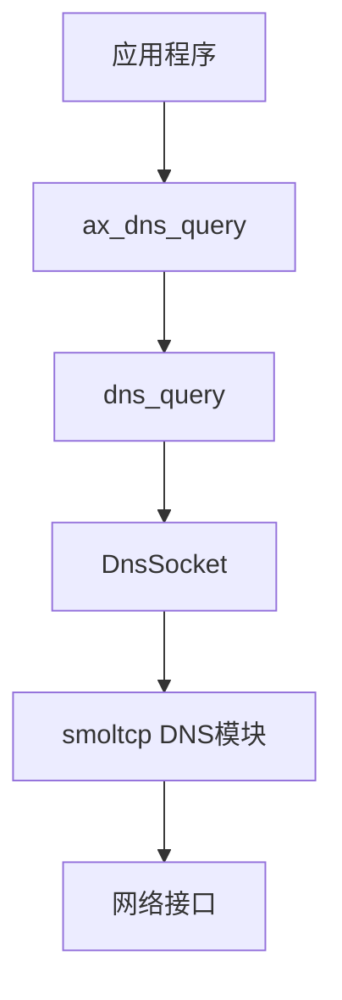
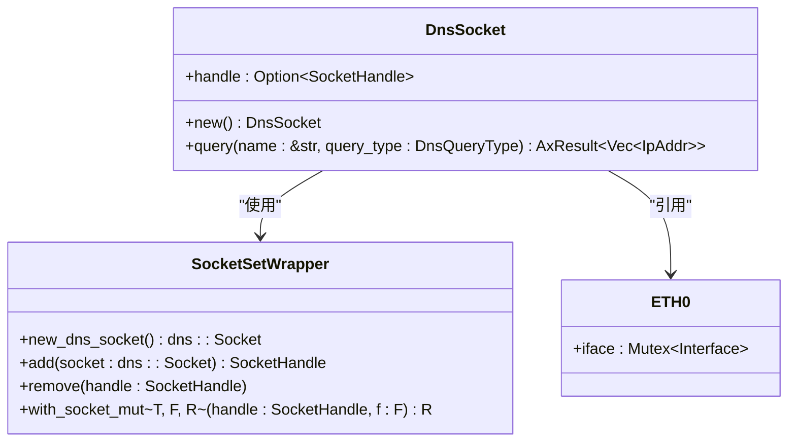
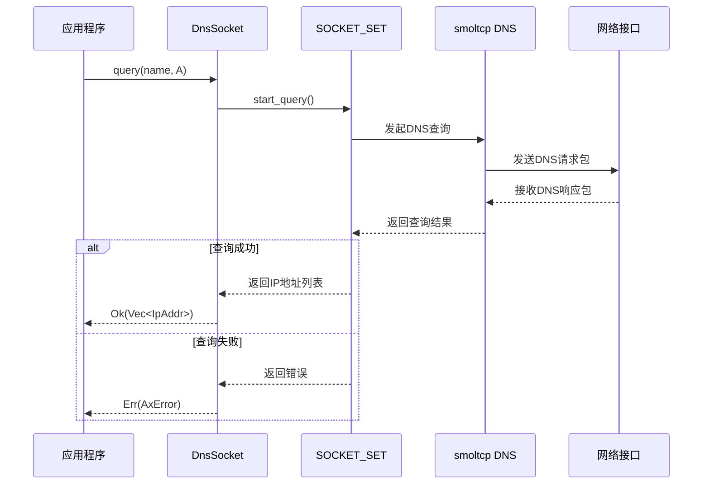
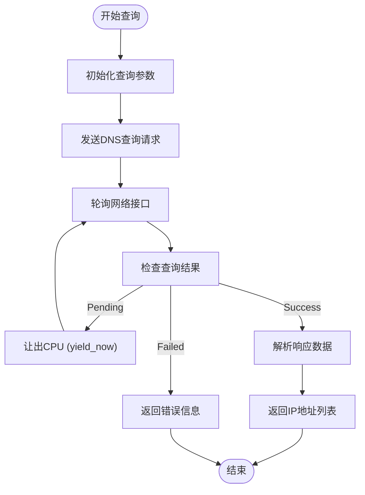
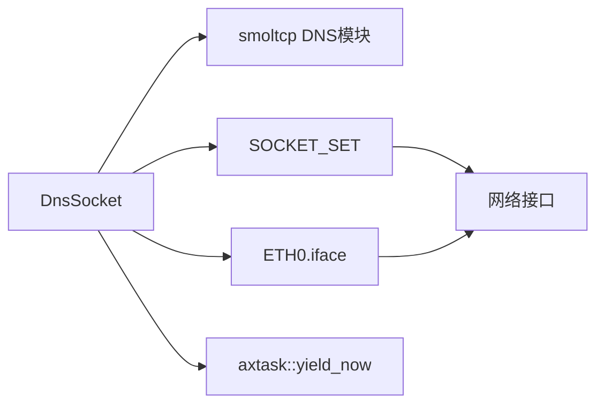

# DNS客户端

<cite>
**本文档引用的文件**
- [dns.rs](file://modules/axnet/src/smoltcp_impl/dns.rs)
- [net.rs](file://api/arceos_api/src/imp/net.rs)
- [net.rs](file://api/arceos_posix_api/src/imp/net.rs)
- [socket_addr.rs](file://ulib/axstd/src/net/socket_addr.rs)
</cite>

## 目录
1. [简介](#简介)
2. [核心组件](#核心组件)
3. [架构概述](#架构概述)
4. [详细组件分析](#详细组件分析)
5. [依赖分析](#依赖分析)
6. [性能考虑](#性能考虑)
7. [故障排除指南](#故障排除指南)
8. [结论](#结论)

## 简介
本文档全面解析ArceOS中内置DNS客户端的设计与实现。重点说明DNS查询请求的构造过程、事务ID管理、超时重试机制及响应解析逻辑。展示如何通过域名解析获取IP地址，并集成至TCP/UDP应用中。文档包含异步解析接口的使用模式，避免阻塞主线程的最佳实践。同时指出当前实现仅支持A记录查询的局限性，并指导开发者扩展以支持AAAA或SRV记录类型。

## 核心组件
DNS客户端的核心功能由`DnsSocket`结构体和相关函数实现。该组件封装了底层smoltcp库的DNS功能，提供高层级的域名解析接口。主要功能包括创建DNS套接字、发起查询请求、处理响应结果以及资源清理。公共接口`dns_query`函数简化了A记录查询的调用流程，使上层应用能够方便地进行域名解析。

**Section sources**
- [dns.rs](file://modules/axnet/src/smoltcp_impl/dns.rs#L0-L89)

## 架构概述
DNS客户端采用分层架构设计，上层API通过`arceos_api::net::ax_dns_query`接口暴露给应用程序，中间层由`axnet::dns_query`函数桥接，底层则基于smoltcp库的DNS模块实现具体协议逻辑。这种设计实现了关注点分离，使网络协议细节与应用逻辑解耦。

**Diagram sources**
- [net.rs](file://api/arceos_api/src/imp/net.rs#L123-L124)
- [dns.rs](file://modules/axnet/src/smoltcp_impl/dns.rs#L85-L88)

## 详细组件分析

### DNS套接字分析
`DnsSocket`是DNS客户端的核心数据结构，负责管理单个DNS查询会话。它封装了smoltcp库的DNS套接字句柄，提供了安全的RAII语义，确保在对象销毁时自动清理资源。

#### 对象关系图

**Diagram sources**
- [dns.rs](file://modules/axnet/src/smoltcp_impl/dns.rs#L10-L89)

#### 查询流程序列图

**Diagram sources**
- [dns.rs](file://modules/axnet/src/smoltcp_impl/dns.rs#L32-L57)

### 异步解析机制
DNS客户端采用协作式异步模型处理查询请求。当查询结果尚未返回时，系统不会阻塞线程，而是调用`axtask::yield_now()`让出CPU，允许其他任务执行。这种设计避免了主线程阻塞，特别适合在单线程或多任务环境中使用。

#### 异步处理流程图

**Diagram sources**
- [dns.rs](file://modules/axnet/src/smoltcp_impl/dns.rs#L56-L88)

## 依赖分析
DNS客户端依赖多个系统组件协同工作。核心依赖包括smoltcp网络协议栈、全局套接字集合(SOCKET_SET)、网络接口(ETH0)以及任务调度系统。这些组件通过清晰的接口定义相互协作，形成了稳定的依赖关系。

**Diagram sources**
- [dns.rs](file://modules/axnet/src/smoltcp_impl/dns.rs#L1-L89)

## 性能考虑
DNS客户端的性能特征主要体现在非阻塞查询和资源复用方面。每次查询都会创建新的`DnsSocket`实例，虽然保证了线程安全性，但可能带来一定的性能开销。建议在高并发场景下考虑连接池或缓存机制来优化性能。查询过程中的轮询操作采用指数退避策略，平衡了响应速度和CPU利用率。

## 故障排除指南
常见问题包括查询超时、无效域名和资源不足。查询超时通常由网络连通性问题引起，应检查网络配置和DNS服务器可达性。无效域名错误表明输入的域名格式不符合规范，需要验证域名字符串的有效性。资源不足错误表示系统中没有可用的DNS查询槽位，可能是由于并发查询过多导致。

**Section sources**
- [dns.rs](file://modules/axnet/src/smoltcp_impl/dns.rs#L40-L50)

## 结论
ArceOS的DNS客户端提供了一个简洁而强大的域名解析接口，通过分层设计和异步处理机制，有效支持了网络应用的需求。尽管当前实现仅支持A记录查询，但其模块化架构为扩展其他记录类型（如AAAA、SRV）提供了良好的基础。开发者可以通过修改`dns_query`函数的查询类型参数来支持更多DNS记录类型，满足多样化的应用场景需求。