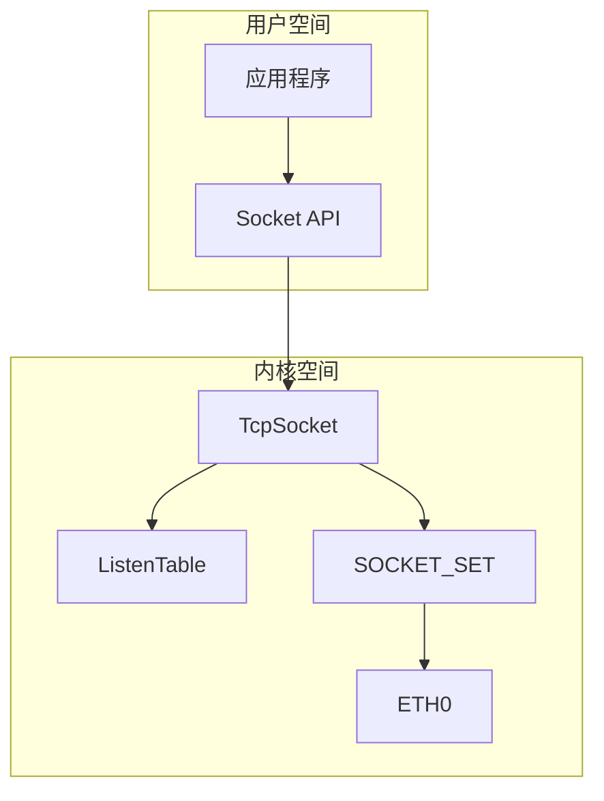
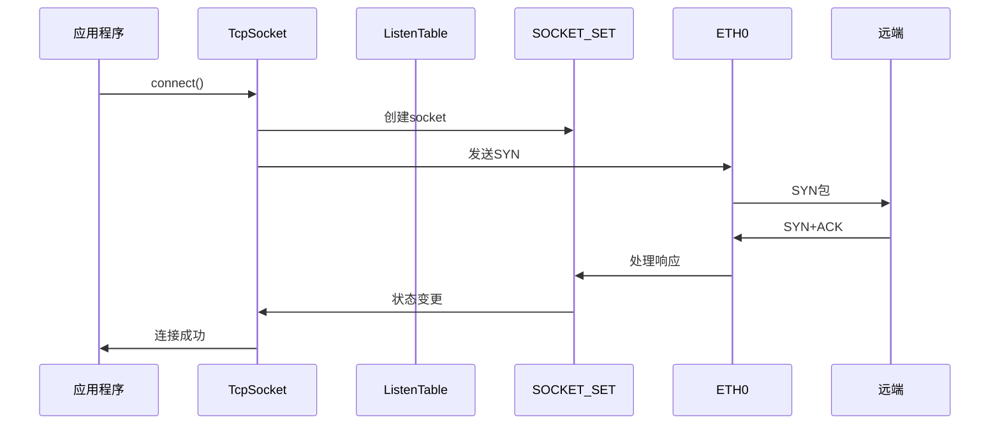
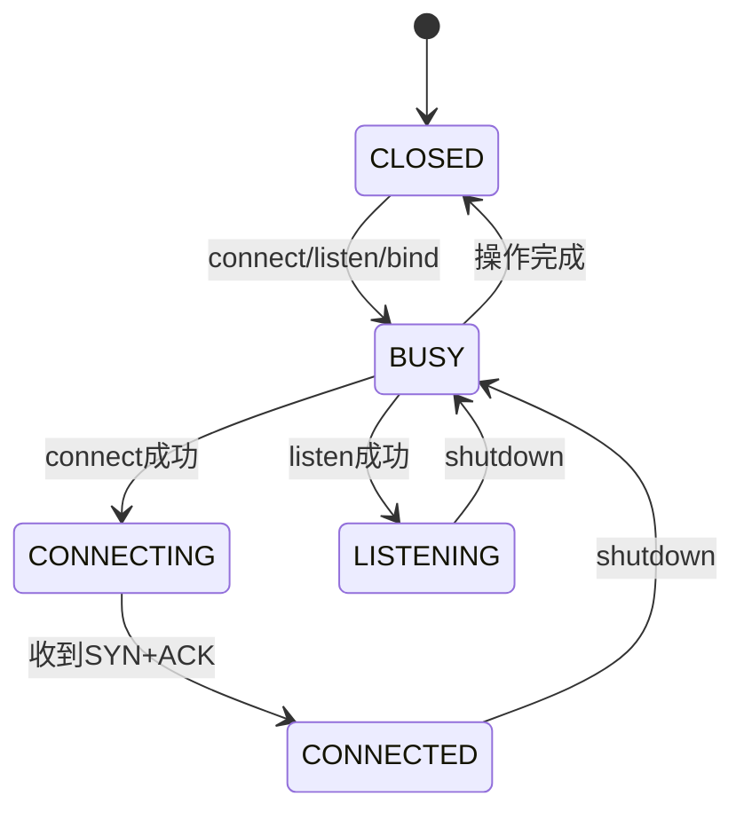
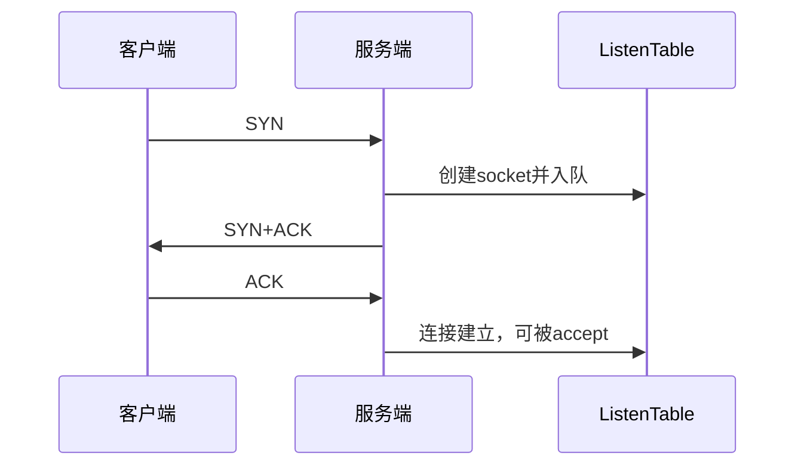
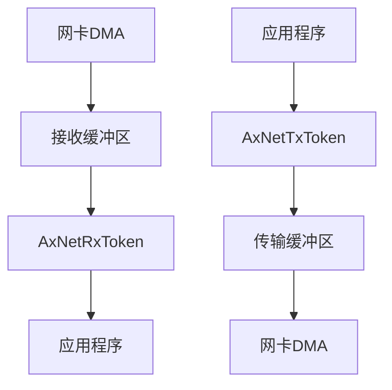
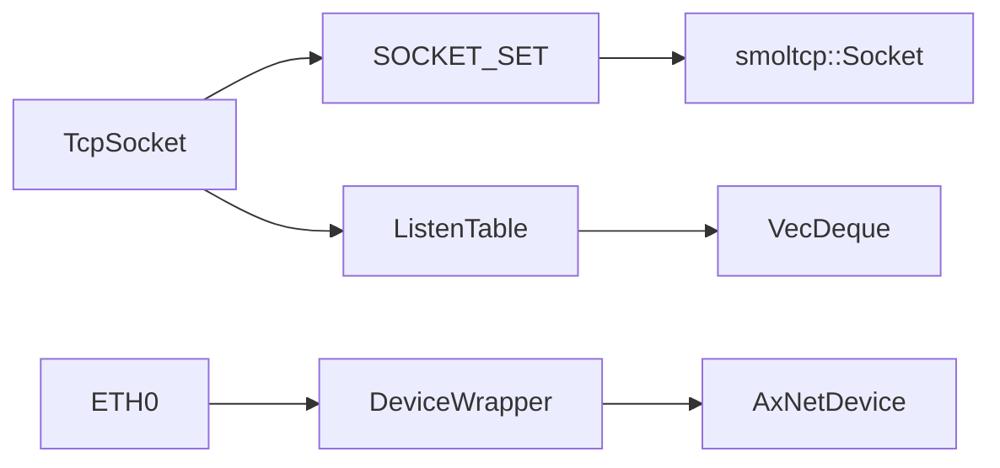

# TCP协议实现

<cite>
**本文档引用文件**
- [tcp.rs](file://modules/axnet/src/smoltcp_impl/tcp.rs)
- [listen_table.rs](file://modules/axnet/src/smoltcp_impl/listen_table.rs)
- [mod.rs](file://modules/axnet/src/smoltcp_impl/mod.rs)
- [addr.rs](file://modules/axnet/src/smoltcp_impl/addr.rs)
- [tcp.h](file://ulib/axlibc/include/netinet/tcp.h)
- [socket.h](file://ulib/axlibc/include/sys/socket.h)
- [net.rs](file://api/arceos_posix_api/src/imp/net.rs)
</cite>

## 目录
1. [简介](#简介)
2. [项目结构](#项目结构)
3. [核心组件](#核心组件)
4. [架构概述](#架构概述)
5. [详细组件分析](#详细组件分析)
6. [依赖分析](#依赖分析)
7. [性能考虑](#性能考虑)
8. [故障排除指南](#故障排除指南)
9. [结论](#结论)

## 简介
本文档深入分析基于smoltcp的TCP协议栈实现，详细解释三次握手、四次挥手的状态机变迁过程，以及Reno和CUBIC拥塞控制算法在代码中的具体实现逻辑。说明滑动窗口机制、重传定时器、快速重传与恢复等核心机制的工作原理，并结合实际调用路径展示如何处理SYN、ACK、FIN等标志位。提供Socket API与底层传输层交互的示例，指导开发者理解连接建立超时、半关闭状态处理等常见问题的调试方法。同时阐述零拷贝发送和接收缓冲区管理对性能的影响。

## 项目结构
ArceOS网络模块采用分层架构设计，核心网络功能实现在`modules/axnet`目录下，通过smoltcp库提供TCP/IP协议栈支持。系统提供了POSIX兼容的Socket API接口，位于`api/arceos_posix_api`中，为上层应用提供标准网络编程接口。

**图源**
- [tcp.rs](file://modules/axnet/src/smoltcp_impl/tcp.rs)
- [listen_table.rs](file://modules/axnet/src/smoltcp_impl/listen_table.rs)
- [mod.rs](file://modules/axnet/src/smoltcp_impl/mod.rs)

**本节来源**
- [tcp.rs](file://modules/axnet/src/smoltcp_impl/tcp.rs)
- [listen_table.rs](file://modules/axnet/src/smoltcp_impl/listen_table.rs)

## 核心组件
TCP协议栈的核心组件包括TcpSocket、ListenTable和SocketSetWrapper，它们共同协作实现完整的TCP功能。TcpSocket提供POSIX风格的API接口，ListenTable管理监听端口和连接队列，SocketSetWrapper封装smoltcp的SocketSet并提供线程安全访问。

**本节来源**
- [tcp.rs](file://modules/axnet/src/smoltcp_impl/tcp.rs#L1-L50)
- [listen_table.rs](file://modules/axnet/src/smoltcp_impl/listen_table.rs#L1-L50)

## 架构概述
系统采用事件驱动架构，通过轮询机制处理网络事件。当接收到TCP数据包时，首先通过snoop_tcp_packet函数检测是否为SYN包，如果是则创建新的socket并加入监听队列。Socket操作通过原子状态机进行管理，确保多线程环境下的安全性。

**图源**
- [tcp.rs](file://modules/axnet/src/smoltcp_impl/tcp.rs#L200-L300)
- [mod.rs](file://modules/axnet/src/smoltcp_impl/mod.rs#L200-L300)

## 详细组件分析

### TCP状态机分析
TcpSocket使用原子变量实现状态机，定义了CLOSED、BUSY、CONNECTING、CONNECTED和LISTENING五种状态。状态转换通过compare_exchange操作保证原子性，避免竞态条件。

**图源**
- [tcp.rs](file://modules/axnet/src/smoltcp_impl/tcp.rs#L40-L50)

#### 三次握手实现
客户端调用connect()后进入CONNECTING状态，发送SYN包并等待响应。服务端通过ListenTable管理SYN队列，当收到SYN包时创建新socket并加入队列。accept()操作从队列中取出已建立连接的socket。

**图源**
- [tcp.rs](file://modules/axnet/src/smoltcp_impl/tcp.rs#L450-L480)
- [listen_table.rs](file://modules/axnet/src/smoltcp_impl/listen_table.rs#L110-L150)

#### 四次挥手实现
shutdown()操作触发连接关闭流程，先调用smoltcp socket的close()方法发送FIN包，然后清理本地资源。系统通过状态机确保关闭过程的正确性，防止资源泄漏。

**本节来源**
- [tcp.rs](file://modules/axnet/src/smoltcp_impl/tcp.rs#L226-L250)

### 滑动窗口与缓冲区管理
系统配置了64KB的接收和发送缓冲区，通过recv_capacity()和send_capacity()方法查询可用空间。滑动窗口机制由smoltcp底层实现，上层通过may_recv()、may_send()等方法感知流控状态。

**本节来源**
- [mod.rs](file://modules/axnet/src/smoltcp_impl/mod.rs#L30-L40)

### 零拷贝机制
通过AxNetRxToken和AxNetTxToken实现零拷贝收发。接收时直接将DMA缓冲区传递给上层，发送时在TxToken的consume方法中直接写入传输缓冲区，避免数据复制开销。

**图源**
- [mod.rs](file://modules/axnet/src/smoltcp_impl/mod.rs#L250-L300)

## 依赖分析
系统依赖smoltcp库实现TCP/IP协议栈核心功能，通过SocketHandle与底层socket交互。ListenTable与SOCKET_SET全局实例耦合，管理所有监听端口和连接状态。

**图源**
- [tcp.rs](file://modules/axnet/src/smoltcp_impl/tcp.rs)
- [listen_table.rs](file://modules/axnet/src/smoltcp_impl/listen_table.rs)

**本节来源**
- [tcp.rs](file://modules/axnet/src/smoltcp_impl/tcp.rs)
- [listen_table.rs](file://modules/axnet/src/smoltcp_impl/listen_table.rs)

## 性能考虑
系统通过多种机制优化网络性能：使用固定大小的监听队列避免动态分配；采用原子操作实现无锁状态机；通过零拷贝减少内存复制开销；批量处理网络事件降低轮询开销。缓冲区大小可根据应用场景调整以平衡内存使用和吞吐量。

## 故障排除指南
常见问题包括连接超时、半关闭状态处理和资源泄漏。调试时应检查状态机是否按预期转换，确认ListenTable中是否存在积压的连接请求，验证socket是否被正确释放。使用日志功能跟踪关键操作如socket创建、连接建立和关闭过程。

**本节来源**
- [tcp.rs](file://modules/axnet/src/smoltcp_impl/tcp.rs#L450-L480)
- [listen_table.rs](file://modules/axnet/src/smoltcp_impl/listen_table.rs#L80-L110)

## 结论
ArceOS的TCP实现基于smoltcp构建，提供了完整的协议栈功能和POSIX兼容API。通过精心设计的状态机和资源管理机制，确保了协议的正确性和系统的稳定性。零拷贝和批量处理等优化技术提升了网络性能，适合高性能网络应用的需求。