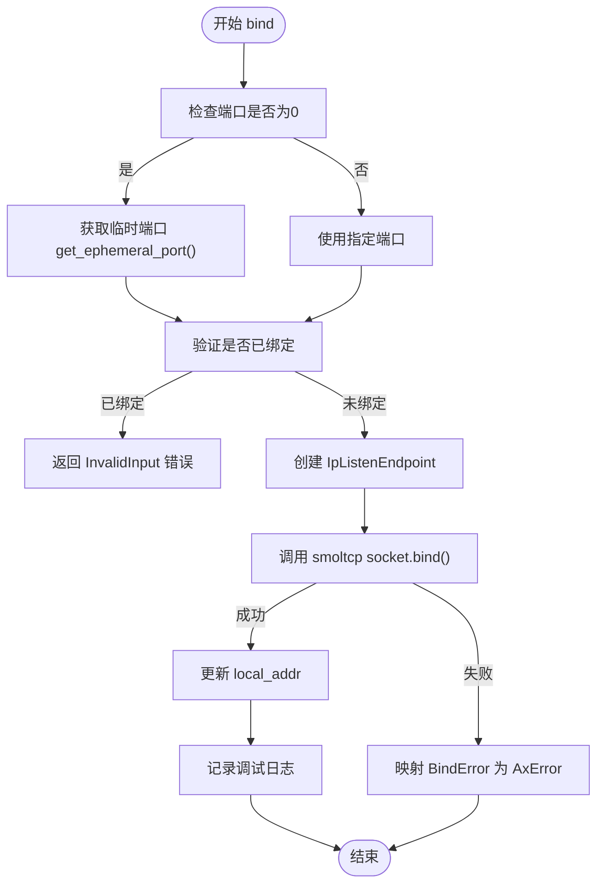
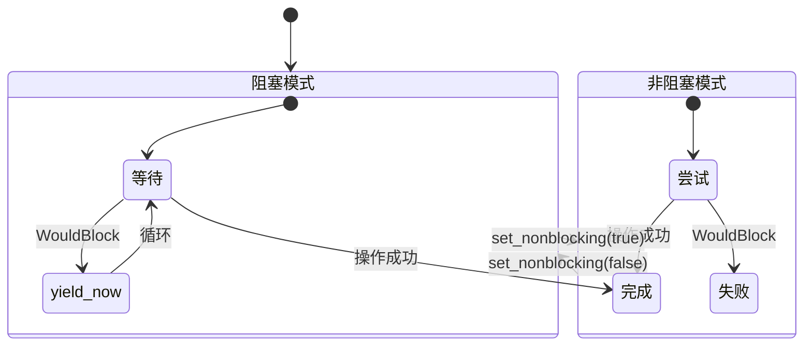
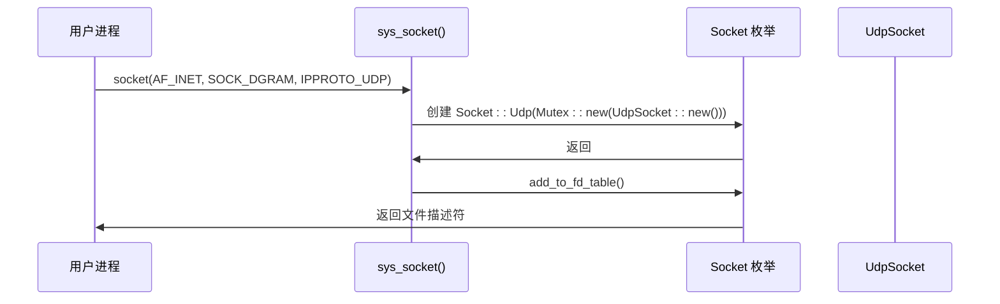

# UDP协议实现

<cite>
**本文档中引用的文件**
- [udp.rs](file://modules/axnet/src/smoltcp_impl/udp.rs)
- [httpclient/src/main.rs](file://examples/httpclient/src/main.rs)
- [net.rs](file://api/arceos_posix_api/src/imp/net.rs)
- [in.h](file://ulib/axlibc/include/netinet/in.h)
</cite>

## 目录
1. [引言](#引言)
2. [UDP套接字核心机制](#udp套接字核心机制)
3. [端口绑定与临时端口分配](#端口绑定与临时端口分配)
4. [数据报发送与接收流程](#数据报发送与接收流程)
5. [非阻塞模式与I/O多路复用](#非阻塞模式与i/o多路复用)
6. [连接状态管理](#连接状态管理)
7. [错误处理与资源清理](#错误处理与资源清理)
8. [POSIX接口适配层](#posix接口适配层)
9. [HTTP客户端示例分析](#http客户端示例分析)
10. [多播与广播支持](#多播与广播支持)
11. [MTU限制与分片处理](#mtu限制与分片处理)
12. [结论](#结论)

## 引言
UDP（用户数据报协议）是一种轻量级的传输层协议，提供无连接的数据报服务。本文档详细阐述了在ArceOS超算虚拟化环境中UDP协议的具体实现机制，包括套接字创建、端口绑定、数据收发、错误处理等核心功能。通过分析`axnet`模块中的`UdpSocket`结构体及其方法，揭示了其如何基于smoltcp库构建POSIX兼容的API，并探讨了其在资源受限环境下的优势。

## UDP套接字核心机制

UDP套接字的核心实现位于`modules/axnet/src/smoltcp_impl/udp.rs`文件中，主要由`UdpSocket`结构体承载。该结构体封装了底层网络栈的句柄和状态信息，提供了符合POSIX标准的高级API。

```mermaid
classDiagram
class UdpSocket {
+handle : SocketHandle
+local_addr : RwLock~Option<IpEndpoint>~
+peer_addr : RwLock~Option<IpEndpoint>~
+nonblock : AtomicBool
+new() UdpSocket
+bind(local_addr) AxResult
+send_to(buf, remote_addr) AxResult~usize~
+recv_from(buf) AxResult~(usize, SocketAddr)~
+connect(addr) AxResult
+send(buf) AxResult~usize~
+recv(buf) AxResult~usize~
+shutdown() AxResult
+poll() AxResult~PollState~
}
UdpSocket --> "uses" SOCKET_SET : "全局套接字集合"
UdpSocket --> "uses" smoltcp : : socket : : udp : : Socket : "底层UDP套接字"
```

**图源**
- [udp.rs](file://modules/axnet/src/smoltcp_impl/udp.rs#L0-L44)

**节源**
- [udp.rs](file://modules/axnet/src/smoltcp_impl/udp.rs#L0-L44)

## 端口绑定与临时端口分配

端口绑定是UDP通信的前提，通过`bind`方法将套接字与本地地址和端口关联。当用户请求绑定到端口0时，系统会自动分配一个临时端口。



**图源**
- [udp.rs](file://modules/axnet/src/smoltcp_impl/udp.rs#L78-L109)

**节源**
- [udp.rs](file://modules/axnet/src/smoltcp_impl/udp.rs#L78-L109)

### 临时端口生成算法
临时端口从0xc000 (49152) 开始，到0xffff (65535) 结束，采用简单的轮转分配策略。
```rust
fn get_ephemeral_port() -> AxResult<u16> {
    const PORT_START: u16 = 0xc000;
    const PORT_END: u16 = 0xffff;
    static CURR: Mutex<u16> = Mutex::new(PORT_START);
    let mut curr = CURR.lock();
    let port = *curr;
    if *curr == PORT_END {
        *curr = PORT_START;
    } else {
        *curr += 1;
    }
    Ok(port)
}
```
此算法确保了端口的快速分配，但在高并发场景下可能存在冲突风险。

## 数据报发送与接收流程

UDP的核心操作是`send_to`和`recv_from`，它们允许向任意目标地址发送数据包，并接收来自任意源地址的数据包。

### 发送流程 (`send_to`)
```mermaid
sequenceDiagram
participant 应用 as 应用程序
participant UdpSocket as UdpSocket
participant SOCKET_SET as SOCKET_SET
participant SmoltcpSocket as smoltcp : : socket : : udp : : Socket
应用->>UdpSocket : send_to(buf, remote_addr)
UdpSocket->>UdpSocket : 验证 remote_addr 有效性
UdpSocket->>UdpSocket : 检查 local_addr 是否已绑定
UdpSocket->>UdpSocket : 调用 send_impl()
UdpSocket->>SOCKET_SET : block_on(...)
loop 阻塞等待
SOCKET_SET->>SOCKET_SET : poll_interfaces()
SOCKET_SET->>SmoltcpSocket : can_send()
alt 可发送
SmoltcpSocket-->>SOCKET_SET : true
SOCKET_SET->>SmoltcpSocket : send_slice(buf, remote_endpoint)
SmoltcpSocket-->>SOCKET_SET : Result
SOCKET_SET-->>UdpSocket : 返回结果
break 成功或非阻塞错误
else 缓冲区满
SmoltcpSocket-->>SOCKET_SET : false
SOCKET_SET-->>UdpSocket : Err(WouldBlock)
UdpSocket->>UdpSocket : yield_now()
end
end
UdpSocket-->>应用 : 返回结果
```

**图源**
- [udp.rs](file://modules/axnet/src/smoltcp_impl/udp.rs#L214-L253)

**节源**
- [udp.rs](file://modules/axnet/src/smoltcp_impl/udp.rs#L214-L253)

### 接收流程 (`recv_from`)
接收流程与发送类似，但调用的是`recv_slice`方法来从接收缓冲区读取数据。
```mermaid
sequenceDiagram
participant 应用 as 应用程序
participant UdpSocket as UdpSocket
participant SOCKET_SET as SOCKET_SET
participant SmoltcpSocket as smoltcp : : socket : : udp : : Socket
应用->>UdpSocket : recv_from(buf)
UdpSocket->>UdpSocket : 检查 local_addr 是否已绑定
UdpSocket->>UdpSocket : 调用 recv_impl()
UdpSocket->>SOCKET_SET : block_on(...)
loop 阻塞等待
SOCKET_SET->>SOCKET_SET : poll_interfaces()
SOCKET_SET->>SmoltcpSocket : can_recv()
alt 有数据可读
SmoltcpSocket-->>SOCKET_SET : true
SOCKET_SET->>SmoltcpSocket : recv_slice(buf)
SmoltcpSocket-->>SOCKET_SET : (len, meta)
SOCKET_SET-->>UdpSocket : 返回 (len, SocketAddr)
break 成功或非阻塞错误
else 无数据
SmoltcpSocket-->>SOCKET_SET : false
SOCKET_SET-->>UdpSocket : Err(WouldBlock)
UdpSocket->>UdpSocket : yield_now()
end
end
UdpSocket-->>应用 : 返回结果
```

**图源**
- [udp.rs](file://modules/axnet/src/smoltcp_impl/udp.rs#L214-L253)

**节源**
- [udp.rs](file://modules/axnet/src/smoltcp_impl/udp.rs#L214-L253)

## 非阻塞模式与I/O多路复用

`UdpSocket`支持通过`set_nonblocking`方法切换到非阻塞模式。在非阻塞模式下，`send_to`和`recv_from`会立即返回，如果操作不能立即完成，则返回`WouldBlock`错误。



此外，`poll`方法可用于查询套接字的可读写状态，这是实现I/O多路复用的基础。

**节源**
- [udp.rs](file://modules/axnet/src/smoltcp_impl/udp.rs#L173-L212)

## 连接状态管理

虽然UDP是无连接的，但`UdpSocket`提供了`connect`方法来建立一个“伪连接”。这并非真正的连接，而是设置了一个默认的远程地址，后续的`send`和`recv`操作将只针对该地址。

```mermaid
flowchart TD
A([connect(addr)]) --> B{local_addr 是否已绑定?}
B --> |否| C[bind(UNSPECIFIED_ENDPOINT)]
B --> |是| D[继续]
C --> D
D --> E[设置 peer_addr]
E --> F[记录调试日志]
F --> G([结束])
```

一旦连接，`send`方法将直接使用`peer_addr`作为目标地址，而`recv`方法则会过滤掉非`peer_addr`来源的数据包。

**节源**
- [udp.rs](file://modules/axnet/src/smoltcp_impl/udp.rs#L139-L171)

## 错误处理与资源清理

`UdpSocket`实现了全面的错误处理机制，所有可能的错误都被映射为`AxError`枚举类型。关键的错误码包括：
- `InvalidInput`: 无效输入参数
- `AlreadyExists`: 地址已在使用
- `NotConnected`: 套接字未连接或未绑定
- `WouldBlock`: 操作会阻塞（非阻塞模式）
- `ConnectionRefused`: 连接被拒绝

资源清理通过`Drop` trait自动完成。当`UdpSocket`实例离开作用域时，会自动调用`shutdown`方法关闭套接字并从全局集合中移除。

```rust
impl Drop for UdpSocket {
    fn drop(&mut self) {
        self.shutdown().ok();
        SOCKET_SET.remove(self.handle);
    }
}
```

**节源**
- [udp.rs](file://modules/axnet/src/smoltcp_impl/udp.rs#L255-L294)

## POSIX接口适配层

为了提供标准的C风格API，系统在`api/arceos_posix_api`模块中实现了POSIX套接字接口的适配层。`sys_socket`系统调用根据传入的参数创建相应的TCP或UDP套接字对象。



其他如`sendto`, `recvfrom`, `bind`, `connect`等系统调用最终都会委托给`UdpSocket`的对应方法。

**节源**
- [net.rs](file://api/arceos_posix_api/src/imp/net.rs#L207-L247)

## HTTP客户端示例分析

`examples/httpclient`示例展示了如何使用TCP进行HTTP通信，虽然它不直接使用UDP，但其网络编程模式具有参考价值。该示例通过`TcpStream::connect`建立连接，然后发送HTTP GET请求并读取响应。

```rust
fn client() -> io::Result<()> {
    let mut stream = TcpStream::connect(DEST)?;
    stream.write_all(REQUEST.as_bytes())?;
    let mut buf = [0; 2048];
    let n = stream.read(&mut buf)?;
    // 处理响应...
    Ok(())
}
```
此代码清晰地展示了同步阻塞I/O模型的典型用法。

**节源**
- [main.rs](file://examples/httpclient/src/main.rs#L0-L40)

## 多播与广播支持

尽管当前代码未显式展示多播（Multicast）和广播（Broadcast）的专用API，但UDP协议本身天然支持这些特性。通过将`remote_addr`设置为特定的多播组地址（如224.0.0.0/4）或广播地址（如255.255.255.255），`send_to`方法即可实现多播或广播。

IPPROTO_UDP常量定义在`ulib/axlibc/include/netinet/in.h`中，确认了UDP协议号为17。
```c
#define IPPROTO_UDP      17
```

**节源**
- [in.h](file://ulib/axlibc/include/netinet/in.h#L0-L47)

## MTU限制与分片处理

UDP数据报的大小受到网络路径MTU（最大传输单元）的限制。在ArceOS中，标准MTU被定义为1500字节。

```c
const STANDARD_MTU: usize = 1500;
```
如果应用层尝试发送超过MTU的数据报，IP层将负责对其进行分片。然而，过大的UDP数据报容易在网络中丢失，因此最佳实践是将单个UDP数据报的大小控制在1472字节以内（考虑IP和UDP头部开销）。接收方需要正确处理分片重组，但这通常由底层网络栈透明完成。

**节源**
- [bench.rs](file://modules/axnet/src/smoltcp_impl/bench.rs#L0-L19)

## 结论
ArceOS中的UDP协议实现通过`UdpSocket`结构体提供了一套完整且高效的API。它巧妙地结合了smoltcp库的强大功能与POSIX标准的易用性，支持阻塞/非阻塞I/O、连接状态管理和完善的错误处理。该实现特别适合于资源受限的嵌入式和虚拟化环境，为构建高性能网络应用奠定了坚实基础。