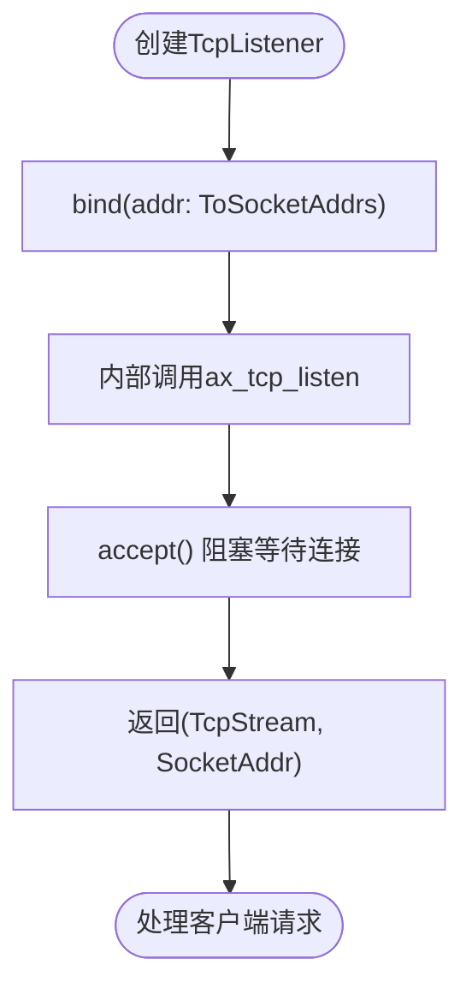
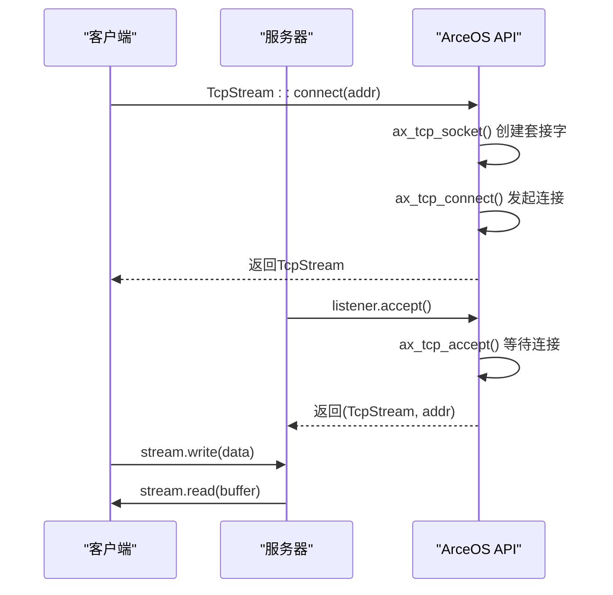
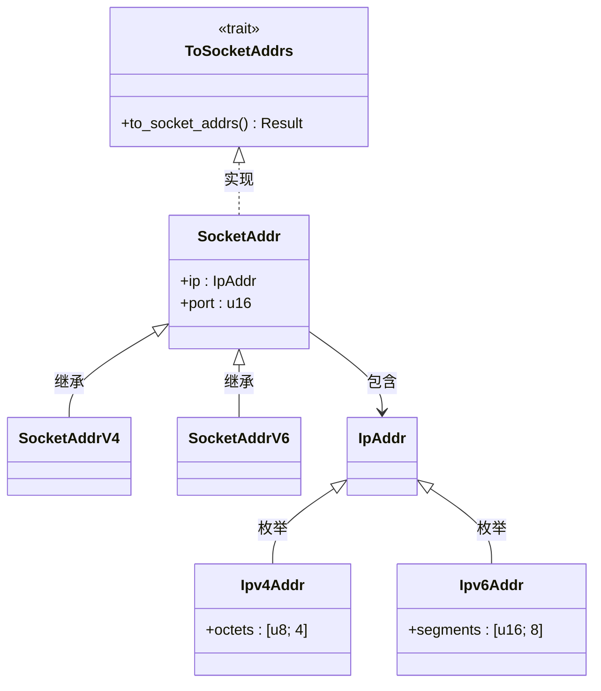
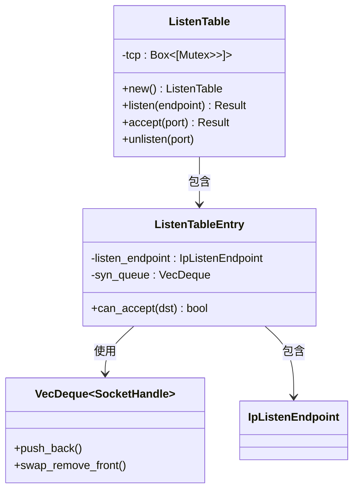
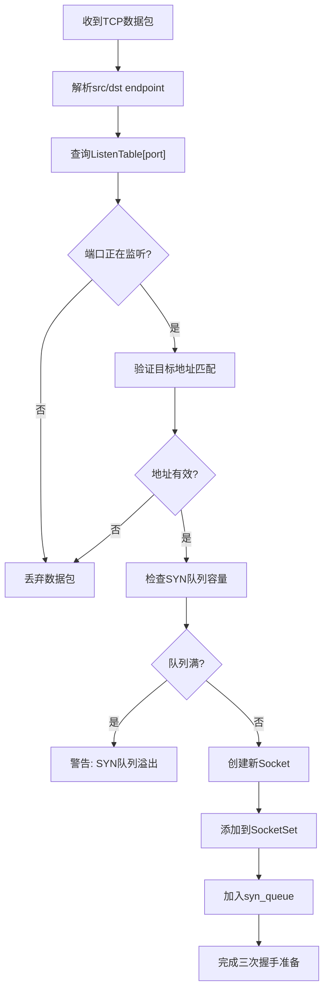
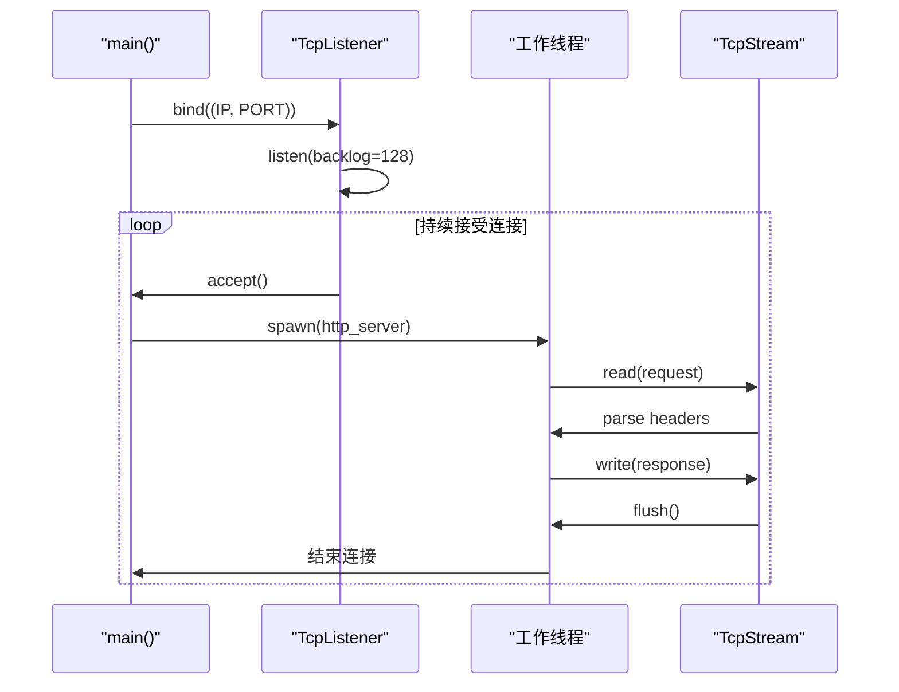

# 网络套接字API

<cite>
**本文档引用文件**   
- [tcp.rs](file://ulib/axstd/src/net/tcp.rs)
- [udp.rs](file://ulib/axstd/src/net/udp.rs)
- [socket_addr.rs](file://ulib/axstd/src/net/socket_addr.rs)
- [listen_table.rs](file://modules/axnet/src/smoltcp_impl/listen_table.rs)
- [main.rs](file://examples/httpserver/src/main.rs)
- [net.rs](file://api/arceos_api/src/imp/net.rs)
- [mod.rs](file://ulib/axstd/src/net/mod.rs)
</cite>

## 目录
1. [简介](#简介)
2. [核心类型与操作](#核心类型与操作)
3. [地址解析机制](#地址解析机制)
4. [并发连接管理](#并发连接管理)
5. [非阻塞I/O与事件驱动示例](#非阻塞io与事件驱动示例)
6. [no_std环境支持特性](#no_std环境支持特性)

## 简介
ArceOS提供了一套完整的网络Socket API，支持TCP和UDP协议的通信功能。该API在`no_std`环境下运行，专为嵌入式和操作系统开发设计，具备内存安全性和异步任务调度能力。系统通过`smoltcp`实现底层网络栈，提供了`TcpListener`、`TcpStream`和`UdpSocket`等核心类型，用于建立、监听和管理网络连接。

## 核心类型与操作

### TCP监听器(TcpListener)
`TcpListener`用于创建服务器端套接字并监听传入的TCP连接请求。通过调用`bind`方法将监听器绑定到指定地址和端口，随后使用`accept`方法接收客户端连接。



**Diagram sources**
- [tcp.rs](file://ulib/axstd/src/net/tcp.rs#L58-L94)
- [net.rs](file://api/arceos_api/src/imp/net.rs#L40-L45)

### TCP流(TcpStream)
`TcpStream`表示一个已建立的TCP连接，可用于双向数据传输。客户端可通过`connect`方法主动连接服务器，而服务器端则通过`accept`获得的流进行通信。



**Diagram sources**
- [tcp.rs](file://ulib/axstd/src/net/tcp.rs#L20-L57)
- [net.rs](file://api/arceos_api/src/imp/net.rs#L50-L65)

### UDP套接字(UdpSocket)
`UdpSocket`提供无连接的数据报服务，适用于需要低延迟通信的场景。通过`bind`绑定本地地址后，可使用`send_to`向特定目标发送数据，或用`recv_from`接收来自任意源的数据包。

```mermaid
flowchart LR
A[UdpSocket::bind] --> B[ax_udp_bind]
B --> C{是否成功}
C --> |是| D[可发送/接收数据]
C --> |否| E[返回错误]
D --> F[send_to(dest, data)]
D --> G[recv_from(buffer)]
F --> H[ax_udp_send_to]
G --> I[ax_udp_recv_from]
```

**Diagram sources**
- [udp.rs](file://ulib/axstd/src/net/udp.rs#L15-L96)
- [net.rs](file://api/arceos_api/src/imp/net.rs#L100-L115)

**Section sources**
- [tcp.rs](file://ulib/axstd/src/net/tcp.rs#L1-L106)
- [udp.rs](file://ulib/axstd/src/net/udp.rs#L1-L97)

## 地址解析机制

### SocketAddr结构
`SocketAddr`类型封装了IP地址和端口号，支持IPv4和IPv6两种格式。系统提供了`SocketAddrV4`和`SocketAddrV6`具体实现，并可通过`FromStr` trait从字符串解析地址。

```rust
// 示例：多种地址表示方式
let addr1: SocketAddr = "127.0.0.1:8080".parse().unwrap();
let addr2 = SocketAddr::new(IpAddr::V4("192.168.1.1".parse().unwrap()), 80);
let addr3 = (Ipv4Addr::new(10, 0, 0, 1), 443).into();
```

### ToSocketAddrs trait
`ToSocketAddrs` trait允许将不同类型的输入统一转换为`SocketAddr`迭代器，简化了地址解析过程。支持的输入类型包括：
- `SocketAddr` 直接转换
- `(IpAddr, u16)` 元组形式
- `(&str, u16)` 字符串加端口
- `&str` 完整地址字符串



**Diagram sources**
- [socket_addr.rs](file://ulib/axstd/src/net/socket_addr.rs#L0-L190)
- [mod.rs](file://ulib/axstd/src/net/mod.rs#L0-L45)

**Section sources**
- [socket_addr.rs](file://ulib/axstd/src/net/socket_addr.rs#L0-L190)

## 并发连接管理

### ListenTable结构
`ListenTable`是ArceOS中管理TCP监听端口的核心数据结构，采用数组+互斥锁的设计，每个端口对应一个`ListenTableEntry`，维护着SYN队列。



**Diagram sources**
- [listen_table.rs](file://modules/axnet/src/smoltcp_impl/listen_table.rs#L0-L154)

### 连接建立流程
当收到SYN包时，系统会检查对应端口是否在监听状态，若存在则创建新套接字加入SYN队列；`accept`调用时从队列中取出已建立连接的句柄。



**Diagram sources**
- [listen_table.rs](file://modules/axnet/src/smoltcp_impl/listen_table.rs#L112-L154)
- [mod.rs](file://modules/axnet/src/smoltcp_impl/mod.rs#L250-L270)

**Section sources**
- [listen_table.rs](file://modules/axnet/src/smoltcp_impl/listen_table.rs#L0-L154)

## 非阻塞I/O与事件驱动示例

### HTTP服务器实现分析
以`examples/httpserver`为例，展示了基于线程池的并发服务器模型：



关键代码路径：
- `TcpListener::bind` → `ax_tcp_bind` → `listen_table.listen`
- `listener.accept()` → `ax_tcp_accept` → `listen_table.accept`
- `stream.read/write` → `ax_tcp_recv/send`

**Diagram sources**
- [main.rs](file://examples/httpserver/src/main.rs#L50-L96)
- [tcp.rs](file://ulib/axstd/src/net/tcp.rs#L70-L94)

**Section sources**
- [main.rs](file://examples/httpserver/src/main.rs#L0-L96)

## no_std环境支持特性

### 内存安全保证
ArceOS的网络API在`no_std`环境下通过以下机制确保内存安全：
- 使用`LazyInit`延迟初始化全局资源
- 所有缓冲区操作均经过边界检查
- 套接字句柄封装避免直接暴露内部状态
- 利用Rust的所有权系统防止数据竞争

### 异步任务调度
系统通过`poll_interfaces`定期轮询网络接口，配合`axsync::Mutex`实现多任务间的同步访问。虽然当前示例采用阻