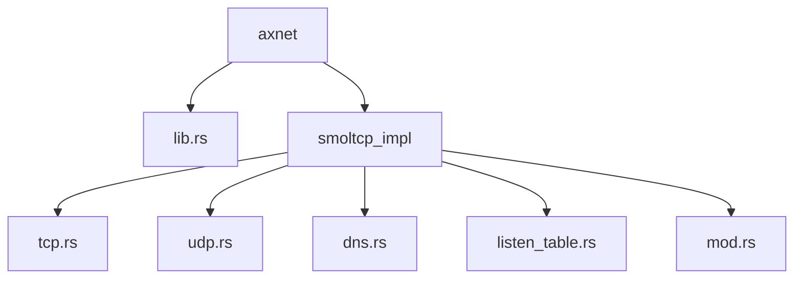
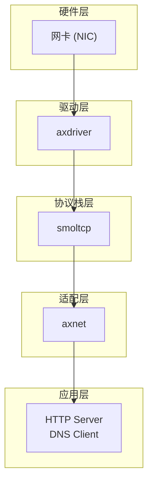
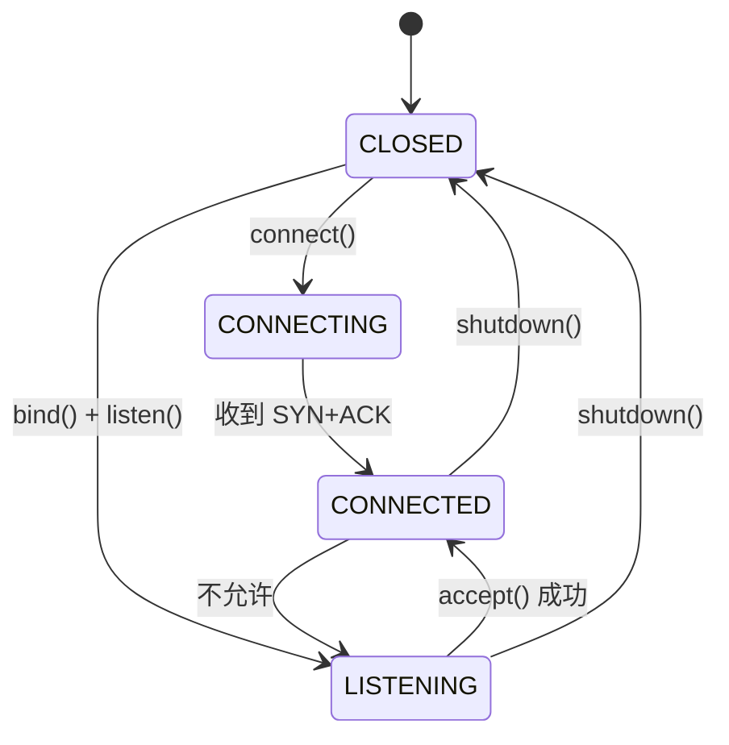
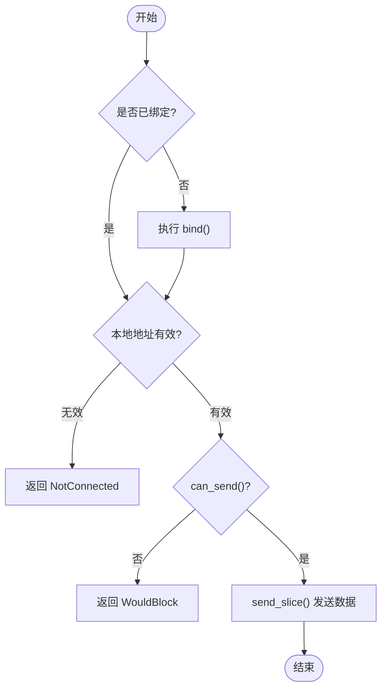
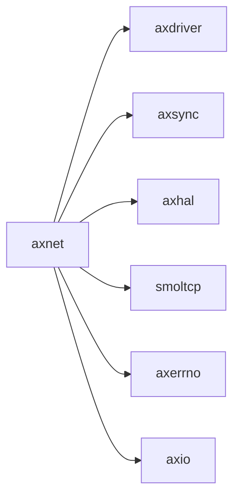

# 网络栈 (axnet)

<cite>
**本文档中引用的文件**  
- [mod.rs](file://modules/axnet/src/smoltcp_impl/mod.rs)
- [tcp.rs](file://modules/axnet/src/smoltcp_impl/tcp.rs)
- [udp.rs](file://modules/axnet/src/smoltcp_impl/udp.rs)
- [dns.rs](file://modules/axnet/src/smoltcp_impl/dns.rs)
- [listen_table.rs](file://modules/axnet/src/smoltcp_impl/listen_table.rs)
- [lib.rs](file://modules/axnet/src/lib.rs)
- [net.rs](file://api/arceos_api/src/imp/net.rs)
- [main.rs](file://examples/httpserver/src/main.rs)
</cite>

## 目录
1. [简介](#简介)
2. [项目结构](#项目结构)
3. [核心组件](#核心组件)
4. [架构概述](#架构概述)
5. [详细组件分析](#详细组件分析)
6. [依赖分析](#依赖分析)
7. [性能考量](#性能考量)
8. [故障排除指南](#故障排除指南)
9. [结论](#结论)

## 简介
本项目 `axnet` 是 ArceOS 操作系统中的网络模块，基于轻量级 TCP/IP 协议栈 smoltcp 实现。该模块为上层应用提供了统一的 TCP/UDP 通信接口，并支持 DNS 查询功能。其设计目标是在嵌入式或虚拟化环境中提供高效、可靠的网络能力。

## 项目结构
`axnet` 模块位于 `modules/axnet` 目录下，其源代码主要分为两部分：顶层的 `lib.rs` 和具体的实现 `smoltcp_impl` 子模块。`smoltcp_impl` 包含了对 smoltcp 库的封装，实现了 TCP、UDP、DNS 等核心协议。

**图示来源**
- [lib.rs](file://modules/axnet/src/lib.rs)
- [mod.rs](file://modules/axnet/src/smoltcp_impl/mod.rs)

**节来源**
- [lib.rs](file://modules/axnet/src/lib.rs)
- [mod.rs](file://modules/axnet/src/smoltcp_impl/mod.rs)

## 核心组件
`axnet` 的核心是围绕 smoltcp 构建的一系列封装。它通过 `TcpSocket` 和 `UdpSocket` 结构体暴露 POSIX 风格的 API，使开发者能够像在标准操作系统中一样进行网络编程。同时，`dns_query` 函数提供了便捷的域名解析服务。

**节来源**
- [lib.rs](file://modules/axnet/src/lib.rs#L0-L47)
- [tcp.rs](file://modules/axnet/src/smoltcp_impl/tcp.rs#L0-L563)
- [udp.rs](file://modules/axnet/src/smoltcp_impl/udp.rs#L0-L295)
- [dns.rs](file://modules/axnet/src/smoltcp_impl/dns.rs#L0-L89)

## 架构概述
`axnet` 的架构是一个典型的分层设计。最底层是硬件驱动（如 ixgbe），通过 `axdriver` 提供的抽象与网络设备交互。中间层是 `smoltcp` 协议栈，负责处理所有复杂的网络协议逻辑。`axnet` 本身作为适配层，将 smoltcp 的功能封装成更易用的接口，并管理全局状态（如套接字集合和监听表）。

**图示来源**
- [mod.rs](file://modules/axnet/src/smoltcp_impl/mod.rs)
- [lib.rs](file://modules/axnet/src/lib.rs)

## 详细组件分析

### TCP 套接字分析
`TcpSocket` 结构体是 TCP 功能的核心。它内部维护了一个状态机，通过原子操作来保证线程安全。该状态机定义了从 `CLOSED` 到 `CONNECTING`、`CONNECTED` 或 `LISTENING` 的转换过程。

#### TCP 状态机变迁

**图示来源**
- [tcp.rs](file://modules/axnet/src/smoltcp_impl/tcp.rs#L24-L45)

#### TCP 三次握手实现
当调用 `connect()` 方法时，`TcpSocket` 会首先检查当前状态是否为 `CLOSED`，然后将其置为 `BUSY` 状态以防止并发访问。接着，它会向 smoltcp 的 `SocketSet` 添加一个 TCP 套接字，并调用其 `connect()` 方法发起连接。此过程是非阻塞的，如果套接字处于非阻塞模式，则立即返回 `WouldBlock` 错误；否则，它会通过 `block_on` 循环调用 `poll_interfaces` 并检查连接状态，直到连接成功或失败。

**节来源**
- [tcp.rs](file://modules/axnet/src/smoltcp_impl/tcp.rs#L100-L150)

### UDP 套接字分析
`UdpSocket` 的实现相对简单，因为它不需要维护复杂的连接状态。它主要负责绑定端口、发送和接收数据报。

#### UDP 数据报收发流程

**图示来源**
- [udp.rs](file://modules/axnet/src/smoltcp_impl/udp.rs#L150-L200)

### DNS 客户端工作机制
`dns_query` 函数是 DNS 客户端的入口。它创建一个临时的 `DnsSocket`，调用 `start_query` 发起查询，并在一个循环中不断调用 `poll_interfaces` 来驱动协议栈处理网络事件，直到查询结果可用或超时。

**节来源**
- [dns.rs](file://modules/axnet/src/smoltcp_impl/dns.rs#L50-L80)

### HTTP 服务器编程模型
`httpserver` 示例展示了如何使用 `axnet` 构建一个简单的 Web 服务器。它通过 `TcpListener::bind` 创建监听套接字，然后在 `accept_loop` 中循环调用 `listener.accept()` 接受新连接。对于每个新连接，它启动一个新线程来处理请求，这体现了经典的“每个连接一个线程”模型。`set_nonblocking(false)` 确保了 `accept` 和 I/O 操作是阻塞的，简化了编程逻辑。

**节来源**
- [main.rs](file://examples/httpserver/src/main.rs#L50-L90)

### 性能优化技术分析
`axnet` 在多个层面应用了性能优化技术。

#### 零拷贝传输
在数据包的收发过程中，`AxNetRxToken` 和 `AxNetTxToken` 的实现避免了不必要的内存拷贝。接收时，`consume` 方法直接将原始缓冲区传递给回调函数 `f`；发送时，`consume` 方法允许回调函数直接填充预分配的传输缓冲区。这种设计最大限度地减少了数据移动。

#### 校验和卸载 (Checksum Offload)
虽然代码中没有显式配置，但 `DeviceCapabilities` 被设置为默认值，这意味着校验和计算由软件完成。然而，底层驱动（如 ixgbe）通常支持硬件校验和卸载。通过配置 `DeviceCapabilities`，可以告知 smoltcp 将校验和计算任务交给网卡硬件，从而减轻 CPU 负担。

**节来源**
- [mod.rs](file://modules/axnet/src/smoltcp_impl/mod.rs#L235-L283)

## 依赖分析
`axnet` 模块依赖于多个其他 ArceOS 组件。它通过 `axdriver` 访问物理网络设备，利用 `axsync` 进行同步控制，并依赖 `axhal` 获取系统时间。其核心功能建立在 `smoltcp` 库之上，而 `axerrno` 和 `axio` 则提供了错误处理和 I/O 抽象。

**图示来源**
- [Cargo.toml](file://modules/axnet/Cargo.toml)
- [lib.rs](file://modules/axnet/src/lib.rs)

**节来源**
- [Cargo.toml](file://modules/axnet/Cargo.toml)
- [lib.rs](file://modules/axnet/src/lib.rs)

## 性能考量
为了适应不同的网络环境，开发者可以通过修改源码中的常量来调整关键参数。例如，`STANDARD_MTU` 可以根据网络链路的实际 MTU 进行设置，以避免 IP 分片。TCP 的接收和发送缓冲区大小 (`TCP_RX_BUF_LEN`, `TCP_TX_BUF_LEN`) 以及监听队列大小 (`LISTEN_QUEUE_SIZE`) 也可以根据预期的并发连接数和吞吐量需求进行优化。更大的窗口和缓冲区有助于提高高