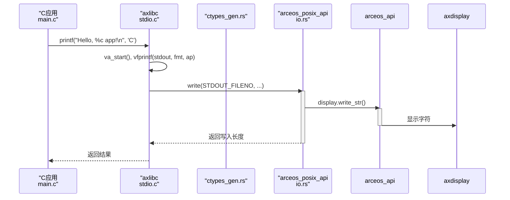

# C语言示例解析

<cite>
**本文档引用的文件**  
- [main.c](file://examples/helloworld-c/main.c)
- [httpclient.c](file://examples/httpclient-c/httpclient.c)
- [ctypes.h](file://api/arceos_posix_api/ctypes.h)
- [build.rs](file://api/arceos_posix_api/build.rs)
- [stdio.c](file://ulib/axlibc/c/stdio.c)
- [printf.h](file://ulib/axlibc/c/printf.h)
- [socket.h](file://ulib/axlibc/include/sys/socket.h)
</cite>

## 目录
1. [引言](#引言)
2. [项目结构概述](#项目结构概述)
3. [核心组件分析](#核心组件分析)
4. [架构概览](#架构概览)
5. [详细组件分析](#详细组件分析)
6. [依赖关系分析](#依赖关系分析)
7. [性能考量](#性能考量)
8. [故障排查指南](#故障排查指南)
9. [结论](#结论)

## 引言
本文旨在深入对比 ArceOS 操作系统中两个关键的 C 语言示例：`helloworld-c` 和 `httpclient-c`，揭示其对 POSIX 兼容 C 运行时的支持能力。通过分析标准库函数调用（如 `printf`）如何在 axlibc 层映射到底层输出机制，以及 socket 编程接口如何借助 arceos_posix_api 实现网络通信，全面展示 ArceOS 对传统 C 应用程序的良好支持。同时，文章还将探讨 C 与 Rust 示例在内存管理、错误处理和系统调用层面的根本差异，并阐明 `ctypes.h` 和 `build.rs` 在生成跨语言绑定中的核心作用，为开发者编写兼容的 C 应用提供明确指导。

## 项目结构概述
ArceOS 的项目结构清晰地划分了 API 接口、模块实现、用户库和示例代码。C 语言相关的运行时支持主要集中在 `ulib/axlibc` 目录下，该目录提供了完整的 C 标准库实现。POSIX API 的绑定生成逻辑位于 `api/arceos_posix_api` 中，它通过 `ctypes.h` 头文件和 `build.rs` 构建脚本将 C 接口转换为 Rust 可调用的形式。示例代码则分别存放在 `examples/helloworld-c` 和 `examples/httpclient-c` 目录中，作为验证 C 运行时功能的直接入口。

```mermaid
graph TB
subgraph "API 接口"
A[arceos_api]
B[arceos_posix_api]
end
subgraph "用户库"
C[axlibc]
D[axstd]
end
subgraph "示例代码"
E[helloworld-c]
F[httpclient-c]
end
B --> C : 提供绑定定义
C --> E : 链接运行时
C --> F : 链接运行时
E --> B : 调用 POSIX 函数
F --> B : 调用 POSIX 函数
```

**图源**
- [arceos_posix_api](file://api/arceos_posix_api)
- [axlibc](file://ulib/axlibc)
- [helloworld-c](file://examples/helloworld-c)
- [httpclient-c](file://examples/httpclient-c)

**节源**
- [project_structure](file://workspace_path)

## 核心组件

本文的核心在于分析 `helloworld-c` 和 `httpclient-c` 两个示例，它们分别代表了最基础的 I/O 输出和复杂的网络通信场景。`helloworld-c` 的 `main.c` 文件展示了标准输出函数 `printf` 的使用，而 `httpclient.c` 则完整演示了从创建套接字、解析域名、建立连接到发送 HTTP 请求和接收响应的全过程。这些功能的实现都依赖于 `ulib/axlibc` 提供的 C 运行时库和 `api/arceos_posix_api` 生成的系统调用绑定。

**节源**
- [main.c](file://examples/helloworld-c/main.c)
- [httpclient.c](file://examples/httpclient-c/httpclient.c)

## 架构概览

ArceOS 的 C 语言支持架构是一个分层设计，上层是传统的 C 应用，中间是兼容的 C 运行时库 (axlibc)，底层是 Rust 实现的内核模块和 POSIX API 绑定。当 C 程序调用 `printf` 或 `socket` 时，请求首先被 axlibc 捕获，然后通过由 `bindgen` 工具自动生成的 FFI（Foreign Function Interface）绑定，转发给底层的 Rust 实现。


**图源**
- [axlibc](file://ulib/axlibc)
- [arceos_posix_api](file://api/arceos_posix_api)
- [arceos_api](file://api/arceos_api)

## 详细组件分析

### helloworld-c 分析

`helloworld-c` 示例虽然简单，但完美地体现了 ArceOS 如何处理最基本的 C 标准库调用。其核心在于 `printf` 函数的调用链。

#### printf 调用流程分析


**图源**
- [main.c](file://examples/helloworld-c/main.c#L5)
- [stdio.c](file://ulib/axlibc/c/stdio.c#L142-L150)
- [io.rs](file://api/arceos_posix_api/src/io.rs)

**节源**
- [main.c](file://examples/helloworld-c/main.c)
- [stdio.c](file://ulib/axlibc/c/stdio.c)

### httpclient-c 分析

`httpclient-c` 示例展示了更复杂的 POSIX 网络编程接口的使用，涉及套接字创建、地址解析、连接建立和数据传输。

#### 网络编程接口调用流程
```mermaid
flowchart TD
Start([开始]) --> CreateSocket["socket(AF_INET, SOCK_STREAM, IPPROTO_TCP)"]
CreateSocket --> CheckSock{"套接字有效?"}
CheckSock --> |否| Error1["perror(\"socket() error\")"]
CheckSock --> |是| GetAddrInfo["getaddrinfo(\"ident.me\", NULL, ... , &res)"]
GetAddrInfo --> CheckAddr{"地址解析成功?"}
CheckAddr --> |否| Error2["perror(\"getaddrinfo() error\")"]
CheckAddr --> |是| Connect["connect(sock, res->ai_addr, ...)"]
Connect --> CheckConn{"连接成功?"}
CheckConn --> |否| Error3["perror(\"connect() error\")"]
CheckConn --> |是| SendRequest["send(sock, request, ...)"]
SendRequest --> CheckSend{"发送成功?"}
CheckSend --> |否| Error4["perror(\"send() error\")"]
CheckSend --> |是| Receive["recv(sock, rebuf, ...)"]
Receive --> CheckRecv{"接收成功?"}
CheckRecv --> |否| Error5["perror(\"recv() error\")"]
CheckRecv --> |是| ProcessData["处理响应数据"]
ProcessData --> End([结束])
Error1 --> End
Error2 --> End
Error3 --> End
Error4 --> End
Error5 --> End
```

**图源**
- [httpclient.c](file://examples/httpclient-c/httpclient.c#L15-L55)

**节源**
- [httpclient.c](file://examples/httpclient-c/httpclient.c)

## 依赖关系分析

C 语言示例的编译和运行依赖于一个精心构建的工具链和库集合。`build.rs` 脚本是整个依赖链条的起点，它负责生成必要的绑定代码。

```mermaid
erDiagram
build_rs["build.rs"] ||--o{ ctypes_gen_rs : "生成"
ctypes_gen_rs["ctypes_gen.rs"] }|--|| arceos_posix_api : "集成"
arceos_posix_api["arceos_posix_api"] }|--|| axlibc : "提供头文件"
axlibc["axlibc"] ||--o{ helloworld_c : "链接"
axlibc["axlibc"] ||--o{ httpclient_c : "链接"
helloworld_c["helloworld-c"] }|--|| arceos_posix_api : "调用"
httpclient_c["httpclient-c"] }|--|| arceos_posix_api : "调用"
```

**图源**
- [build.rs](file://api/arceos_posix_api/build.rs)
- [ctypes_gen.rs](file://api/arceos_posix_api/src/ctypes_gen.rs)
- [axlibc](file://ulib/axlibc)

**节源**
- [build.rs](file://api/arceos_posix_api/build.rs)

## 性能考量

由于 ArceOS 的 C 运行时是通过 FFI 调用底层 Rust 实现的，因此每次系统调用都会产生一定的上下文切换开销。对于 `helloworld-c` 这类简单的 I/O 操作，这种开销可以忽略不计。然而，在 `httpclient-c` 这种需要频繁进行网络 I/O 的场景下，开发者应考虑批量读写以减少系统调用次数，从而优化整体性能。此外，`axlibc` 的 `malloc` 实现基于 `axalloc` 模块，其性能与底层的内存分配策略紧密相关。

## 故障排查指南

当 C 应用出现异常时，应遵循以下步骤进行排查：
1.  **检查返回值**: 所有 POSIX 函数调用后都应立即检查返回值，如 `socket()` 返回 `-1`，`connect()` 返回非零值。
2.  **使用 perror**: 当函数调用失败时，调用 `perror()` 函数可以打印出具体的错误信息，这是定位问题的第一步。
3.  **确认绑定生成**: 如果遇到未定义的符号错误，应检查 `api/arceos_posix_api` 目录下的 `ctypes_gen.rs` 是否已正确生成，并确认 `ctypes.h` 中是否包含了所需的头文件。
4.  **验证库链接**: 确保编译时正确链接了 `axlibc` 库。

**节源**
- [httpclient.c](file://examples/httpclient-c/httpclient.c#L17, L22, L32, L43, L48)
- [build.rs](file://api/arceos_posix_api/build.rs)

## 结论

通过对 `helloworld-c` 和 `httpclient-c` 示例的对比分析，可以得出 ArceOS 已经具备了强大的 POSIX 兼容性。其通过 `axlibc` 提供了完整的 C 运行时环境，并利用 `bindgen` 工具和 `build.rs` 脚本，高效地将 C 的 POSIX 接口映射到了底层的 Rust 实现上。这使得开发者能够轻松地将现有的 C 代码移植到 ArceOS 平台上。尽管在内存管理和错误处理上，C 的手动模式与 Rust 的所有权和类型安全机制存在根本差异，但 ArceOS 的这一设计巧妙地弥合了两种语言之间的鸿沟，为构建混合语言的系统软件提供了坚实的基础。