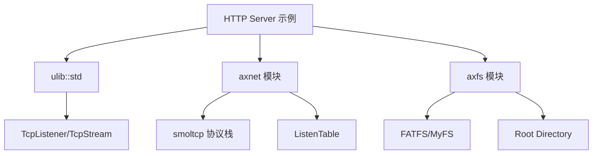
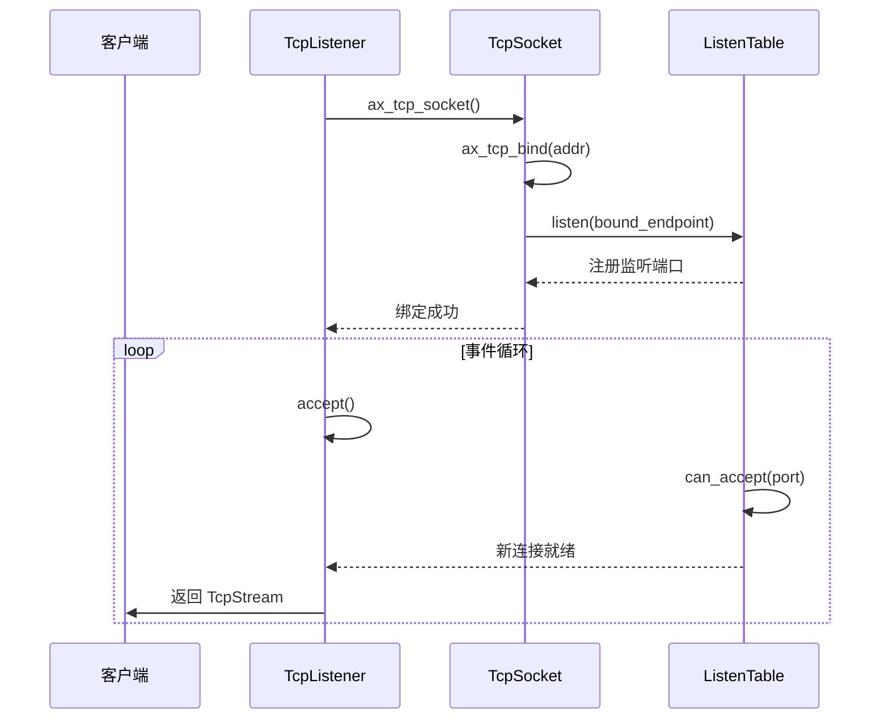

# HTTP 服务器示例解析

<cite>
**本文档引用文件**  
- [main.rs](file://examples/httpserver/src/main.rs)
- [tcp.rs](file://modules/axnet/src/smoltcp_impl/tcp.rs)
- [listen_table.rs](file://modules/axnet/src/smoltcp_impl/listen_table.rs)
- [mod.rs](file://modules/axnet/src/smoltcp_impl/mod.rs)
- [fs.rs](file://api/arceos_api/src/imp/fs.rs)
- [root.rs](file://modules/axfs/src/root.rs)
- [fatfs.rs](file://modules/axfs/src/fs/fatfs.rs)
</cite>

## 目录
1. [项目结构](#项目结构)  
2. [核心组件分析](#核心组件分析)  
3. [网络栈集成与TCP监听机制](#网络栈集成与tcp监听机制)  
4. [HTTP请求处理流程](#http请求处理流程)  
5. [静态文件服务与文件系统挂载](#静态文件服务与文件系统挂载)  
6. [异步I/O与事件驱动模型](#异步io与事件驱动模型)  
7. [性能瓶颈分析与优化建议](#性能瓶颈分析与优化建议)

## 项目结构

ArceOS 是一个模块化的操作系统框架，其 `httpserver` 示例位于 `examples/httpserver` 目录下。该示例依赖于底层的 `axnet` 网络栈和 `axfs` 文件系统模块来实现完整的网络服务功能。



**图源**  
- [main.rs](file://examples/httpserver/src/main.rs)
- [mod.rs](file://modules/axnet/src/smoltcp_impl/mod.rs)
- [root.rs](file://modules/axfs/src/root.rs)

## 核心组件分析

`httpserver` 示例的核心逻辑集中在 `main.rs` 中，通过标准库接口调用底层 `axnet` 和 `axfs` 模块提供的能力。

**节源**  
- [main.rs](file://examples/httpserver/src/main.rs)

## 网络栈集成与TCP监听机制

### Socket 创建与绑定

HTTP 服务器通过 `TcpListener::bind()` 接口启动监听。该调用最终映射到底层 `axnet` 模块中的 `TcpSocket::bind()` 方法，将套接字绑定到指定的 IP 地址和端口（默认为 `0.0.0.0:5555`）。



**图源**  
- [main.rs](file://examples/httpserver/src/main.rs#L68-L75)
- [tcp.rs](file://modules/axnet/src/smoltcp_impl/tcp.rs#L198-L224)
- [listen_table.rs](file://modules/axnet/src/smoltcp_impl/listen_table.rs#L59-L86)

### 监听表（ListenTable）机制

`ListenTable` 是 `axnet` 模块中用于管理 TCP 监听状态的核心数据结构。它维护一个大小为 65536 的数组，每个端口对应一个 `Mutex<Option<Box<ListenTableEntry>>>`，确保同一端口不会被重复监听。

当调用 `listen()` 时：
1. 检查目标端口是否已被占用（`can_listen()`）
2. 若空闲，则创建 `ListenTableEntry` 并插入 SYN 队列
3. 将连接请求排队等待 `accept()` 处理

**节源**  
- [listen_table.rs](file://modules/axnet/src/smoltcp_impl/listen_table.rs)

## HTTP请求处理流程

### 连接接受与多线程处理

服务器在 `accept_loop()` 中循环调用 `listener.accept()`，每当有新连接到来时，便通过 `thread::spawn()` 启动一个新线程处理该连接。

```rust
fn accept_loop() -> io::Result<()> {
    let listener = TcpListener::bind((LOCAL_IP, LOCAL_PORT))?;
    loop {
        match listener.accept() {
            Ok((stream, addr)) => {
                thread::spawn(move || http_server(stream));
            }
            Err(e) => return Err(e),
        }
    }
}
```

每个连接由独立线程执行 `http_server()` 函数，读取请求并返回预定义的 HTML 响应。

### 请求解析与响应生成

尽管当前示例未实际解析 HTTP 请求头，但其响应构造遵循标准格式：

```rust
macro_rules! header {
    () => {
        "\
HTTP/1.1 200 OK\r\n\
Content-Type: text/html\r\n\
Content-Length: {}\r\n\
Connection: close\r\n\
\r\n\
{}"
    };
}
```

响应体为硬编码的 HTML 页面，包含指向 ArceOS 项目的链接。

**节源**  
- [main.rs](file://examples/httpserver/src/main.rs#L50-L66)

## 静态文件服务与文件系统挂载

### 文件系统初始化

`axfs` 模块负责提供文件系统支持。系统启动时会初始化根目录，并根据编译特征挂载不同的文件系统实例，如 `devfs`、`ramfs`、`procfs` 等。

```rust
// 在 root.rs 中初始化
#[cfg(feature = "ramfs")]
root_dir.mount("/tmp", mounts::ramfs());
```

### 资源访问路径

虽然当前 `httpserver` 示例未实现真正的静态文件服务，但其架构允许通过 `ax_open_file()`、`ax_read_file()` 等 API 访问挂载路径下的资源。例如，若需提供 `/var/www/html/index.html`，只需确保该路径已正确挂载且文件存在。

```mermaid
flowchart TD
A[HTTP 请求 /index.html] --> B{路径解析}
B --> C[/var/www/html 是否挂载?]
C --> |是| D[调用 ax_open_file()]
D --> E[ax_read_file_at()]
E --> F[构造 HTTP 响应]
F --> G[发送给客户端]
C --> |否| H[返回 404]
```

**图源**  
- [root.rs](file://modules/axfs/src/root.rs#L164-L208)
- [fs.rs](file://api/arceos_api/src/imp/fs.rs)

## 异步I/O与事件驱动模型

### 单线程事件循环

`axnet` 模块基于 `smoltcp` 实现了一个轻量级 TCP/IP 协议栈，其核心是一个单线程事件驱动模型。所有网络 I/O 操作均通过轮询（polling）方式处理：

```rust
fn block_on<F, T>(&self, mut f: F) -> AxResult<T> {
    if self.is_nonblocking() {
        f()
    } else {
        loop {
            SOCKET_SET.poll_interfaces();
            match f() {
                Ok(t) => return Ok(t),
                Err(AxError::WouldBlock) => axtask::yield_now(),
                Err(e) => return Err(e),
            }
        }
    }
}
```

此机制避免了复杂的中断处理，适合运行在资源受限的嵌入式或虚拟化环境中。

### 非阻塞读写模式

所有 socket 操作默认为阻塞模式。当缓冲区无数据可读或满时，`read()` 或 `write()` 会返回 `WouldBlock` 错误，触发任务让出 CPU（`yield_now()`），直到下次轮询。

**节源**  
- [tcp.rs](file://modules/axnet/src/smoltcp_impl/tcp.rs#L507-L562)

## 性能瓶颈分析与优化建议

### 当前性能瓶颈

1. **每连接一线程模型**：`thread::spawn()` 开销大，无法支持高并发连接。
2. **缺乏请求解析**：无法区分不同 URL 路径，限制了服务扩展性。
3. **静态内容硬编码**：响应内容不可变，无法提供动态或个性化内容。
4. **无连接复用**：`Connection: close` 导致每次请求后关闭连接，增加握手开销。

### 优化建议

| 问题 | 优化方案 |
|------|----------|
| 线程开销大 | 改用异步 + 多路复用（如 epoll）模型 |
| 无法处理静态文件 | 集成 `axfs` API 实现文件读取 |
| 不支持持久连接 | 修改头部为 `Connection: keep-alive` |
| 缺乏路由机制 | 引入简单路由匹配逻辑 |
| 内存拷贝频繁 | 使用零拷贝技术传输大文件 |

此外，可考虑引入连接池、缓存机制以及更高效的序列化格式以进一步提升性能。

**节源**  
- [main.rs](file://examples/httpserver/src/main.rs)
- [tcp.rs](file://modules/axnet/src/smoltcp_impl/tcp.rs)