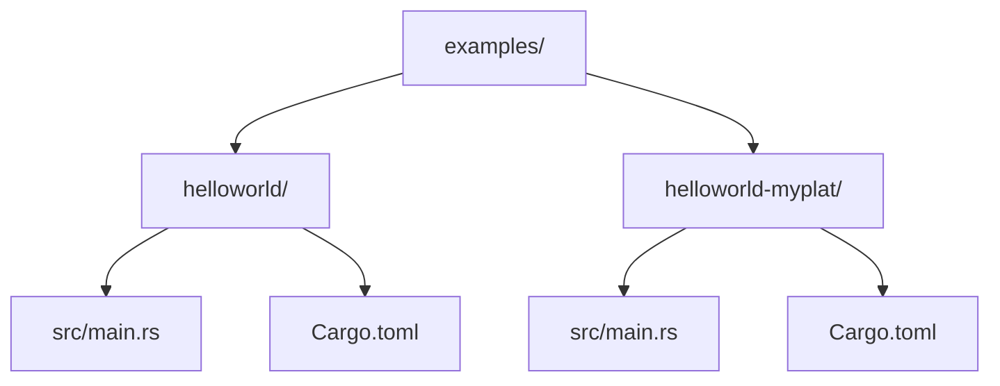
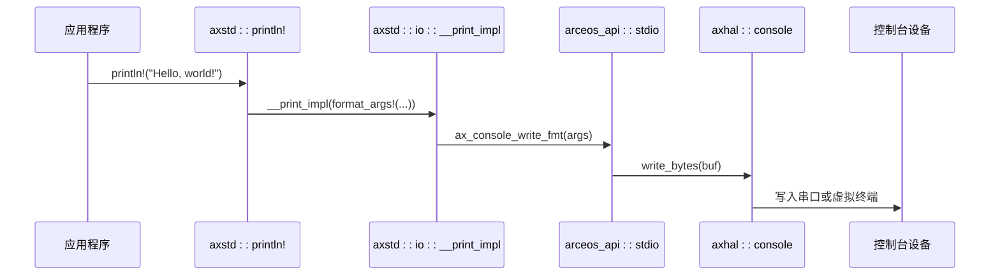
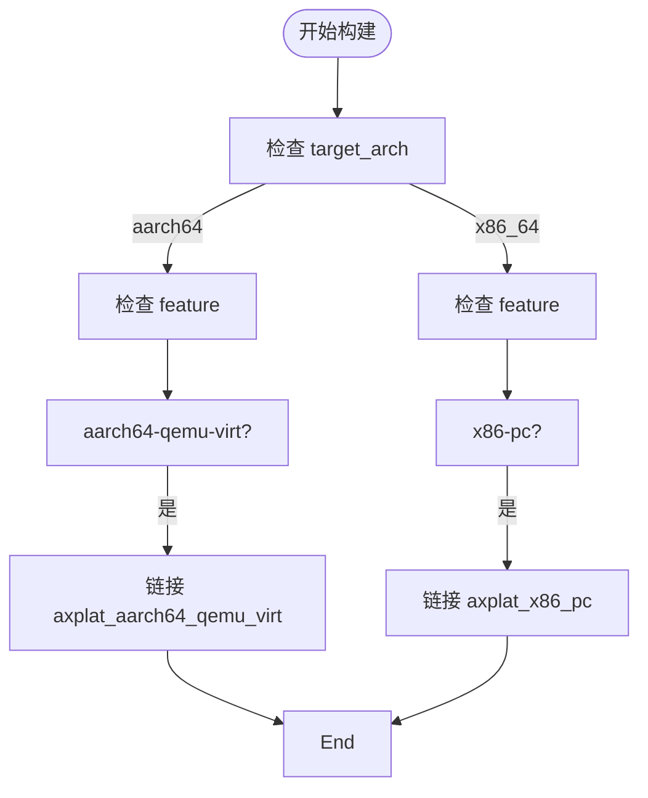

# Hello World 示例解析

<cite>
**本文档引用的文件**
- [main.rs](file://examples/helloworld/src/main.rs)
- [Cargo.toml](file://examples/helloworld/Cargo.toml)
- [main.rs](file://examples/helloworld-myplat/src/main.rs)
- [Cargo.toml](file://examples/helloworld-myplat/Cargo.toml)
- [macros.rs](file://ulib/axstd/src/macros.rs)
- [stdio.rs](file://ulib/axstd/src/io/stdio.rs)
- [mod.rs](file://api/arceos_api/src/imp/mod.rs)
</cite>

## 目录
1. [简介](#简介)
2. [项目结构](#项目结构)
3. [核心组件分析](#核心组件分析)
4. [程序入口与执行流程](#程序入口与执行流程)
5. _myplat 变体与平台定制化构建
6. 最小可运行应用依赖与编译配置
7. 常见问题排查指引
8. 结论

## 简介
`helloworld` 示例是 ArceOS 操作系统中最基础的应用模板，旨在展示如何在无标准库（no_std）环境下编写一个最简单的用户态应用程序。该示例不仅演示了基本的控制台输出功能，还体现了 ArceOS 的模块化设计、平台抽象机制以及与底层硬件交互的方式。通过深入分析此示例，开发者可以理解 ArceOS 应用的启动过程、依赖管理及跨平台构建策略。

## 项目结构
ArceOS 的 `helloworld` 示例位于 `examples/helloworld` 目录下，包含标准版本和平台定制化版本 `_myplat`。其结构简洁明了：

```
examples/
├── helloworld/
│   ├── src/
│   │   └── main.rs          # 标准 Hello World 入口
│   └── Cargo.toml           # 构建配置
├── helloworld-myplat/
│   ├── src/
│   │   └── main.rs          # 支持多平台的 Hello World
│   └── Cargo.toml           # 多平台依赖配置
```

该结构反映了 ArceOS 鼓励模块化、可复用的设计理念，并通过条件编译实现对不同目标平台的支持。



**图源**
- [examples/helloworld](file://examples/helloworld)
- [examples/helloworld-myplat](file://examples/helloworld-myplat)

**本节来源**
- [examples/helloworld](file://examples/helloworld)
- [examples/helloworld-myplat](file://examples/helloworld-myplat)

## 核心组件分析
`helloworld` 示例的核心在于其极简但完整的运行时环境构建，涉及三个关键组件：`axstd`、`axlog` 和平台适配层。

### axstd 模块的作用
`axstd` 是 ArceOS 提供的用户空间标准库替代品，专为嵌入式和操作系统开发设计。它实现了 Rust 标准库中常用的功能子集，如 I/O、线程、同步原语等，同时保持 `no_std` 兼容性。

在 `helloworld` 中，通过条件编译特性 `feature = "axstd"` 启用 `axstd`，并使用其提供的 `println!` 宏进行输出。

**本节来源**
- [main.rs](file://examples/helloworld/src/main.rs#L3-L7)
- [Cargo.toml](file://examples/helloworld/Cargo.toml#L9)

### axlog 与输出机制
`axlog` 是 ArceOS 的日志输出基础设施，负责将格式化字符串传递到底层控制台驱动。`println!` 宏最终调用 `axlog::print_fmt` 实现实际输出。

当启用 `smp` 特性时，输出会通过锁同步以避免多核环境下的日志交错；否则直接写入 `stdout` 锁。



**图源**
- [macros.rs](file://ulib/axstd/src/macros.rs#L15-L23)
- [stdio.rs](file://ulib/axstd/src/io/stdio.rs#L170-L172)
- [mod.rs](file://api/arceos_api/src/imp/mod.rs#L40-L47)

**本节来源**
- [macros.rs](file://ulib/axstd/src/macros.rs#L15-L23)
- [stdio.rs](file://ulib/axstd/src/io/stdio.rs#L170-L172)
- [mod.rs](file://api/arceos_api/src/imp/mod.rs#L40-L47)

## 程序入口与执行流程
`helloworld` 的程序入口定义在 `main.rs` 中，采用 `no_main` 模型，由运行时提供启动引导。

### 入口函数定义
```rust
#[cfg_attr(feature = "axstd", unsafe(no_mangle))]
fn main() {
    println!("Hello, world!");
}
```

`no_mangle` 属性确保函数名不被编译器修饰，使其能被链接器正确识别为入口点。整个流程如下：

1. 内核初始化完成后跳转至用户程序入口
2. 运行时设置栈、堆等基础环境
3. 调用 `main()` 函数
4. 执行 `println!` 输出文本
5. 程序结束（当前示例无显式退出）

**本节来源**
- [main.rs](file://examples/helloworld/src/main.rs#L7-L11)

## _myplat 变体与平台定制化构建
`helloworld-myplat` 示例展示了如何通过条件编译支持多个硬件平台，体现 ArceOS 的平台抽象能力。

### 平台选择机制
通过 `cfg_if!` 宏根据目标架构和功能特性动态链接对应的平台 crate，例如：
- `aarch64-qemu-virt` → `axplat_aarch64_qemu_virt`
- `x86-pc` → `axplat_x86_pc`

这使得同一份应用代码可在不同平台上编译运行，只需切换构建目标。

### Cargo.toml 中的条件依赖
`Cargo.toml` 使用 `target.'cfg(...)'.dependencies` 语法声明特定架构下的可选依赖，结合 `features` 控制具体平台的激活。

这种设计实现了“一次编写，处处编译”的灵活性，是 ArceOS 支持异构平台的关键机制。



**图源**
- [main.rs](file://examples/helloworld-myplat/src/main.rs#L5-L30)
- [Cargo.toml](file://examples/helloworld-myplat/Cargo.toml#L12-L32)

**本节来源**
- [main.rs](file://examples/helloworld-myplat/src/main.rs#L5-L30)
- [Cargo.toml](file://examples/helloworld-myplat/Cargo.toml#L12-L32)

## 最小可运行应用依赖与编译配置
要创建一个最小可运行的 ArceOS 用户程序，需满足以下条件：

### 必需依赖
- `axstd`: 提供基础 I/O、内存管理等功能
- 目标平台 crate（如 `axplat_x86_pc`）: 提供硬件抽象接口

### 编译特征（Features）
- `axstd`: 启用用户标准库
- 平台特征（如 `x86-pc`）: 激活对应平台支持

### 构建命令示例
```bash
# 构建 x86_64-pc 平台
cargo build -p arceos-helloworld-myplat --features "x86-pc"

# 构建 aarch64 qemu 平台
cargo build -p arceos-helloworld-myplat --features "aarch64-qemu-virt"
```

这些配置确保了应用能够链接正确的运行时和服务，完成从入口到输出的完整生命周期。

**本节来源**
- [Cargo.toml](file://examples/helloworld-myplat/Cargo.toml)
- [main.rs](file://examples/helloworld-myplat/src/main.rs)

## 常见问题排查指引
### 构建失败：未找到平台 crate
**现象**：编译时报错 `No platform crate linked!`
**原因**：未指定有效的平台 feature
**解决方法**：使用 `--features <platform>` 指定平台，如 `--features x86-pc`

### 输出无显示
**可能原因**：
1. 控制台驱动未正确初始化
2. `axlog` 输出被静默
3. 目标平台未正确模拟串口设备

**排查步骤**：
- 确认 `axhal::console::write_bytes` 是否被调用
- 检查 `arceos_api::stdio::ax_console_write_bytes` 返回值
- 验证 QEMU 或硬件平台是否启用了串口输出

### no_std 环境下无法使用标准库
**解决方案**：确保 `#![no_std]` 和 `#![no_main]` 正确标注，并依赖 `axstd` 替代功能。

**本节来源**
- [mod.rs](file://api/arceos_api/src/imp/mod.rs#L40-L47)
- [stdio.rs](file://ulib/axstd/src/io/stdio.rs#L170-L172)

## 结论
`helloworld` 示例虽简单，却是理解 ArceOS 架构的钥匙。它展示了：
- 如何在 `no_std` 环境下构建用户程序
- `axstd` 与 `axlog` 协同完成 I/O 输出
- 通过条件编译实现跨平台兼容
- 最小依赖集和构建流程

掌握这一模板有助于开发者快速上手 ArceOS 应用开发，并在此基础上扩展更复杂的功能。建议新开发者以此为基础，逐步探索网络、文件系统等高级模块的使用方式。