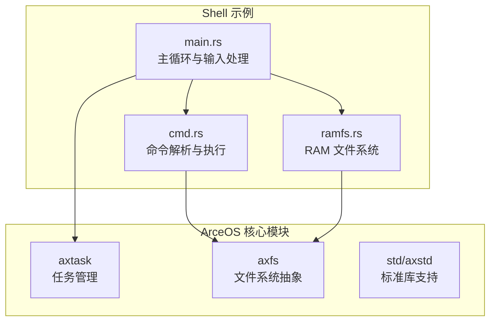
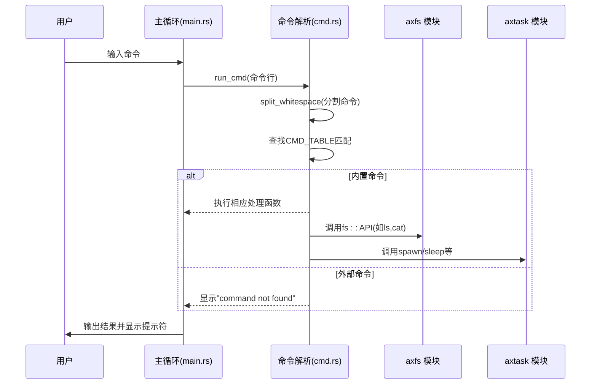
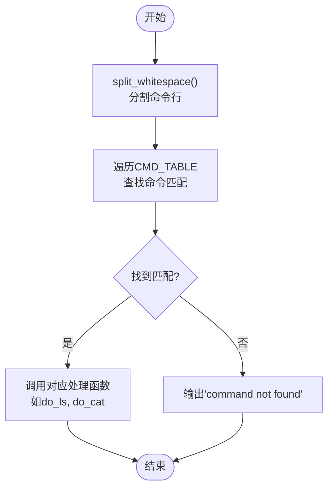
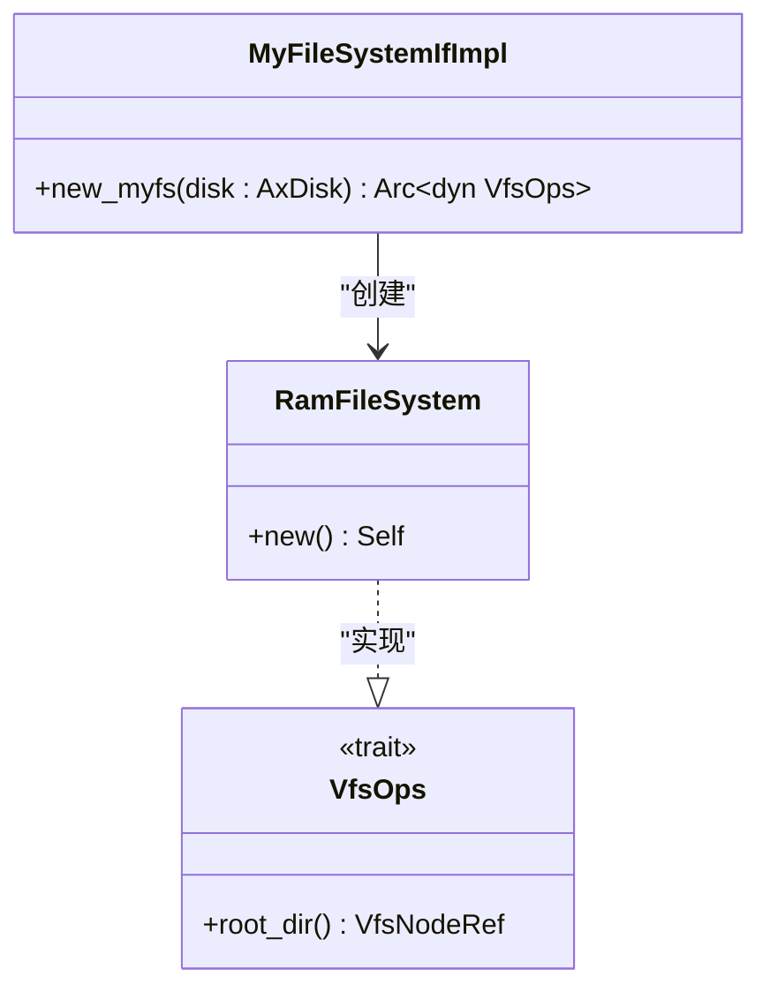
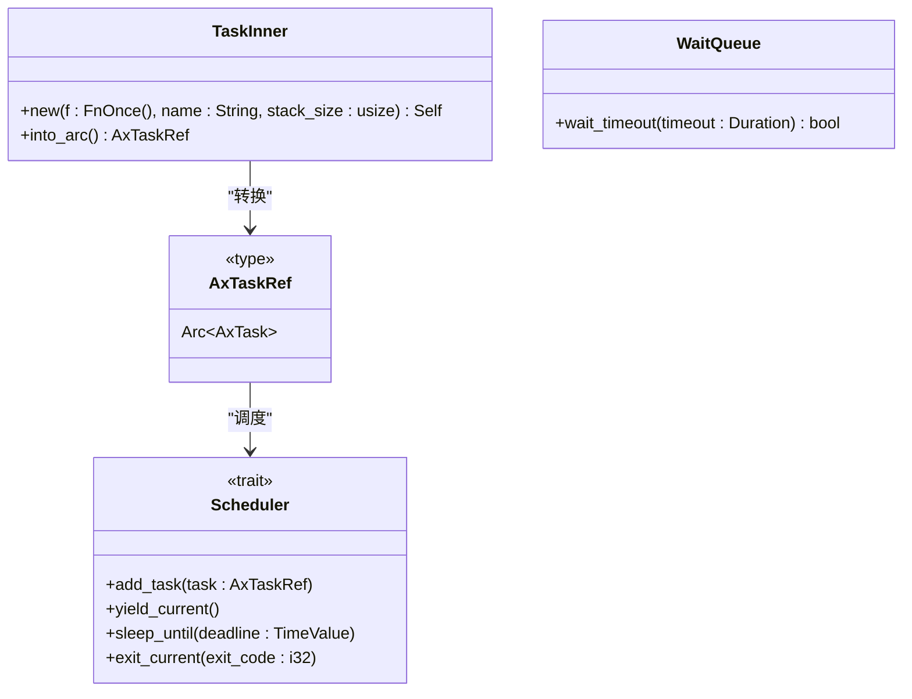
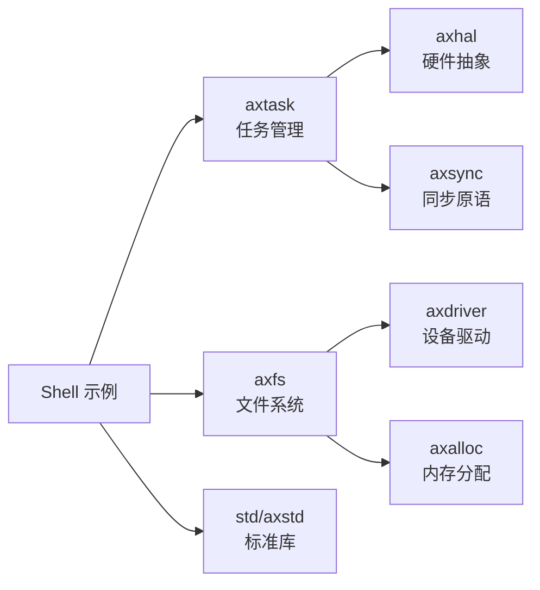

# Shell 示例解析

<cite>
**本文档中引用的文件**
- [cmd.rs](file://examples/shell/src/cmd.rs)
- [ramfs.rs](file://examples/shell/src/ramfs.rs)
- [main.rs](file://examples/shell/src/main.rs)
- [lib.rs](file://modules/axtask/src/lib.rs)
- [api.rs](file://modules/axtask/src/api.rs)
</cite>

## 目录
1. [简介](#简介)
2. [项目结构](#项目结构)
3. [核心组件](#核心组件)
4. [架构概述](#架构概述)
5. [详细组件分析](#详细组件分析)
6. [依赖分析](#依赖分析)
7. [性能考虑](#性能考虑)
8. [故障排除指南](#故障排除指南)
9. [结论](#结论)

## 简介
本文档全面剖析 ArceOS 操作系统中的 shell 示例，重点解析其命令行处理机制、轻量级 RAM 文件系统实现、多任务控制逻辑以及标准输入输出重定向等关键功能。通过深入分析 `cmd.rs`、`ramfs.rs` 和 `axtask` 模块的代码实现，揭示该示例所体现的操作系统交互接口设计思想，为开发复杂交互式应用提供参考。

## 项目结构
shell 示例位于 `examples/shell` 目录下，包含三个核心源文件：`main.rs` 负责主循环和用户输入处理，`cmd.rs` 实现内置命令解析与执行，`ramfs.rs` 提供 RAM 文件系统支持。整个示例依托于 ArceOS 的底层模块，特别是 `axtask` 提供的任务调度能力和 `axfs` 提供的虚拟文件系统接口。

**Diagram sources**
- [main.rs](file://examples/shell/src/main.rs#L1-L83)
- [cmd.rs](file://examples/shell/src/cmd.rs#L1-L300)
- [ramfs.rs](file://examples/shell/src/ramfs.rs#L1-L16)

**Section sources**
- [main.rs](file://examples/shell/src/main.rs#L1-L83)
- [cmd.rs](file://examples/shell/src/cmd.rs#L1-L300)
- [ramfs.rs](file://examples/shell/src/ramfs.rs#L1-L16)

## 核心组件
shell 示例的核心组件包括命令行解析器、内置命令处理器、RAM 文件系统适配器和任务控制接口。这些组件协同工作，实现了基本的 shell 功能，包括命令执行、文件操作和进程管理。系统通过 `axtask` 模块提供的 API 实现多任务创建与同步，并利用 `axfs_vfs` 接口实现对 RAM 文件系统的统一访问。

**Section sources**
- [cmd.rs](file://examples/shell/src/cmd.rs#L1-L300)
- [ramfs.rs](file://examples/shell/src/ramfs.rs#L1-L16)
- [lib.rs](file://modules/axtask/src/lib.rs#L1-L60)

## 架构概述
shell 示例采用分层架构设计，上层为命令行交互界面，中层为命令解析与执行引擎，底层为操作系统服务接口。当用户输入命令时，主循环将输入传递给命令解析器，解析器根据内置命令表调用相应的处理函数。对于文件操作命令，系统通过 `axfs` 模块访问 RAM 文件系统；对于任务控制需求，则通过 `axtask` 模块进行进程管理。

**Diagram sources**
- [main.rs](file://examples/shell/src/main.rs#L1-L83)
- [cmd.rs](file://examples/shell/src/cmd.rs#L1-L300)
- [lib.rs](file://modules/axtask/src/lib.rs#L1-L60)

## 详细组件分析

### 命令行解析逻辑分析
shell 的命令行解析逻辑主要由 `cmd.rs` 文件实现，其核心是 `run_cmd` 函数和 `CMD_TABLE` 命令表。系统首先使用 `split_whitespace` 函数将输入行分割为命令和参数，然后在预定义的命令表中查找匹配项，找到后立即调用对应的处理函数。

#### 命令解析流程图

**Diagram sources**
- [cmd.rs](file://examples/shell/src/cmd.rs#L1-L300)

**Section sources**
- [cmd.rs](file://examples/shell/src/cmd.rs#L1-L300)

### RAM 文件系统实现分析
RAM 文件系统通过 `ramfs.rs` 文件实现，它作为 `axfs_ramfs` 模块的适配层，遵循 `MyFileSystemIf` 接口规范。系统在初始化时创建一个基于内存的文件系统实例，并将其注册到虚拟文件系统层，从而支持基本的文件操作。

#### RAM 文件系统类图

**Diagram sources**
- [ramfs.rs](file://examples/shell/src/ramfs.rs#L1-L16)
- [test_ramfs.rs](file://modules/axfs/tests/test_ramfs.rs#L1-L55)

**Section sources**
- [ramfs.rs](file://examples/shell/src/ramfs.rs#L1-L16)

### 多任务创建与控制机制分析
多任务功能由 `axtask` 模块提供支持，shell 示例可以利用其 API 实现任务的创建、调度和同步。系统通过配置不同的调度器特征（如 `sched-fifo`、`sched-rr`）来选择合适的调度算法。

#### 任务管理API类图

**Diagram sources**
- [lib.rs](file://modules/axtask/src/lib.rs#L1-L60)
- [api.rs](file://modules/axtask/src/api.rs#L1-L221)

**Section sources**
- [lib.rs](file://modules/axtask/src/lib.rs#L1-L60)
- [api.rs](file://modules/axtask/src/api.rs#L1-L221)

## 依赖分析
shell 示例依赖于多个 ArceOS 核心模块，形成了清晰的依赖关系链。最核心的依赖是 `axtask` 模块，它提供了任务管理和调度的基础能力；其次是 `axfs` 模块，为文件系统操作提供统一接口；最后是标准库支持，包括 `std` 或 `axstd`，提供基本的 I/O 和数据结构功能。

**Diagram sources**
- [Cargo.toml](file://modules/axtask/Cargo.toml#L1-L55)
- [lib.rs](file://modules/axtask/src/lib.rs#L1-L60)

**Section sources**
- [Cargo.toml](file://modules/axtask/Cargo.toml#L1-L55)
- [lib.rs](file://modules/axtask/src/lib.rs#L1-L60)

## 性能考虑
shell 示例的设计充分考虑了嵌入式和操作系统环境下的性能需求。命令解析采用静态查找表而非动态解析，确保 O(1) 时间复杂度；RAM 文件系统完全在内存中操作，避免了磁盘 I/O 开销；任务调度支持多种算法配置，可根据应用场景选择最适合的调度策略。此外，系统通过预分配缓冲区和避免不必要的内存分配来减少运行时开销。

## 故障排除指南
当 shell 示例出现异常时，可从以下几个方面进行排查：检查 `CMD_TABLE` 是否正确注册所有内置命令；验证 RAM 文件系统是否成功初始化；确认 `axtask` 模块的调度器特征是否正确配置；审查输入处理循环是否存在边界条件错误。对于任务相关问题，应检查 `init_scheduler()` 是否在使用多任务功能前被调用。

**Section sources**
- [cmd.rs](file://examples/shell/src/cmd.rs#L1-L300)
- [ramfs.rs](file://examples/shell/src/ramfs.rs#L1-L16)
- [lib.rs](file://modules/axtask/src/lib.rs#L1-L60)

## 结论
shell 示例展示了 ArceOS 操作系统中交互式应用的基本架构和实现方法。通过命令行解析、RAM 文件系统和多任务控制的有机结合，该示例提供了一个完整的轻量级 shell 实现。其模块化设计和清晰的接口分离为开发更复杂的交互式应用提供了良好的参考模板，体现了操作系统接口设计的简洁性和扩展性原则。