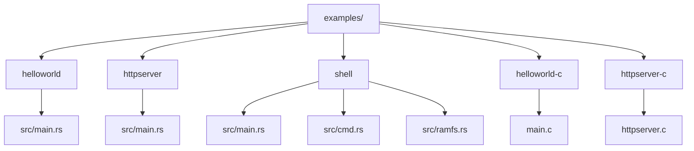
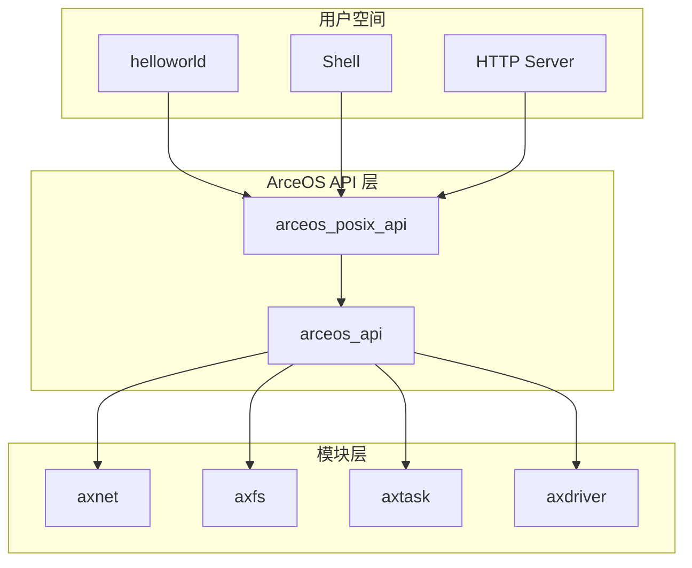
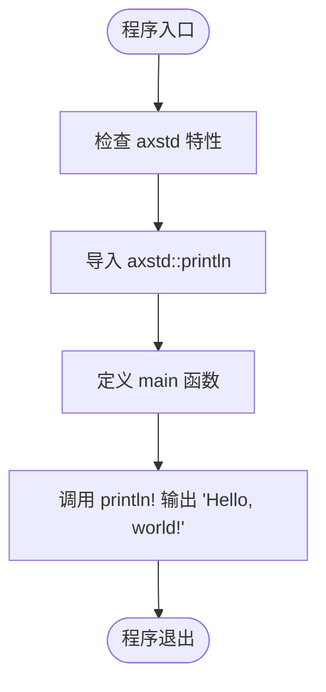
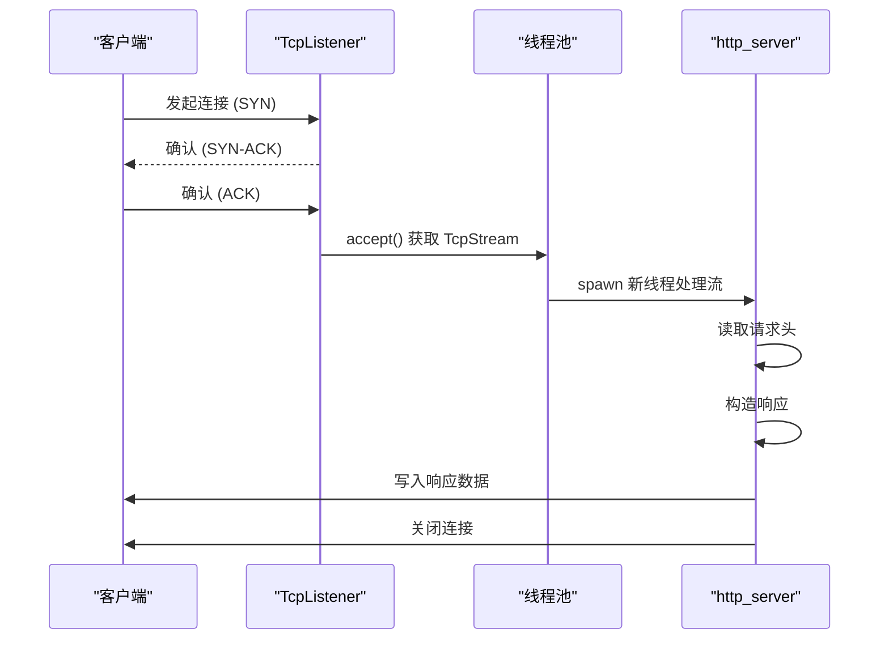
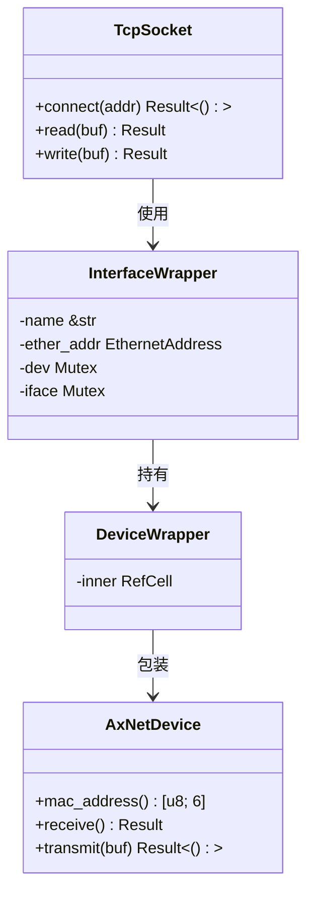
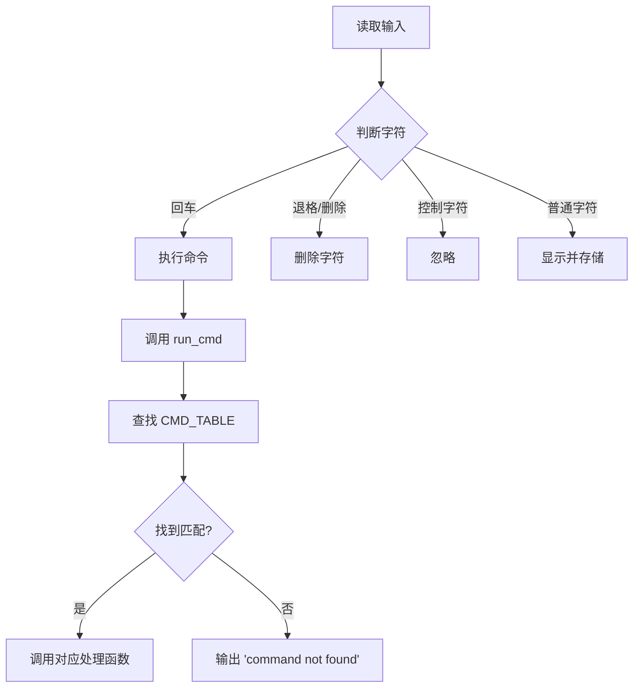
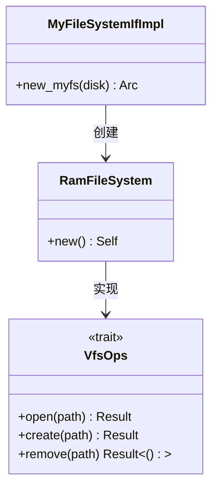
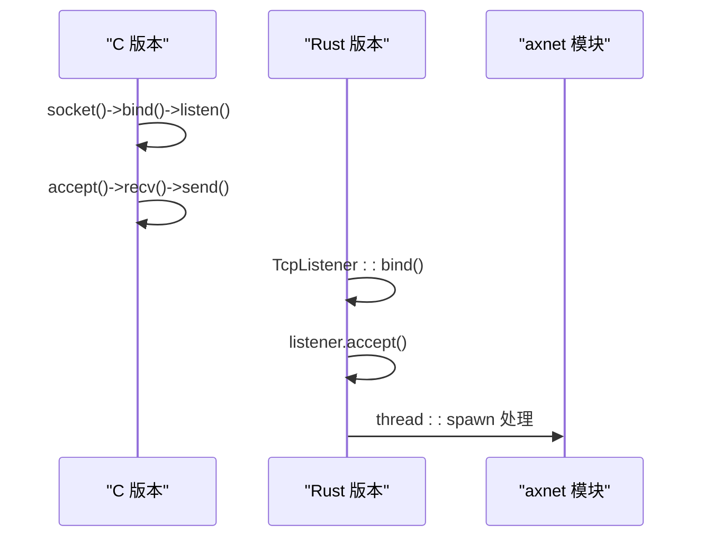

# 示例程序解析

<cite>
**本文档中引用的文件**
- [main.rs](file://examples/helloworld/src/main.rs)
- [main.rs](file://examples/httpserver/src/main.rs)
- [main.rs](file://examples/shell/src/main.rs)
- [cmd.rs](file://examples/shell/src/cmd.rs)
- [ramfs.rs](file://examples/shell/src/ramfs.rs)
- [main.c](file://examples/helloworld-c/main.c)
- [httpclient.c](file://examples/httpclient-c/httpclient.c)
- [httpserver.c](file://examples/httpserver-c/httpserver.c)
- [lib.rs](file://modules/axnet/src/lib.rs)
- [mod.rs](file://modules/axnet/src/smoltcp_impl/mod.rs)
</cite>

## 目录
1. [简介](#简介)
2. [项目结构](#项目结构)
3. [核心组件分析](#核心组件分析)
4. [架构概览](#架构概览)
5. [详细组件分析](#详细组件分析)
6. [依赖关系分析](#依赖关系分析)
7. [性能考量](#性能考量)
8. [故障排除指南](#故障排除指南)
9. [结论](#结论)

## 简介
本文档旨在深入分析 ArceOS 提供的多个示例程序，揭示其作为学习模板的价值。通过对 `helloworld`、`httpserver` 和 `shell` 等示例的逐个剖析，展示 ArceOS 应用程序的基本结构、网络通信机制、文件系统操作和进程管理逻辑。同时，通过对比 Rust 版本与 C 语言版本（如 `helloworld-c` 和 `httpserver-c`）的实现差异，帮助开发者理解不同语言绑定下的编程模式。最终提取出通用的最佳实践，包括事件循环、I/O 处理和错误传播等关键概念。

## 项目结构
ArceOS 的示例程序位于 `examples/` 目录下，每个示例都是一个独立的 Cargo 项目或 C 语言源文件。这些示例覆盖了从最简单的“Hello World”到复杂的 HTTP 服务器和交互式 Shell 的多种应用场景。



**图示来源**
- [examples/helloworld/Cargo.toml](file://examples/helloworld/Cargo.toml)
- [examples/httpserver/Cargo.toml](file://examples/httpserver/Cargo.toml)
- [examples/shell/Cargo.toml](file://examples/shell/Cargo.toml)

**章节来源**
- [examples/helloworld/Cargo.toml](file://examples/helloworld/Cargo.toml)
- [examples/httpserver/Cargo.toml](file://examples/httpserver/Cargo.toml)
- [examples/shell/Cargo.toml](file://examples/shell/Cargo.toml)

## 核心组件分析
本节将对各个示例的核心功能进行简要概述，并指出其在学习 ArceOS 开发中的价值。

**章节来源**
- [examples/helloworld/src/main.rs](file://examples/helloworld/src/main.rs)
- [examples/httpserver/src/main.rs](file://examples/httpserver/src/main.rs)
- [examples/shell/src/main.rs](file://examples/shell/src/main.rs)

## 架构概览
ArceOS 示例程序的整体架构体现了微内核操作系统的设计理念：用户空间应用程序通过统一的 API 接口访问底层硬件资源，如网络、文件系统和显示设备。Rust 示例主要依赖 `axstd` 和 `arceos_api` 模块提供的 POSIX 兼容接口，而 C 示例则直接调用封装好的 C 库函数。



**图示来源**
- [api/arceos_api/Cargo.toml](file://api/arceos_api/Cargo.toml)
- [api/arceos_posix_api/Cargo.toml](file://api/arceos_posix_api/Cargo.toml)
- [Cargo.toml](file://Cargo.toml)

## 详细组件分析

### Hello World 示例分析
`helloworld` 示例展示了 ArceOS 上最简 Rust 应用的结构。它使用 `no_std` 和 `no_main` 属性来适应无操作系统环境，并通过 `axstd::println!` 宏输出文本。



**图示来源**
- [examples/helloworld/src/main.rs](file://examples/helloworld/src/main.rs#L1-L10)

**章节来源**
- [examples/helloworld/src/main.rs](file://examples/helloworld/src/main.rs#L1-L10)

### HTTP 服务器示例分析
`httpserver` 示例演示了如何利用 `axnet` 和 `axfs` 模块实现 TCP 监听与 HTTP 响应。服务器创建一个 TCP 监听器，接收客户端连接，并在新线程中处理每个请求。

#### 网络处理流程


**图示来源**
- [examples/httpserver/src/main.rs](file://examples/httpserver/src/main.rs#L50-L90)
- [modules/axnet/src/lib.rs](file://modules/axnet/src/lib.rs#L1-L47)

#### axnet 模块初始化
`axnet` 模块是 ArceOS 网络功能的核心，基于 smoltcp 实现。它封装了网卡设备驱动，提供 TCP/UDP Socket API。



**图示来源**
- [modules/axnet/src/lib.rs](file://modules/axnet/src/lib.rs#L1-L47)
- [modules/axnet/src/smoltcp_impl/mod.rs](file://modules/axnet/src/smoltcp_impl/mod.rs#L1-L337)

**章节来源**
- [examples/httpserver/src/main.rs](file://examples/httpserver/src/main.rs#L1-L96)
- [modules/axnet/src/lib.rs](file://modules/axnet/src/lib.rs#L1-L47)

### Shell 示例分析
`shell` 示例是一个功能完整的命令行解释器，实现了命令解析、RAMFS 文件系统操作和基本的进程控制。

#### 命令解析与执行


**图示来源**
- [examples/shell/src/main.rs](file://examples/shell/src/main.rs#L50-L80)
- [examples/shell/src/cmd.rs](file://examples/shell/src/cmd.rs#L1-L300)

#### RAMFS 文件系统集成
`shell` 示例通过条件编译特性 `use-ramfs` 集成了基于内存的文件系统。



**图示来源**
- [examples/shell/src/ramfs.rs](file://examples/shell/src/ramfs.rs#L1-L15)
- [modules/axfs/src/lib.rs](file://modules/axfs/src/lib.rs)

**章节来源**
- [examples/shell/src/cmd.rs](file://examples/shell/src/cmd.rs#L1-L300)
- [examples/shell/src/ramfs.rs](file://examples/shell/src/ramfs.rs#L1-L15)

### C 语言示例对比分析
通过对比 Rust 和 C 语言版本的 `helloworld` 和 `httpserver`，可以清晰地看到两种语言绑定的使用差异。

#### helloworld 对比
```mermaid
flowchart LR
subgraph Rust
R1[#![cfg_attr(feature = "axstd", no_std)]]
R2[use axstd::println]
R3[println!("Hello, world!");]
end
subgraph C
C1[#include <stdio.h>]
C2[printf("Hello, %c app!\n", 'C');]
end
R1 --> R2 --> R3
C1 --> C2
```

**章节来源**
- [examples/helloworld/src/main.rs](file://examples/helloworld/src/main.rs#L1-L10)
- [examples/helloworld-c/main.c](file://examples/helloworld-c/main.c#L1-L8)

#### httpserver 对比
C 版本的 `httpserver` 直接使用传统的 BSD socket API，而 Rust 版本则通过更高层次的抽象进行操作。



**图示来源**
- [examples/httpserver-c/httpserver.c](file://examples/httpserver-c/httpserver.c#L1-L90)
- [examples/httpserver/src/main.rs](file://examples/httpserver/src/main.rs#L1-L96)

**章节来源**
- [examples/httpserver-c/httpserver.c](file://examples/httpserver-c/httpserver.c#L1-L90)
- [examples/httpclient-c/httpclient.c](file://examples/httpclient-c/httpclient.c#L1-L56)

## 依赖关系分析
各示例程序依赖于 ArceOS 的核心模块，形成了清晰的分层架构。

```mermaid
graph LR
    H[helloworld] --> P[arceos_posix_api]
    HS[httpserver] --> P
    S