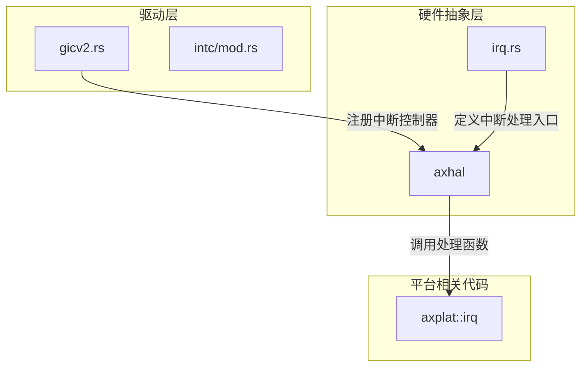
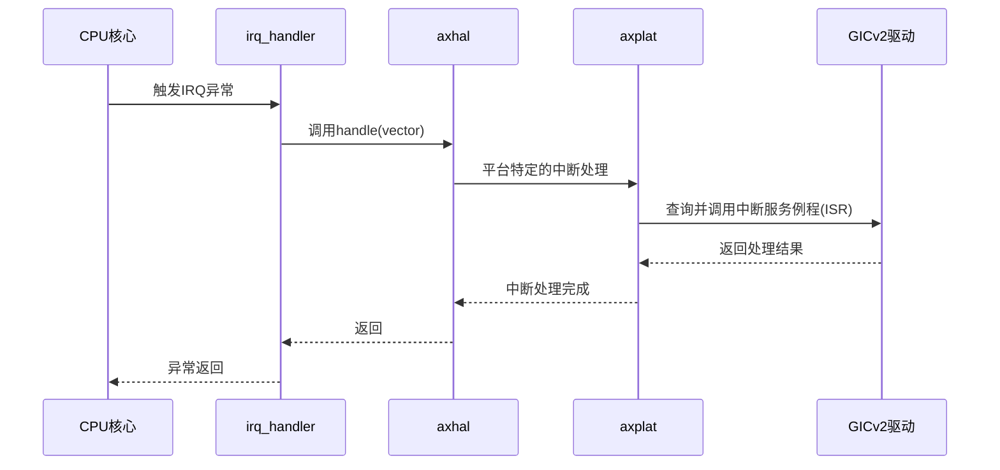
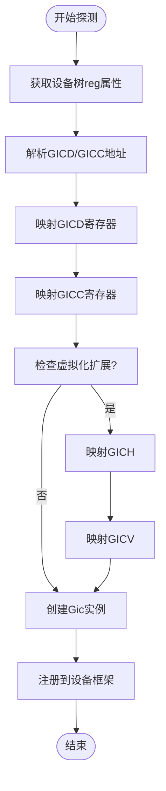
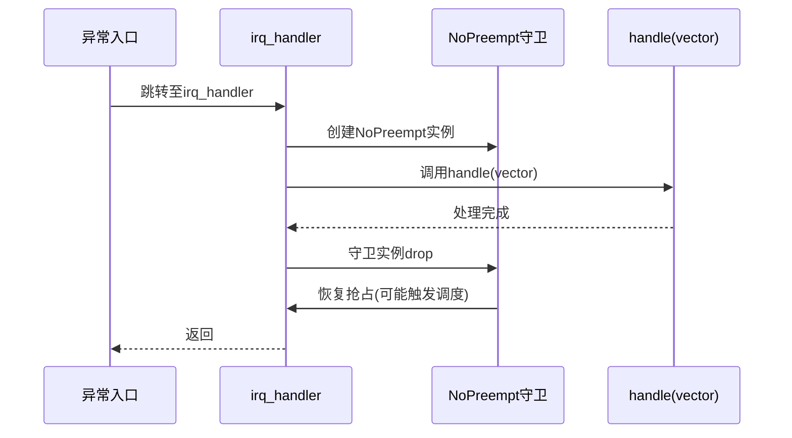
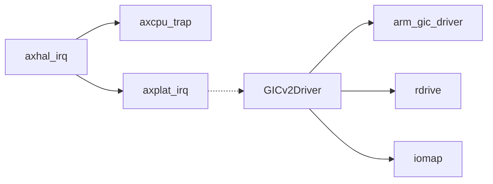

# GICv2中断控制器驱动

<cite>
**本文档引用的文件**
- [gicv2.rs](file://modules/axdriver/src/dyn_drivers/intc/gicv2.rs)
- [irq.rs](file://modules/axhal/src/irq.rs)
</cite>

## 目录
1. [引言](#引言)
2. [项目结构](#项目结构)
3. [核心组件](#核心组件)
4. [架构概述](#架构概述)
5. [详细组件分析](#详细组件分析)
6. [依赖分析](#依赖分析)
7. [性能考虑](#性能考虑)
8. [故障排除指南](#故障排除指南)
9. [结论](#结论)

## 引言
本文深入解析ArceOS中GICv2中断控制器的实现机制。重点阐述其在系统初始化阶段的探测与注册流程、寄存器映射方式、中断类型（SPI、PPI、SGI）的配置逻辑，以及与axhal模块IRQ抽象层的交互机制。同时分析中断处理流程和多核环境下的核间中断（IPI）支持。

## 项目结构
ArceOS是一个基于Rust的轻量级操作系统内核，其硬件抽象层（HAL）和设备驱动采用模块化设计。GICv2中断控制器驱动位于`modules/axdriver/src/dyn_drivers/intc/`目录下，通过平台设备探测机制进行加载，并与`axhal`模块提供的中断管理接口协同工作。

**图示来源**
- [gicv2.rs](file://modules/axdriver/src/dyn_drivers/intc/gicv2.rs#L1-L60)
- [irq.rs](file://modules/axhal/src/irq.rs#L1-L23)

**本节来源**
- [gicv2.rs](file://modules/axdriver/src/dyn_drivers/intc/gicv2.rs#L1-L60)
- [irq.rs](file://modules/axhal/src/irq.rs#L1-L23)

## 核心组件
GICv2驱动的核心功能是根据设备树信息探测并初始化GICv2控制器，将其封装为通用中断控制器接口供上层使用。`axhal`中的`irq.rs`则负责提供统一的中断注册、使能和处理接口，屏蔽底层细节。

**本节来源**
- [gicv2.rs](file://modules/axdriver/src/dyn_drivers/intc/gicv2.rs#L1-L60)
- [irq.rs](file://modules/axhal/src/irq.rs#L1-L23)

## 架构概述
GICv2驱动遵循ArceOS的动态驱动模型，通过`module_driver!`宏声明探测条件，在系统启动早期由驱动框架自动调用`probe_gic`函数完成初始化。初始化后，将`arm_gic_driver`库创建的`Gic`实例注册到全局中断控制器列表中。当发生中断时，CPU进入异常向量，执行`irq_handler`，该函数调用`axplat`平台相关的`handle`函数完成具体中断分发。

**图示来源**
- [gicv2.rs](file://modules/axdriver/src/dyn_drivers/intc/gicv2.rs#L40-L60)
- [irq.rs](file://modules/axhal/src/irq.rs#L10-L23)

## 详细组件分析

### GICv2驱动初始化分析
`probe_gic`函数是GICv2驱动的核心。它从设备树节点中提取GICD（分发器）和GICC（CPU接口）的物理地址，通过`iomap`函数映射到虚拟内存空间。随后，可选地映射虚拟化相关的GICH和GICV区域。最后，使用这些内存映射区域的虚拟地址，通过`arm_gic_driver`库的`Gic::new`方法创建一个安全的GICv2控制器抽象实例，并将其注册为一个实现了`rdif_intc::Intc`接口的设备。

#### 初始化流程图

**图示来源**
- [gicv2.rs](file://modules/axdriver/src/dyn_drivers/intc/gicv2.rs#L15-L55)

**本节来源**
- [gicv2.rs](file://modules/axdriver/src/dyn_drivers/intc/gicv2.rs#L15-L60)

### IRQ抽象层分析
`axhal::irq`模块提供了操作系统层面的中断管理API。`irq_handler`是一个被`register_trap_handler`宏标记的陷阱处理函数，它会在CPU接收到IRQ时被调用。该函数首先禁用抢占以保证原子性，然后调用`axplat::irq::handle`进行具体的中断处理，最后在退出作用域时恢复抢占。

#### 中断处理序列图

**图示来源**
- [irq.rs](file://modules/axhal/src/irq.rs#L10-L23)

**本节来源**
- [irq.rs](file://modules/axhal/src/irq.rs#L10-L23)

## 依赖分析
GICv2驱动严重依赖于`arm_gic_driver`这个外部crate来提供对GIC寄存器的安全访问和操作。同时，它依赖`rdrive`框架进行设备探测和生命周期管理。`axhal::irq`模块则依赖于`axcpu`提供的陷阱处理机制和`axplat`提供的平台特定实现。

**图示来源**
- [gicv2.rs](file://modules/axdriver/src/dyn_drivers/intc/gicv2.rs#L3-L5)
- [irq.rs](file://modules/axhal/src/irq.rs#L1-L3)

**本节来源**
- [gicv2.rs](file://modules/axdriver/src/dyn_drivers/intc/gicv2.rs#L1-L60)
- [irq.rs](file://modules/axhal/src/irq.rs#L1-L23)

## 性能考虑
在非虚拟化环境下，可以移除对GICH和GICV寄存器的探测和映射，减少不必要的内存占用和初始化开销。此外，确保中断服务例程（ISR）尽可能短小高效，避免在中断上下文中执行耗时操作，以降低中断延迟。

## 故障排除指南
若系统无法正常响应中断，请检查以下几点：
1. 设备树中GIC节点的`compatible`属性是否匹配`"arm,cortex-a15-gic"`或`"arm,gic-400"`。
2. 确认`iomap`调用成功，GIC寄存器的物理地址已被正确映射。
3. 验证中断号是否已通过`axhal::irq::register`正确注册。
4. 检查`axplat::irq::handle`函数是否能正确分发中断。

**本节来源**
- [gicv2.rs](file://modules/axdriver/src/dyn_drivers/intc/gicv2.rs#L15-L60)
- [irq.rs](file://modules/axhal/src/irq.rs#L10-L23)

## 结论
ArceOS通过模块化的驱动设计和清晰的分层抽象，有效地实现了对GICv2中断控制器的支持。`axdriver`模块负责硬件探测和初始化，`axhal`模块提供统一的中断管理接口，而具体的中断处理逻辑则下沉到`axplat`。这种设计既保证了代码的可移植性，又便于针对不同平台进行优化。