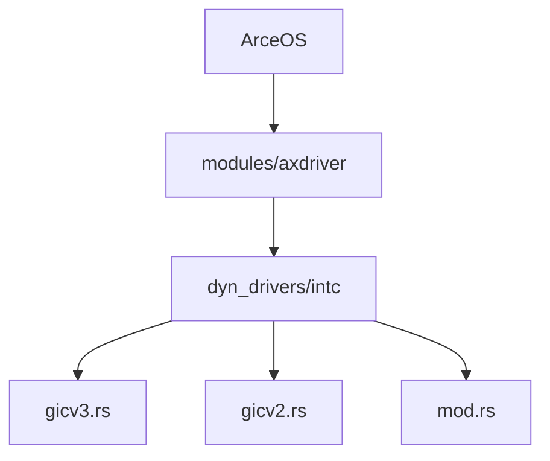
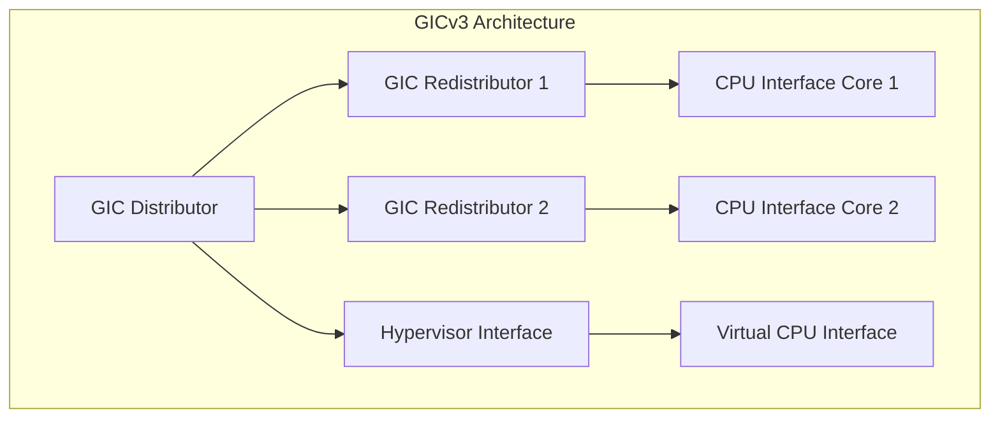
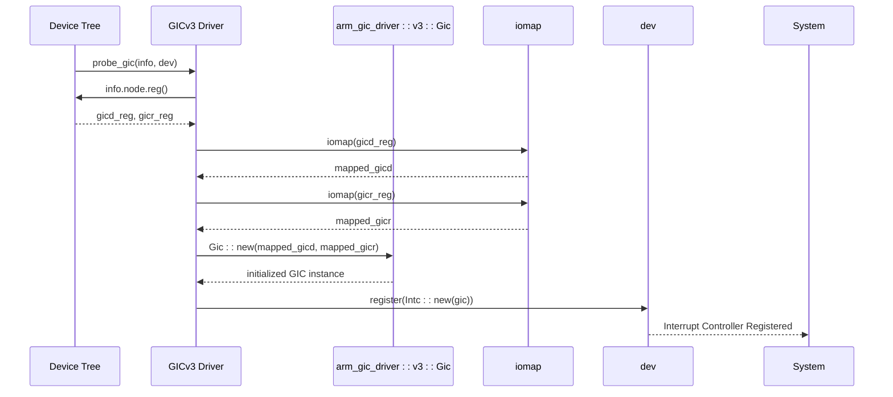
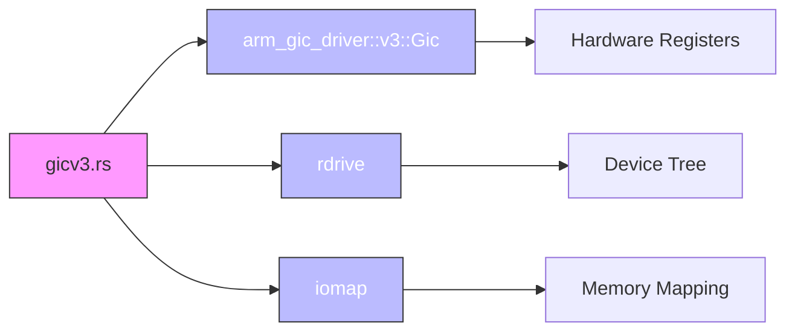

# GICv3中断控制器驱动

<cite>
**本文档中引用的文件**
- [gicv3.rs](file://modules/axdriver/src/dyn_drivers/intc/gicv3.rs)
- [gicv2.rs](file://modules/axdriver/src/dyn_drivers/intc/gicv2.rs)
- [mod.rs](file://modules/axdriver/src/dyn_drivers/intc/mod.rs)
- [Cargo.toml](file://modules/axdriver/Cargo.toml)
- [raspberrypi.rs](file://tools/raspi4/chainloader/src/bsp/raspberrypi.rs)
- [platform_raspi4.md](file://doc/platform_raspi4.md)
</cite>

## 目录
1. [引言](#引言)
2. [项目结构](#项目结构)
3. [核心组件](#核心组件)
4. [架构概述](#架构概述)
5. [详细组件分析](#详细组件分析)
6. [依赖分析](#依赖分析)
7. [性能考虑](#性能考虑)
8. [故障排除指南](#故障排除指南)
9. [结论](#结论)

## 引言
本文档全面阐述了GICv3中断控制器在ArceOS操作系统中的驱动实现。重点描述其分布式处理单元（Distributor）、重分布器（Redistributor）和CPU接口的初始化流程，解析LPI（特定于局部性的外设中断）配置机制与IT-LPI表管理，并对比其相较于GICv2在可扩展性和功耗管理上的优势。同时说明GICv3特有的命令队列、同步机制及虚拟化扩展支持的软件实现细节，并结合Raspberry Pi 4等实际平台展示硬件集成要点。

## 项目结构
ArceOS是一个模块化的嵌入式操作系统框架，其中断控制器驱动位于`modules/axdriver/src/dyn_drivers/intc/`目录下。该路径包含针对不同版本GIC控制器的支持代码，包括GICv2和GICv3的具体实现。

**图示来源**
- [gicv3.rs](file://modules/axdriver/src/dyn_drivers/intc/gicv3.rs)
- [gicv2.rs](file://modules/axdriver/src/dyn_drivers/intc/gicv2.rs)
- [mod.rs](file://modules/axdriver/src/dyn_drivers/intc/mod.rs)

**本节来源**
- [gicv3.rs](file://modules/axdriver/src/dyn_drivers/intc/gicv3.rs)
- [gicv2.rs](file://modules/axdriver/src/dyn_drivers/intc/gicv2.rs)
- [mod.rs](file://modules/axdriver/src/dyn_drivers/intc/mod.rs)

## 核心组件
GICv3的核心功能由`arm_gic_driver::v3::Gic`提供封装，通过设备树探测机制加载并初始化。主要涉及三个关键部分：分发器（GICD）、重分布器（GICR）以及每个CPU核心对应的接口寄存器区域。

**本节来源**
- [gicv3.rs](file://modules/axdriver/src/dyn_drivers/intc/gicv3.rs#L0-L43)

## 架构概述
GICv3采用分布式架构设计，将中断管理划分为多个层次：
- **GIC Distributor (GICD)**：负责全局中断的使能、优先级设置、目标CPU分配。
- **GIC Redistributor (GICR)**：为每个CPU或CPU簇提供本地中断控制能力，支持LPI的接收与转发。
- **CPU Interface (GICC/GICH/GICV)**：各CPU访问中断状态和进行应答操作的接口。

此架构显著提升了多核系统的可扩展性与灵活性。

**图示来源**
- [gicv3.rs](file://modules/axdriver/src/dyn_drivers/intc/gicv3.rs#L0-L43)

## 详细组件分析

### GICv3初始化流程分析
GICv3驱动通过设备树匹配字符串`"arm,gic-v3"`自动探测并初始化。初始化过程中首先从设备树获取GICD和GICR的内存映射地址，然后调用底层库完成硬件寄存器的映射与配置。

#### 初始化序列图

**图示来源**
- [gicv3.rs](file://modules/axdriver/src/dyn_drivers/intc/gicv3.rs#L0-L43)

**本节来源**
- [gicv3.rs](file://modules/axdriver/src/dyn_drivers/intc/gicv3.rs#L0-L43)

### LPI配置与IT-LPI表管理
LPI（Locality-specific Peripheral Interrupts）是GICv3引入的重要特性，用于高效处理大量外设中断。LPI使用基于内存的IT-LPI表来定义中断属性和目标CPU。系统需为每个重分布器配置基址指向IT-LPI表，并通过写入命令队列触发更新。

虽然当前代码未直接体现LPI表操作逻辑，但`arm_gic_driver`库已具备相关API支持，未来可通过扩展`probe_gic`函数实现完整LPI配置。

### 虚拟化扩展支持
GICv3支持完整的虚拟化扩展（GICv3 virtualization extensions），允许Hypervisor拦截和模拟中断行为。在ArceOS中，若启用虚拟化模式，可通过额外注册`GICH`和`GICV`寄存器区域实现对虚拟机中断的精细控制。

尽管当前`gicv3.rs`未显式处理这些寄存器，但底层`arm_gic_driver`支持此类功能，只需在设备树中提供相应节点即可激活。

## 依赖分析
GICv3驱动依赖于多个外部库和内部模块协同工作：

**图示来源**
- [gicv3.rs](file://modules/axdriver/src/dyn_drivers/intc/gicv3.rs#L0-L43)
- [Cargo.toml](file://modules/axdriver/Cargo.toml#L45)

**本节来源**
- [gicv3.rs](file://modules/axdriver/src/dyn_drivers/intc/gicv3.rs#L0-L43)
- [Cargo.toml](file://modules/axdriver/Cargo.toml#L45)

## 性能考虑
GICv3相比GICv2的主要性能优势体现在：
- 支持更多中断源（SPI数量增加）
- 更细粒度的中断优先级控制
- LPI机制减少中断延迟
- 分布式重分布器降低总线争用

此外，命令队列机制允许批量提交配置变更，避免频繁访问慢速寄存器，提升整体效率。

## 故障排除指南
当GICv3初始化失败时，请检查以下常见问题：
- 设备树中是否正确声明`"arm,gic-v3"`兼容性字符串
- GICD和GICR的内存地址范围是否准确映射
- 是否存在权限或页表未映射导致的访问异常
- 平台是否支持GICv3硬件（如Raspberry Pi 4）

对于调试支持，可参考文档`doc/platform_raspi4.md`中关于JTAG连接与OpenOCD调试的说明。

**本节来源**
- [platform_raspi4.md](file://doc/platform_raspi4.md#L0-L28)
- [raspberrypi.rs](file://tools/raspi4/chainloader/src/bsp/raspberrypi.rs#L0-L26)

## 结论
ArceOS通过模块化方式实现了对GICv3中断控制器的良好支持，利用现代ARM架构提供的高级中断管理能力，为高性能、可扩展的操作系统奠定了基础。未来可通过完善LPI管理和虚拟化支持进一步增强其实时性与安全性。